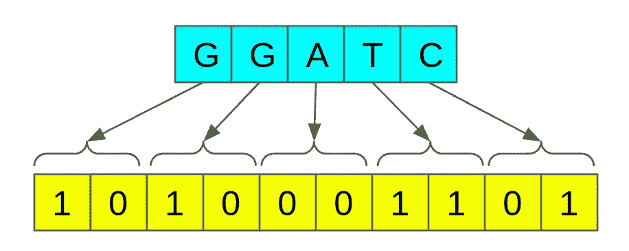
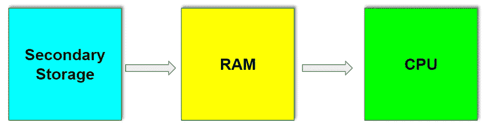

# 生物信息学 DNA 序列的位编码

> 原文：<https://medium.com/analytics-vidhya/bioinformatics-2-bit-encoding-for-dna-sequences-9b93636e90e2?source=collection_archive---------13----------------------->

## 一种简单而有效的数据压缩技术

图片由[克里斯蒂安·科伦](https://www.flickr.com/photos/christiaancolen/)在 [flickr](https://www.flickr.com/) 拍摄

在生物信息学领域，人们经常处理不同的数据序列，如 DNA、RNA 和蛋白质。不管序列类型如何，一个共同的方面(也是一个重大挑战)是需要处理的数据量。在本文中，我们将把讨论范围缩小到 DNA 序列。

与过去相比，由于高通量测序技术的进步，我们可以获得大量的 DNA 序列数据。例如，下一代测序技术为单个生物体产生了成百上千千兆字节的数据。处理这些大量的数据产生了一个有趣而又具有挑战性的计算机科学问题。

# 计算机科学视角

## 1.DNA 序列的位编码

位编码是一种简单而有效的数据压缩技术。主要思想是减少用于表示单个核苷酸的位数。

在标准 C 中，单个字符由 8 位或 1 字节表示(`char`数据类型)。使用八位我们可以代表 2⁸不同的字符。然而，DNA 序列仅由 4 个字母{A、C、G 和 T}组成，可以仅用 2 位来表示。我们可以利用这一点。

这将减少 75%的内存消耗。例如，如果原始序列消耗 100GB，编码版本将只消耗 25GB，这是一个显著的减少。

## 我们如何做到这一点？

> 假设 DNA 序列的长度是 n，
> 
> 第一步:分配大小为(n * 2)/8 字节的内存[n 个字符需要 n * 2 个位数。除以 8 进行字节转换]
> 
> 步骤 2:对于给定 DNA 序列中的每个字符，在分配的内存中设置相应的位。

位编码的 c 实现

## 2.比特编码的好处是什么？

让我们来看看数据处理的典型步骤。

数据最初存储在磁盘中(也可以是云存储)。然后，我们需要将数据加载到 RAM 中，然后再将数据提取到缓存中供 CPU 处理。我在下面列出了一些好处。

1.  ***减少 IO 操作***

输入/输出(IO)操作是最昂贵和最慢的操作之一。磁盘和 RAM 之间的数据传输比 RAM 和 CPU 之间的数据传输慢得多。位编码将减少 75%的 IO 时间消耗，这将显著减少应用程序的总时间消耗(磁盘和 RAM 之间以及 RAM 和 CPU 之间)。

***2。更快的计算***

当字符尺寸减小时，CPU 的操作将执行得更快。例如，假设您想要比较两个 DNA 序列。当比较原始序列时，对于每个核苷酸/字符，CPU 必须检查 8 位(在最坏的情况下)。然而，在编码后，每个字符只需检查 2 位(在最坏的情况下)，这将导致更快的操作。

***3。网络利用率更好***

当我们在分布式环境中工作时，位编码将减少要传输的数据量。这将减少网络流量以及数据共享所用的时间。

我希望你喜欢这篇文章！！！