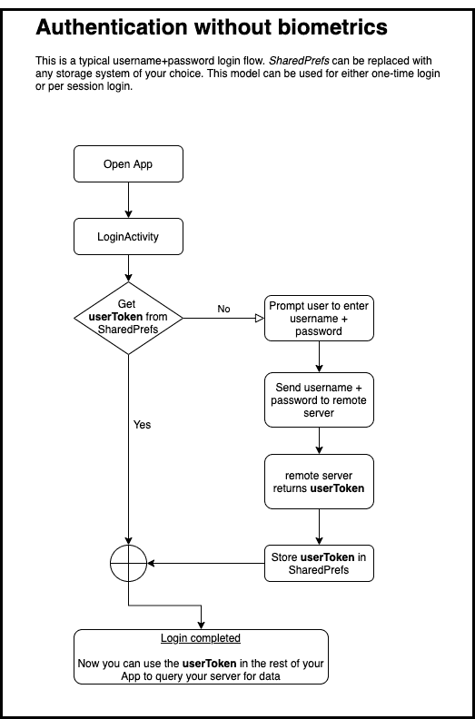
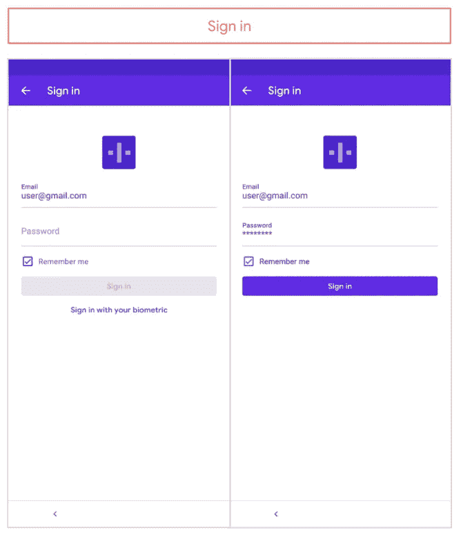
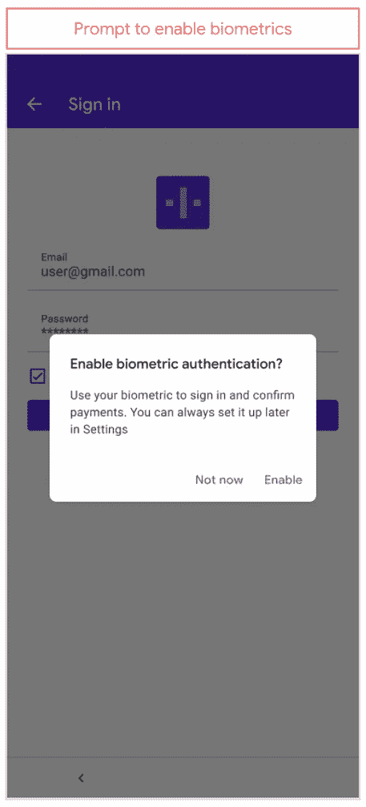
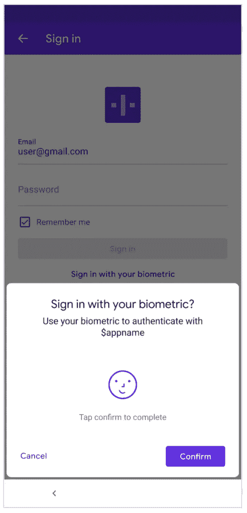
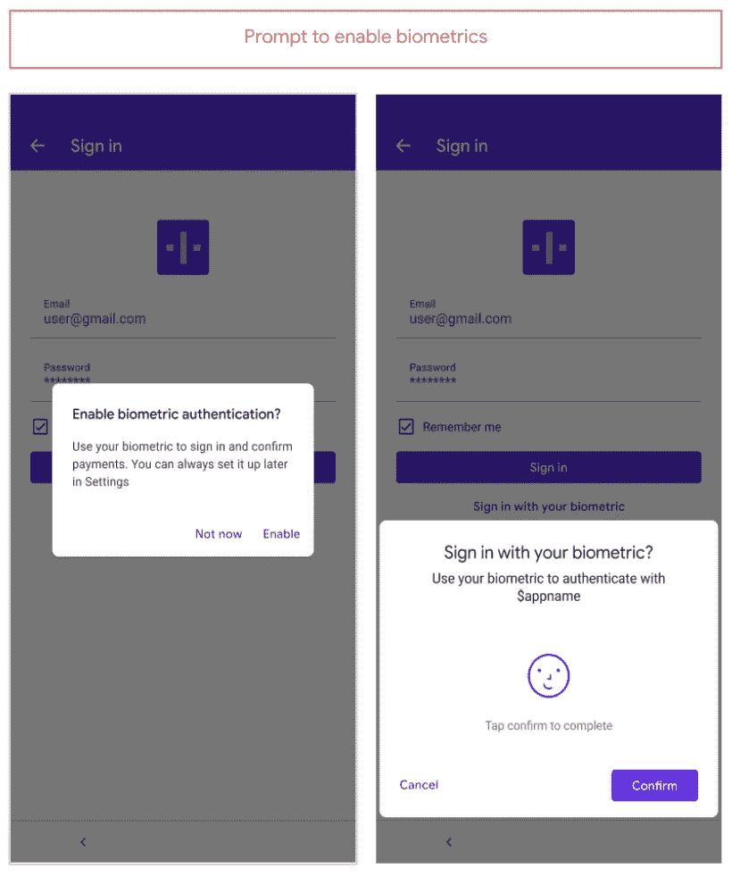
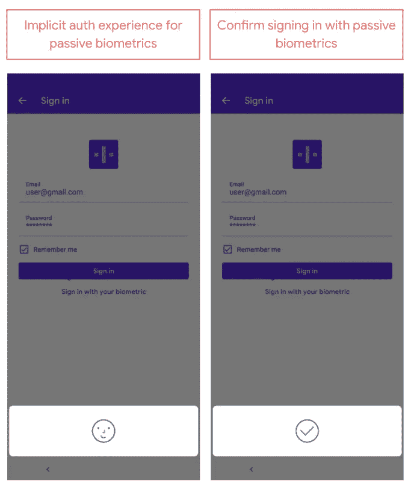
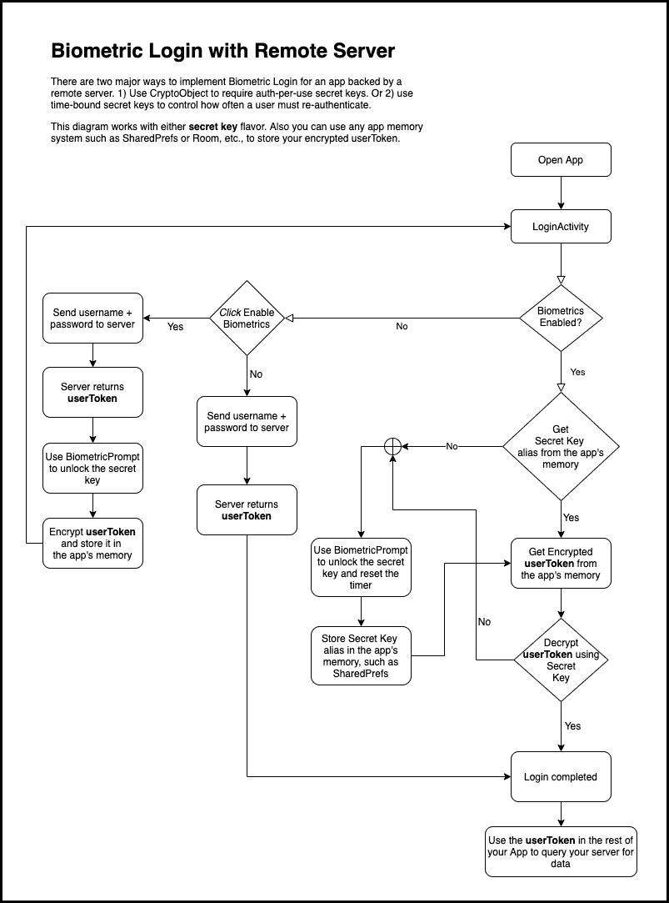

# Android 上的生物认证

> 原文：<https://medium.com/analytics-vidhya/biometric-authentication-on-android-5c2521c7c41b?source=collection_archive---------9----------------------->


## 必须需要

为了保护隐私和敏感信息，许多应用程序要求用户登录。如果您的应用程序支持传统的登录体验，它可能与图 1 中描述的过程类似。用户输入用户名和密码，应用程序将凭证发送到远程服务器，最后远程服务器返回一个`userToken`,应用程序稍后可以使用它来查询远程服务器的受限数据。无论是要求用户每次打开应用程序都要登录，还是每次安装只登录一次，图 1 都很好。



图 1:没有生物特征的认证

然而，使用图 1 所示的过程有几个缺点:

*   如果它用于银行应用程序使用的每次会话认证，那么这个过程很快就会变得繁琐，因为用户每次打开应用程序时都需要输入密码。
*   如果它用于电子邮件应用程序使用的每次安装身份验证，那么设备所有者的私人内容对任何碰巧持有该设备的人都是可见的，因为它不会验证所有者的存在。

为了帮助克服这些缺点，生物特征认证提供了许多便利，使认证过程对最终用户更容易，对开发人员更有吸引力，即使开发人员可能不需要经常登录他们的应用程序。这些优势中的关键是，使用生物认证就像轻按传感器或查看您的设备一样简单。重要的是，作为开发人员，您可以决定用户必须重新认证的频率——每天一次，每周一次，每次打开应用程序时，等等。总的来说，API surface 有许多特性使得开发者和他们的用户更容易登录。

如今，许多处理个人数据的应用程序，如电子邮件或社交网络应用程序，往往只需要在安装时进行一次性身份验证。当用户每次打开应用程序时输入用户名和密码会对用户体验产生负面影响时，这种做法就流行起来了。但是有了生物认证，安全性就不必对用户造成如此沉重的负担。即使您的应用程序通常需要一次性认证，您也可以考虑定期要求生物特征认证来验证用户的存在。周期的长短完全取决于你，开发者。

如果应用程序要求每次会话都进行身份验证(或者每 2 小时一次或每天一次等频率)。)，那么与每次都必须键入密码相比，看着设备或轻敲传感器几乎不会被注意到。如果一个应用程序只需要一次性认证，就像许多电子邮件应用程序一样，那么生物识别技术将增加一层额外的安全性，用户只需拿起并查看他们的设备。如果用户想继续保持他们的电子邮件打开，而不需要重新认证，那么他们应该有这个选择。但是对于想要更多隐私的用户来说，生物认证应该可以让他们更加放心。无论哪种方式，最终用户的成本都是微乎其微的，尤其是与额外的好处相比。

# 使用 BiometricPrompt 实现生物认证

`BiometricPrompt` API 允许您在加密和不加密的情况下实现认证。如果您正在开发一个需要更强安全系统的应用程序，如医疗保健应用程序或银行应用程序，那么您可能希望将您的加密密钥与生物认证相结合，以便验证用户的存在。否则，为了方便用户，您可能希望实现生物认证。两种情况下的代码片段非常相似，除了对于加密实现，您将传入一个`[CryptoObject](https://developer.android.com/reference/androidx/biometric/BiometricPrompt.CryptoObject)`，而为了方便实现，您将省略`CryptoObject`参数。

**加密版本:**

```
biometricPrompt.authenticate(promptInfo, BiometricPrompt.CryptoObject(cipher))
```

虽然在上面的代码片段中，我们将一个`[Cipher](https://developer.android.com/reference/javax/crypto/Cipher)`传递给了`CryptoObject,`，但是您可以自由地传递多个替代项，比如一个`[Mac](https://developer.android.com/reference/javax/crypto/Mac)`或`[Signature](https://developer.android.com/reference/java/security/Signature)`。

**无密码对象版本:**

```
biometricPrompt.authenticate(promptInfo)
```

要在您的 Android 应用中实现生物认证，请使用`[AndroidX Biometric library](https://android-developers.googleblog.com/2019/10/one-biometric-api-over-all-android.html)`。尽管 API 处理不同的模态(指纹、面部、虹膜等。)自动地，作为一个开发者，你仍然可以通过设置`setAllowedAuthenticators()`来选择你的应用将接受的生物特征的安全级别，如下面的代码片段所示。 ***Class 3*** (原 **Strong** )表示你想要的生物特征，即解锁`Keystore`中存储的凭证(即密码术)； ***Class 2*** (之前的 **Weak** )表示你只是想解锁你的 app，而不依赖于进一步被密码术保护的凭证。有一个 ***Class 1*** ，但是和 apps 不兼容。详见[安卓兼容性定义文档](https://source.android.com/compatibility/android-cdd#7_3_10_biometric_sensors)。

```
fun createPromptInfo(activity: AppCompatActivity): BiometricPrompt.PromptInfo =   BiometricPrompt.PromptInfo.Builder().*apply* **{**      setAllowedAuthenticators(*BIOMETRIC_STRONG*)      // Continue setting other PromptInfo attributes such as title,  subtitle, description **}**.build()
```

# 加密和每次使用授权密钥与限时密钥

***每次使用授权*密钥**是可用于执行一次加密操作的秘密密钥。因此，举例来说，如果你想执行十次加密操作，那么你必须解锁密钥十次。因此命名为 *auth-per-use* :你必须在每次使用时进行认证(即解锁密钥)。

另一方面，一个 ***有时间限制的*密钥**是一个在某个时间段内有效的秘密密钥——您可以通过将几秒钟传递给`[setUserAuthenticationValidityDurationSeconds](https://developer.android.com/reference/android/security/keystore/KeyGenParameterSpec.Builder)`来预先建立它。如果您传递给*有时间限制的*函数的秒数是-1，这是默认值，那么系统假设您想要*每次使用授权*。对于所有其他数字，我们建议三秒或更长时间，系统会遵循您设置的持续时间。要轻松创建有时间限制的密钥，请参见`[Jetpack Security](https://developer.android.com/topic/security/data)`中的`[MasterKeys](https://developer.android.com/reference/androidx/security/crypto/MasterKeys)` 类。

通常——结合前面提到的-1——您将传递一个`CryptoObject`到`BiometricPrompt.authenticate()`来请求`*auth-per-use*.` ,然而，您可以设置一个非常短的持续时间，比如 5 秒，来使用一个*有时间限制的*密钥，就好像它是一个*每次使用授权*密钥一样。这两种方法在显示用户存在方面实际上是等效的，所以如何设计应用程序的 UX 取决于你自己。

关于引擎盖下发生的事情:当您使用`CryptoObject`时，密钥仅针对指定的操作解锁。这是因为 Keymint(或 Keymaster)获得了一个带有特定操作 Id 的`HardwareAuthToken` ( `HAT`)。密钥被解锁，您只能使用它来执行您环绕`CryptoObject`的`Cipher/Mac/Signature`操作所代表的操作，并且在它再次锁定之前，您只能执行一次指定的操作——这是一个*每次使用授权密钥*。当你不使用`CryptoObject`时，送去造币厂的帽子没有`operationId`；因此，Keymint 简单地寻找一个具有有效`timestamp` ( `timestamp + time-based-key-duration > now)`)的`HAT`，并且您可以使用那个密钥直到它的时间到期——它是一个*有时间限制的*密钥。

乍一看，这听起来像是一个有时间限制的键，只要时间窗口有效，任何应用程序都可以访问它。但事实是，除了妥协的用户空间，没有人会担心某个 app *X* 使用某个 app *Y* 的按键或操作。Android 框架不会允许其他应用程序找到或初始化另一个应用程序的操作。

# 生物认证的实现

要增强您的登录过程以包括生物识别身份验证，请在用户成功登录后立即提示他们启用生物识别身份验证。图 1A 显示了一个典型的登录流程，您可能已经很熟悉了。用户按下登录按钮后，服务器返回一个`userToken`，提示用户启用生物识别，如图 1B 所示。一旦用户启用了生物特征认证，从那时起，每次用户需要登录时，应用程序都会自动显示生物特征提示，如图 2 所示。



**图 1A:典型的登录界面**



**图 1B:启用生物认证**



**图 2:确认生物认证**

虽然图 2 显示了 UI 中的确认按钮，但该按钮实际上是可选的。例如，如果您正在构建一个餐馆应用程序，建议您显示这个确认按钮，因为生物认证允许顾客支付他们的餐费。对于敏感交易和支付，我们建议您要求确认。要在你的应用程序 UI 中包含一个确认按钮，在构建你的`[BiometricPrompt.PromptInfo](https://developer.android.com/reference/androidx/biometric/BiometricPrompt.PromptInfo)`时调用`[setConfirmationRequired(true)](https://developer.android.com/reference/androidx/biometric/BiometricPrompt.PromptInfo.Builder#setConfirmationRequired(boolean))`。注意，如果你不调用`setConfirmationRequired()`，系统将默认设置为真。

# 生物识别设计流程

举例来说，代码片段使用加密版本的`BiometricPrompt`，带有`CryptoObject`。

如果你的应用需要认证，你应该创建一个专用的`LoginActivity`组件作为你的应用的登陆页面。只要需要身份验证，无论您要求用户进行身份验证的频率有多高，这一点都很重要。如果用户已经被认证，那么这个`LoginActivity`将调用`finish()`，用户可以继续前进。如果用户尚未通过身份验证，那么您应该检查生物识别功能是否已启用。

有几种方法可以检查生物识别是否已启用。然而，与其在各种选择中跋涉，不如让我们特别深入一个:对定制属性`ciphertextWrapper`的空检查。`CiphertextWrapper`是您创建的一个数据类，以便当用户成功为您的应用启用生物认证时，您可以方便地将加密的`userToken`，也称为`ciphertext`，存储在永久存储中，如`SharedPreferences`或`Room`。因此，如果`ciphertextWrapper`不为空，那么就有了访问远程服务器所需的`userToken`的加密版本——也就是说启用了生物识别。

如果没有启用生物识别，那么用户可以点击启用它(图 1B)，这时您将向用户显示实际的生物识别提示，如图 3 所示。

在下面的代码片段中，`showBiometricPromptForEncryption()`展示了如何设置与生物识别提示相关联的密钥。本质上，您从一个`String`初始化一个`Cipher`，然后将`Cipher`传递给`CryptoObject`。最后你把`CryptoObject`传给`biometricPrompt.authenticate(promptInfo, cryptoObject)`。



**图 3:启用生物识别的提示**

此时，即图 2 和图 3，app 只有`userToken`。但是，除非用户每次打开应用程序时都继续使用他们的密码，否则这个`userToken`需要存储在应用程序的文件系统中，以便以后使用。然而，如果您存储`userToken`而没有首先对其进行加密，那么未经授权访问设备的攻击者可能会读取`userToken`并使用它从远程服务器获取数据。因此，最好在本地保存之前加密`userToken`。这就是图 3 中的生物特征提示发挥作用的地方。当用户使用他们的生物特征进行身份验证时，您的目标是使用`BiometricPrompt`来解锁密钥(或者是*每次使用授权*或者是*时间限制*)，然后使用该密钥来加密服务器生成的`userToken`，然后将其存储在本地。从现在开始，当用户需要登录时，可以使用自己的生物特征进行认证(即生物特征认证- >解锁密钥- >解密`userToken`进行服务器访问)。

请注意用户第一次启用生物特征识别和用户随后使用生物特征识别登录之间的区别。为了启用生物认证，应用程序调用`showBiometricPromptForEncryption()`，这将初始化一个`Cipher`用于加密`userToken`。另一方面，为了使用生物特征进行实际登录，应用程序调用`showBiometricPromptForDecryption()`，它初始化一个`Cipher`用于解密，然后使用`Cipher`来解密`userToken`。

启用生物认证后，用户下次返回应用程序时应该会看到生物认证提示，如图 4 所示。请注意，因为图 4 用于登录应用程序，而图 2 用于交易确认，所以不需要确认，因为应用程序登录是一个被动的、容易撤销的操作。



**图 4**

为了为您的用户实现这个流程，当您的`LoginActivity`验证用户已经通过身份验证时，您将使用通过成功的`BiometricPrompt`身份验证解锁的加密对象来解密`userToken`，然后在`LoginActivity`组件上调用`finish()`。

# 完整的图片

图 5 显示了推荐工程设计的完整流程图。我们充分意识到，您的代码在许多地方可能会偏离这一建议。例如，您自己的加密解决方案可能只要求为加密而不是为解密解锁密钥。我们仍然为那些可能需要的人提供完整的示例解决方案。

图中提到*秘密密钥*的地方，你可以自由使用*每次使用授权*密钥或者*有时间限制的*密钥。此外，只要图中提到“应用程序的内存”，您就可以自由地使用您最喜欢的结构化数据存储解决方案:`[SharedPreferences](https://developer.android.com/reference/android/content/SharedPreferences)`、`[Room](https://developer.android.com/jetpack/androidx/releases/room)`或其他任何东西。最后，通常所说的`userToken`，是任何类型的服务器负载，它将给予用户访问受限数据或服务的权限。服务器通常会检查这种有效载荷的存在，作为调用者被授权的证据。

在图中，从“ *encrypt userToken* 开始的箭头很可能指向“*登录完成*”，而不是回到“`LoginActivity`”。尽管如此，我们还是选择了`LoginActivity`来提醒大家注意，在用户点击“启用生物识别”之后，可以使用额外的`Activity`，例如`EnableBiometricAuthActivity`。使用单独的活动可能会使您的代码更加模块化，因此可读性更好。或者，您可以创建一个带有两个`Fragment`的`LoginActivity`(由一个[导航组件](https://developer.android.com/guide/navigation)支持):一个`Fragment`用于实际的身份验证流程，另一个`Fragment`响应用户点击“启用生物识别”。

除了这个工程流程图，这里还有一个设计指南，你可以在实现你的应用时遵循。另外，Github 上的这个[示例应该会为您提供进一步的见解。](https://github.com/android/security-samples/tree/master/BiometricLoginKotlin)



**图 5:远程服务器生物特征登录的完整示意图**

# 摘要

在这篇文章中，你学到了以下内容:

*   为什么只有用户名+密码的认证是有问题的。
*   为什么在你的应用中加入生物认证是个好主意。
*   不同类型应用的设计考虑。
*   加密或不加密如何调用`BiometricPrompt`。
*   *每次使用授权*与*限时*加密密钥的区别。
*   使用哪些 UI 资产来增强生物识别的登录过程。
*   你的应用应该为生物认证解决的关键用户旅程。
*   如何设计您的代码来处理生物认证的不同方面。
*   您的登录系统应该如何流动的完整工程图。

编码快乐！！