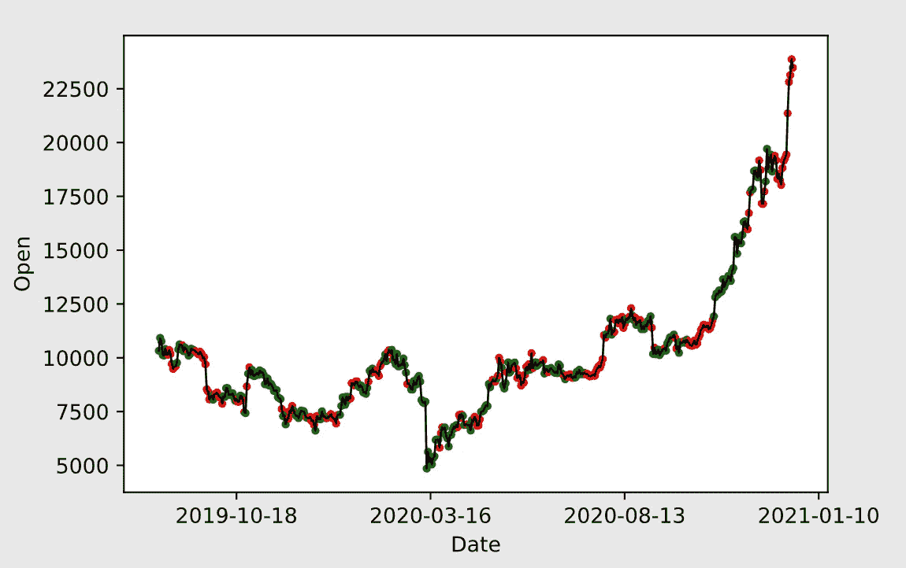

# 随机森林和技术指标的比特币价格预测

> 原文：<https://medium.com/analytics-vidhya/bitcoin-price-prediction-with-random-forest-and-technical-indicators-python-560800d6f3cd?source=collection_archive---------6----------------------->

在市值超过 5000 亿美元的比特币创下历史新高后，包括我在内的很多人都想知道，比特币的价值是会一直增加，还是像 2017 年那样是泡沫。这就是我写这篇文章的动机。

首先，我解释了如何向由价格历史和交易量组成的源数据集添加特性。然后，使用技术指标丰富的数据集来训练一个**随机森林**分类模型，该模型预测比特币的价值在未来是增加还是减少。

所有使用过的库都列在[对应的 GitHub 库](https://github.com/rs75/bitcoin-price-model)的 [pipfile](https://github.com/rs75/bitcoin-price-model/blob/main/Pipfile) 中。这个库还包含一个 Jupyter 笔记本，上面有完整的代码。

# 创建数据集

价格和交易量的历史数据可以从 quandl 获得，它提供了一个 python 库。这非常简单，因为它将数据直接加载到 Pandas 数据框架中。

我们已经可以尝试使用这个数据框架来训练分类模型，但是我决定添加更多的功能，这些功能通常会使模型更加准确。

我找到了一个名为 [ta](https://github.com/bukosabino/ta) 的库，它创建了许多技术指标，如**均线**或**布林线**(以及许多其他指标)。它最初是为分析股票数据而设计的，但也应该适用于比特币。以下代码向数据集中添加了 80 多个要素。在 Github 上查看[笔记本，查看输出。](https://github.com/rs75/bitcoin-price-model/blob/main/bitcoin_price_prediction.ipynb)

下一步是创建我们想要预测的类。为了不使问题变得太复杂，我决定只预测未来 7 天比特币的价值是涨还是跌。预测二元类比预测具体价格容易得多。

# 训练分类模型

接下来，我们需要将数据集分为测试数据和训练数据。前 2000 天用于培训，剩下的 491 天用于测试。

现在有趣的部分来了，创建**随机森林分类器**并用训练数据拟合它。其他分类模型也可以，我只是选择随机森林，因为我个人喜欢它。

## 评估模型

```
0.5804480651731161
```

这个预测在 58%的情况下是正确的。用训练数据集对它进行测试的结果是 72%的准确率，这并不奇怪，因为这样的模型往往会过度拟合。

# 解释

下面的代码片段将结果可视化。红点和绿点表示在给定时间预测是否正确。



基于随机森林评估的比特币价格预测

**random forest** 模型正确预测了 2020 年 3 月的下降，当时是日冕危机的开始。然而，2020 年底的上涨并没有被正确预测。

该模型完全依赖于从价格历史中获得的技术数据，许多人认为这些数据大多是随机的。因此，我对结果感到满意，但如果基本面因素也包括在内，我会期待显著的改善。例子可能是比特币的谷歌搜索量或区块链的分析。特别是区块链可能非常有价值，因为它包含了自 2009 年初以来的所有交易。