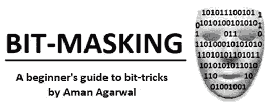
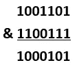
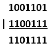
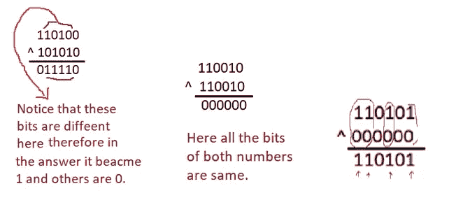
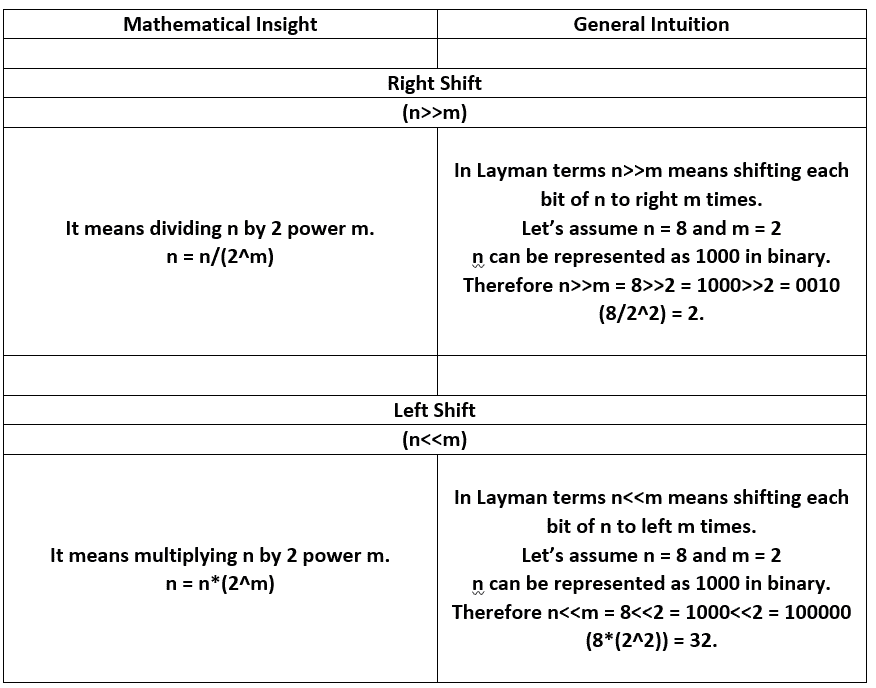
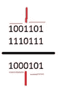
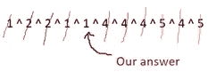
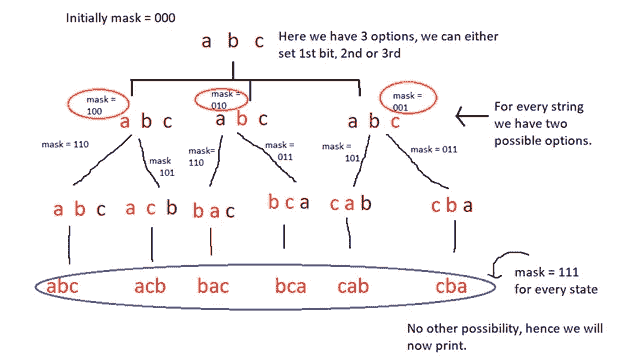
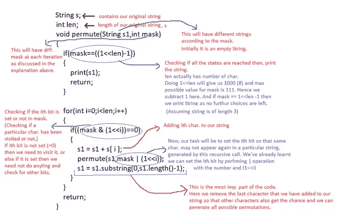

# 位和位屏蔽

> 原文：<https://medium.com/analytics-vidhya/bits-bitmasking-62277789f6f5?source=collection_archive---------0----------------------->

位屏蔽通常被许多人称为位魔法，并不像人们想象的那样可怕。

我观察到我的同事抱怨在运行他们的代码时重复出现 TLE(超过时间限制)和空间复杂性问题。所以这就是比特魔法来拯救我们的地方。

在这个由两部分组成的系列中，我将分享我目前关于位屏蔽以及它如何帮助优化算法的知识(为什么它也被称为**位魔术**)。

这一部分将介绍位屏蔽背后的基本直觉以及如何操作不同的位，在下一部分，我将讨论一些高级问题，这些问题可以通过使用位屏蔽和动态编程来解决和优化。

通过这篇文章，我将讨论以下内容:

位和位屏蔽:介绍。

按位运算符。

动手位屏蔽。

放到文章上！！

**比特和比特屏蔽:导论。**

一个位是一个布尔值(0 或 1)，它的小集合构成一个位掩码。当且仅当一个位为‘1’时，称该位为**置位**。例如:在 10011 中，设置了第 1、第 2 和第 5 位，而第 3 和第 4 位没有设置**。**

位屏蔽中的“屏蔽”可以理解为隐藏/显示某些信息的一种方式。让我们举一个基本的例子来更透彻地理解它。假设我们有一组 5 个字符{'a '，' b '，' c '，' d '，' e'}，我们想用它们组成不同的字符串。这里我们将创建一个 5 位(_ _ _ _ _ _ _)的掩码，每一位都会告诉我们是否引用了该字符。简单来说 10011 将表示相当于“ade”的字符串，00000 将表示空字符串，11111 将表示“abcde”等等

理解了什么是位和位掩码之后，现在是研究一些可用于操作位的操作的最佳时机。

**按位运算符**

**AND 运算符(& )** :给定两个位屏蔽，&运算符将在两个位都置位时给出 1。

**OR 运算符(|):** 给定两个位掩码，无论两位中的哪一位被置位，‘|’运算符都会给出 1。

**XOR 运算符(^):** 给定两个位掩码，每当两个位不同时，'^'运算符将给出 1。

**这里一个重要的观察是，任意两个相同的数的异或永远是 0，任意数与 0 的异或就是数本身。**

你能想出一些可以应用这个概念的情况吗？？

如果你有，哇哦！！你做得很好。如果没有，不要担心，我们将在文章的后面部分讨论同样的问题。

**移位操作符:**

**如何设置一个数的第 k 位？**

解决这个问题的一个简单方法是首先创建一个掩码，以便在其中设置第 k 位。

我们可以通过左移 1 k 次或做(1<

我们必须设置 1000001 的 3 位。1<< 3 会给我们 1000。

现在，为了设置第 3 位(或第 k 位),我们只需执行数字和掩码的 or 运算。

因此，1000001 | 1000 = 1001001(设置了第 3 位)

代码:

N = N | (1 <

**如何清零第 k 位？**

如果我们的任务是清除数字的第 k 位(或者将第 k 位设置为 0 ),我们可以创建一个除第 k 位为 0 之外全为 1 的掩码。我们从这个掩码中得到的好处是，如果我们用掩码执行' & '运算，我们将得到该数的所有位，这是一个额外的好处，我们的第 k 位现在是 0。因为(0 & any no)永远是 0。

假设我们有 1001101，我们想清除它的第 3 位。所以 1 << 3 will give us 1000 but we want something like 1110111\. What can we do ??

Let’s try out by taking negation of our mask. So ~(mask) = ~(1000) = ~(0001000) = 1110111

Now we can simply perform ‘&’ operation of number & mask to clear the 3rd bit.

Having learnt about bitwise operators and how to access a particular bit by creating masks, here is a simple problem for you as an exercise.

**Q 给你 n 个比特。将 k 和 l 之间的所有位设置为 1。从用户处取 k 和 l。(k < l < = n)**

使用这些运算符可以更好地掌握逐位操作。

现在是时候了解如何使用位生成来优化代码了。让我们开始吧！！

**动手位屏蔽:**

我们都知道，信息是以位的形式存储在计算机内存中的，这意味着直接操作这些位将比对普通数据执行计算产生更快的结果。

好，我们现在通过解决一些问题来看看位屏蔽是如何优化代码的。

让我们从一个简单的交换两个数的例子开始。

*例如:a = 4(二进制 100)，b = 6(二进制 110)*

*我们想要 a = 6，b = 4 作为我们的答案。*

*a = a ^ b (a = 4 ^ 6)*

*b = a ^ b(b = 4 ^ 6 ^ 6){而我们之前已经看到，相同数字的异或是 0，因此 b = 4(因为 6 ^ 6= 0) }*

*a = a ^ b (a = 4 ^ 6 ^ 4= 6)*

因此 a = 6，b = 4。

我们成功地完成了任务..耶！！

这显然可以通过正常的交换来实现，但是使用按位操作符将会产生一个更加高效的代码。

给定一个整数列表，其中所有的整数都出现偶数次，除了一个出现奇数次。找出那个整数。

**例如:** l = { 1，2，2，1，1，4，4，5，4，5}我们的 ans。应该是 1

一种简单的强力方法是计算每个整数在列表中出现的次数，并打印出与奇数计数相对应的整数。在最坏的情况下，它将导致 O(n*k)的时间复杂度，其中 k 是不同元素的数量。

让我们使用位屏蔽来尝试一下。如果我们对所有元素进行异或运算会发生什么？

进行 xor 运算将抵消所有出现次数为偶数的数字(回想一下，相同数字的 XOR = 0 ),我们只剩下重复次数为奇数的整数。感兴趣！！不是吗？？

我希望你现在能更好地掌握它！！现在来讨论一个稍微复杂一点的问题。

给定一个字符串，打印它的所有排列。

**例如:**给定的字符串是“abc”。我们首先想到的是如何访问字符串中的每个字符。还记得我们学过的面具吗？？是的，你答对了！！在这里，我们将为每个可能的状态创建一个掩码，一旦每个角色被访问，我们将打印我们的答案。掩码的长度显然等于字符串的长度。

在每次迭代中，我们将检查哪些位没有被设置，然后通过在每次迭代中设置不同的位来尝试不同的排列。如果一个特定的位已经设置，那么我们不需要做任何事情，但如果它不是，那么我们必须尝试所有可能的组合。遮罩的不同状态将决定下一个组合是什么。

这一部分将变得更加清晰，因为我们对这个问题的编码部分的标题。

下面是相同的代码:

我希望现在您已经清楚地了解了位屏蔽(或者我会说位魔术)是如何工作的。

现在是时候通过练习一些有趣的问题来弄脏你的手了。

我的下一篇关于位屏蔽的文章将关注更复杂的问题，包括位屏蔽和动态编程。

直到那时快乐编码:)

**一些有趣问题的链接:**

[https://www . hackere earth . com/practice/basic-programming/bit-manipulation/basics-of-bit-manipulation/practice-problems/algorithm/subham-and-binary-strings/](https://www.hackerearth.com/practice/basic-programming/bit-manipulation/basics-of-bit-manipulation/practice-problems/algorithm/subham-and-binary-strings/)

[https://www . hackere earth . com/practice/basic-programming/bit-manipulation/basics-of-bit-manipulation/practice-problems/algorithm/a-new-experiment/](https://www.hackerearth.com/practice/basic-programming/bit-manipulation/basics-of-bit-manipulation/practice-problems/algorithm/a-new-experiment/)

[https://practice . geeks forgeeks . org/problems/subsets-with-xor-value/0](https://practice.geeksforgeeks.org/problems/subsets-with-xor-value/0)