# 黑色-(失明与否)

> 原文：<https://medium.com/analytics-vidhya/black-blind-or-not-8897e6c1ad4c?source=collection_archive---------13----------------------->

> **概述 *:*** *这篇博客是关于检测* [糖尿病视网膜病变](https://nei.nih.gov/health/diabetic/retinopathy) *的，糖尿病视网膜病变是居住在难以进行医学筛查的农村地区的工作老年人失明的主要原因*。*这个想法是在早期阶段检测到这个问题，以便在机器学习的帮助下预防失明。使用机器学习的要点是，整个过程可以加速，并且可以在没有医生的地方远程访问。*

完整的代码可以在我的 Github [档案](https://github.com/Anwoy-p/case_study_2)中找到

> **目录**:

— —关于这个问题

— —关于数据集

— —指标

— —加载数据集

— —探索数据

— —数据增强

— —数据预处理

— —准备图像数据生成器

— —建模

— —对照表

— —卡格尔分数

— —未来的工作

— —参考

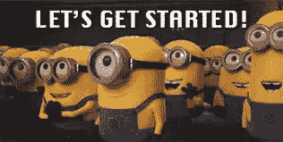

> **关于问题:**

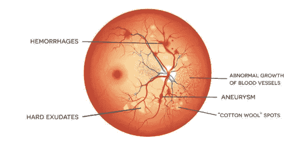

如上图所示，这是不健康眼睛的五种不规则性，即这些不规则性倾向于[糖尿病视网膜病变](https://nei.nih.gov/health/diabetic/retinopathy)。所以我们必须处理图像来发现问题有多严重。

> **关于数据集:**

这是一个 Kaggle 问题，其中数据集由 5 个不同类别的图像组成，但所提供的图像包含噪声，因为所有真实世界的数据都是如此，并且它是一个高度不平衡的数据集，具有超过 1700 个 0 类点和少于 250 个 4 类图像。训练集由 3662 幅图像组成，测试集包含 1928 幅图像。

> **指标:**

用于评估预测的度量是 kappa 度量。Kappa score 测量两个评价人之间的一致程度，这两个评价人分别将 N 个项目分成 *C* 互斥的类别。

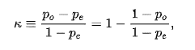

*po* 是相对观察一致， *pe* 是偶然一致的概率

如果评定者完全同意，那么 k =1。如果评定者之间没有一致意见，则的值为 0，即 k=0。

> ***加载数据集:***

现在将列车图像的路径保存在列车数据框中

> **探索数据:**

— — — *绘制图像标签的直方图:*

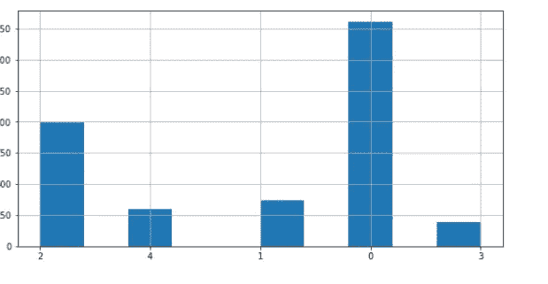

从剧情来看，很明显有很多数据不平衡。

— — — *绘制一些不同类别的图像:*

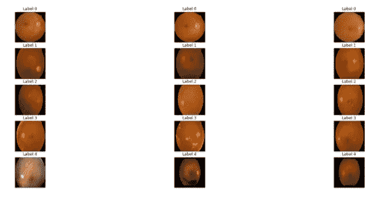

从图中，我们可以看到图像在大小和强度上有很大差异。

> **数据扩充:**

正如我们所知，所提供的数据是高度不平衡的，我们可以使用一种技术来处理它是上采样。上采样基本上是通过使用不同的增强技术从现有数据中创建数据点。在这篇博客中，我们将对 1、4 和 3 级使用水平和垂直翻转增强，因为它们的比例比 0 和 2 级小，并保存这些图像，以便我们可以在训练时使用它们。

创建具有 1、4 和 3 类标签的数据帧

下面的函数返回给定图像的两幅图像，一幅垂直翻转，另一幅水平翻转。

现在我们需要保存这些图像，以便以后使用。在此之前，我们需要将图像转换成 RGB 格式，因为 cv2 可以读取 BGR 格式的图像。

增强后的数据集是这样的，我们总共有 5062 个数据点。

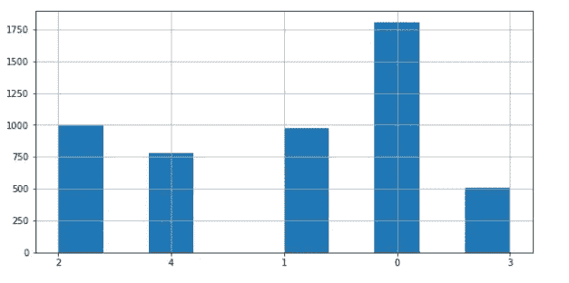

从图中可以明显看出，我们已经设法在一定程度上减少了阶级的不平衡

> **数据预处理:**

对于预处理部分，我们将裁剪所有图像，将使用 Ben(前一场比赛的获胜者)使用的图像增亮技术，最后使用阈值处理以获得更好的结果。

所以让我们从修剪所有的法师开始。在这一步，我们将裁剪掉所有的暗像素，这样我们就有了一个清晰的图像。但是，如果图像是完全黑暗的，那么我们将裁剪一切，因此，如果裁剪后的形状为 0，我们需要返回原始图像。

现在来看本使用的图像增亮技术。在这个函数中，我们首先将图像从 RGB 转换到 BGR，因为 ImageDataGenerator 以 RGB 模式读取图像，而 cv2 以 BGR 模式读取。之后，我们将调整图像的大小，并给它们添加权重。

之后，我们将应用阈值技术，使不规则很容易看到。

在图像变亮后，我也尝试使用 canny 边缘检测技术，但它无法检测出图像中存在的所有不规则之处

让我们想象一下到目前为止所有预处理的输出。

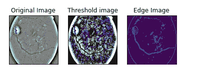

从图像来看，很明显 canny 边缘检测没有正常工作，所以我们将使用阈值处理

> **准备图像数据生成器:**

现在，我们需要加载所有图像，并将它们分为训练和验证两部分。

将数据分为训练集和验证集。在分割时，我做了 80-20 分割，并使用分层，因为数据是不平衡的。分割后，我们有 4049 个训练数据和 1013 个验证数据。

现在让我们看看训练和验证数据集的分布。

列车组分布

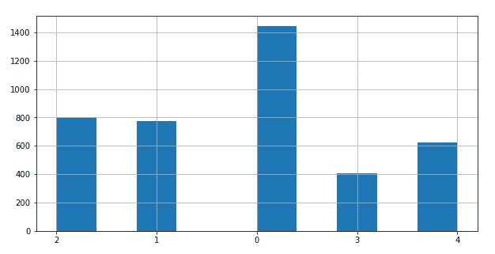

有效集分布

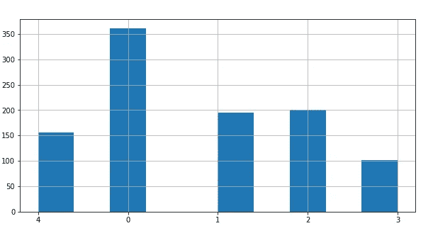

很明显，训练集和验证集具有相同的分布。

我们准备好训练模型了。

> **造型:**

— — ***基础型号*** :

对于基本模型，我没有训练任何模型，我只是使用了预训练的 [Vgg16](https://keras.io/api/applications/vgg/) ，在此基础上，我使用了具有 5 个参数和 softmax 激活功能的密集层。结果不是很好，因为它错误地分类了许多 2 类和 3 类数据点。

基本模型的训练

基本模型的混淆矩阵如下所示。

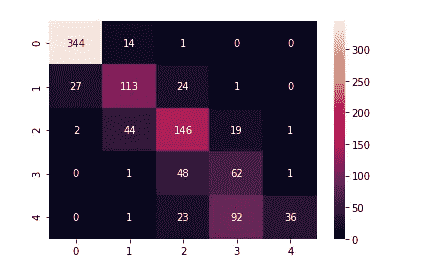

> ———**CNN 基本模式:**

出于同情，我尝试实现一个 CNN 模型，这是一个基本的模型。该模型似乎是一个哑模型，它将所有的数据点归类到类标签 1。

模型架构

CNN 模型的训练

混乱矩阵看起来像这样

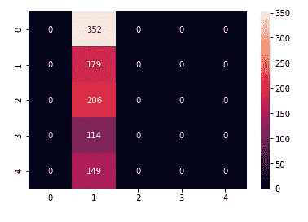

显然，这是一个什么也没学到的愚蠢模型。

— — — ***转移学习:***

对于迁移学习，我使用的是 [EfficientNetB3](https://keras.io/api/applications/efficientnet/) ，图像大小为 300*300，批量大小为 16。我使用分类交叉熵作为损失函数，使用自定义 AUC 作为度量。

首先，让我们使用预先训练的 ImageNet 权重初始化模型，并在此基础上使用密集层将问题视为分类。

现在是训练部分，在训练模型时，我使用了 ReduceLROnPlateau 作为回调。其功能是在模型不收敛时降低学习速率。很多时候，训练时发生的情况是，模型没有收敛，这意味着它已经优化，但性能不是很好。这是因为学习率，可能是超过了最小值，所以如果我们减少学习与历元，收敛变得更容易，并提供更好的性能。

效率网的结果是令人满意的。它的混淆矩阵是这样的。

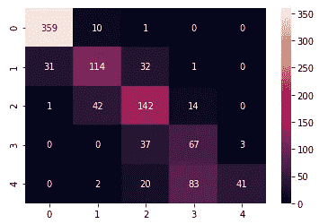

我们可以看到，它对 3 类数据点进行了错误分类，但结果仍然足够好。

— — — ***集合模型:***

为了减少有效网络的错误分类点，我尝试通过结合有效网络、vgg16 和 rest 网络实现一个集成模型，但结果并没有太大不同。我用三票多数来预测最终的标签。

架构

[Vgg16](https://keras.io/api/applications/vgg/) 架构

[高效网络 B3](https://keras.io/api/applications/efficientnet/) 架构

然后是使用这三个模型的预测，我使用了多数票。

集合模型的混淆度量看起来像这样。

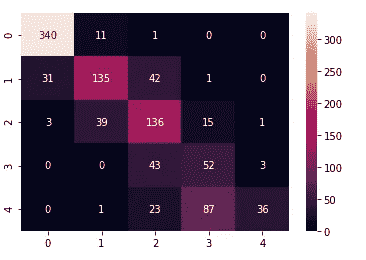

显然，有效的网络模型和集合模型之间没有太大的区别。

> **对比表:**

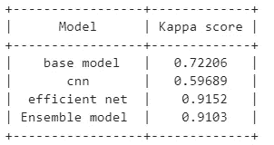

> **Kaggle 评分:**

我的分数:

— — —私人得分:0.9152

— — —公众评分:0.763837

最高领导者委员会分数:

— — —私人得分:0.936129

— — —公众得分:0.856139

> **未来工作:**

通过在组合时使用更多的模型，或者通过改变阈值，或者通过使用从图像中提取信息的其他技术，可以进一步提高结果。

> **参考:**

 [## 应用课程

### 我们知道转行是多么具有挑战性。我们的应用人工智能/机器学习课程被设计为整体学习…

www.appliedaicourse.com](https://www.appliedaicourse.com/)  [## APTOS:糖尿病视网膜病变中的眼睛预处理

### 使用 Kaggle 笔记本探索和运行机器学习代码|使用来自多个数据源的数据

www.kaggle.com](https://www.kaggle.com/ratthachat/aptos-eye-preprocessing-in-diabetic-retinopathy)  [## 带 Keras 的 efficient net b5(APTOS 2019)

### 使用 Kaggle 笔记本探索和运行机器学习代码|使用来自多个数据源的数据

www.kaggle.com](https://www.kaggle.com/carlolepelaars/efficientnetb5-with-keras-aptos-2019) 

我的 LinkedIn [个人资料](https://www.linkedin.com/in/anwoy-panigrahi-415754169/)