# 黑色星期五——使用可视化和 XGBoost 的详细分析和预测。

> 原文：<https://medium.com/analytics-vidhya/black-friday-a-detailed-analysis-prediction-using-visualization-and-xgboost-6f5fe4eb7622?source=collection_archive---------7----------------------->


🇨🇭·克劳迪奥·施瓦茨| @purzlbaum 在 [Unsplash](https://unsplash.com?utm_source=medium&utm_medium=referral) 上拍摄的照片

O 机器学习和数据科学最有趣的用途之一可以在商业领域找到，人们可能需要分析给定的数据来解决问题，例如确定公司可以预期的客户数量，公司需要关注的客户类型以实现利润最大化等。
通过这一特定的黑色星期五销售分析，我们更感兴趣的是根据客户的特定属性(如年龄组、城市类别等)计算出他们的消费金额。(稍后将详细讨论)。

> *这个项目是正在进行的黑客马拉松* [*分析 Vidhya*](https://datahack.analyticsvidhya.com/contest/all/) *的一部分，被称为* [*黑色星期五销售预测*](https://datahack.analyticsvidhya.com/contest/black-friday/)
> 
> 注意:完整的 Python 代码可以在这里访问[。](https://github.com/starnlm/Black-Friday-Hackathon)
> 
> 还有，看看这个[**黑色星期五可视化**](https://public.tableau.com/views/BlackFriday_16010249401550/BlackFriday?:language=en-GB&:display_count=y&publish=yes&:toolbar=n&:origin=viz_share_link) 我在 Tableau 上创作的。

## 介绍

零售公司“ABC Private Limited”希望**了解顾客对不同类别的各种产品的购买行为(具体来说，购买金额)。他们分享了上个月不同客户对选定的大量产品的购买摘要。**

他们希望建立一个模型来预测客户对各种产品的购买量，这将有助于他们针对不同的产品为客户创建个性化的报价。

## 步骤 0:理解问题

在我们开始处理数据之前，我们必须了解问题对我们的要求。在这种情况下，我们需要预测'*购买量'*，这是一个连续变量。既然我们知道我们将预测一个连续变量，我们可以肯定地说，这是一个**回归** **问题**，我们可以使用各种回归算法，如线性回归、岭回归、决策树回归、集成技术、神经网络或任何其他首选的回归技术。

## 步骤 1:导入库和数据集

Python 拥有大量的机器学习库，这使得它成为数据科学的最佳编程语言之一。最重要的是熊猫，Numpy，Scikit Learn，MatplotLib 和 Seaborn。

```
#Import Librariesimport pandas as pd
import numpy as np
from sklearn.preprocessing import OneHotEncoder
from sklearn.metrics import mean_squared_error
from math import sqrt
from sklearn.model_selection import train_test_split
from sklearn.linear_model import LinearRegression
from sklearn.ensemble import RandomForestRegressor
import xgboost as xgb
from sklearn.preprocessing import StandardScaler#Get the Data
train = pd.read_csv("train.csv")
test = pd.read_csv("test.csv")train.head()
```

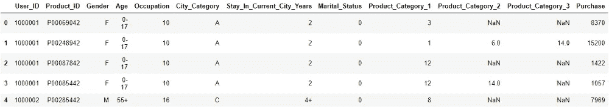

数据

```
train.info()
```

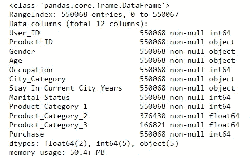

dataFrame.info()给出了关于实体数量和各列数据类型的信息

可以看出，我们的数据中有 550，068 行，除了*‘Purchase _ Category _ 2’*和*‘Purchase _ Category _ 3’之外，大多数数据列都是非空的。我们需要处理这些列中缺失的数据。但是在此之前，我们将看看这些列是如何影响目标的，然后对其进行相应的处理。*

```
train.describe()
```

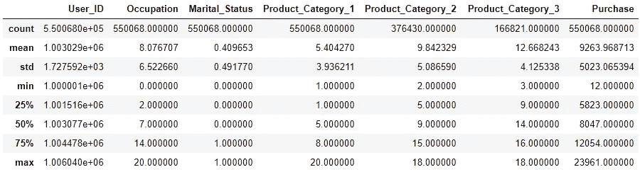

dataFrame.describe()给出了数据的统计洞察

```
#Checking for unique valuesprint('The number of unique Users are:',train['User_ID'].nunique())
print('The number of unique Products are:',train['Product_ID'].nunique())
-------------------------------------**OUTPUT** The number of unique Users are: 5891
The number of unique Products are: 3631
```

我们可以看到，在 550，068 个数据点中，只有 5，891 个唯一用户和 3，631 种不同的产品可用。

## 第二步:仔细观察特征

1.  **User_ID:** 给客户一个独特的 ID，以唯一地标识他们。
2.  **产品标识:**产品被赋予一个独特的标识，以唯一地标识它们。
3.  **性别:** M 或 F 可作为二元变量。
4.  **年龄:**年龄分为 6 类。
5.  **职业:**用户从事的职业类型，已经被屏蔽。
6.  **City _ Category:**A、B、c 中城市的类别应作为分类变量。
7.  **Stay _ In _ Current _ City _ Years:**有 5 个值:0，1，2，3，4+，可以作为分类变量使用。
8.  **婚姻状况:** 0:未婚，1:已婚。预计婚姻状况确实会影响购买价值。
9.  **产品 _ 类别 _1:** 产品所属的主要类别。这可能是一个有用的功能，因为某些类别的产品比其他产品销售得更频繁。
10.  **产品 _ 类别 _2:** 产品的二级类别。如果没有次级类别，这将是空的。
11.  **产品 _ 类别 _3:** 产品的第三个类别。只有当类别 1 和类别 2 被占用时，它才会被占用。此外，如果产品没有第三类别，它将为 *Null。*
12.  **购买:**这是目标变量。

现在我们已经理解了我们的数据，我们可以开始可视化，并获得更多的见解。

> ***注:*** *我将使用 Tableau 进行数据可视化。*

## 步骤 3:使用可视化的 EDA

当使用可视化来分析数据时，有大量的可能性。我们将首先了解不同的特征如何影响目标，然后了解这些特征的组合如何影响目标。

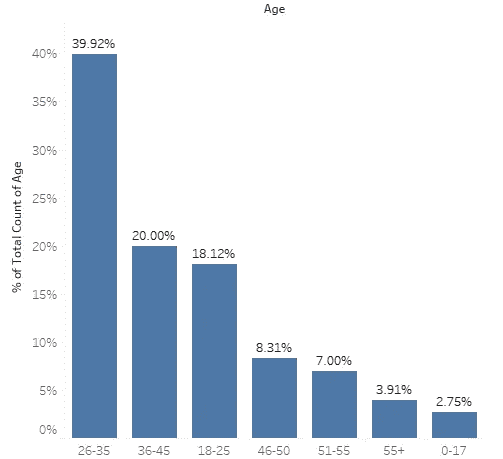

图 3.1.1

## 3.1 年龄

我们可以在*图 3.1.1* 中看到，我们数据中各个年龄组的分布情况。26-35 岁的顾客数量最多，约占总顾客的 40%，而 0-17 岁的顾客数量最少，仅占 2.75%。

因此，我们可以推断，26-35 岁年龄段的人购物最多，其次是 36-25 岁，18-25 岁，51-55 岁，55 岁以上，然后是 0-17 岁。

很容易推测这个数据。由于 0-17 岁的人通常依赖老年人，他们作为顾客的数量最少。此外，26-35 岁年龄组的人通常是独立的，有收入来源，他们是我们数据中最大的人群。

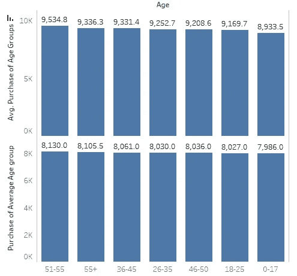

图 3.1.2

尽管不同年龄组的顾客数量存在差异，但我们可以从*图 3.1.2* 中看到，不同年龄组的平均购买金额(平均值)与该年龄组中平均每人的购买金额(中值)几乎相同。此外，重要的是要注意，26-35 岁的年龄组确实在很大程度上构成了我们的数据，但最大的平均支出金额是 51-55 岁年龄组的人。一个普遍的原因可能是，他们不再需要储蓄，可以自由地花费他们想要的任何金额。

> 此数据列不应用作序数变量，因为图表显示它们在比较时不符合任何特定的顺序。我将使用该列作为分类变量，并执行一个热编码以用于建模。

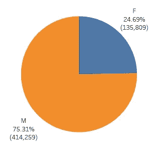

图 3.2.1

**3.2 性别
这可能是一个非常重要的特征，因为不同性别的购物行为之间可能存在一些重大差异。在*图 3.2.1* 中我们可以看到数据中男性(M)和女性(F)的分布。男性占购物的 75%，而女性仅占 25%。这是一个非常奇怪的观察结果，因为人们不会想到性别之间会有如此大的差异，公司必须找出存在这种差异的原因，以及如何吸引女性购物者。**

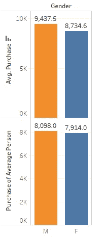

图 3.2.2

男性不仅购物更多，而且平均花费也比女性多。此外，一个普通男性的花费比一个普通女性多，尽管不是很多。

> 因为这个类别只有两个变量 M 和 F，所以它可以很容易地被认为是一个二元变量。

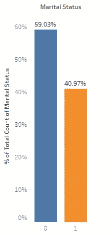

图 3.3.1

**3.3 婚姻状况** 从*图 3.3.1，*我们可以看到大约 60%的客户未婚，40%已婚。已婚人士喜欢购买的商品可能没有吸引人的报价，也许公司可以在下次销售中解决这个问题。也有可能夫妇选择不在销售中浪费他们的收入，而更多地关注他们自己和他们的家庭。

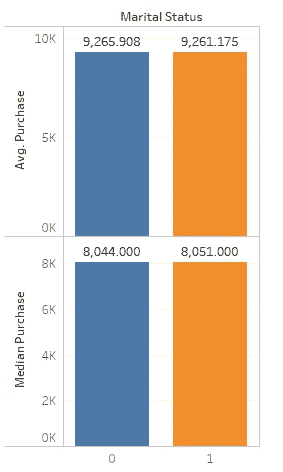

图 3.3.2

尽管未婚者购物更多，但未婚者和已婚者的平均花费几乎相同。

> 看起来这个特性并不会对目标产生太大的影响，但是我们将进行更详细的双变量分析，并确定是否要使用这个特性。

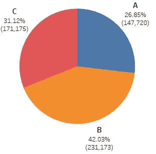

图 3.4.1

**3.4 城市类别** *图 3.4.1* 显示了我们的客户在各个城市的分布情况。大多数购物者来自 B 城市(43%)，最少来自 A 城市(27%)。现在我们还不确定这些类别是什么意思，这些类别是在什么基础上制定的。不过，我们可以得到一些想法后，更详细的分析。例如，如果我们假设城市是根据人们的收入范围划分的，那么高收入的人可能对销售不太感兴趣，因此属于城市 A，同样，低收入的人会感兴趣，但由于他们的报酬低，他们的手被束缚，因此可以被归类为城市 c。工资不太高也不太低的人可以自由地参与这次销售，主要购物者也是如此，因此属于城市 b 类。

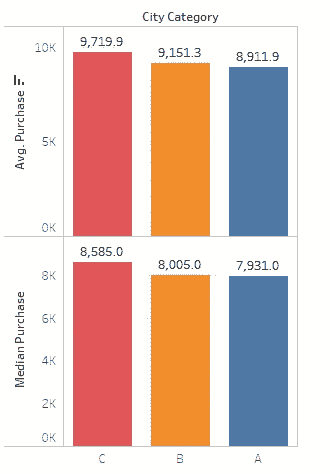

图 3.4.2

从*图 3.4.2* 中可以明显看出，C 城市的人均消费金额最多，A 城市的人均消费金额最少。此外，C 城市的购买中值(平均每人花费的金额)最多，A 城市最少。现在，这不符合我们的假设，即 A 类城市的人收入最高，因为我们可以预计他们将花费最多，但实际上，他们花费最少。因此，这不是划分这些类别的标准。

**3.5 职业**

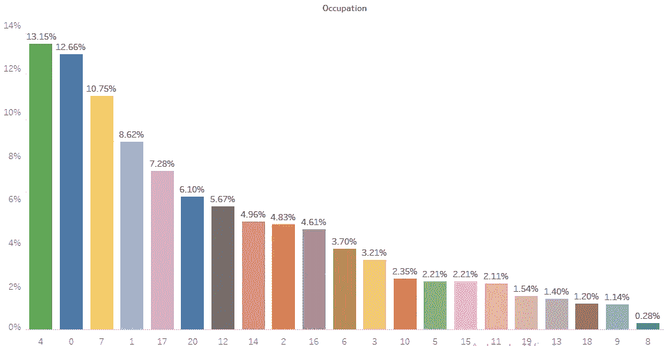

图 3.5.1

有 21 种不同的职业，这些价值观已经被掩盖了。从*图 3.5.1* 我们可以看到，大部分购物者都涉及职业代码 4，占 13.15%，其次是职业代码 0，占 12.66%。
从事职业 8 的人占购物者的比例最低。也许公司应该关注这一职业的购物者。

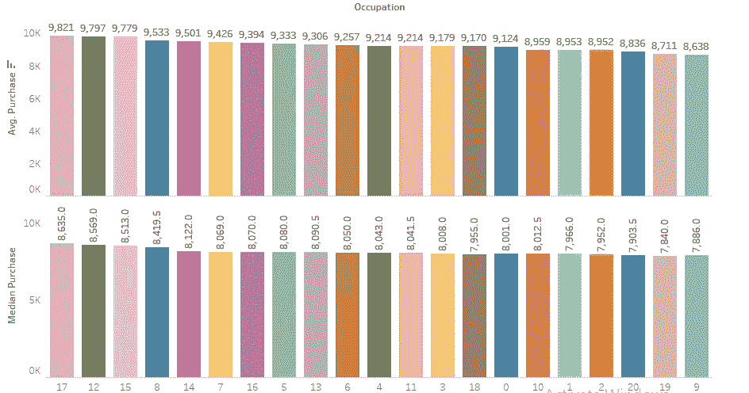

图 3.5.2

从*图 3.5.2，*很明显，在占用-购买图中有一些趋势。职业 17 的顾客花费最多，职业 9 的顾客花费最少。

> 尽管 occupation 字段中的值是数字，但是最好将该列作为分类变量处理，并使用一个热编码进行编码。

**3.6 在当前城市停留年数**

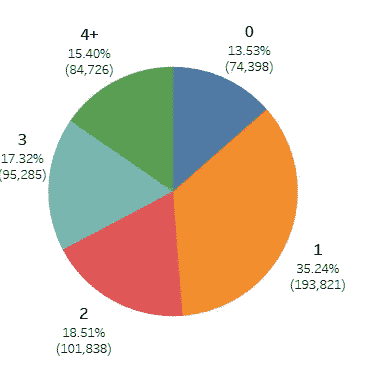

图 3.6.1

从*图 3.6.1* 我们可以看到，我们的大部分客户是那些在过去 1 年内一直住在同一城市的人(35.24%)。而最少的是刚搬进来的(13.53 %)。这种现象可能有一些显而易见的原因。已经在一个城市呆了一年的人现在可能会呆得更久，所以他们会自由地参加黑色星期五的销售活动，可能会为房子买些东西，而那些刚刚搬进来的人需要更多的时间来适应。此外，有可能那些已经在这个城市呆了 4 年以上的人要么计划搬出去，要么厌倦了这个城市的销售，所以选择不去购物。

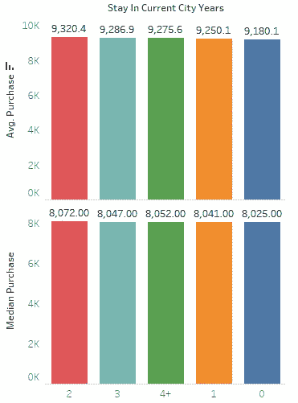

图 3.6.2

停留时间不同的人平均花费的金额非常相似。然而，相比之下，逗留不到一年的人花费最低。因此，我们可以肯定地说，如果一个人还没有完成在一个城市的第一年，他会花更少的钱。

> 这个特性在购买量的预测中起着至关重要的作用。我们将把它视为一个分类变量。

**3.7 产品类别** 产品类别有三列，其中两列为空值。我们将不得不处理空值。但在此之前，让我们了解这些类别告诉我们什么。
一个产品可以属于一个类别(主要类别)，也可以有两个类别(主要+次要类别)或最多三个类别(主要+次要+第三类别)。**属于多个品类会影响产品的购买金额吗？**让我们来了解一下。

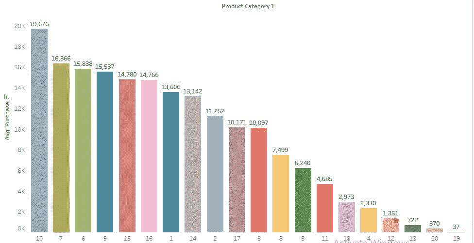

图 3.7.1

在*图 3.7.1 中，*我们可以看到，主要类别为 10 的产品平均购买量高达 19，676，其次是类别为 7 的产品，平均购买量为 16，366，以此类推。属于类别 19 的产品的平均购买金额为 37。

现在让我们假设有一个产品，它有一个主要类别 10，还有一个次要类别。

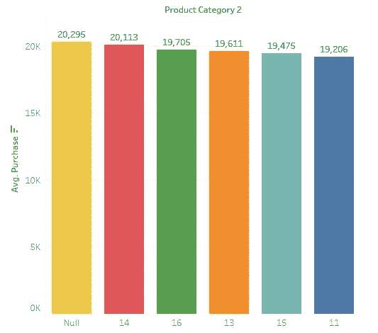

图 3.7.2

图 *3.7.2* 显示了当主要类别为 10 时，不同的次要产品类别和平均采购金额。因此，如果一个产品有一个类别 10，这意味着它可能不属于任何其他类别(空)，或者它可以属于以下任何类别:14，16，13，15 或 11。我们可以看到，如果该产品不属于任何其他类别，它具有最大的平均购买价值:20，295。如果该产品属于类别 10 和类别 11，其平均购买量显著下降至 19，206，这是不可忽略的。因此，我们可以说，产品类别 2 与产品类别 1 相结合，肯定会影响购买价值。
现在让我们假设我们有一个类别为 10 和 13 的产品。**拥有第三个类别会影响产品的购买量吗？**

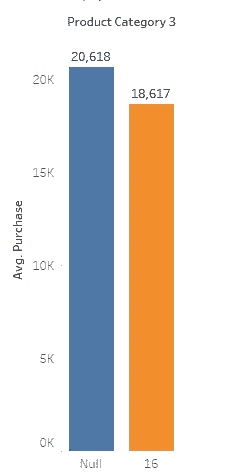

图 3.7.3

*图 3.7.3* 描述了在我们给定的数据中，如果产品有类别 10 和 13，它可能没有第三个类别(空)或者可能属于类别 16。我们可以看到平均成绩的巨大差异。没有第三类的产品和有第三类的产品的购买量(16)。

> 因此，删除空值或不考虑三个产品类别列中的任何一个都是不明智的。无论如何，我们将在稍后创建模型时处理这些列。

我们已经完成了数据的单变量分析。但是有一个可变的“婚姻状况”,我们不知道它如何影响我们的目标。因此，我们将进行双变量分析，并获得更深入的见解。

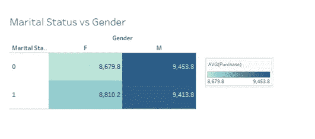

图 3.8.1

在*图* *3.8.1* 中我们看到婚姻状况和性别 w.r.t 平均购买量的对比。我们看到，对于一个未婚的人来说，如果他们是女性，他们比男性花费少得多。已婚人士也有同样的趋势，只是略有不同。

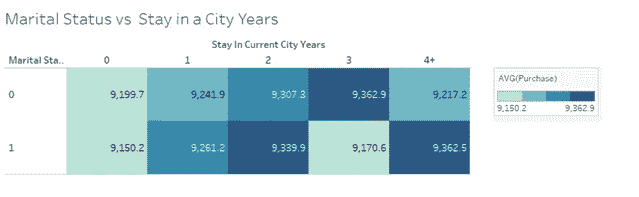

图 3.8.2

在*图*图 *3.8.2* 中我们看到了婚姻状况和停留在当前城市年(SCCY) w.r.t 平均购房的对比。对于 SCCY 0，平均值。购买也差不多。对于 SCCY 1，平均值。已婚和未婚之间只有细微的差别。对于 SCCY 2 号来说，已婚和未婚之间也只有细微的差别。然而，对于 SCCY 3，已婚(9 170.6 英镑)和未婚(9 362.9 英镑)之间的差距稍大一些。对于 SCCY 4+来说，已婚和未婚之间只有微小的区别。

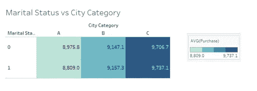

图 3.8.3

在*图* *3.8.2* 中我们看到婚姻状况和城市类别 w.r.t 平均购买量的对比。生活在城市不同类别的已婚和未婚人群之间没有显著差异。

> 根据上述双变量分析和图 3.8.1、3.8.2 和 3.8.3，我们可以得出结论，婚姻状况对目标影响不大，可以不再使用。

现在我们已经完成了数据分析，我们将开始构建预测模型。

## 步骤 4:数据预处理

1.  我们要做的第一件事是删除婚姻状况列。

```
df = train.copy() #Create a copy of Train Data to work on.
df = df.drop(columns = ['Marital_Status'])
```

2.现在我们将对性别列进行编码。因为它是一个二进制变量，我们将使用一个 *replace( )* 函数来实现这个目的*。*

```
df = df.replace({'Gender': {'M': 1, 'F':0}})
```

3.现在我们需要对 *Product_Category_2* 和 *Product_Category_3* 中缺失的值进行处理，同时不丢弃缺失的值。因此，我们首先将这两列中的 NaN 值替换为 0，然后对 *Product_Category_1 进行一次热编码。*接下来，如果我们在数据*、*的任何一行中的 *Product_Category_2* 和 *Product_Category_3* 列中遇到任何非零值，我们将用 1 *替换一个热编码 *Product_Category_1* 的相应列中的值。*这将把三个产品类别列的所有信息聚合到一个用于 *Product_Category_1 的热编码中。*为了有更清楚的了解，让我们举一个例子。

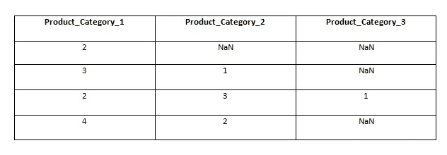

图:4.1

**图 4.1** :考虑总共只有 4 个类别 1、2、3、4 的虚拟数据。

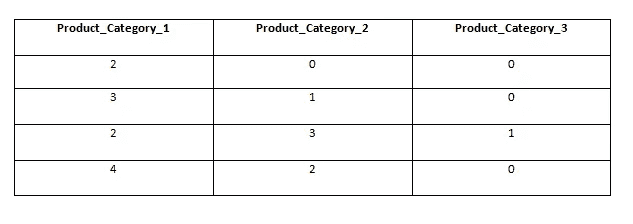

图 4.2

**图 4.2** :将所有 NaN 值替换为 0。

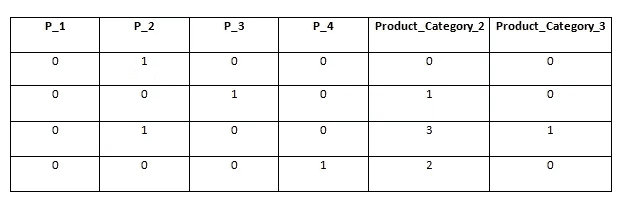

图 4.3

**图 4.3:** 使用一键编码和前缀= 'P '对产品类别 1 进行编码

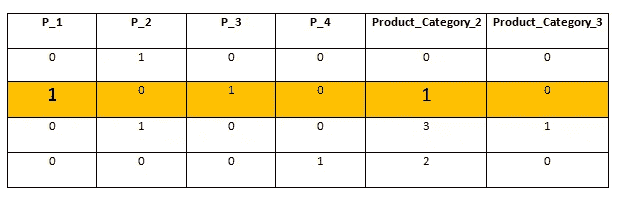

图 4.4

**图 4.4:** 对于在产品类别 2 或产品类别 3 中有非零单元格的每一行(假设第 2 行突出显示)，我们取非零值**‘I’**，并用 1 替换该行中的**‘ith’**列。我们对所有数据都这样做。

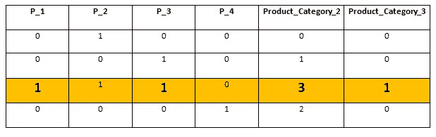

图 4.5

**图 4.5:** 我们对第 3 行(突出显示)执行上述步骤，这是我们的数据看起来的样子。

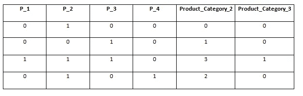

图 4.6

**图 4.6:** 这是我们完成所有数据点后的最终数据。
**现在我们将为实际数据集编写上述步骤的代码。**

```
**# First do One Hot encoding for Product Category 1**
df_oneHot = pd.get_dummies(df, columns = ['Product_Category_1'], prefix = ['P'])**#Fill NaN values with Zeros** df_oneHot = df_oneHot.fillna(0)for i in range(1, 15):
    df_oneHot.loc[df_oneHot.Product_Category_2 == i,'P_'+ str(i)]= 1
    df_oneHot.loc[df_oneHot.Product_Category_3 == i,'P_'+ str(i)]= 1
```

现在让我们看看数据中的列。

```
df_oneHot.columns
--------------------------------------------------------------------**OUTPUT** Index(['User_ID', 'Product_ID', 'Gender', 'Age', 'Occupation', 'City_Category', 'Stay_In_Current_City_Years', 'Product_Category_2','Product_Category_3', 'Purchase', 'P_1', 'P_2', 'P_3', 'P_4',  'P_5', 'P_6', 'P_7', 'P_8', 'P_9', 'P_10', 'P_11', 'P_12', 'P_13', 'P_14','P_15', 'P_16', 'P_17', 'P_18', 'P_19', 'P_20'],
dtype='object')
```

我们现在删除*‘产品 _ 类别 _ 2’*和*‘产品 _ 类别 _ 3’*列。

```
df_oneHot = df_oneHot.drop(columns = ['Product_Category_2', 'Product_Category_3'])
```

现在我们对其余的分类变量进行一次热编码。

```
data_df_onehot = pd.get_dummies(df_oneHot, columns=['Age',"Occupation", 'City_Category', 'Stay_In_Current_City_Years'], prefix = ['Age',"Occupation", 'City','Stay'])
```

我们还想使用产品 ID 列，但由于它属于“P00…”类型，因此无法按原样使用。因此，我们将首先从列中删除“P00 ”,然后使用它。

```
data_df_onehot['Product_ID'] = data_df_onehot['Product_ID'].str.replace('P00', '')
```

为了有效地建立模型，我们可以使用**特征缩放**来标准化数据集。这可以用 sklearn 预处理库中的 *StandardScaler()* 来完成。

```
scaler = StandardScaler()
data_df_onehot['Product_ID'] = scaler.fit_transform(data_df_onehot['Product_ID'].values.reshape(-1, 1))
data_df_onehot['User_ID'] = scaler.transform(data_df_onehot['User_ID'].values.reshape(-1, 1))
```

现在，我们将目标变量从数据集中分离出来，然后使用 *train_test_split()* 命令将数据集分成比例为 80:20 的训练数据和测试数据。

```
target = data_df_onehot.Purchase
data_df_onehot = data_df_onehot.drop(columns = ['Purchase'])train_data, test_data, train_labels, test_labels = train_test_split(data_df_onehot, target, test_size=0.2, random_state=42)
```

## 步骤 5:数据建模

> 在这个故事中，我不会深入解释极端梯度推进(XGBoost)算法。为了更好地解释超参数调整[请点击此链接](https://blog.cambridgespark.com/hyperparameter-tuning-in-xgboost-4ff9100a3b2f)，为了理解算法如何工作，[请点击此链接](https://www.youtube.com/watch?v=OtD8wVaFm6E)。

首先，我们导入 xgboost，然后将数据转换成 XGBoost 使用的 DMatrix 格式。然而，该算法也可以在不转换成数据矩阵的情况下使用。无论如何我都会做的。

```
import xgboost as xgbdtrain = xgb.DMatrix(train_data, label=train_labels)
dtest = xgb.DMatrix(test_data, label=test_labels)
```

现在我们将考虑我们将要调优的 XGBoost 的一些参数。这些参数是 ***最大深度、最小子权重、学习率、子样本、*** 和 ***列采样*** 。我们还采用了评估指标。我们将使用 ***均方根误差(RMSE)*** ，因为这是竞赛中使用的。此外，我们将把 **N *助推轮数*** 设置为 999(这显然是允许的最大值)。 **N *助推轮数*** 是模型遍历完整数据的次数。为了避免花费大量时间进行 999 轮，我们可以设置一个早期停止变量，一旦模型在一定数量的轮次后没有改善，该变量将停止训练。我们做所有这些，然后开始训练我们的模型。

```
params = {
    # Parameters that we are going to tune.
    'max_depth':6,
    'min_child_weight': 1,
    'eta':.3,
    'subsample': 1,
    'colsample_bytree': 1,
    # Other parameters
    'objective':'reg:squarederror',
}params['eval_metric'] = "rmse"
num_boost_round = 999model = xgb.train(
    params,
    dtrain,
    num_boost_round=num_boost_round,
    evals=[(dtest, "Test")],
    early_stopping_rounds=10

)**--------------------------------------------------------------****OUTPUT** [0]	Test-rmse:7753.65625
Will train until Test-rmse hasn't improved in 10 rounds.
[1]	Test-rmse:5930.35205
[2]	Test-rmse:4769.00244
[3]	Test-rmse:4027.15063
[4]	Test-rmse:3586.85400
[5]	Test-rmse:3348.09839
...
[814]	Test-rmse:2511.04102
[815]	Test-rmse:2511.13452
[816]	Test-rmse:2511.16455
[817]	Test-rmse:2511.13867
[818]	Test-rmse:2511.05640
[819]	Test-rmse:2511.06519
Stopping. Best iteration:
[809]	Test-rmse:2510.89258
```

由于数据点很多，训练模型需要一些时间。我们的模型遍历了 819 次完整数据，并在第 809 轮找到了最好的分数。Test-rmse 是 2510，没有超参数调优，相当不错。

## 步骤 6:超参数调整

现在我们将调整我们的模型。为此，我们将使用交叉验证。XGBoost 自带了一个内置的交叉验证特性，我们将会用到它。

> 我只做了一个粗略的参数调整，因为使用交叉验证调整模型花费了很多时间。与下面的调整相比，我觉得可以对模型进行更好的调整，但目的是展示我是如何进行调整的。

**6.1 最大深度和最小儿童体重。** `max_depth`是一棵树从根到最远的叶子所允许的最大节点数。更深的树可以通过添加更多的节点来模拟更复杂的关系，但随着我们深入，分裂变得不那么相关，有时只是因为噪音，导致模型过度拟合。
`min_child_weight`是在树中创建新节点所需的最小权重(或样本数，如果所有样本的权重都为 1)。更小的`min_child_weight`允许算法创建对应于更少样本的子代，从而允许更复杂的树，但同样，更有可能过度拟合。

我们一起调整这些参数，以确保模型偏差和方差之间的良好平衡。

```
**#Select a range of values for different parameters**
gridsearch_params = [
    (max_depth, min_child_weight)
    for max_depth in range(9,12)
    for min_child_weight in range(5,8) **#TRY GREATER VALUES > 60**
]**#Initialize minimum rmse and the best parameters**min_rmse  = float("Inf")
best_params = Nonefor max_depth, min_child_weight in gridsearch_params:
    print("CV with max_depth={}, min_child_weight={}".format(
                             max_depth,
                             min_child_weight))
    **# Update our parameters**
    params['max_depth'] = max_depth
    params['min_child_weight'] = min_child_weight
   ** # Run CV**
    cv_results = xgb.cv(
        params,
        dtrain,
        num_boost_round=num_boost_round,
        seed=42,
        nfold=5,
        metrics={'rmse'},
        early_stopping_rounds=5,
        verbose_eval = True
    )
   ** # Update best RMSE**
    mean_rmse = cv_results['test-rmse-mean'].min()
    boost_rounds = cv_results['test-rmse-mean'].argmin()
    print("\tRMSE {} for {} rounds".format(mean_rmse, boost_rounds))
    if mean_rmse < min_rmse:
        min_rmse = mean_rmse
        best_params = (max_depth,min_child_weight)
print("Best params: {}, {}".format(best_params[0], best_params[1])----------------------------------------------------------------- **OUTPUT** Best params: 9, 7
```

我们用 9 的`max_depth`和 7 的`min_child_weight`得到最好的分数，所以让我们更新我们的参数

```
params['max_depth'] = 9
params['min_child_weight'] = 7
```

**6.2 子采样和逐树列采样** 这些参数控制在每个增强回合中进行的数据集采样。
我们不需要每次都使用整个训练集，而是可以在每个步骤中基于稍微不同的数据构建一个树，这样就不太可能过度适应单个样本或特征。

*   `subsample`对应于每一步要进行二次抽样的观察值(行)的分数。默认情况下，它被设置为 1，意味着我们使用所有行。
*   `colsample_bytree`对应于要使用的特征(列)的分数。默认情况下，它被设置为 1，意味着我们将使用所有功能。

让我们看看是否可以通过一起调整这些参数来获得更好的结果。

```
**#Select a range of values for different parameters** gridsearch_params = [(subsample, colsample)
    for subsample in [i/10\. for i in range(7,11)]
    for colsample in [i/10\. for i in range(7,11)]
]
**#Initialize minimum rmse and the best parameters**min_rmse = float("Inf")
best_params = None
**# We start by the largest values and go down to the smallest**
for subsample, colsample in reversed(gridsearch_params):
    print("CV with subsample={}, colsample={}".format(
                             subsample,
                             colsample))
    **# We update our parameters**
    params['subsample'] = subsample
    params['colsample_bytree'] = colsample
    # Run CV
    cv_results = xgb.cv(
        params,
        dtrain,
        num_boost_round=num_boost_round,
        seed=42,
        nfold=5,
        metrics={'rmse'},
        early_stopping_rounds=10
    )
    **# Update best score**
    mean_rmse = cv_results['test-rmse-mean'].min()
    boost_rounds = cv_results['test-rmse-mean'].argmin()
    print("\tRMSE {} for {} rounds".format(mean_rmse, boost_rounds))
    if mean_rmse < min_rmse:
        min_rmse = mean_rmse
        best_params = (subsample,colsample)
print("Best params: {}, {}".format(best_params[0], best_params[1)
--------------------------------------------------------------------
**OUTPUT**Best params: 1, 0.7
```

再次，我们更新我们的`params`字典。

```
params['subsample'] = 1
params['colsample_bytree'] = 0.7
```

**6.3 ETA(学习率)** `ETA`参数控制学习率。它对应于每一轮后与特征相关联的权重的收缩，换句话说，它定义了我们在每一步进行的“校正”的量。

在实践中，较低的`eta`使我们的模型对过拟合更加鲁棒，因此，通常学习率越低越好。但是随着更低的`eta`，我们需要更多的助推轮，这需要更多的时间来训练，有时只是边际改善。

```
min_rmse = float("Inf")
best_params = None
for eta in [.3, .2, .1, .05, .01, .005]:
    print("CV with eta={}".format(eta))
    **# We update our parameters**
    params['eta'] = eta
    **# Run and time CV**
    cv_results = xgb.cv(
            params,
            dtrain,
            num_boost_round=num_boost_round,
            seed=42,
            nfold=5,
            metrics=['rmse'],
            early_stopping_rounds=10
          )
    **# Update best score**
    mean_rmse = cv_results['test-rmse-mean'].min()
    boost_rounds = cv_results['test-rmse-mean'].argmin()
    print("\tRMSE {} for {} rounds\n".format(mean_rmse, boost_rounds))
    if mean_rmse < min_rmse:
        min_rmse = mean_rmse
        best_params = eta
print("Best params: {}".format(best_params))
--------------------------------------------------------------------
**OUTPUT**Best Params: 0.2
```

## 步骤 7:模型的评估

下面是我们最终的参数字典的样子:

```
params = {'colsample_bytree': 0.7,
 'eta': 0.2,
 'eval_metric': 'rmse',
 'max_depth': 9,
 'min_child_weight': 7,
 'objective': 'reg:squarederror',
 'subsample': 1}
```

让我们用它来训练一个模型，看看它在我们的测试集上表现如何！

```
model = xgb.train(
    params,
    dtrain,
    num_boost_round=num_boost_round,
    evals=[(dtest, "Test")],
    early_stopping_rounds=10
)-------------------------------------------------------------------**OUTPUT**
[0]	Test-rmse:7753.65625
Will train until Test-rmse hasn't improved in 10 rounds.
[1]	Test-rmse:8655.89258
[2]	Test-rmse:7285.25684
[3]	Test-rmse:5282.01660
[4]	Test-rmse:4646.53125
[5]	Test-rmse:3779.51074
...
[604]   Test-rmse:2497.35059
[605]   Test-rmse:2497.48877
[606]   Test-rmse:2497.36914
[607]   Test-rmse:2497.48291
Stopping. Best iteration:
[597]   Test-rmse:2497.25513
```

好吧，好吧，这难道不是一个进步。不仅迭代次数从 819 减少到 607，而且测试 RMSE 也从 2510.89 减少到 2497.255。现在，我们可以使用这个模型来拟合测试数据，然后提交它进行检查。
**这使我们处于第 355 位，是所有参与者中排名前 14%的人。**

# 结论

即使我们用上面的模型得到了一个不错的结果，还是有 354 名参与者比我们做得更好。也许，我们可以更专注于提取有趣的特征或使用不同的集成模型。还可以使用深度神经网络进行回归，这可能产生比集合模型更好的结果。
完整的 Python 代码可以在这里[访问。如果你对这篇文章或使用 Tableau 的可视化有任何疑问，请在评论中提出来，如果你喜欢我的作品，请为它鼓掌！](https://github.com/starnlm/Black-Friday-Hackathon)