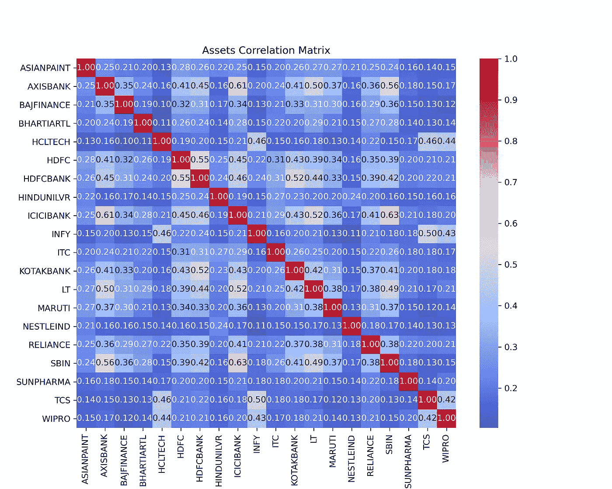
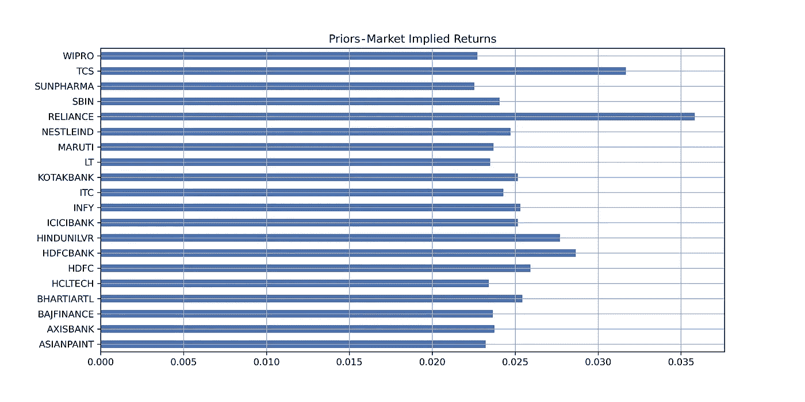
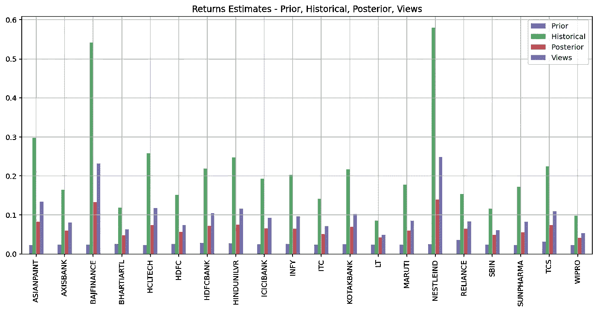
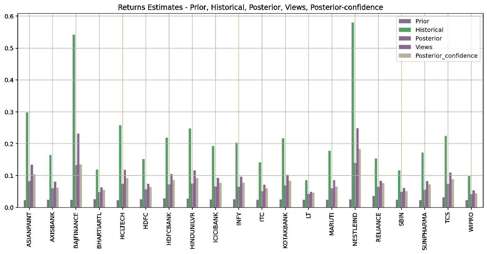
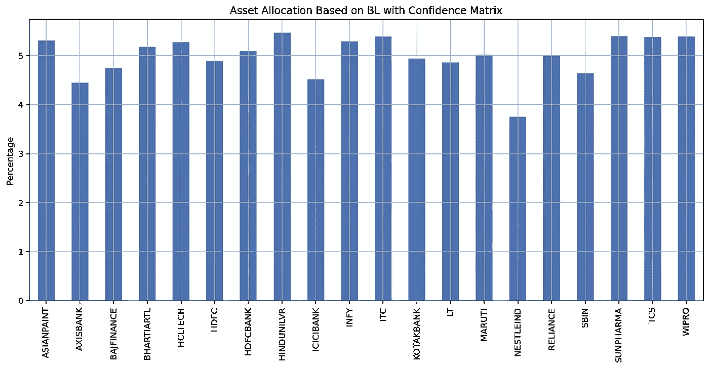

# black–little man 按市值和回溯测试对前 20 名印度公司进行资产配置的模型—第 1 部分

> 原文：<https://medium.com/analytics-vidhya/black-litterman-model-for-asset-allocation-for-top-20-indian-companies-by-market-capitalization-c9fcbd362d72?source=collection_archive---------3----------------------->

资产配置是投资管理过程中最重要的一步。承担风险的能力和意愿、回报目标、投资者的约束以及资本市场预期是资产配置的关键输入。Harry Markowitz 首先介绍了[均值-方差优化(MVO)](https://en.wikipedia.org/wiki/Modern_portfolio_theory) ，这可能是实践中开发和设定资产分配政策最常用的方法。然而，对 MVO 也有一些批评，特别是不稳定、集中和投资组合表现不佳。

解决这些问题的方法之一是由费希尔·布莱克和罗伯特·里特曼创建的[黑人-里特曼模型](https://en.wikipedia.org/wiki/Black%E2%80%93Litterman_model) (BL)。Black-little man 模型从反向优化开始，根据资产的市值计算起始权重和隐含回报，随后允许容纳分析师的替代预测。Black-little man 模型的数学细节对于非数学界人士来说可能很无聊，超出了本文的范围。BL 模型与均值-方差优化一起，通过提高每个资产类别的预期回报与其对系统风险的贡献之间的一致性，通常会导致非常多样化的资产配置。

在这里，我们将研究这个模型的应用，以得出按市值排名的前 20 家印度公司的可选权重。我举了一个股票的例子，但是，它可以是任何资产类别。在本文第二部分的[中，我们将使用 Quantopian zipline 或 Backtrader 对模型得出的权重进行回溯测试。这不是一个神奇的公式，因此不要认为在这篇文章结束时，你会对这 20 只股票拥有神奇的权重，让你立刻成为超级富豪。目标是帮助你理解和学习过程和代码。我已经使用了 python](/@sabirh.jana/black-litterman-model-for-asset-allocation-for-top-20-indian-companies-by-market-capitalization-e22e1450dc39?sk=4aa40d8d84979bd22928c9de4ec34b96) [PyPortfolioOpt](https://github.com/robertmartin8/PyPortfolioOpt) 开源库，它提供了这个模型的 python 实现，因此我强烈推荐你去探索它。我必须感谢 [Robert Martin](https://reasonabledeviations.com/about/) 在开发 PyPortfolioOpt 方面的出色工作。本文的代码和数据可以在我的 [**Github**](https://github.com/sabirjana/blog/tree/master/Black%E2%80%93Litterman) 资源库中找到。

总体方法如下:

1.  印度前 20 大公司的数据收集。
2.  之前的计算和分析师对回报的看法。
3.  收益和协方差矩阵的 BL 后验估计。
4.  分析师观点的置信矩阵和有效前沿。

## 20 家印度公司的数据收集

首先，我们需要按市值排列的前 20 家印度公司的名单。这些信息是公开的，应该不难获得。我从[https://www . money works 4 me . com/best-index/NSE-stocks/top-nifty 50-companies-list/](https://www.moneyworks4me.com/best-index/nse-stocks/top-nifty50-companies-list/)中提取了这些详细信息，并将其保存在 *mcap.csv* 文件中。

接下来，我们需要这些公司的每日历史收盘价细节。我已经从我在本地机器上维护的数据库中获取了这些细节。但是，为了便于您快速参考，在 *prices.csv.* 中提供了一份定价数据集

## 先前的计算和分析师对退货的看法

为了构建隐含在资产市值中的市场隐含回报先验，我们需要一个市场隐含风险溢价。这被称为 delta，可以通过将市场的超额收益除以其方差来计算。一旦我们有了 delta，就可以通过将 delta 乘以市值权重来计算先验。PyPortfolioOpt 使所有这些计算变得非常容易。

让我们看看执行以下任务的代码:

1.  阅读 *mcap.csv* 为熊猫数据帧。
2.  根据步骤 1 中创建的数据帧创建报价机列表。
3.  从 *prices.csv.* 中读取每日收盘价
4.  从步骤 1 中创建的数据框架创建 ticker 的市值字典。
5.  下载 BSE-500 收盘价代表市场价格。我们需要这个来计算市场超额收益。我已经使用 [yfinance](https://github.com/ranaroussi/yfinance) python 库从雅虎财经下载了每日价格数据。
6.  计算资产协方差和 delta。为了计算资产协方差，我使用了 PyPortfolioOpt 中提供的收缩估计器实现。如果你有兴趣了解更多，你可以查看 PyPortfolioOpt 文档。我用 10 年期印度债券收益率 5.796%作为无风险利率。
7.  Plot [Spearman 相关性](https://en.wikipedia.org/wiki/Spearman%27s_rank_correlation_coefficient)日收益矩阵。
8.  使用市值字典、delta 和资产协方差矩阵计算市场隐含回报。
9.  纳入分析师对回报的看法。我们为此创建了 *views.csv* 文件。读取文件并为视图创建一个字典。

```
# necessary imports
import pandas as pd
import numpy as np
import matplotlib.pyplot as plt
import pypfopt as pyp
import seaborn as sns
import datetime
import yfinance as yf
idx = pd.IndexSlice

%matplotlib inline
%config InlineBackend.figure_format = 'retina'

# read market capitalization and ticker details
mcap = pd.read_csv('data/mcap.csv')
mcap.head(2)

# create the tickers list
tickers = [ticker[:-3] for ticker in mcap.Tickers]
print(tickers)

# Read daily prices from csv
prices = pd.read_csv('data/prices.csv', index_col=[0], parse_dates=[0])
prices.head(2)

# create market cap dict
mcap_dict = {ticker[:-3] : cap for ticker, cap in zip(mcap['Tickers'].values, mcap['Market Cap'].values)}
print(mcap_dict)

# get market daily prices - BSE-500
market_prices = yf.download("BSE-500.BO", period="max")["Adj Close"]
market_prices.head(2)

# calculate asset covariance and delta
# market-implied risk premium, which is the market’s excess return divided by its variance
S = pyp.risk_models.CovarianceShrinkage(prices).ledoit_wolf()
delta = pyp.black_litterman.market_implied_risk_aversion(market_prices, risk_free_rate=0.05796)
print(delta)

fig, ax = plt.subplots(figsize=(10,8))
sns.heatmap(prices.pct_change().corr(method ='spearman'), ax=ax, cmap='coolwarm', annot=True, fmt=".2f")
ax.set_title('Assets Correlation Matrix')
plt.savefig('images/chart1', dpi=300) 

# calculate prior - market implied retunrs
market_prior = pyp.black_litterman.market_implied_prior_returns(mcap_dict, delta, S)
market_prior.name = 'Prior'
print(market_prior)

# plot prior
market_prior.plot.barh(figsize=(12,6), title = 'Market Iimplied Retunrs',grid=True);
plt.savefig('images/chart2', dpi=300)

# provide absolute views - read csv
view_confidence = pd.read_csv('data/views.csv', index_col=[0])
view_confidence.head(20)

# create view dict
views_dict = {ind : view_confidence['View'][ind] for ind in view_confidence.index}
print(views_dict)
```



资产关联矩阵



先验——市场隐含回报

资产相关性矩阵显示了这 20 只股票之间的相关性，在第二张图中，您可以看到市场隐含回报率的条形图。相关系数的范围从+1 到-1，其中+1 表示强正相关，而-1 表示强负相关。类似业务的公司之间的相关性更高，这并不奇怪，例如 ICICI 银行和 Axis 银行的相关性为 0.61。资产类别之间的回报、风险和相关性是投资组合构建的关键。相关性越低，多元化收益越高。

## 收益和协方差矩阵的 BL 后验估计

在本节中，我们将运行 Black-litter man 模型，将历史协方差、市场先验和分析师观点作为输入。我们还可以选择在视图上指定置信度矩阵，这将在下一节中介绍。在缺乏信心矩阵的情况下，PyPortfolioOpt 考虑与市场先验方差成比例的观点的不确定性。BL 模型输出后验估计收益和协方差矩阵。

让我们动手执行以下任务:

1.  运行 BL 模型，将历史协方差、市场先验和分析师观点作为输入。
2.  提取后验收益并创建一个由*、【先前】、【历史】、【后验】、【视图】*收益组成的数据框架，并绘制成图，以便快速比较。
3.  将退货数据帧保存为 csv 文件，以备将来参考。
4.  提取协方差矩阵，保存为 csv 文件，以备将来参考。

```
# run the Bl model
bl = pyp.BlackLittermanModel(S, pi=market_prior, absolute_views=views_dict)

# Posterior estimate of returns
bl_return = bl.bl_returns()
bl_return.name = 'Posterior'

# get historical returns
mu = pyp.expected_returns.mean_historical_return(prices)
mu.name = 'Historical'
# print(mu)

# create returns dataframe
returns_df = pd.DataFrame([market_prior, mu, bl_return, pd.Series(views_dict)], 
             index=['Prior', 'Historical','Posterior', 'Views']).T
print(returns_df)

# write it for future reference
returns_df.to_csv('data/returns.csv', header=True, )
returns_df = pd.read_csv('data/returns.csv', index_col=[0], )

# plot the returns
returns_df.plot.bar(figsize=(14,6), title = 'Returns Estimates - Prior, Historical, Posterior, Views', grid=True);
plt.savefig('images/chart3', dpi=300)

# get the covariance matrix
S_bl = bl.bl_cov()
S_bl.to_csv('data/S_bl.csv')
S_bl = pd.read_csv('data/S_bl.csv',  index_col=[0])
```



返回估计值—先验、历史、后验、视图

各种回报的图示看起来非常有趣，因为各种估计之间有很大的差异。历史回报率相当高，我们认为在预测期内实现类似的表现是不可行的。我们的估计反映在“视图”中。

## 分析师观点和有效前沿的置信矩阵

现在，让我们在模型中添加一个我们想要指定的扭曲——我们对自己的回报观点有多有信心？Idzorek 的方法在 PyPortfolioOpt 中的实现允许我们将有关分析师观点的不确定性指定为百分比。这意味着 1 表示 100%有信心，0 表示完全没有信心。我们将选择输入参数 omega="idzorek "来使用这个特性，并将一个置信度列表(在 0 到 1 之间)传递给 BlackLittermanModel 类初始化的 view_confidences 参数。要了解 Idzorek 方法的更多信息，请参考 [PyPortfolioOpt 文档。](https://pyportfolioopt.readthedocs.io/en/latest/BlackLitterman.html#id8)

让我们对以下内容进行编码:

1.  为所有 20 只股票创建一个信心输入列表。
2.  初始化 BlackLittermanModel 类，输入为协方差矩阵、市场先验、视图字典和置信度列表，其中 omega 等于“idzorek”。
3.  提取收益并创建 pandas 数据框架，其中包含到目前为止的所有估计收益。这包括*、【先验】、【历史】、【后验】、【观点】、【后验信心】、*，并把它们画出来以便快速比较。
4.  提取协方差矩阵，保存为 csv 文件，以备将来参考。
5.  以 BL 模型生成的后验收益和后验协方差矩阵作为输入，运行有效边界。我保留了一个约束，任何特定股票的最大权重不超过 10%，并选择了最小波动率优化。

```
# create confidences vector
confidences = list(view_confidence.Confidences)

print(confidences)

# use Idzorek's method and run the model
bl_confi = pyp.BlackLittermanModel(S, pi=market_prior, 
                                   absolute_views=views_dict, 
                                   omega="idzorek", view_confidences=confidences)

# Posterior estimate of returns
bl_return_confi = bl_confi.bl_returns()
bl_return_confi.name = 'Posterior_confidence'

returns_df = pd.DataFrame([market_prior, mu, bl_return, pd.Series(views_dict), bl_return_confi], 
             index=['Prior', 'Historical','Posterior', 'Views', 'Posterior_confidence']).T
print(returns_df)

# write it for future reference
returns_df.to_csv('data/returns.csv', header=True,)
returns_df = pd.read_csv('data/returns.csv', index_col=[0],)

returns_df.plot.bar(figsize=(14,6), 
                    title = 'Returns Estimates - Prior, Historical, Posterior, Views, Posterior-confidence', grid=True);
plt.savefig('images/chart4', dpi=300)

# get the covariance matrix
S_bl_confi = bl_confi.bl_cov()
S_bl_confi.to_csv('data/S_bl_confi.csv')
S_bl_confi = pd.read_csv('data/S_bl_confi.csv',  index_col=[0])
S_bl_confi

# Long-only minimum volatility portfolio, with a weight cap of 10% and regularisation
ef = pyp.EfficientFrontier(bl_return_confi, S_bl_confi, weight_bounds=(0, 0.1), gamma=0)
ef.add_objective(pyp.objective_functions.L2_reg, gamma=0.1)
weights = ef.min_volatility()
ef.portfolio_performance(verbose=True), print('\n')
wt_min_vola = pd.DataFrame([weights],columns=weights.keys()).T * 100

# write it to csv for part 2
wt_min_vola.to_csv('data/wt_min_vola_wts.csv')
wt_min_vola = pd.read_csv('data/wt_min_vola_wts.csv',  index_col=[0])

print ('Weights in Percentage ********************')
print(wt_min_vola.round(4))

# plot the weights
wt_min_vola.plot.bar(figsize=(14,6), 
                    title = 'Asset Allocation Based on BL with Confidence Matrix', grid=True,legend=False);
plt.ylabel('Percentage')
plt.savefig('images/chart5', dpi=300)
```



返回估计值—先验、历史、后验、视图、后验置信度



基于置信矩阵的商业智能资产配置

同样有趣的是，在作为输入的置信度列表之后，比较各种回报估计。我们可以看到，由于我们考虑的不确定性，“后验”和“有信心的后验”都小于“视图”。很明显，根据我们自己的预测,“浏览量”低于历史回报率。

当我们运行输入为后验回报、从 BL 模型生成的后验协方差矩阵、权重和最小波动率约束的有效前沿优化器时，我们得到了按市值排列的前 20 家印度公司的多元化投资组合。预期年回报率约为 8%，年波动率为 9.8%，夏普比率为 0.61。详情请参考 GitHub 上的 Jupyter 笔记本。

在这里，我想提醒你，我们已经选择了最小波动性，因此它将是一个关键参数，与我们选择的任何基准进行比较。在本文的第 2 部分，我们将采用这些权重，并对超过 10 年的历史数据进行定期再平衡，对投资组合进行回溯测试。

在此之前，享受投资，并为文章留下评论。

谢谢！

请注意:此分析仅用于教育目的，作者不对您的任何投资决策负责。