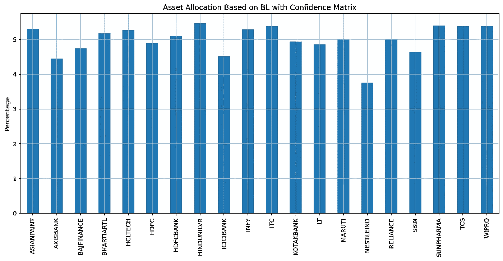
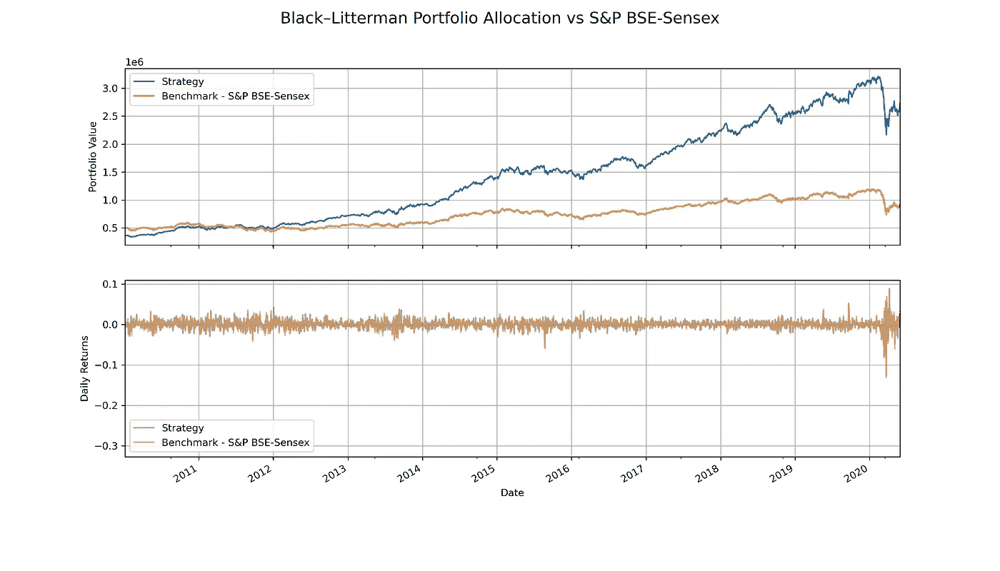
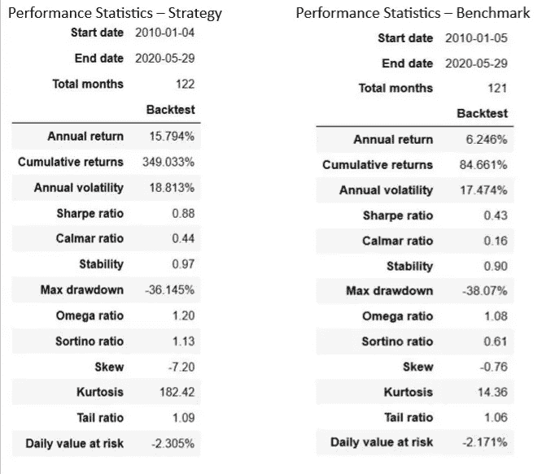
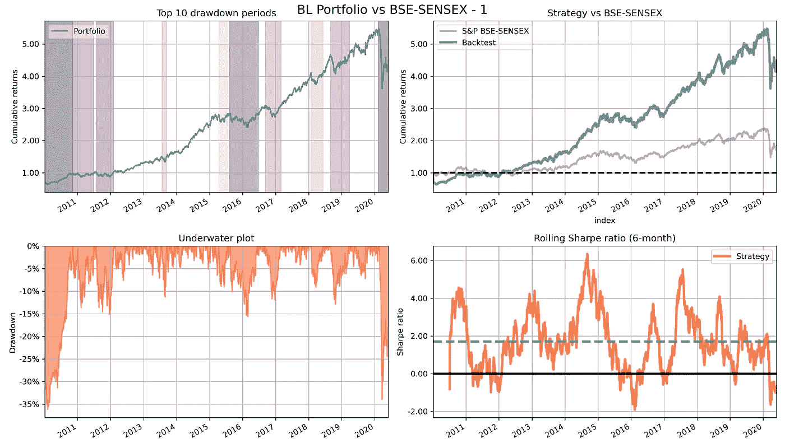
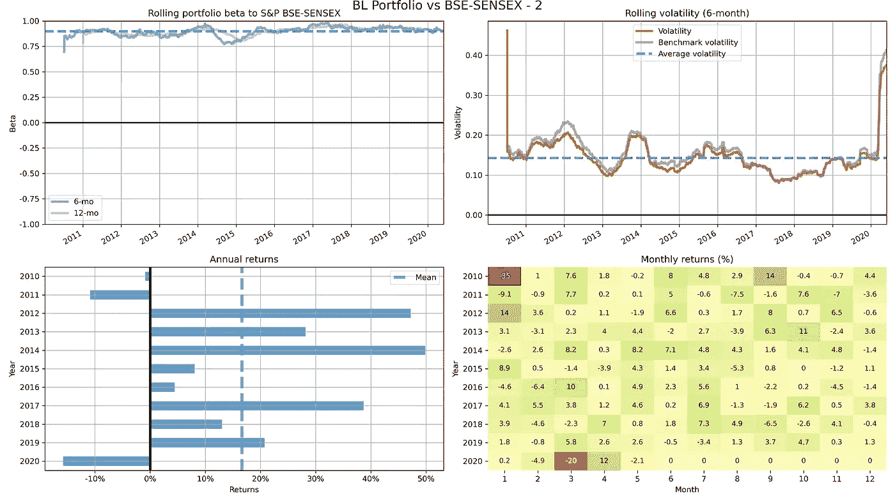

# black–little man 按市值和回溯测试对前 20 名印度公司进行资产配置的模型—第 2 部分

> 原文：<https://medium.com/analytics-vidhya/black-litterman-model-for-asset-allocation-for-top-20-indian-companies-by-market-capitalization-e22e1450dc39?source=collection_archive---------14----------------------->

作者:萨比尔·贾纳

在本文中，我们将通过一步一步的过程来回溯测试从[Black-litter man 资产配置模型中创建的投资组合，通过市值和回溯测试对前 20 名印度公司进行资产配置——第 1 部分](/@sabirh.jana/black-litterman-model-for-asset-allocation-for-top-20-indian-companies-by-market-capitalization-c9fcbd362d72)。在我们进入下一步之前，让我们快速回顾一下到目前为止的总结。作为第一步，我们收集了 20 家印度公司的市值和每日定价数据。接下来，在`[PyPortfolioOpt](https://pyportfolioopt.readthedocs.io/en/latest/)` (python 开源库)的帮助下，我们计算了市场隐含回报率。然后，我们计算了回报的后验估计和协方差矩阵，还考虑了分析师的观点和对这些观点的信心。使用收益的后验估计和协方差矩阵作为输入，我们运行了有效的前沿优化器，以获得最小波动性的最优权重和任何单只股票不超过 10%的权重约束。

为了回溯测试这个投资组合，我想到了使用两个强大的 python 库，`[zipline](https://www.zipline.io/)`和`[Backtrader](https://www.backtrader.com/)`。在我看来，两者各有利弊，但我决定支持反向交易。有了 Backtrader，您将更容易理解本文并在您的机器上运行代码，而不会沉迷于 zipline 的定制捆绑包复杂性。然而，如果你想使用 zipline，你可以参考我的文章[如何将印度股票数据导入你本地机器上的 zipline？因为 zipline 将要求您创建一个自定义包来对其进行回溯测试。您可以在我的](/@sabirh.jana/how-to-import-indian-equities-data-to-zipline-on-your-local-machine-3b8587aaf112)[**Github**](https://github.com/sabirjana/blog/tree/master/Black%E2%80%93Litterman)**资源库中找到本文的代码和数据。**

**我们的方法如下:**

1.  **收集数据。**
2.  **在 Backtrader 中定义我们的回溯测试策略。**
3.  **提取性能统计数据，与基准进行比较和对比。**

****收集数据****

**首先，我们需要我们的投资组合权重。在本文的第一部分，我们将这些信息保存为 csv 文件，因此我们将从 csv 文件中读取这些信息。除此之外，我们还需要 2010 年 1 月 1 日至 2020 年 5 月 29 日这 20 家券商的 OHLCV 数据集。您可以从您选择的数据源获取该数据集，但是作为一个开端，我为该数据集提供了一个 csv 文件。**

**让我们动手操作代码并执行以下任务:**

1.  **从`wt_min_vola_wts.csv` 中读取代码和相应的重量，并绘制出来以便快速验证。**
2.  **将回溯测试日期定义为 2010 年 1 月 1 日至 2020 年 5 月 29 日。**
3.  **读取`prices_all.csv`文件并创建一个带有 OHLCV 列的堆栈数据帧。**
4.  **创建一个列表的股票和相应的权重元组，我们将需要在稍后阶段。**

```
# necessary imports
import pandas as pd
import numpy as np
import matplotlib.pyplot as plt
import seaborn as sns
import datetime
import yfinance as yf
import pandas_datareader.data as web
import pyfolio as pf
import backtrader as bt
idx = pd.IndexSlice%matplotlib inline
%config InlineBackend.figure_format = ‘retina’# Read our 20 tickers weights
wt_min_vola = pd.read_csv('data/wt_min_vola_wts.csv',  index_col=[0])
print(wt_min_vola)# plot the weights
wt_min_vola.plot.bar(figsize=(14,6), 
                    title = 'Asset Allocation Based on BL with Confidence Matrix', grid=True,legend=False);
plt.ylabel('Percentage')
plt.savefig('images/chart6', dpi=300)# date range for the backtesting
fromdate=datetime.datetime(2010, 1, 1)
todate=datetime.datetime(2020, 5, 29)# Read daily prices from csv
prices = pd.read_csv('data/prices_all.csv', index_col=['ticker','date'], parse_dates=True)
prices.head(2)prices.info()# create a tuple list of ticker and weight
assets_param = [(ind, wt_min_vola.loc[ind][0]) for ind in wt_min_vola.index]
print(assets_param)
```

****

**基于置信矩阵的商业智能资产配置**

**我们有一个多元化的投资组合，包括市值排名前 20 位的印度公司。如果你检查第一部分的有效边界的输出，预期年回报率是 8%左右，年波动率是 9.8%，夏普比率是 0.61。但是，我们需要理解，这种性能预期是在“买入并持有”的情况下，并不考虑回溯测试期间的任何再平衡。**

****在 Backtrader 中定义我们的回溯测试策略****

**我们的回溯测试策略如下:**

1.  **我们将从我们的 20 只股票和相应权重的 500，000 货币现金和股票宇宙开始。**
2.  **每个季度，我们都会重新平衡权重，并将其重置为初始值。**
3.  **因为我们每个季度都在重新平衡，所以我计算了 0.4%的交易费用**

**让我们跳到代码:**

1.  **在`Backtrader`中，我们的策略类需要继承`bt.Strategy`。它有输入参数`assets` 和`rebalance_months` *。*参数`assets`用于提供 tickers 和相应权重的元组列表。第二个参数`rebalance_month` 用于提供重新平衡月份的列表。例如，一月在列表中用数字 1 表示。**
2.  **在`__init__`函数中，我们创建了一个股票和相应权重的字典，并附加了一个“rebalanced”标志。**
3.  **在`next` 函数中，我们枚举所有 20 只股票，并检查当前月份是否在`rebalance_months`列表中，以及`‘rebalanced’`标志是否为‘False’。在这种情况下，我们将目标百分比排序，并将标志设置为“True”。**
4.  **如果当前月份不在列表中，我们将`‘rebalanced’`标记保持为“假”。**
5.  **在`notify_order`函数中，我们检查订单是否完成。**
6.  **如果订单完成，我们用完成策略类的`notify_trade`函数通知交易。**
7.  **接下来，我们创建 Backtrader 背后的主要引擎`bt.Cerebro`的实例，并将起始现金设置为 500，000，交易佣金设置为 0.004 (0.4%)。**
8.  **参数`set_checksubmit`被设置为“假”。这将确保订单不会被检查，看看我们是否能负担得起，然后再提交。**
9.  **下一步，我们编写一个循环，将这 20 只股票的回溯测试数据加载到内存中。**
10.  **现在，我们需要将策略添加到`cerebro` 中，输入是我们在上一节中创建的股票和权重的元组列表。**
11.  **我们添加了回报和投资组合分析器，我们将使用它们来提取我们的策略的性能。**
12.  **最后，我们运行策略并在`results`变量中捕获输出。**

```
# define the strategy
class Strategy(bt.Strategy):
# parameters for inputs    
    params = dict(
        assets = [],
        rebalance_months = [1,3,6,9]
    )

    # initialize
    def __init__(self):
        # create a dictionary of ticker:{'rebalanced': False, 'target_percent': target%}
        self.rebalance_dict = dict()
        for i, d in enumerate(self.datas):
            self.rebalance_dict[d] = dict()
            self.rebalance_dict[d]['rebalanced'] = False
            for asset in self.p.assets:
                if asset[0] == d._name:
                    self.rebalance_dict[d]['target_percent'] = asset[1]

    def next(self):
        # rebalance for the month in the list
        for i, d in enumerate(self.datas):
            dt = d.datetime.datetime()
            dname = d._name
            pos = self.getposition(d).size

            if dt.month in self.p.rebalance_months and self.rebalance_dict[d]['rebalanced'] == False:
                print('{} Sending Order: {} | Month {} | Rebalanced: {} | Pos: {}'.
                      format(dt, dname, dt.month,
                             self.rebalance_dict[d]['rebalanced'], pos ))

                self.order_target_percent(d, target=self.rebalance_dict[d]['target_percent']/100)
                self.rebalance_dict[d]['rebalanced'] = True

            # Reset the flage
            if dt.month not in self.p.rebalance_months:
                self.rebalance_dict[d]['rebalanced'] = False

    # notify the order if completed
    def notify_order(self, order):
        date = self.data.datetime.datetime().date()

        if order.status == order.Completed:
            print('{} >> Order Completed >> Stock: {},  Ref: {}, Size: {}, Price: {}'.
                  format(date, order.data._name, order.ref, order.size,
                         'NA' if not order.price else round(order.price,5)
                        ))# notify the trade if completed        
    def notify_trade(self, trade):
        date = self.data.datetime.datetime().date()
        if trade.isclosed:
            print('{} >> Notify Trade >> Stock: {}, Close Price: {}, Profit, Gross {}, Net {}'.
                  format(date, trade.data._name, trade.price, round(trade.pnl,2),round(trade.pnlcomm,2))
                 )# starting cash
startcash = 500000# 0.4% commission
commission = 0.004#Create an instance of cerebro
cerebro = bt.Cerebro()cerebro.broker.setcash(startcash)# orders will not be checked to see if you can afford it before submitting them
cerebro.broker.set_checksubmit(False)cerebro.broker.setcommission(commission=commission)TICKERS = list(prices.index.get_level_values('ticker').unique())
print(TICKERS)# load the data
for ticker, data in prices.groupby(level=0):
    if ticker in TICKERS:
        print(f"Adding ticker: {ticker}")
        data = bt.feeds.PandasData(dataname=data.droplevel(level=0),
                                   name=str(ticker),
                                   fromdate=fromdate,
                                   todate=todate,
                                   plot=False)
        cerebro.adddata(data)#Add our strategy
cerebro.addstrategy(Strategy, assets=assets_param)# add analyzers
cerebro.addanalyzer(bt.analyzers.Returns, _name='returns')
cerebro.addanalyzer(bt.analyzers.TimeReturn, _name='time_return')
cerebro.addanalyzer(bt.analyzers.PyFolio, _name='pyfolio')print('Starting Portfolio Value: %.2f' % cerebro.broker.getvalue())# Run the strategy. 
results = cerebro.run(stdstats=True, tradehistory=False)# Print out the final result
print('Final Portfolio Value: %.2f' % cerebro.broker.getvalue())
```

****提取性能统计数据，与基准测试进行比较和对比****

**最后，是时候看看在漫长的投资组合识别和后续回溯测试过程之后，我们做得有多好了。在本节中，我们将获得回溯测试结果，并将其与基准性能进行比较。我们将使用 S&P BSE-Sensex 作为我们的基准。这是考虑到我们的 20 只股票都是大盘股。我们使用`[pyfolio](https://quantopian.github.io/pyfolio/)` [](https://quantopian.github.io/pyfolio/)Python 库进行性能分析。**

**让我们对它进行如下编码:**

1.  **从回溯测试`results` 变量中提取投资组合所需的输入，包括回报、头寸和交易。**
2.  **借助 python 库`[yfinance](https://github.com/ranaroussi/yfinance)`下载基准 S&P BSE-Sensex 每日定价数据，并将其转换为每日回报。我们需要确保使用正确的时区，否则`pyfolio` 会抛出错误。避免任何前瞻偏差也很重要。我更喜欢将所有数据转换为 UTC 时区。**
3.  **绘制策略和基准的性能图，以比较和对比结果。我更喜欢根据需要绘制单个参数，而不是使用`pyfolio.`中的 cheatsheet 选项。如果你是 python 新手，那么请使用代码进行绘制，不要投入太多时间和精力，因为随着时间的推移和经验的积累，你会慢慢明白这一点。**

**我们来编码一下:**

```
# Extract inputs for pyfolio
strat = results[0]
pyfoliozer = strat.analyzers.getbyname(‘pyfolio’)# Extract inputs for pyfolio
returns, positions, transactions, gross_lev = pyfoliozer.get_pf_items()
returns.name = 'Strategy'
returns.head(2)# Get the benchmark returns for comparison
benchmark = '^BSESN' # S&P BSE Sensex
benchmark_rets= web.DataReader(benchmark, 'yahoo', start='2010-01-01',)['Adj Close'].pct_change().dropna()
benchmark_rets.index = benchmark_rets.index.tz_localize('UTC') 
benchmark_rets = benchmark_rets.filter(returns.index)
benchmark_rets.name = 'S&P BSE-SENSEX'
benchmark_rets.head(2)# Get the benchmark prices for comparison
benchmark = '^BSESN' # S&P BSE Sensex
benchmark_prices = web.DataReader(benchmark, 'yahoo', start='2010-01-01',)['Adj Close']
benchmark_prices = benchmark_prices.asfreq('D', method='ffill')
benchmark_prices.index = benchmark_prices.index.tz_localize('UTC')
benchmark_prices = benchmark_prices.filter(returns.index)
benchmark_prices.head(5)# Rebase the benchmark prices for comparison
benchmark_prices = (benchmark_prices/benchmark_prices.iloc[0]) * startcash
benchmark_prices.head()portfolio_value = returns.cumsum().apply(np.exp) * startcash# Visulize the output
fig, ax = plt.subplots(2, 1, sharex=True, figsize=[14, 8])# portfolio value
portfolio_value.plot(ax=ax[0], label='Strategy')
benchmark_prices.plot(ax=ax[0], label='Benchmark - S&P BSE-Sensex')
ax[0].set_ylabel('Portfolio Value')
ax[0].grid(True)
ax[0].legend()# daily returns
returns.plot(ax=ax[1], label='Strategy', alpha=0.5)
benchmark_rets.plot(ax=ax[1], label='Benchmark - S&P BSE-Sensex', alpha=0.5)
ax[1].set_ylabel('Daily Returns')fig.suptitle('Black–Litterman Portfolio Allocation vs S&P BSE-Sensex', fontsize=16)
plt.grid(True)
plt.legend()
plt.show()
fig.savefig('images/chart9', dpi=300)import seaborn as sns
import warnings
%matplotlib inline
%config InlineBackend.figure_format = 'retina'
warnings.filterwarnings('ignore')# get performance statistics for strategy
pf.show_perf_stats(returns,)# get performance statistics for benchmark
pf.show_perf_stats(benchmark_rets)# plot performance for strategy
fig, ax = plt.subplots(nrows=2, ncols=2, figsize=(14, 8),constrained_layout=True)
axes = ax.flatten()pf.plot_drawdown_periods(returns=returns, ax=axes[0])
axes[0].grid(True)
pf.plot_rolling_returns(returns=returns,
                        factor_returns=benchmark_rets,
                        ax=axes[1], title='Strategy vs BSE-SENSEX')
axes[1].grid(True)
pf.plot_drawdown_underwater(returns=returns, ax=axes[2])
axes[2].grid(True)
pf.plot_rolling_sharpe(returns=returns, ax=axes[3])
axes[3].grid(True)
fig.suptitle('BL Portfolio vs BSE-SENSEX - 1', fontsize=16, y=0.990)plt.grid(True)
plt.legend()
plt.tight_layout()
plt.savefig('images/chart7', dpi=300)# plot performance
fig, ax = plt.subplots(nrows=2, ncols=2, figsize=(16, 9),constrained_layout=True)
axes = ax.flatten()pf.plot_rolling_beta(returns=returns, factor_returns=benchmark_rets, ax=axes[0])
axes[0].grid(True)pf.plot_rolling_volatility(returns=returns, factor_returns=benchmark_rets,ax=axes[1])
axes[1].grid(True)pf.plot_annual_returns(returns=returns, ax=axes[2])
axes[2].grid(True)pf.plot_monthly_returns_heatmap(returns=returns, ax=axes[3],)
fig.suptitle('BL Portfolio vs BSE-SENSEX - 2', fontsize=16, y=0.950)plt.tight_layout()
plt.savefig('images/chart8', dpi=300)
```

****

**布莱克-立特曼组合 vs S&P BSE-Sexsex**

****

**战略 vs S&P BSE-Sensex 性能**

**从上图可以看出，我们做得很好，在一些关键参数上击败了基准，如年回报率、夏普比率、索提诺比率、稳定性、最大下降等。年波动率和日风险值略高于基准。我们在其他几个参数上表现不佳，比如非常高的峰度和负的回报率偏差。让我们看看这些参数和其他几个参数的性能图形表示。**

****

**商业智能组合与基准— 1**

****

**商业智能组合与基准— 2**

**我们可以看到，该策略的累积回报远远超过基准。6 个月滚动波动率符合基准，6 个月和 12 个月滚动 beta 均小于 1。然而，在 6 个月滚动夏普比率的高波动是令人担忧的。**

**与 S&P BSE-Sensex 相比，我们的总体战略表现非常好，这可能是一个巧合，因为我没有用科学的方法来定义我的观点和信心。它们是基于我的直觉。另外，请注意，我使用了免费的定价数据，可能会有数据质量问题。目标是与您一起经历整个过程，并强调这种模式提供的灵活性和选项。在我看来，我们需要这一点来确保我们和我们的客户对我们的资产配置决策有足够的信心。**

**祝投资愉快，请在文章中留下您的反馈:)**

**谢谢**

**请注意:此分析仅用于教育目的，作者不对您的任何投资决策负责。**