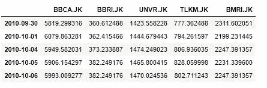
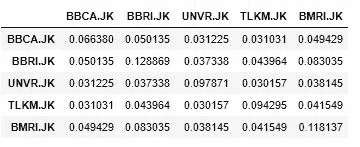
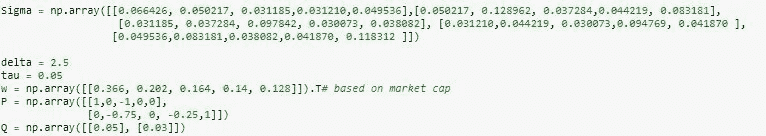
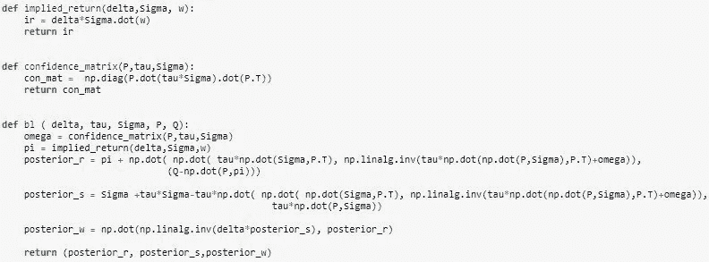
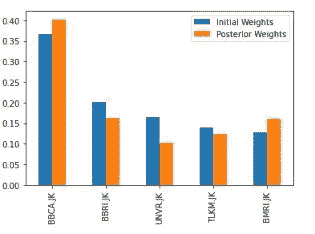

# 布莱克-利特曼模型:

> 原文：<https://medium.com/analytics-vidhya/black-litterman-model-the-perspective-of-individual-investor-203f0f42f587?source=collection_archive---------11----------------------->

# 个人投资者的视角

照片由[斯捷潘·巴巴宁](https://unsplash.com/@stepanbabanin)通过 [Unsplash](https://unsplash.com/photos/1d9xXWMtQzQ) 拍摄

你喜欢水果吗？你喜欢哪种水果？你喜欢苹果吗？如果是，欢迎加入。红色的嘎拉和绿色的史密斯奶奶，你更喜欢哪一个？都不是？让我猜猜你是一个黄金美味的超级粉丝。谈论成熟度，这有时很棘手，因为颜色可能无法表明成熟度，因为某些苹果的自然颜色。然而，如果你比较两个几乎完全相同的苹果，你就能区分它们的成熟程度。你很自信，一个暗红色的节日意味着比不那么红的节日更成熟。

就像苹果一样，资产组合可以用同样的方式构建，你可以利用感觉和信心来确定成熟度。在 Black-little man 模型中，投资组合被允许生成为投资者观点信心(绝对或相对观点)与市场均衡相结合的产物。在我之前的[文章](https://sunanmurpratomo.medium.com/idx-big-caps-optimization-using-python-e3999feaccbc)中，我们已经讨论过关于投资组合优化源自于马科维茨(MPT)的现代投资组合理论。MPT 不灵活，方差的任何变化，无论是上升还是下降，都将严重影响我们投资组合中资产配置的权重。

相比之下，由费希尔·布莱克和罗伯特·里特曼(1992)开发的布莱克-里特曼模型在贝叶斯框架下生成预测。贝叶斯从现有的“先验”信念开始，生成“后验”信念。Black-little man 模型是为了使投资组合模型在实际投资中更有用而开发的(little man，2003)。

让我们开始更好地理解。

# **导入库和数据**

图 1|调整关闭

图 2|年度协方差

*   开始日期为 2010 年 9 月 30 日，结束日期为 2020 年 9 月 30 日。
*   股票选自印度尼西亚证券交易所(IDX ),数据取自雅虎。

# 一般信息

图 3|一般信息

*   模型从反向优化开始，根据资产的市值计算初始权重和隐含回报。
*   Delta 是风险规避得分，tau 是衡量 CAPM 先验的
    不确定性的标量。
*   p 是投资者观点的矩阵，Q 是投资者观点价值的矩阵

# 布莱克-利特曼模型

图 4|布莱克-利特曼公式

在我们输入投资者的观点矩阵及其得分后，现在我们得到期望收益后验、协方差后验和权重后验

# 最后的

图 5|初始与后验权重

在 Black-Litterman 模型中，投资者的观点和分数至关重要，因为这些因素将决定权重后验、预期回报后验和协方差后验。

# 参考

*   何和李立民(2002)。布莱克-利特曼模型投资组合背后的直觉。
*   张威(2010)。布莱克-立特曼模型解释说。*《资产管理杂志》*， *11* (4)，229–243。
*   曼克特，C. (2006 年)。*布莱克-利特曼模型:数学和行为金融方法在实践中的应用*(博士论文，KTH)。
*   文学家等。艾尔。，(2003)现代投资管理-均衡方法，新泽西:威利。

> 免责声明:
> 
> 本材料仅供一般参考，不作为专业建议。提供的信息没有考虑投资目标、风险承受能力或财务状况。