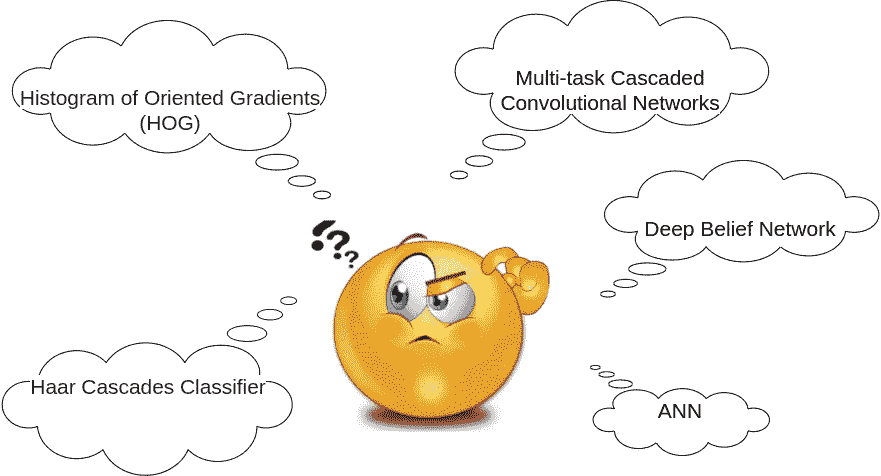
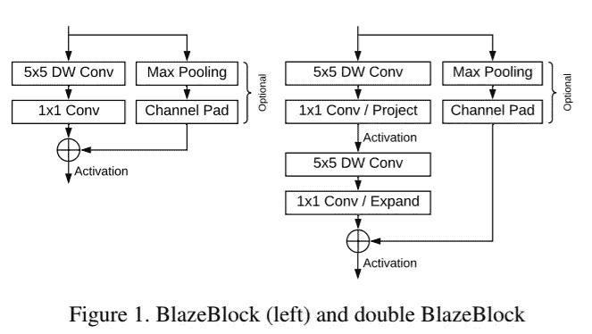
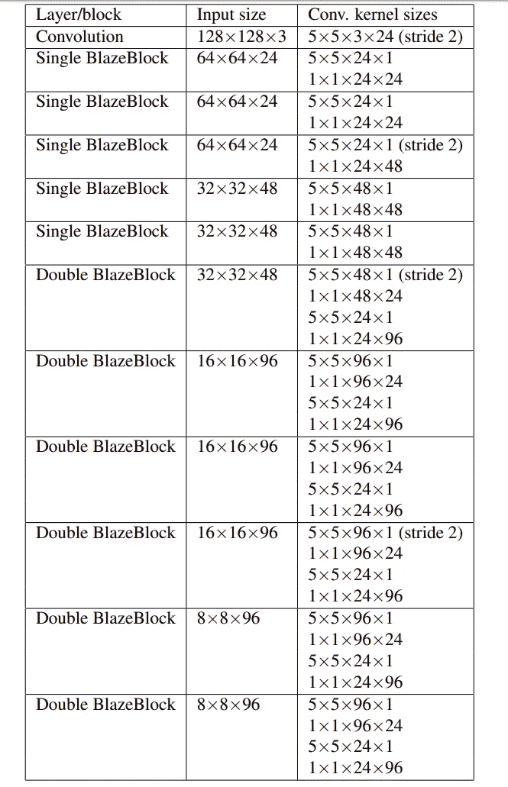

# Blazeface:移动 GPU 上的人脸检测

> 原文：<https://medium.com/analytics-vidhya/blazeface-face-detection-dd1783e2f2d8?source=collection_archive---------9----------------------->

在计算机视觉中，人脸检测是许多应用中的第一步。有许多技术可用于面部检测，这里有一个不错的[博客](https://towardsdatascience.com/face-detection-for-beginners-e58e8f21aad9)供更多阅读。

使用面部检测作为构建模块的一些实际应用如下

*   手机中的面部锁定
*   识别社交媒体上的人
*   唇读
*   情感检测
*   人脸识别
*   面部增大

存在一些面部检测技术。根据你的需求选择合适的，看看这个[博客](/@Intellica.AI/a-guide-for-building-your-own-face-detection-recognition-system-910560fe3eb7)了解更多信息。



人脸检测技术

因为人脸检测广泛用于移动电话应用中。那么，哪一个是适合移动设备的正确选择呢？谷歌最近的一篇研究论文介绍了一种重量轻、性能好的人脸检测器，它可以与移动 GPU 很好地配合，提供实时性能。


火焰脸

该文件详细介绍了该模型的主要组成部分。我们可以使用文中提供的体系结构重新创建模型。在论文中描述了两种主要的结构单元，称为单结构单元和双结构单元。



在这些块中，使用了深度方向的卷积层，这提高了模型的速度。5x5 内核用于 DW conv，1x1 内核用于 conv 图层。该模型使用 5 个单火焰块和 6 个双火焰块。



模型架构

对于锚计算，具有 16×16 内核大小和 8×8 内核大小的两个 Conv 层分别与 2 个和 8 个滤波器一起使用。模型的输出需要后处理，因为重叠的锚的数量随着对象的大小而显著增加。该预测首先被裁剪以适合图像尺寸的边界，然后应用 NMS 得到最终的盒子。当输入图像被调整到 128x128 时，这些框可以被调整到图像的原始大小。最终的边界框可以使用 cv2.rectangle 在图像上随机生成。

最终检测到的人脸可以进一步用作特定任务的另一个模型的输入。

blazeface 的 tflite 模型可以在[这里](https://github.com/google/mediapipe/blob/master/mediapipe/models/face_detection_front.tflite)找到。我们可以提取层细节和模型架构如下。

```
tflite_path = 'face_detection_front.tflite'
interpreter = tf.lite.Interpreter(model_path=tflite_path)interpreter.allocate_tensors()for i in interpreter.get_tensor_details():
    print("name|shape ",i["name"],"|",i["shape"])
```

这里我们需要内核的权重和偏差。我们可以通过将权重分配给模型的层来恢复模型的权重。

```
for var in model.variables:
    weight = tflite_map[var.name]
    var.assign(weight)
```

预测人脸包围盒，并使用 cv2 渲染。

```
for bx in final_boxes:
    cv2.rectangle(orig_image, (bx[0], bx[1]), (bx[2], bx[3]), (0, 255, 0), 10)plt.figure(figsize=(15,15))
plt.imshow(orig_frame)
plt.show()
```


编辑表情图像

保存模型，以便它可以用于进一步的任务，如面部识别，面部增强等。《BlazeFace:移动 GPU 上的亚毫秒级神经人脸检测》一文[此处](https://arxiv.org/pdf/1907.05047.pdf)可用。

感谢阅读…..