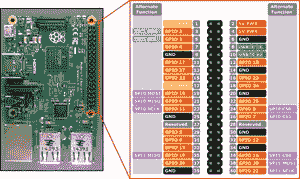

# 使用树莓 Pi 的闪烁 LED python 程序

> 原文：<https://medium.com/analytics-vidhya/blinking-a-led-using-raspberry-pi-9e437d69ef13?source=collection_archive---------15----------------------->

让我们从一个非常小的使用 Raspberry Pi 闪烁 LED 的程序开始。在我们开始 Raspberry Pi 的编程和执行部分之前。我们需要安装一些软件包，作为运行程序的基础。请打开 Raspberry Pi 的终端窗口并运行以下命令。[请记住逐行运行每个代码，不要一次运行所有代码]

以下代码更新和升级任何现有的包:

让我们安装编译过程中需要的 Python 3 头文件:

使用以下命令安装 pip:

GPIO 的安装【通用输入/输出】这个包专门用来玩传感器和执行器用树莓 Pi。该软件包有助于接受来自传感器的外部数据作为输入，也有助于从 Raspberry Pi 发出信号。

要安装 GPIO 库包，我们需要执行以下命令:

> *sudo apt-get 安装 python-rpi . gpio python 3-rpi . gpio*

随着图书馆安装使用终端窗口，是时候让你输入一些代码，让你最喜欢的彩色 led 闪烁。打开你喜欢的 Python IDE【推荐 Thonny Python IDE】

**进口** RPi。GPIO **as** GPIO #导入树莓 Pi GPIO 库

**从**时间**导入**睡眠#从时间模块导入睡眠功能

GPIO.setwarnings(False) #暂时忽略警告

GPIO.setmode(GPIO。BOARD) #使用物理引脚编号

GPIO.setup(8，GPIO。OUT，initial=GPIO。低)#将引脚 8 设置为输出引脚，并将初始值设置为低(关)

**而**为真:#永远运行

GPIO.output(8，GPIO。高)#打开

睡眠(1) #睡眠 1 秒钟

GPIO.output(8，GPIO。低)#关闭

睡眠(1) #睡眠 1 秒钟

编译程序并检查是否有错误，如果你用 Thonny 输入代码，请小心拼写错误。假设没有错误，让我们继续了解 Raspberry Pi [GPIO]中的引脚图

LED 和 Raspberry Pi 之间的连接如下:

发光二极管的正极端子——8 号引脚

LED 的负极端子----针脚 6

[您可以利用试验板进行这些连接]

现在，您可以在 Thonny Python IDE 中运行代码，并观察到 LED 闪烁延迟 1 秒，该延迟可以根据您的要求增加或减少。

如果我错过了什么，请随时通知我[电子邮件 id:[arnoldautomatic@rediffmail.com】](mailto:arnoldautomatic@rediffmail.com)。

希望看到您使用 Raspberry Pi 构建令人兴奋的项目。[# raspberrypi](https://www.tulunaduelectronics.com/search/.hash.raspberrypi)[# blinking](https://www.tulunaduelectronics.com/search/.hash.blinkingled)[# projectsusingraspberrypi](https://www.tulunaduelectronics.com/search/.hash.projectsusingraspberrypi)[# led blinking](https://www.tulunaduelectronics.com/search/.hash.ledblinking)[# raspberrypiLEDblinking](https://www.tulunaduelectronics.com/search/.hash.raspberrypiledblinking)

干杯

阿诺德·萨希特