# 区块链在医疗保健中的老式解释

> 原文：<https://medium.com/analytics-vidhya/blockchain-explained-in-old-fashioned-way-in-medical-care-786e63cffa0c?source=collection_archive---------20----------------------->

抽象。医疗记录的分散存储将减少对记录的伪造。通过复制数据进行简单的分散可能就足够了，但是会牵涉到记录的安全问题。IPFS 可能会提供一个解决方案，但将利用存储。我们提出了一种使用区块链来避免医疗保健领域伪造的解决方案。区块链网络将对医疗保健管理数据及其相关文件打上时间戳并存储在网络存储器中。这也会造成内存爆炸，从而导致系统崩溃。然而，基于机器学习的分类模型用于决定哪些记录进入区块链。机器学习模型对患者的心跳信号使用 CNN，其中通过 FFT 技术提取特征。该模型是使用标准开源数据集构建的。这种方法明显减少了内存的使用。

**问题域。**心脏听诊是监测心脏和血液循环所产生的声音的过程。听诊是诊断心脏病的基本工具。听诊仍然是初级卫生保健中筛查和诊断的主要工具，部分原因是设备的成本较高且可用性相对有限，以及管理和解释心电图和超声心动图结果所需的特殊技能。由于心音的结构非常复杂并且是高度非平稳的信号，因此分析听诊的过程非常复杂。与这些声音相关的“节拍”在信号中反映为相对高活动的周期，与相对长的低活动间隔交替。许多类型的研究正在进行，以使用机器学习的最便宜的方式更早地预测心脏病。区块链技术非常吸引研究人员，这主要是因为它们在比特币加密货币方面的成功。这种魅力的主要原因是，以前只能通过中央权威机构运行的应用程序现在可以作为一个完全分散的权威机构运行，并以同样的确定性实现同样的功能，因为区块链就在那个地方。随着这一巨大进步，研究人员正在尝试在不同的场景中实现区块链，而不是在加密货币场景中。研究人员试图实现区块链的一些领域包括:金融、医疗保健、公共事业、音乐行业、房地产和政府部门。

**问题描述。**根据我们的调查，患者服用了错误的药物，危及了患者的生命。为了避免这种情况，我们必须存储从患者手术批准日期到手术日期的所有药物交易。尤其是心脏、大脑和癌症手术在印度非常重要，必须受到严格监控。因此，现在我们需要创建一个记录管理系统，这样医生就不能修改这些手术记录。为了检查患者是否患有心脏病，患者必须经历大量的初步筛查，这使其成为一个乏味的过程。因此，我们将提出一种将记录的心跳分类为正常或异常的系统，以及一种使用区块链的安全系统，该系统保存手术数据，并且还帮助检测心脏疾病的传播。这降低了初步筛选过程的复杂性，也降低了成本。区块链使系统去中心化，即使上级机关也不可能篡改病历。据我们所知，印度目前没有这样的系统。我们可以在区块链存储任何疾病信息，由于缺乏数据集，我们已经将我们的圈子缩小到心脏疾病及其手术。

**范围。**现在每天的医疗保健数据更重要，因为它可以被更高的权威修改。因此，这种医疗保健数据的安全性变得有问题。如果病人受到医生错误给药的影响，而他们又无法证明，因为医生给的药很容易被伪造。发生这种情况是因为我们完全依赖医院的集中记录管理系统。因此，我们需要建立一个系统来记录所给的药物，即使是医院的上级也不可能伪造。因此，不可能向社会隐瞒医生开出的原始药物。我们的主要目的是保护使用区块链的医疗保健数据。如果我们在印度实施这一措施，印度的医疗犯罪将会减少。

**贡献。**存在许多具有不同特征的心跳分类算法。我们在应用低通滤波器之前和之后进行了两次 FFT，并将它们连接起来，并将其用作提高分类精度的特征。我们使用 CNN 的两个隐藏层。我们使用了新的安全技术，这是一个区块链，没有人可以修改存储在其中的数据。

**相关作品。**

**2.1 心跳异常检测**

在偏远地区或发展中国家，听诊可能是唯一可用的手段，因此心脏病的诊断变得困难。异常心跳声音决策过程包括三个主要阶段。在第一阶段，S1-S2 音被分段，即它们的时序被确定。S1-S2 音用于提取心跳信号的特征。在第二阶段，通过使用小波平面形成特征向量元素。在最后阶段，通过机器学习算法实现分类过程[4]。

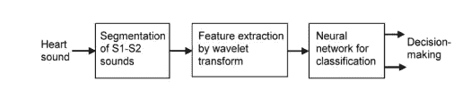

图 2.1 异常检测的阶段

2 . 1 . 1 S1-S2 音的分段 S1-S2 音的分段可以用三种方式来完成。它们是多带小波能量，多带小波 Shannon 能量，同态滤波。一般程序是将信号归一化，使用小波变换过滤心跳声音，然后检测 S1 和 S2 的位置。

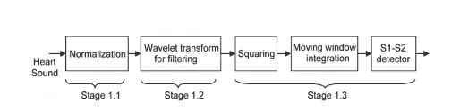

图 2.2 细分步骤

为了标准化，采样频率设置为 2000 Hz，因为心脏信号的频谱频率范围为 5-500Hz，这使得计算机化分析变得容易。通过这种标准化，与噪声相关的突然变化被最小化。然后将 DWT 应用于标准化的心跳信号。该信号经受 5 级分解小波。表示第三、第四、第五分解级别系数的子带在上采样之后被求和。子频带的总和大约相当于 30–250Hz 的频带。因此，通过选择这三个易于分析的带，S1 和 S2 被扩增。求和输出被平方。

这强调了 S1 和 S2 声音和杂音的区别。将移动窗口积分应用于平方和，以获得平滑的输出。手术后，与 S1-S2 湾位置相对应的山丘变得明显。因此 S1-S2 音是分段的[8]。在香农能量方法中，心跳信号经历相同的归一化和离散小波变换方法。然后，计算信号的归一化香农能量。阈值处理后，信号被检查，然后声音 S1，S2 被标记。在同态滤波方法中，信号的能量、缓慢和快速变化部分用于计算。S1 和 S2 对信号的缓慢变化部分有贡献，而杂音对快速变化部分有贡献。组合两个信号的对数。然后应用低通滤波器来去除不想要的分量。阈值处理后，检查声音之间的时间间隔，然后标记声音 S1、S2。

**2.1.2 小波变换特征提取。**特征提取对分类器的精度有显著影响。从小波包树的适当节点的系数中提取特征。心音异常或杂音可发生在心脏收缩期或心脏舒张期或两个阶段。每个阶段分为五个相等的时间段。计算每个片段中细节系数的幂。特征向量的元素由五个分解级中每个子带的十个功率级形成。用于特征提取的另一种方法是基于由 Coifman 和 Wickerhauser 引入的 BBS。这是一种基于熵的基础选择，试图找到具有最小成本的节点。父节点的开销与其两个子节点的开销之和进行比较。并且它被分配到最小成本。局部判别基是另一种从整个树中选择 k 个具有最大判别度量的节点的方法。成本或鉴别测量的值被用作分类的特征。

**2.1.3 分类算法。**支持向量机和人工神经网络是常用于心音分类的分类算法。它们都通过合适的核函数将输入特征向量映射到更高维的特征空间，该核函数有助于最大限度地划分数据类别[6]。

**2.2 区块链。**在加密货币场景中，付款人和收款人之间的问题是必须有一个可信的第三方来验证货币的重复消费并验证交易。这导致了一种状态，在这种状态下，所有参与的人必须就可信机构达成一致[3]。整个社区的命运都交给了一家公司，这家公司掌管着这个可信的机构。为了使网络的所有参与者对先前进行的交易达成一致，所有参与者了解所有先前的交易是很重要的。因此，一项名为区块链的技术被提出，以防篡改的方式将所有交易存储在公共账本中[12]。一种名为比特币的早期加密货币使用难以破解的密码来验证交易。捆绑在块中的事务数量以这样一种方式进行散列，即散列包含一些前导零。当前导零的数量增加时，计算复杂度增加。因此，整个网络被给予基于 CPU 的投票许可。如果网络包含控制更大 CPU 能力的更多诚实节点，网络将具有更大的可信区块链[14]。

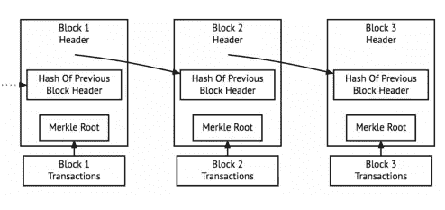

图 2.3 比特币中的区块链

**2.3 调查观察结果。**根据以上调查，在我们的系统中，使用相同的 DFT 方法从心跳信号中提取特征。卷积神经网络被用于分类，它给出了比其他分类算法更高的精度。一旦患者获得异常结果，如果需要，患者必须接受手术。这些手术细节由医院管理层保存，如果出现任何错误的诊断或提供的药物，当局可以很容易地修改或篡改这些细节[13]。为了避免这种情况或识别错误的诊断，这些手术细节将被存储在区块链，使其无法篡改[10]。因此，我们使用区块链来存储这些手术细节。

**3 需求分析**

**3.1 功能要求。**我们的系统分为机器学习部分和安全(区块链)部分。机器学习部分将心跳信号分类为正常或异常，分类算法应遵循以下要求

*   wav 文件应该是清晰的，以获得正确的分类
*   分类算法应该产生正确的分类
*   添加额外的隐藏层不应该影响分类的准确性
*   分类错误应该更少区块链在这个项目中为医疗保健数据提供了安全性，区块链应该依赖于以下要求
*   区块链不应该被第三方篡改
*   区块链要稳定

**3.2 非功能性要求**

**3.2.1 硬件**

*   用于计算的 GPU 用于训练的 CNN 算法在 CPU 中处理大数据集需要几个小时，而在 GPU 中只需要几分钟。

3.2.2 软件

****操作系统:****

*   **Linux 操作系统**
*   **编程语言:Python、Go、NodeJS**
*   **区块链:超级账本结构**
*   **虚拟机:Docker 3.2.3 性能系统必须优化、可靠、一致、始终可用。**

****3.3 约束条件****

**心跳信号应以 wav 文件格式存储。**

**心跳分类的准确性决定了病人的手术，心跳分类算法中的错误会传播到其余的模块。**

**交易应采用指定的格式和大小，以便在区块链中存储交易。**

*   **没有人可以检索和修改存储在区块链中的事务。**

****3.4 系统型号****

****3.4.1 软件实现流程****

**图 3.1 描述了建议系统的软件流程图。**

**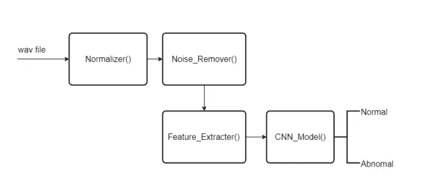**

**图 3.1 软件流程图**

**在这个提议的系统中使用的功能是，**

*   ***规格化器()*——在-1 到 1 之间改变振幅值。•**
*   ***噪声去除器()* —使用巴特沃兹创建的低通滤波器从标准化 wav 文件中去除不需要的高频信号。**
*   ***特征提取器()*——对去噪后的信号、正常信号进行 FFT，并将它们连接起来得到特征矩阵。**
*   ***CNN Model()* —分析测试样本的特征矩阵，得出正常或异常。**

****3.4.2 数据流图****

**我们提出的系统的数据流如图 3.2 所示。它解释了病历在我们的项目中是如何流动的。**

**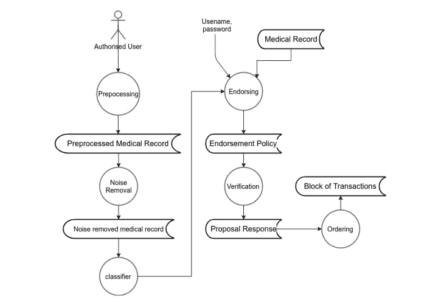**

**图 3.2 数据流图**

****系统设计****

****4.1 系统架构。整个系统的框图如图 4.1 所示。该系统旨在通过将医疗保健数据存储在区块链中来保护其安全。由于医疗保健数据非常庞大，我们将我们的系统仅限于心脏手术。为了加快识别心脏病的过程，已经开发了一种使用 CNN 算法识别异常心跳声音的模型。wav 文件格式的心跳信号作为系统的输入。这些信号经过归一化处理，然后通过低通滤波器。然后通过对预处理的信号应用 FFT 来提取特征。这些特征作为具有两个隐藏层和一个丢弃层的 CNN 算法的输入给出。最初，权重和偏差是随机设置的。随着模型的学习，它基于 adam 优化器函数更新权重和偏差。使用软最大熵方法计算损失。然后存储权重和偏差，用于进一步的测试分类过程。在全面筛查过程后，如果需要，心跳异常的患者必须接受手术。病人的手术细节被认为是一个交易，并广播到区块链网络的每一个其他节点，以提供安全保障。当交易被添加时，地理智能合同模块将被执行，并给出所有州的疾病传播情况。****

**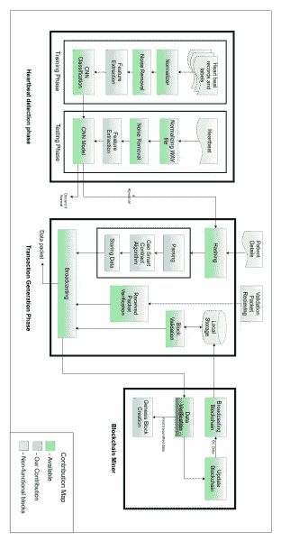**

**图 4.1 框图**

****4.2 模块设计****

**我们的系统有三个阶段。**

*   *****心跳检测阶段*****

**—规格化器**

**—噪音消除**

**—特征提取**

**— CNN 分类**

*****交易生成阶段*****

**—哈希**

**—地理智能合同**

**—接收数据包验证**

**—块验证**

*   *****区块链矿工*****

**—数据验证**

**—创世纪区块创建**

**区块链广播公司**

****4.3 心跳检测阶段****

**在这个阶段，我们实现了 CNN 来将心跳信号分类为正常或异常。它包括培训和测试阶段。它包含数据预处理、特征提取、分类过程。**

**4.3.1 规格化器**

**它接受一个普通的 wav 文件作为输入。wav 文件包含时域信号值。我们对这些信号有一些复杂的操作。因此，为了使这些操作更容易，我们应用了随机归一化函数，将-1 范围内的幅度值转换为 1。**

****4.3.2 噪声消除****

**记录的心跳信号可能具有影响分类准确性的额外噪声。因此，我们创建了一个巴特沃兹低通滤波器来滤除大于 2.5 Hz 的频率。因为正常人的心跳频率最高可达 2.5 赫兹。4.3.3 特征提取我们需要每个 wav 文件的特征来训练 CNN 分类算法。我们将 FFT 的系数作为特征。FFT 的公式如图 4.2 所示。**

**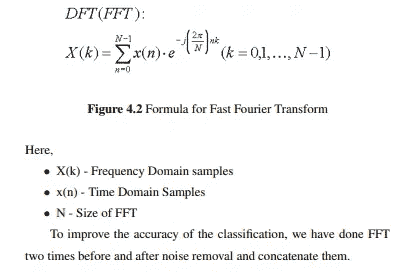**

****4.3.4 CNN 分类****

**我们使用[卷积神经网络](http://keras.io/examples/cifar10_cnn/)训练分类模型，以获得比其他分类算法更高的准确性。对于这个 CNN 训练，我们有特征向量作为输入。有两个隐藏层。我们在输出层中有两个节点来将心跳信号分类为正常或异常。我们的 CNN 的设计模型如图 4.3 所示。**

**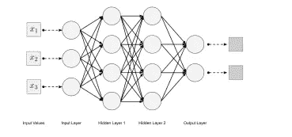**

**图 4.3 设计的 CNN 模型**

**最初，在 CNN 中随机分配权重和偏差，然后在即将到来的迭代中更新权重和偏差。最后，该模型预测心跳信号是正常还是异常。**

****4.4 交易生成阶段****

**当心跳信号被分类为异常时，患者必须经历许多筛选过程。一旦手术得到确认，病人的详细信息就应该存储在区块链中。这个阶段包括散列病人的详细资料、分析疾病传播和验证过程。每个交易都从这个阶段开始。**

****4.4.1 哈希****

**患者的详细信息和手术详细信息在这里被视为使用 SHA-256 的事务。**

****4.4.2 地理智能合同****

**我们从病人的详细资料中提取了地理位置数据。每当交易被添加到区块链时，该模块将被触发。图 4.4 给出了智能合同的流程。**

**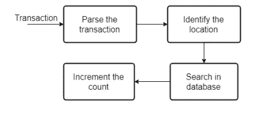**

**图 4.4 地理智能合同**

**最初，我们解析事务并获得病人的位置。然后我们改变累积利差身份。**

****4.4.3 接收包验证****

**在区块链，每笔交易都必须由网络中的其他对等体验证，以做出适当的决定。在本模块中，必须完成以下步骤**

**接收对等方获得生成交易的对等方的公钥。**

*   **对等体使用获得的公钥解密接收到的分组。**
*   **对等方计算消息的哈希。•**
*   **如果 H = Hash，则向其他对等体广播该事务，否则丢弃该事务。**

****4.4.4 块验证****

**该模块可用于区块链网络的每个对等点。网络中的对等体从挖掘器获得新挖掘的块。他们检查块的有效性。如果有效，它们更新它们的区块链，否则丢弃新的块。**

**块验证的程序如下**

*   **对等体通过检查每个事务的有效性来检查该块是否包含有效的事务。**
*   **如果有任何无效的事务，它将丢弃该块。**
*   **否则，它检查块报头是否包含与一致性算法中提到的相同数量的前导零。**
*   **如果零的数量较少或较多，则丢弃该块。**
*   **否则，它检查新块是否正确地引用了对等体的上一个块的散列。**
*   **如果它正确地引用更新区块链，然后它广播这个新的更新区块链，否则丢弃这个新块。**

****4.5.1 数据验证****

**该模块查找低于目标哈希值(PoW)的哈希值。在区块链，我们有四种类型的共识算法。四种类型的算法是 1。实用拜占庭容错算法 2。工作证明 3。利害关系证明 4。委托利益证明**

## **一致性算法**

**工作证明是计算客户端难题，其中需要计算能力来解决难题，并且首先解决难题的节点将把块添加到区块链，并且将在挖掘网络中获得奖励。一旦完成一个块，它将被广播到所有的挖掘节点，并且它们都开始挖掘。首先解决该问题的挖掘器节点会将该块添加到区块链中。**

****4.5.2 创世纪区块创建****

**在本模块中，用于引导区块链应用程序的 genesis 块是使用 configtxgen 工具创建的，该工具是 Hyperledger 的内置工具。该工具获取一个输入文件 configtx.yaml，并输出在为区块链创建初始设置时应该使用的二进制文件。**

****4.5.3 广播区块链****

**该模块将新创建的块广播给网络中的其他对等体。**

## **系统开发**

**在这一章中，我们将讨论为开发这个系统而实现的算法。我们的项目分为三个阶段。**

**他们是，**

1.  **心跳检测阶段**
2.  **交易生成阶段**
3.  **区块链矿工**

****5.1 跨模块原型****

**本节描述了系统各模块的输入和输出。1.心跳检测阶段**

***规格化器:*该模块将原始 wav 文件作为输入，并在-1 到 1 的范围内改变其振幅值。**

*   ***去噪:*该模块将一个规格化的 wav 文件作为输入，返回去噪后的 wav 文件。**
*   ***特征提取:*这里去噪后的 wav 文件将作为输入，返回该 wav 文件的特征矩阵。**
*   ***CNN 分类:*训练数据集的特征矩阵将被送入这个 CNN，我们将得到用于心跳异常分类的训练模型。**

****2。交易生成阶段****

*   ***散列*:原始数据(患者详细信息)将被散列。**
*   ***Geo smart contract* :所有交易将被视为输入，并使用地理定位数据返回心脏病在所有州的传播情况。**
*   ***接收包验证*:该模块通过哈希符号验证接收到的加密包。**
*   ***块验证*:它接受一个新挖掘的块作为输入，并检查该块是否必须被添加到区块链或被丢弃。**

****3。区块链矿工****

***数据验证*:发现低于目标哈希值的哈希值(工作证明)。**

*   ***创世纪区块创建*:创建区块链的第一个区块并广播。**
*   ***广播区块链*:将新创建的块广播给网络中的其他对等体。**

## **5.2 特征提取程序**

**以下过程应用于原始 wav 文件，以获取该 wav 文件的特征。该程序的流程如图 5.1 所示。**

**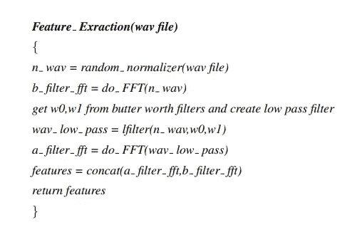****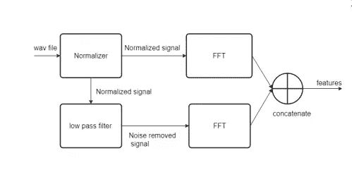**

**图 5.1 特征提取程序**

## **5.3 [卷积神经网络算法](http://keras.io/examples/cifar10_cnn/)**

**[CNN 算法](http://keras.io/examples/cifar10_cnn/)下面给出。它采用特征矩阵并输出 CNN 模型。**

**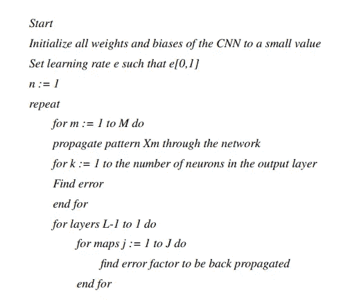****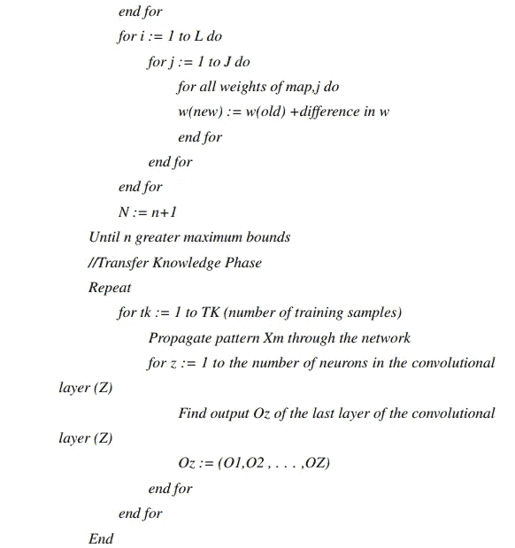**

## **5.4 地理智能合同算法**

**我们提出了一种算法，使用来自患者详细信息的地理位置数据来发现心脏病在所有城市的传播。**

**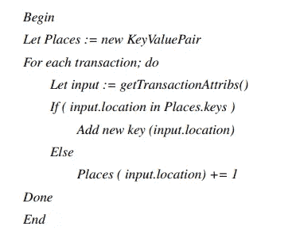**

## **5.5 接收包验证程序**

**数据包验证的过程如下所示。**

**由生成事务的对等体签名和加密的数据包将被作为输入，并执行以下过程**

**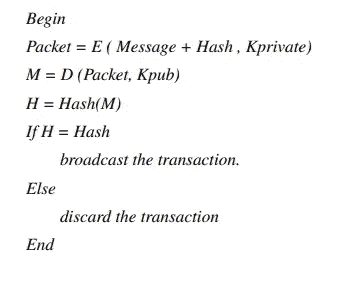**

## **5.6 共识算法**

**基于工作证明。工作证明是计算客户端难题，其中需要计算能力来解决难题，并且首先解决难题的节点将把块添加到区块链，并且将在挖掘网络中获得奖励。一旦完成一个块，它将被广播到所有的挖掘节点，并且它们都开始挖掘。首先解决该问题的挖掘器节点会将该块添加到区块链中。**

**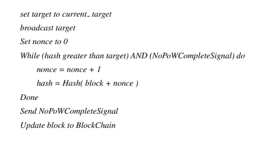**

****5.7 部署详情****

**系统的部署要求心跳信号应该以 wav 文件的形式提供。我们需要区块链的 Hyperledger 和像 Pycharm，NodeJS 这样的 IDE 来成功部署系统**

****6 结果和讨论****

****6.1 数据集****

**我们从网上可获得的模拟数据集中获取了 CNN 训练的心跳信号。生理网模拟数据集可在[http://physionet.org/physiobank/database/challenge/2016/](http://physionet.org/physiobank/database/challenge/2016/)获得**

****6.2 各阶段获得的产量****

**本节显示了获得的结果。**

****6.2.1 标准化器。**输入的 wav 文件将被规范化。图 6.1 显示了标准化前后的变化**

**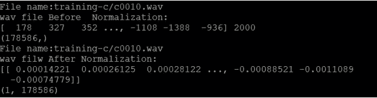**

**图 6.1 标准化的结果**

****6.2.2 噪声消除**。该模块通过对标准化信号应用低通滤波器来去除高频。输出如图 6.2 所示。**

**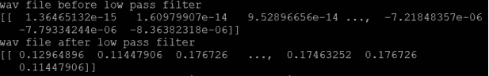**

**图 6.2 噪声消除的输出**

****6.2.3 特征提取****

**该模块使用 FFT 技术生成给定 wav 文件的特征矩阵。图 6.3 显示了给定 wav 文件的特征。**

**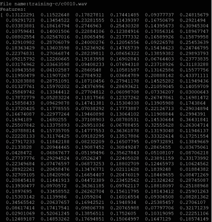**

**图 6.3 给定 wav 文件的特征**

****6.2.4 CNN 分类****

**在此模块中，数据集分为 75%用于训练，25%用于测试(图 6.4)。这里已经创建了模型。对测试集的预测如图 6.5 所示。**

**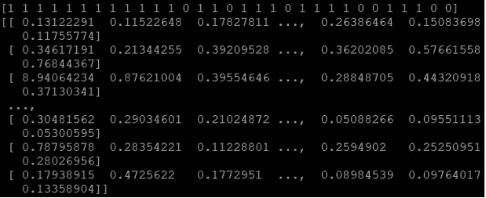**

**图 6.4 用于训练和测试的分割数据集**

**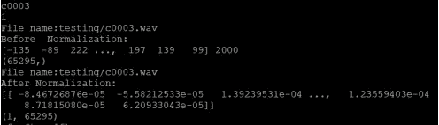**

**图 6.5 训练期间的预测**

**模型创建后，可以通过给出测试样本来进行验证。未知心跳信号的测试结果如图 6.6 至 6.9 所示。**

**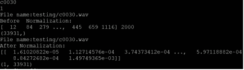**

**图 6.6 样本输入 1**

**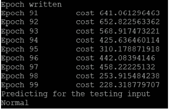**

**图 6.7 样本输入 1 的输出**

****

**图 6.8 样本输入 2**

**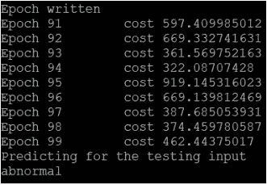**

**图 6.9 样本输入 2 的输出**

****6.2.5 区块链网络设置****

**要实现区块链，我们必须通过创建订购者和对等点来建立网络。下图(6.10–6.12)解释了区块链的实施。**

****

**图 6.10 区块链的订购者**

**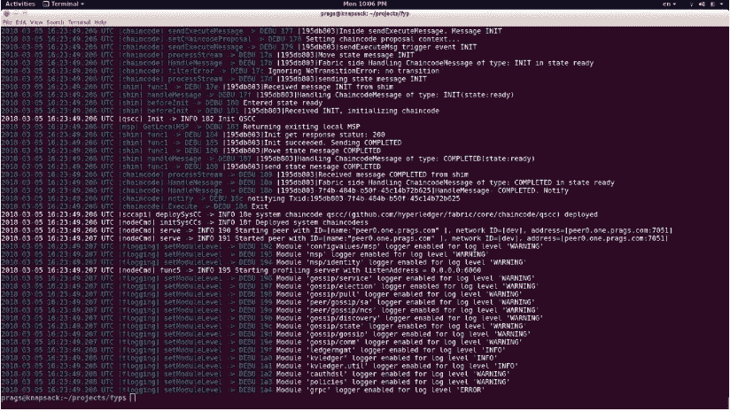**

**图 6.11 区块链中的对等点**

**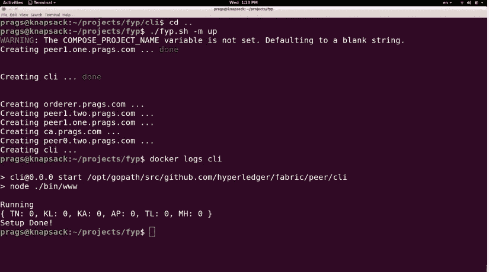**

**图 6.12 网络设置**

****6.2.6 交易生成和地理智能合同****

**我们实现了一个客户端来启动一个事务，如图 6.14 所示。添加交易后，将触发地理智能合同。geo smart 合同的结果如图 6.13 所示。**

****

**图 6.13 地理智能合同的结果**

**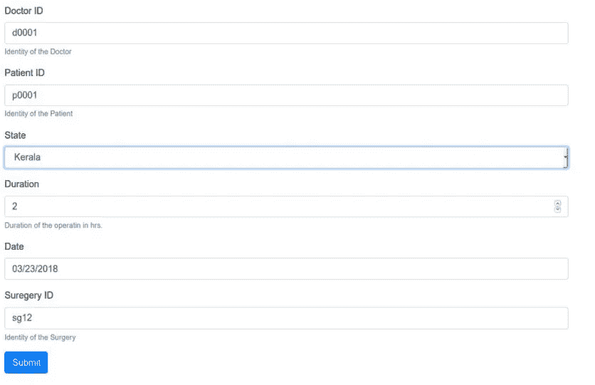**

**图 6.14 启动交易的客户端**

****6.2.7 防篡改****

**当未知方试图访问许可的区块链，它会显示错误，不允许他/她访问数据。这如图 6.15 所示**

**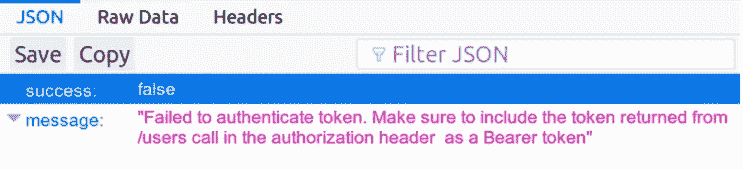**

**图 6.15 防篡改**

****6.3 绩效评估****

**使用下面给出的标准参数来评估 CNN 算法的性能。6.3.1 分类算法混淆矩阵的评价指标混淆矩阵是一个 N * N 的矩阵，其中 N 是被预测的类别数。对于手头的问题，我们有 N=2，因此我们得到一个 2×2 矩阵。**

*   **准确性:正确预测总数的比例。灵敏度:被正确识别的实际阳性病例的比例。特异性:被正确识别的实际阴性病例的比例**

**对学习率为 0.0001 的整个数据集进行了分析，如图 6.16 所示**

**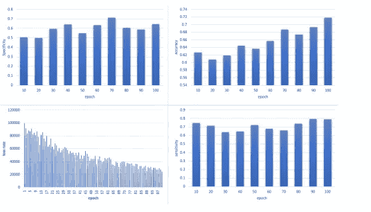**

**图 6.16 学习率为 0.0001 时对整个数据集的不同分析**

**观察结果如表 6.1 所示。**

**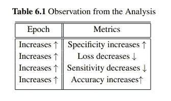**

****6.3.2 不同大小数据集的准确度比较****

**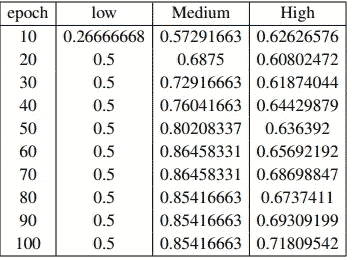**

**表 6.2 不同大小数据集的精确度**

**当我们以相同的学习率 0.0001 对不同大小的数据集执行该算法时，我们获得了表 6.2 中的结果。当我们增加用于训练的数据集大小时，分类的准确性增加。比较结果如图 6.18 所示。**

**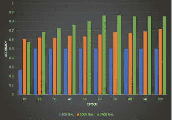**

**图 6.18 不同大小数据集的精确度比较**

****7.1 结论****

**在我们的系统中，CNN 被用于心跳信号的分类，Hyperledger 被用于构建区块链。对于心跳的分类，首先通过归一化过程对信号进行预处理。然后，通过应用低通巴特沃兹滤波器从预处理信号中去除噪声。然后通过应用 FFT 从信号中提取特征。为了具有更高的分类准确率，建立了两层的 CNN 来开发基于提取的特征的模型。一旦心跳被归类为异常，如果需要的话，病人必须接受手术。手术细节被认为是一个交易，并在区块链电视网播出。这将触发地理智能合同，该合同将解析交易并获取交易生成的位置。这有助于轻松发现印度心脏病的传播情况。这已经使用 Hyperledger 结构和链代码实现。区块链使得篡改这些数据变得不可能，这消除了医院中央权威的控制。因此，医生不能修改或改变给定的药物细节。**

## **测试案例**

**本节提供了所开发的
系统的一些模块的测试用例。**

## **A.1 规格化器和噪声消除**

****A.1.1 描述**
这里我们测试从归一化的 wav
文件中去除其他噪声以及归一化。
**A.1.2 测试用例**
【TC ID:01
**输入**:原始 wav 文件
**预期输出**:归一化无噪声 wav 文件**

## ****A.2 特征提取****

****A.2.1 描述**
该模块的测试用例检查使用 FFT 技术从给定的
wav 文件中提取特征。
**A.2.2 测试用例**
TC ID:01
输入:无噪声 wav 文件
预期输出:给定 wav 文件的特征矩阵**

## **A.3 CNN 分类**

****A.3.1 说明**
该模块的测试用例测试给定的心跳信号为
正常或异常。
**A.3.2 测试用例**
TC ID:01
**输入:**测试 wav 文件分类
**预期输出**:正常/异常**

## ****A.4 地理智能合同****

****A.4.1 描述**
这里我们检查
数据库中的手术数是否正确更新。
**A.4.2 测试用例**
TC ID:01
**输入**:患者详细信息及地理位置
**预期输出**:患者位置的更新计数**

## **A.5 防篡改**

****A.5.1 描述**
这里我们检查区块链
**的稳定性 A.5.2 测试用例**
TC ID:01
**输入**:密码错误的未知人用户 ID
**预期输出**:限制访问**

## **参考**

**[1]“爱沙尼亚公民将很快拥有世界上最具黑客特征的医疗记录”。网址:[https://qz.com/628889/this-](https://qz.com/628889/this-)
东欧国家正在将其健康记录移至
区块链/。(访问时间:2017 年 10 月 7 日)。**

**[2] Devetsikiotis M Christidis K 和 Christidis K .，“物联网的区块链和智能合同”，IEEE Access:The jour-
nal for rapid open Access publishing，第 04 卷，第 2292–2303 页，**

**2016.**

**[3] Owenson G Dennis R 和 Aziz B .，“一个时间的区块链:一种形式分析”，协作技术-
技术与系统国际会议，第 430–437 页，2016 年。**

**[4] Zmray Dokur 和 Tamer lmez。，“利用
小波变换和增量自组织映射的心音分类”，Elsevier
:数字信号处理 18，PP . 951–959，2008。**

**[5] Chan Yeob Yeun Ebrahim AL Alkeem 和 M. Jamal Zemerly。，“无处不在的医疗保健物联网去服务的安全和隐私框架”，第十届互联网技术和安全交易国际会议(ICITST 15)，第 70–75 页，2015 年。**

**[6]az reen az man az rul Jantan fate meh Safara，Shyamala Do-
raisamy 和 Asri Ranga Abdullah Ramaiah。“心音分类小波包分解树的多级基 se-
选取-
筛选”，Elsevier 计算机在生物与医学中的应用，第 43 卷，第 1407–1414 页，2013 年。**

**[7] Emin Gn Sirer Ittay Eyal、Adem Efe Gencer 和 Robbert van Re-
nesse。，“比特币-NG:一个可扩展的区块链协议”，进行-
第十三届 USENIX 网络系统研讨会 De-
签署与实施(NSDI 16)。1618 年 3 月，2016 年第 45–59 页。**

**[8] Vishwanath Shervegar M 和 Ganesh V. Bhat。“自动分段-
使用心脏事件的发生进行心音图的心理分析”，爱思唯尔:医学信息学解锁杂志，第 6–10 页
，2017 年。**

**[9]McBurney P . Magazzeni D 和 Nash W .,“智能合同的验证和检验:研究议程”，IEEE 计算机**

**社会杂志 2017 年 9 月，第 50-57 页。**

**[10]马蒂亚斯·梅特勒。，“医疗保健中的区块链技术 rev-
解决方案从这里开始”，IEEE 第 18 届 e-
健康网络、应用和服务国际会议，2017。**

**[11] Alex Mizrahi，“一个基于区块链的财产所有权记录-
ing 系统”。网址:[https://chromaway.com/papers/A-blockchain-](https://chromaway.com/papers/A-blockchain-)
based-property-registry . pdf(访问时间:2017 年 12 月 20 日)。**

**[12] S. Nakamoto，“比特币:一个点对点的电子现金系统”，
2008。网址:[https://bitcoin.org/bitcoin.pdf](https://bitcoin.org/bitcoin.pdf)。**

**13 朱尔斯·怀特·张鹏、迈克尔·沃克和道格拉斯·施密特。，“评估区块链医疗保健 de-
集中式应用的指标”，IEEE 第 19 届 e-
健康网络、应用和服务国际会议(Healthcom)，2017。**

**[14] Florian Tschorsch 和 Bjorn Scheuermann。，“比特币及更远:
关于去中心化数字货币的技术调查”，IEEE
通信调查与教程，2015。**

**这就是所有的家伙，感谢滚动！**