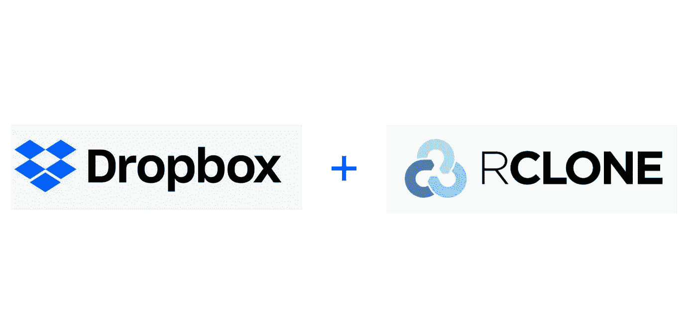
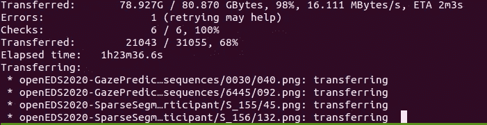

# 血液、汗水和 Dropbox 数据集

> 原文：<https://medium.com/analytics-vidhya/blood-sweat-and-dropbox-dataset-2e68f48ba05a?source=collection_archive---------26----------------------->

如何将 Dropbox 数据集下载到远程服务器



你好。

最近我决定参加 [OpenEDS 2020](https://research.fb.com/programs/openeds-2020-challenge/) 挑战赛。
比赛的组织者提供了两条赛道:

1.  基于先前估计的注视向量来预测未来的注视位置
2.  基于先前估计的注视向量预测未来的注视位置，同时另外利用在先前记录的眼睛图像序列中编码的时空信息

每个都有自己的数据集，可以通过请求从 Dropbox 下载。那么，我们如何管理从 Dropbox 下载数据集呢？

## 无头收纳箱

我选择的第一条路是在我的 Ubuntu 服务器上安装 Dropbox 应用程序。跟随[这个](https://www.dropbox.com/en/install-linux)我成功安装了 headless Dropbox 并通过了授权。

可以用`~/.dropbox-dist/dropboxd`命令启动守护进程，但是之后出现了一个合理的问题“如何检查同步的当前状态？”。为了获得这样的功能，需要从我之前提到的同一个页面下载 **python 脚本**，并将其用作在服务器上控制 Dropbox 的**可执行文件。对我来说，提议的控制方法看起来很荒谬，但这不是本文的主题。**

有了这个脚本，你可以运行`dropbox status`，你就会知道它是`Syncing…`。如果一段时间后一切顺利，您将获得数据集。在我的案例中，出现了一些问题，Dropbox 守护程序向我发送了一个错误:

```
Unable to monitor entire Dropbox folder hierarchy. Please run “echo fs.inotify.max_user_watches=100000 | sudo tee -a /etc/sysctl.conf; sudo sysctl -p” and restart Dropbox to fix the problem.
```

是的，那看起来就像“照他们要求的去做！”但这并不容易。我们将服务器作为共享资源，这就是为什么每个人都在自己的 Docker 容器中工作。`fs.inotify.max_user_watches`设置适用于整个主机，所以我不能在一个容器内更改它。这是服务器管理员上台的时刻。他提出了两种选择:

> —我(指他)可以在系统范围内更改此设置**或** 您可以使用**[**rclone**](https://rclone.org/)**

## **rclone[解决方案]**

**为了使用 rclone 并将其连接到我的 Dropbox 帐户，我遵循了这个教程。运行`rclone config`需要它，它会引导你完成配置过程。**

**在运行`rclone authorize dropbox`之前，一切都很顺利。此命令在本地主机上启动服务器，该主机显示:**

```
If your browser doesn’t open automatically go to the following link: [http://127.0.0.1:53682/auth?state=X](http://127.0.0.1:53682/auth?state=rI2PNqhT51DZ93WPtGarAQ)XXXXXXXXXXXXXX
Log in and authorize rclone for access
Waiting for code…
```

**但是我的终端*没有浏览器(如果你对“终端浏览器* `*w3m*` *能处理吗？”，答案是:“不它不能”)。不幸的是，我的 Docker 容器被设置成无法使用主机的 IP 地址跟踪链接。使用 IP，只有以`0.0.0.0`地址开始的服务器(指应用程序)是可见的。***

> ***亲爱的读者，
> 如果你知道如何正确地设置 Docker 容器来做到这一点，请将此注释掉***

**幸运的是，rclone 提供了使用在另一台机器上获得的配置文件的可能性。这就是为什么我在本地安装了 rclone，并做了上面描述的所有事情来获得正确的配置。之后，我可以轻松地将本地`/home/emil/.config/rclone/rclone.conf`的内容传输到远程`/root/.config/rclone/rclone.conf`(容器内部)。**

**至此，我的**两天**获取数据集
`rclone copy Dropbox:Openedsdata2020 /hdd/datasets/Openedsdata2020 -P`之旅结束**

****

**它还活着！**

## **结论**

**希望我的叙述能帮助那些对从 Dropbox 下载远程服务器上的大文件夹感兴趣的人。上面讨论的两种方法中的一种可能会让你得到想要的结果。我也尝试了第三种方式[和](https://github.com/jbmcg/dropbox-dl)，它的表现非常糟糕，它下载文件非常慢，大多数情况下无法获取文件。**

**感谢阅读！**