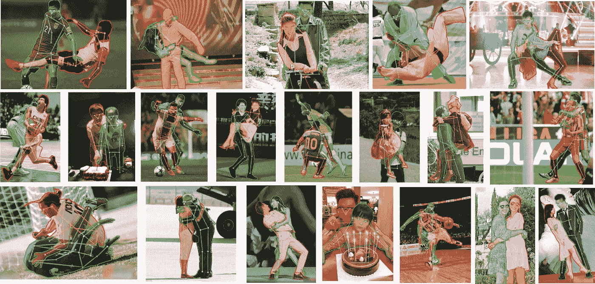
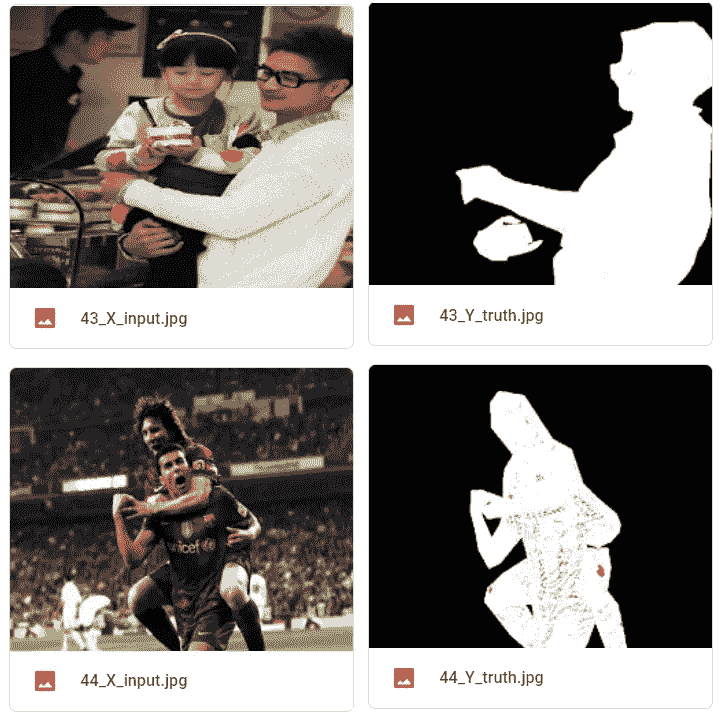
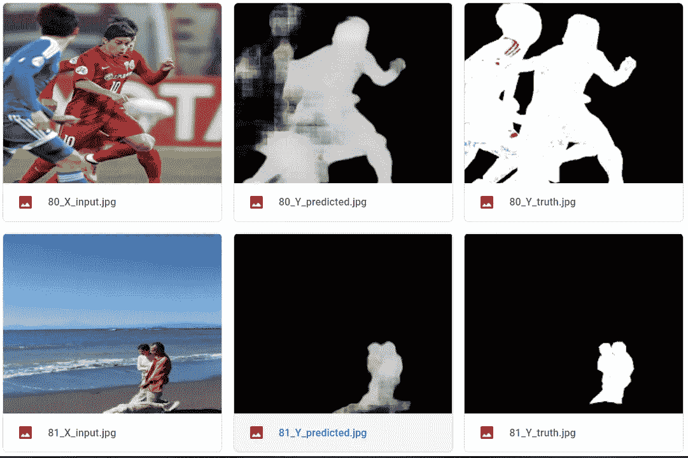
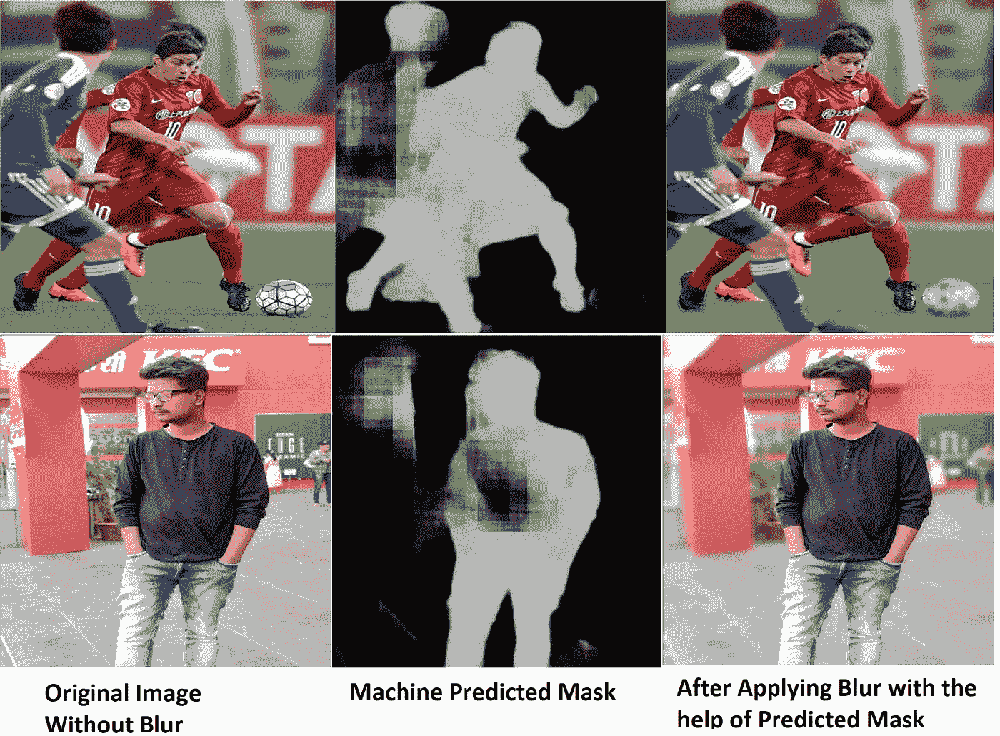
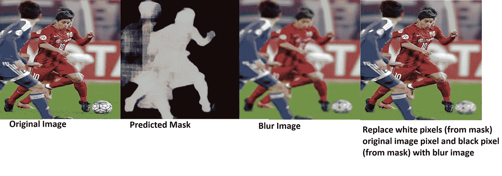

# 通过 Tensorflow 使用机器学习模糊或更改图像背景

> 原文：<https://medium.com/analytics-vidhya/blur-or-change-background-of-images-using-machine-learning-with-tensorflow-f7dab3ddab6f?source=collection_archive---------6----------------------->

在这篇文章中，我们将讨论如何改变图像的背景或者如何模糊图像的背景。我们将使用 Unet 架构来实现这一目标。

我们有一个名为 [OCHuman](https://cg.cs.tsinghua.edu.cn/dataset/form.html?dataset=ochuman) 的数据集，它为我们提供了**包围盒、人类姿势和实例遮罩**，但这对我们的任务来说还不够，因为它给出了这样的图像

应用注记(标注)后的数据集

我们只想面具(黑色背景和白色人类)作为标签和图像(原始)作为特征。所以我们创建了我们的海关数据集，里面有这样的图片-

自定义数据集

我们将这些图像输入到我们创建的 Unet 模型，该模型应该能够预测类似的面具。

> **如果你想知道我是如何创建这些图像并训练模型的，请阅读这篇 medium 文章:**[https://medium . com/analytics-vid hya/humans-image-segmentation-with-unet-using-tensor flow-keras-FD 6 CB 43 b 06 e 5](/analytics-vidhya/humans-image-segmentation-with-unet-using-tensorflow-keras-fd6cb43b06e5)

*以上这篇文章将向您详细解释关于* ***数据集、训练、代码和理论。***

# 我们使用的 Unet 的架构-

你可以看到我们有可训练的参数:1，941，139。您可以增加可训练参数的数量，这可能有助于您获得更好的准确性。

## 结果-

## 预测-

预言；预测；预告

# 创建模糊或更改背景-

模糊图像

我们已经创建了模糊图像的脚本，让我们谈谈我们是如何做到这一点的。

首先，您需要提供原始图像，然后您需要将此图像传递给模型以预测遮罩。

然后，我们还将原始图像传递给 cv2.blur()函数。

现在，我们总共有三个图像，第一个原始非模糊图像，第二个预测遮罩，和第三个模糊图像。

现在为了得到我们的模糊图像，我们需要用模糊图像像素替换黑色像素(来自蒙版),用原始图像替换白色像素(来自蒙版)。合成图像是模糊背景图像。

同样，当我们替换黑色背景时，你也可以用你自定义的背景图片替换黑色背景。

你可以下载我们的预训练模型，然后运行“start.py”。

你可以从我们的 [GitHub](https://github.com/Dipeshpal/Image-Segmentation-with-Unet-using-Tensorflow-Keras) repo 下载代码和模型。

> ***你可以在我的网站上了解更多:***[***www.dipeshpal.com***](http://www.dipeshpal.com/)
> 
> ***你可以了解我更多:***[***www . dipeshpal . I***](http://www.dipeshpal.in/)***n***
> 
> ***你可以在 YouTube 上看我的科技视频:***[***https://www.youtube.com/DIPESHPAL17***](https://www.youtube.com/DIPESHPAL17)
> 
> ***Linkedin:***[***https://www.linkedin.com/in/dipesh-pal-a34952110/***](https://www.linkedin.com/in/dipesh-pal-a34952110/)
> 
> ***推特:***[***https://twitter.com/dipesh_pal17***](https://twitter.com/dipesh_pal17)
> 
> ***GitHub:***[***https://github.com/Dipeshpal***](https://github.com/Dipeshpal)

1.  **GitHub Code:**[https://GitHub . com/Dipeshpal/Image-Segmentation-with-Unet-using-tensor flow-Keras](https://github.com/Dipeshpal/Image-Segmentation-with-Unet-using-Tensorflow-Keras)(你可以使用这个模块在你的系统上运行，但我会推荐你使用 Google Colab)
2.  **使用 Tensorflow 使用 UNet 完成人体分割教程:**[https://medium . com/analytics-vid hya/humans-image-Segmentation-with-UNet-using-tensor flow-keras-FD 6 CB 43 b 06 e 5](/analytics-vidhya/humans-image-segmentation-with-unet-using-tensorflow-keras-fd6cb43b06e5)