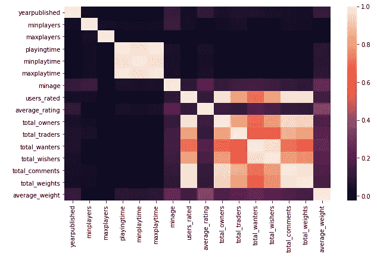

# Python 中基于线性回归和随机森林回归的棋牌游戏评分预测

> 原文：<https://medium.com/analytics-vidhya/board-game-rating-prediction-using-linear-regression-random-forest-regression-in-python-e9a63480090f?source=collection_archive---------4----------------------->


克里斯托夫·保罗·高在 [Unsplash](https://unsplash.com?utm_source=medium&utm_medium=referral) 拍摄的照片

这个机器学习项目是关于预测桌游的评分。数据集“games.csv”可以在这里下载[。](https://github.com/ThaWeatherman/scrapers/tree/master/boardgamegeek)

导入必要的包。

```
**import numpy as np
import pandas as pd
import seaborn as sns
import matplotlib.pyplot as plt
import sklearn
from sklearn.linear_model import LinearRegression
from sklearn.metrics import mean_squared_error
from sklearn import model_selection
from sklearn.model_selection import train_test_split
from sklearn.ensemble import RandomForestRegressor**
```

## **读取数据**

数据被加载到“df”数据帧中。

```
**df = pd.read_csv(‘games.csv’)**
```

## **了解数据**

理解数据很重要，因为我们对数据有一个直观的感觉，检查丢失的值，检查不正确的数据，检查变量之间不正确的关系，这将帮助我们决定必要的预处理步骤。预处理步骤已经确定并用粗线给出。

```
**df.shape** # Displays the shape of 'df'
```

“df”数据帧的形状为(81312，20)，这意味着 81312 个事例和 20 列。

```
**df.head()** # Displays first five rows of ‘df’.
```


图片中无法显示所有列。

```
**df.columns** # Displays column names of ‘df’.
```

列名为['id '，' type '，' name '，' yearpublished '，' minplayers '，' maxplayers '，' playingtime '，' minage '，' users_rated '，' average_rating '，' bayes_average_rating '，' total_owners '，T10，' total_traders '，' total_wanters '，' total_wishers '，' total_comments '，T11，' total_weights '，' average_weight']

目标是预测棋盘游戏的“平均评级”。**列['id '，' name' ]可以删除**，因为它们不会影响“average_rating”。**列“bayes_average_rating”也可以删除**，因为它是使用“average_rating”计算的，不会影响“average_rating”。

```
**df.nunique()** # Displays total number of unique elements in each column.
```


可以观察到,“类型”是唯一具有两个值的分类变量。分类变量是可以取固定数量的值之一的变量。该值可以是数字、字符串或任何其他数据类型。如果它是非数字数据类型，则它是“一个热编码”，因为在机器学习算法的输入/输出中只允许数字数据类型。一个热点编码将在后续文章中介绍。

```
**df[‘type’].unique()** # Prints the unique values in ‘type’ column
```

“类型”列中的两个唯一值是['boardgame '，boardgameexpansion']。这些值似乎不会影响输出“average_rating ”,也没有多大用处。**因此可以删除“类型”列。**

```
**df.describe()** # Displays properties of each column
```


图片中无法显示所有列。

从“count”中可以观察到，并非所有列都有行数= 81312，这表明存在缺失值。但是与行数= 81312 相比，丢失值的数量非常少。**因此，可以删除至少有一个缺失值的所有行。**

> 注意:-如果一列中缺少太多值，则可以删除整列。如果列中有少量缺失值，则只能删除缺失值的行。如果缺失值的数量适中(既不太高也不太低)，则必须对列进行预处理以填充空值，例如用列的平均值替换空值，或者根据列和给定的问题集进行任何其他预处理步骤。

还可以观察到,“users_rated”的最小值是 0，这表明可能存在没有被任何用户评级的棋盘游戏。让我们来看看那些没有被任何用户评级的棋盘游戏。

```
**plt.hist(df[‘users_rated’],range = (0,5))** # Histogram of ‘users_rated’ column.
```


很大一部分桌游的“用户评分”= 0。让我们看看没有被任何用户评级的棋盘游戏的“平均评级”。

```
 **df[df[‘users_rated’] == 0][‘average_rating’].describe()** # Prints the properties of ‘average_rating’ column of board games which were not rated by any of the users.
```


24380 个棋盘游戏没有被任何用户评级。这 24380 个棋盘游戏的“平均评级”的“平均值”和“标准偏差”为 0，这表明**所有未被任何用户评级的棋盘游戏的“平均评级”= 0。**

这是不正确的，因为没有被评级的棋盘游戏不能被归类为差，并且不能被给予“平均评级”= 0。**因此，将删除“users _ rated”= 0 的行。**

另一个观察结果是['maxplayers '，' maxplaytime']为 0。

```
**df[(df[‘maxplayers’] == 0) | (df[‘maxplaytime’] == 0)]** # Displays the rows when either of mentioned variables is 0.
```

有 20675 个这样的情况，其中至少有一个['maxplayers '，' maxplaytime]为 0。这个信息应该是桌游厂商给的。一个预处理步骤是从其他来源抓取数据，并为这 20675 个案例中的每一个替换为['maxplayers '，' maxplaytime']的正确值。但是为了避免复杂性，我们坚持不做预处理。

因为我们在数据帧中有最小值和最大值，所以最好检查所有最大值是否都大于所有最小值。

```
**df[df[‘minplayers’] > df[‘maxplayers’]].count()** # Displays count of rows where ‘minplayers’ > ‘maxplayers’
```

有 4020 种情况下' minplayers' > 'maxplayers '。

```
**df[df[‘minplaytime’] > df[‘maxplaytime’]].count()** # Displays count of rows where ‘minplaytime’ > ‘maxplaytime’
```

有 600 种情况下' minplaytime' > 'maxplaytime '。

由于准备数据时出现错误，最小值大于最大值。对于上述情况，预处理步骤将是**用‘max players’交换‘min players’，用‘max playtime’交换‘min playtime’**。

> 总结:-必要的预处理步骤已经确定。将删除列['id '，' name '，' bayes_average_rating '，' type']。缺少值的行将被删除。' users_rated' = 0 的行将被删除。将对带有' minplayers' > 'maxplayers '和' minplaytime' > 'maxplaytime '的行进行交换。

## **数据预处理**

我们执行“理解数据”一节中确定的预处理步骤。

*1。将删除列['id '，' type '，' name '，' bayes_average_rating']。*

```
**df.drop([‘id’,’type’,’name’,’bayes_average_rating’],axis = 1,inplace = True)**
```

2.*丢失值的行将被删除。*

```
**df.dropna(axis = 0,inplace = True)**
```

3.*将删除' users_rated' = 0 的行。*

```
**df.drop(df[df[‘users_rated’] == 0].index,inplace = True)**
```

4.*将对带有‘min players’>‘max players’和‘min playtime’>‘max playtime’*的行进行交换

```
**a = (df[‘minplayers’] > df[‘maxplayers’])** 
**df.loc[a,[‘minplayers’,’maxplayers’]] = df.loc[a, [‘maxplayers’,’minplayers’]].values****b = (df[‘minplaytime’] > df[‘maxplaytime’])**
**df.loc[b,[‘minplaytime’,’maxplaytime’]] = df.loc[b,[‘maxplaytime’,’minplaytime’]].values**
```

## **可视化数据**

我们检查“df”中变量之间的相关性。相关性是两个随机变量之间的任何统计关系(因果或非因果)，尽管它通常指一对变量线性相关的程度。

```
**plt.figure(figsize = (10,6))** # Adjusting figure size.
**sns.heatmap(df.corr())** # Displays heatmap of correlations between variables in ‘df’.
```



浅色阴影区域高度相关。可以看出,“平均评级”与“minage”、“总次数”和“平均权重”具有较高的相关性。

total_owners '、' total_traders '、' total_wanters '、' total_wishers '、' total_comments '和' total_weights '在它们之间具有良好的相关性，这是可以预期的，因为这些变量中的每一个都与棋盘游戏的需求值成正比。

“游戏时间”、“最小游戏时间”和“最大游戏时间”在它们之间具有良好的相关性，这是预期的，因为这些变量中的每一个都与棋盘游戏的游戏时间相关。

由于“平均评分”与“最低”、“总人数”和“平均体重”具有相对较高的相关性，我们将重点关注这些变量。

```
**sns.set(font_scale = 1.5)**
**sns.pairplot(df[[‘minage’,’average_rating’,’total_wanters’,’average_weight’]],height = 3.5,aspect = 0.9)**
```


在“total_wanters”与“minage”的图表中，可以观察到对于“minage”在 10 到 20 之间的棋盘游戏，“total_wanters”较高。这意味着许多人更喜欢为青少年设计的桌游。

定义了一个名为“new_users_rated”的新列。如果' users_rated' > df['users_rated']，则 new_users_rated' = 1。mean()否则为 0。

```
**df[‘new_users_rated’] = df[‘users_rated’].apply(lambda x: 1 if x>df[‘users_rated’].mean() else 0)
sns.scatterplot(‘average_rating’,’total_wanters’,data = df,hue = ‘new_users_rated’,legend = ‘full’)**
```


对于“平均评分”在 6 到 9 之间的桌游，“用户评分”很高。对于具有大约 8 的“平均评级”的棋盘游戏来说,“总想要者”是高的，这是合理的，因为人们会希望拥有具有高评级的棋盘游戏。

> 单纯以收视率来比较桌游对吗？

在做出决定之前，还必须考虑“用户评级”。可能是高“平均评级”的棋盘游戏的“用户评级”较少，这使得“平均评级”有偏差。

定义了一个名为“new_users_rated”的新列。如果' users_rated' > 5000，new_users_rated' = 1，否则为 0。

```
**df[‘new_users_rated’] = df[‘users_rated’].apply(lambda x: 1 if x>5000 else 0)
sns.scatterplot(‘average_rating’,’users_rated’,data = df,hue = ‘new_users_rated’)**
```


首选棋盘游戏将是橙色点数组中“平均评级”最高的游戏(“用户评级”> 5000)。

## 训练模型

数据集已经过预处理，可以进行训练了。对两种模型进行了比较:-线性回归和随机森林回归。

**线性回归和随机森林回归的比较**

基于交叉验证分数进行比较。给定的训练集被分成 2 个集:“训练集”和“测试集”。使用“训练集”的一部分来训练该模型。交叉验证分数是根据“Train_set”剩余部分中已训练模型的性能计算的。

有各种各样的交叉验证技术，我们将在后面讨论。这里使用了 K 重交叉验证技术。

训练集被分成“训练集”和“测试集”。

```
**X = df.drop(‘average_rating’,1)** # X is input
**y = df[‘average_rating’]** # y is output
**X_train,X_test,y_train,y_test = model_selection.train_test_split(X,y,test_size=0.2)** # Spitting into ‘Train_set’ and ‘Test_set’.
```

计算两个模型的交叉验证分数。

```
**validation_type = model_selection.KFold(n_splits = 10)** # K-Fold cross validation technique is used.
**cross_validation_result1 = model_selection.cross_val_score(LinearRegression(),X_train,y_train,cv = validation_type,scoring = ‘neg_mean_squared_error’)** # Cross validation score of SVC model.
**cross_validation_result2 = model_selection.cross_val_score(RandomForestRegressor(),X_train,y_train,cv = validation_type,scoring = ‘neg_mean_squared_error’)** # Cross validation score of KNN model.
**print(cross_validation_result1.mean(),cross_validation_result2.mean())**
```

线性回归模型的交叉验证得分= -2.094

随机森林回归模型的交叉验证分数= -1.632

上面计算了均方误差的负值。因此，线性回归模型和随机森林回归模型的均方误差分别为 2.094 和 1.632。

随机森林回归模型在给定数据集上的性能预期优于线性回归模型。让我们通过使用“Train_set”进行训练和使用“Test_set”进行测试来验证这一点。

**线性回归模型的性能**

```
**a = LinearRegression().fit(X_train,y_train)** # Fitting the model.
**predictions = a.predict(X_test)** # Test set is predicted.
**print(mean_squared_error(y_test,predictions))** # Mean squared error is calculated.
```

均方差是 2.083

**随机森林回归模型的性能**

```
**b = RandomForestRegressor().fit(X_train,y_train)** # Fitting the model.
**predictions = b.predict(X_test)** # Test set is predicted.
**print(mean_squared_error(y_test,predictions))** # Mean squared error is calculated.
```

均方差是 1.609

正如所料，对于给定的数据集，随机森林回归模型的性能优于线性回归模型。**这是因为桌游数据集非常大，线性回归模型很难用直线拟合数据。**

**使用训练模型进行预测**

经过训练的随机森林回归模型用于预测从数据集中随机选择的 2 个棋盘游戏的“平均评级”。

```
**prediction = b.predict(df.iloc[[42,97]].drop(‘average_rating’,1))
print(prediction)**
```

数据集中第 42 和第 97 个棋盘游戏的预测“平均评级”为[7.793971 7.683359]。

```
**df.iloc[[42,97]][‘average_rating’] # Actual average ratings.**
```

数据集中第 42 和第 97 个棋盘游戏的实际“average_ratings”为[7.86088 7.67833]。

预测的“平均评级”非常接近实际的“平均评级”。随机森林回归模型训练得很好。

快乐阅读！