# 图书推荐模型-机器学习。

> 原文：<https://medium.com/analytics-vidhya/book-recommendation-model-machine-learning-7ea9396399cd?source=collection_archive---------33----------------------->

> **主旨**

使用 Goodreads 数据集背后的基本想法是获得一本书可能具有的多个属性之间的关系的公平想法，例如每本书的总评分、作者多年来的趋势以及多种语言的书籍。随着每一天的流逝，有超过 10 万个评级的书籍变得越来越流行。

我们一直认为书籍似乎具有神奇的人格魅力，有了这款笔记本，我们踏上了一段旅程，看看在这个现代智能设备的时代，什么样的书籍真正促使人们阅读。

有了这么多压倒性的因素，我们将回顾这样的人口统计数据，如书籍可以根据评级推荐吗？这是一个有效的因素吗？

> 使用数据集

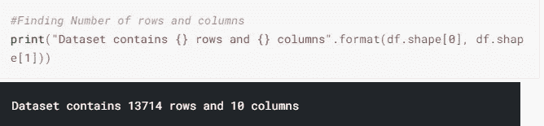

让我们开始旅程，似乎有 J.K .罗琳，主要在这个数据框架的头部。然而，当我们都开始了解并喜爱她时，玛丽也在这里。让我们解决这个问题，只是为了简洁起见，她的书肯定会有很多列表。

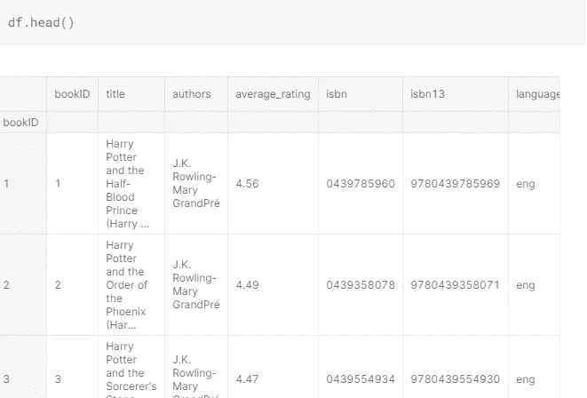

## 列描述:

*   **bookID** 包含每本书/系列的唯一 ID
*   **书名**包含书籍的书名
*   **作者**包含特定书籍的作者
*   由用户决定的图书的平均评分
*   **ISBN** ISBN(10)号，告诉我们关于一本书的信息——比如版本和出版商
*   国际标准书号 13 国际标准书号的新格式，于 2007 年实施。13 位数
*   **language_code** 告知书籍使用的语言
*   **Num_pages** 包含书籍的页数
*   **Ratings_count** 包含该书的评分数
*   T21 统计了用户留下的评论

> 解释性数据分析

列表中出现次数最多的书是哪些？

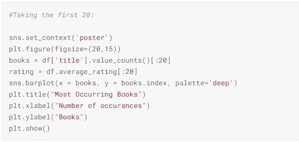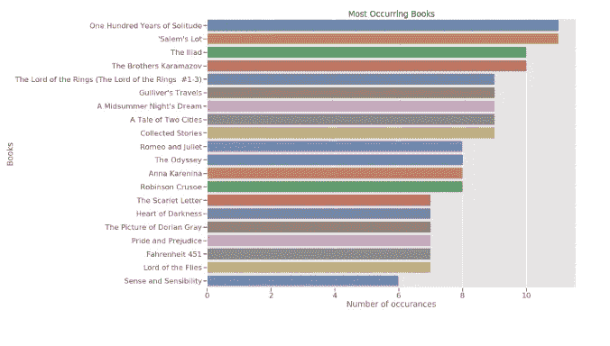

我们可以看到**百年孤独**和**塞勒姆的名单**在数据中同名出现的次数最多。

这些书一次又一次地出现在这个数据库中，有各种不同的出版版本。从列表中，我们可以看到所给图表中的大部分书籍要么是古老的，坚定的经典著作，要么是通常分配给学校的书籍。看起来有些书确实很古老，这些书只是经受住了时间的流逝。

所有语言的图书分布情况如何？

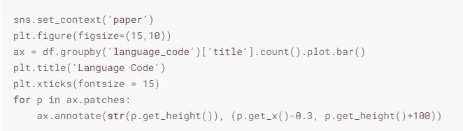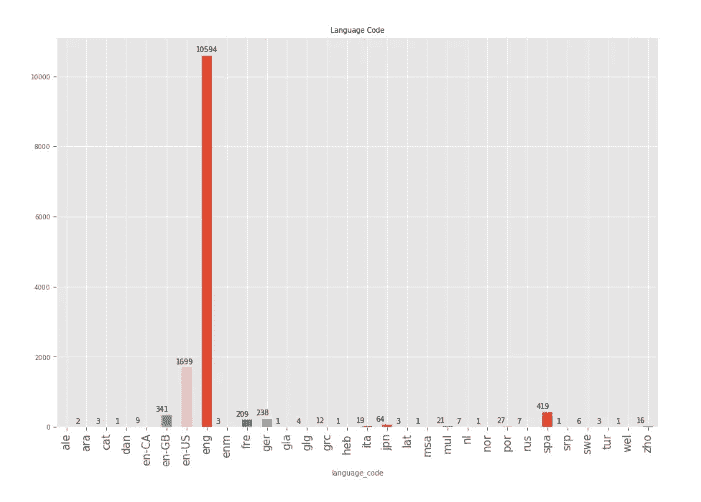

从给定的图表中，我们可以推断出，在给定的数据中，大部分的书是英文版的，还有一些被进一步分为英美版、英国版和英国版。

收视率最高的 10 本书是哪一本？

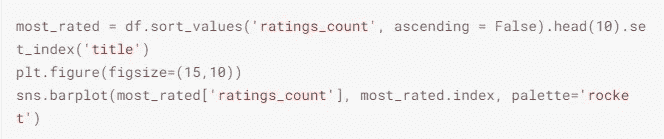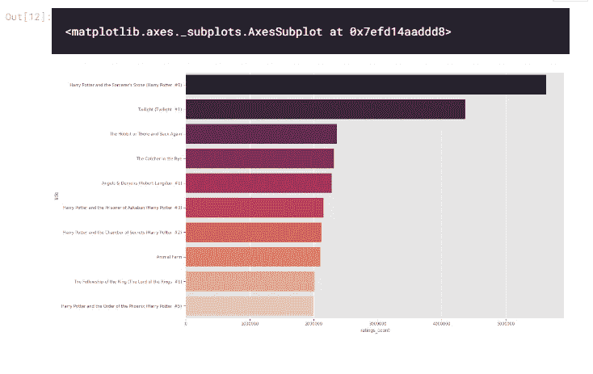

我们可以看到，该系列的开头几本书通常拥有大部分的收视率，即**哈利波特与魔法石**、**、【暮光之城#1** 、**霍比特人**、**天使与魔鬼#1** 。

《哈利·波特》的第一本书以超过 5000000 的收视率独占该版块。事实上，除了《麦田里的守望者》和《动物庄园》等少数几本书之外，所有的书似乎都来自一个系列的书，让我们的头脑中产生这样一种观念，即一旦人们开始阅读，他们中的大多数人似乎都会沉浸在完成它的想法中。

然而，当我们浏览《哈利·波特》的第一和第五本书时，我们也可以注意到，这些书的读者数量/评分存在着荒谬的巨大差距，这表明有些人没有选择该系列的下一本书，或者只找到了第一本触动他们心灵的书，以至于放弃了投票。

哪些是出书最多的作者？

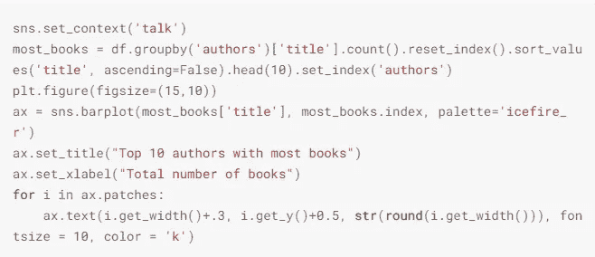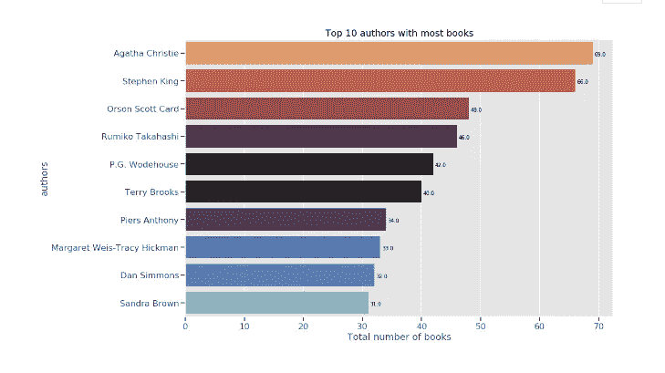

从名单中的名字，我们可以再次收集到，大多数作者要么已经写作了几十年，不时翻出大量的书籍，要么是被誉为我们历史上的“经典”的作者。

看来，炒作确实在其中发挥了作用。

获得作者的整体绩效

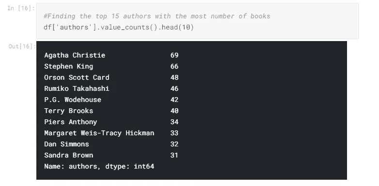

这些书的收视率分布是怎样的？

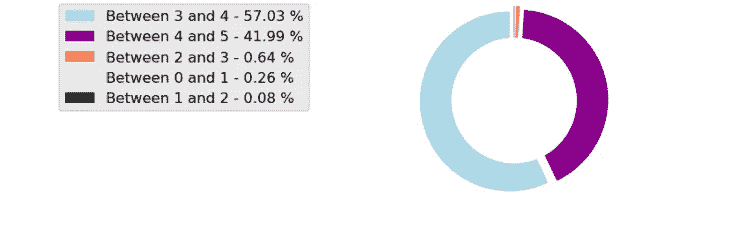

我们可以推断:

*   大多数评级大约在 3.7-4.3 之间。
*   得分接近 5 分的书非常罕见

令人惊讶的是，可以看到 0 到 1 之间的评级在数量上要多得多，这导致了一个结论，即如果一个人确实读了一本书，并最终讨厌它，它仍然会得到大约 2 星的最低评级，这只是因为他们为阅读这本书付出了努力。

图表的峰度似乎正好落在 3 到 4 之间，这意味着阅读它所付出的努力，以及这本书令人激动、爱不释手的性质，大多数评级都在 3 到 4 之间。

评论最高的书有哪些？

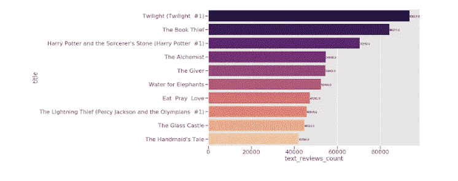

从以上所有的推论中，我们可以从根本上决定，尽管评论很重要，但它们与所有书籍的排名之间不可能有任何特定的关系

我试图在 KMeans 聚类的帮助下找到评级计数和平均评级值之间的关系或分组。

我使用了肘形曲线法，这是寻找数据聚类数的最佳方法

# 推荐引擎

我们可以推断，利用平均评级和评级计数之间的关系，可以产生一些推荐。

以 Ratings_Distribution(一种自己创建的分类趋势)为例，推荐系统采用 K 近邻算法。

基于用户输入的书，与其最近的邻居将被分类为用户可能喜欢的书。

KNN 用于分类和回归问题。在分类问题中，为了预测实例的标签，我们首先基于距离度量找到与给定实例最接近的 k 个实例，并且基于多数投票方案或加权多数投票(越接近的邻居权重越高),我们预测标签。

在这样的设置中，进行无监督学习，推荐相似的邻居。对于给定的列表，如果我要求推荐《麦田里的守望者》，就会出现五本与之相关的书。

基于评级分布创建图书特性表，该表将图书分类为评级等级，例如:

*   介于 0 和 1 之间
*   介于 1 和 2 之间
*   两点到三点之间
*   3 到 4 点之间
*   4 到 5 点之间

概括地说，这些推荐然后考虑所输入的查询的平均评级和评级 cout。

创建特定的函数来帮助查找图书名称:

*   从标题获取索引
*   从部分名称中获取 ID(因为不是每个人都能记住所有的名称)
*   打印要素数据集中的相似书籍。*(这使用来自最近邻居的索引度量来挑选书籍。)*

为了检查系统的工作情况，我尝试了下面的例子。

*   系统名称:麦田里的守望者
*   系统名称:霍比特人
*   系统的部分名称:哈利波特(第五册)

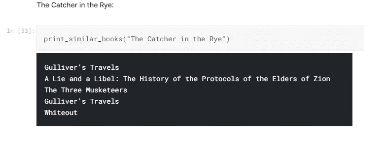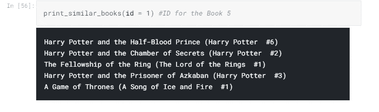

模型做好了！这里是资源库的[链接](https://jovian.ml/jagtapsakshi999/book-recommendation)，这样你就可以试用或参考它。从书籍推荐系统的角度来看，这是一个惊人的项目。