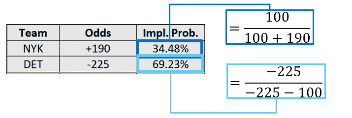

# 博彩经济学:Vigorish & Overround

> 原文：<https://medium.com/analytics-vidhya/bookmaking-economics-8710d25a42a5?source=collection_archive---------5----------------------->

**Vigorish** (或“ **Vig** ”)和 **Overround** 是两个密切相关(但经常被合并)的术语，它们提供了对固定赔率游戏运营商的预期长期盈利能力的洞察。

*   **Vigorish** —从体育博彩的角度来看， **vigorish** 代表从特定市场或事件中赚取的长期预期利润率，以百分比为基础，表示为该市场内每个可用提议的价格或赔率的函数，*假设*以美元为基础，对每个提议下注的风险最小化比例。
*   **过舍入** —过舍入被定义为一个市场内所有可用提议的所有价格或赔率的累计隐含概率。这将(几乎)总是大于 100%的值，并且有时仅用超过 100%的累积隐含概率来表示。

> 从经济角度来看，我们会说体育博彩收取 vig 是为了补偿信息不对称的潜在风险，以及提供流动性。

为了理解这些术语是如何使用的，理解体育博彩如何以及为什么赚钱是有帮助的。为了说明这一点，我们可以用下面一个假设的例子，尼克斯在客场对阵活塞的比赛中得到 5.5 分，还有两个假设的客户，爱丽丝和鲍勃。

爱丽丝将在假设尼克斯会彻底获胜的情况下冒险 100 美元，并希望赢得 190 美元，而鲍勃在假设尼克斯会彻底失败(即活塞会获胜)的情况下冒险 225 美元，并希望赢得 100 美元。因此，房子总共收集了 325 美元。

由于这是一个二元事件，所以只有两种结果(NBA 没有平局)。要么纽约赢了，在这种情况下，爱丽丝可以拿回她最初的 100 美元，加上 190 美元的奖金，剩下的体育博彩利润为 35 美元。或者，纽约赢了，在这种情况下，Bob 拿回了他最初的 225 美元的赌注，加上 100 美元的奖金，体育博彩的利润为 0 美元。

我们一会儿将回到爱丽丝和鲍勃。让我们把重点放在 moneyline 赔率上，创建一个简单的表格，首先将两者转换为隐含概率。这里实际上使用了两个公式，一个适用于赔率比支付的赔率高的团队(通常是最受欢迎的团队)，另一个适用于赔率比支付的赔率高的团队。一般形式如下:

当我们把这些公式应用到尼克斯和活塞的比赛中，我们得到:

我们很快注意到，这些概率加起来大于 100%。正是这个精确的总和(或者，有时，总和减去 100%)超过了 (𝕆)，我们将回到这个问题。首先，我们应该将隐含概率转换为公平概率，只需将每个隐含概率除以隐含概率的总和。

这确保了我们现在有一个合计为 100%的总公平概率，但也假设了房子边缘按比例应用于两个团队。如果出于某种原因，博彩公司对一个队比对另一个队施加了更多的优势，这个计算将产生一个稍微错误的结果。

我们现在从客户 Alice 和 Bob 那里知道了我们希望每个队获胜的概率，以及每种情况下体彩将增加的利润。我们可能希望合计许多体育书籍或模型的隐含获胜概率。有了这个，我们就可以整理出一个期望值表:

这意味着 sportsbook 在这两个客户身上从这一事件或市场(尼克斯对活塞的货币线)中的预期利润是 **$11.64** 。当然，他们不太可能，实际上甚至不可能挣到 11.64 美元。相反，如果成千上万对像爱丽丝和鲍勃一样的人对同一事件下相同的赌注，11.64 美元代表了人们期望体彩从每对顾客身上获得的平均利润。

**vigor ish 和 Overround 的关系**

我们在本文开始时讨论了 vigorish、overround 以及它们之间的关系，现在我们可以更详细地了解它们。解释替代的一种方法如下:

事实证明，在这个过程中，我们实际上可以更早地以百分比为基础计算出预期利润率。为了验证这一点，我们知道我们的预期利润是 11.64 美元，这需要 325 美元的风险。可能会也可能不会让人感到意外

…正如预测的那样。全貌看起来是这样的:

事实证明，vigorish 和 overround 是由两个非常简单的非线性函数联系在一起的。

…其中𝕍表示“vigor ish ”,𝕆表示“overround”。

*注意:这是溢出的定义，假设累积概率之和没有减去 100%。*

如果一个人对操作者设定的𝕍或𝕆水平的回报率的可变性和敏感性感兴趣，蒙特卡洛模拟通常是最好的方法，我们在文章 [**【体育博彩量化建模简介(Excel)**](http://bit.ly/Medium_Intro-to-Quant-Modeling) 中讨论了这一点。