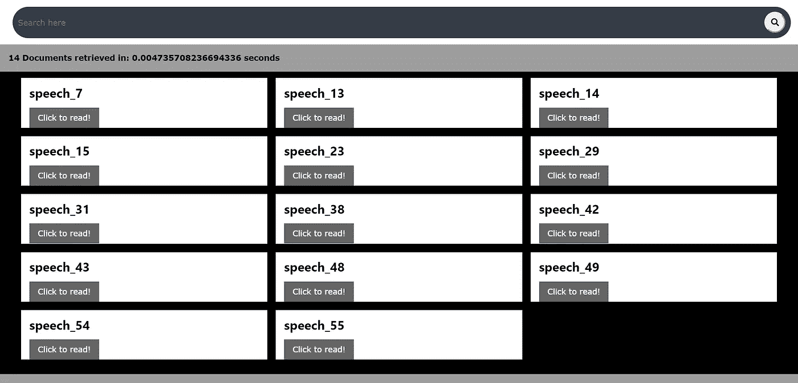
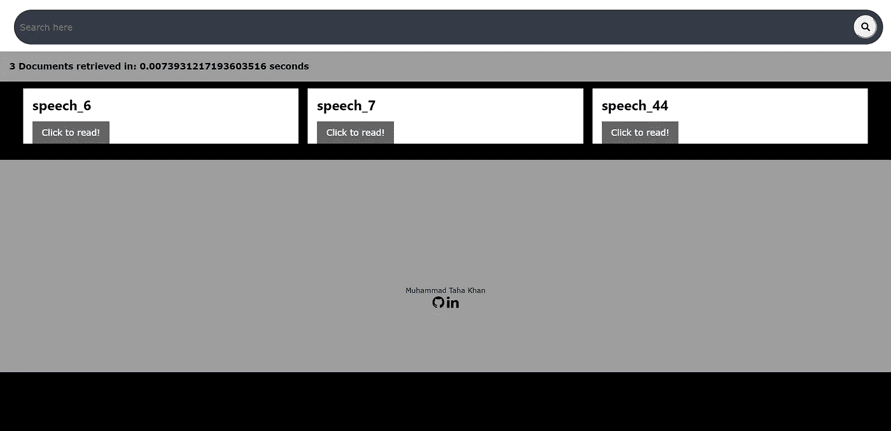
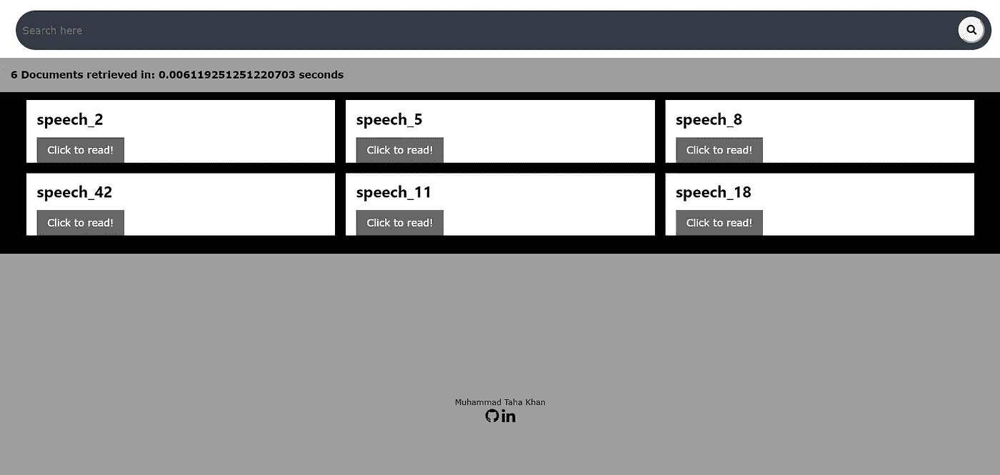

# 使用倒排索引和位置索引的布尔检索模型

> 原文：<https://medium.com/analytics-vidhya/boolean-retrieval-model-using-inverted-index-and-positional-index-2a9782bcec99?source=collection_archive---------3----------------------->


I **信息检索** ( **IR** )是从这些资源的集合中获取与信息需求相关的[信息系统资源的活动。搜索可以基于](https://en.wikipedia.org/wiki/Information_system)[全文](https://en.wikipedia.org/wiki/Full-text_search)或其他基于内容的索引。信息检索是在文档中搜索信息、搜索文档本身以及搜索描述数据的元数据和文本、图像或声音数据库的科学。[1]

(标准)**布尔信息检索(BIR)** 模型是一个经典的[信息检索](https://en.wikipedia.org/wiki/Information_retrieval) (IR)模型，同时也是第一个和最常用的模型。直到今天，许多红外系统都在使用它。 **BIR** 基于[布尔逻辑](https://en.wikipedia.org/wiki/Boolean_logic)和经典[集合论](https://en.wikipedia.org/wiki/Set_theory)，因为要搜索的文档和用户的查询都被视为术语集。检索基于文档是否包含查询术语。[2]

在这篇文章中，我将分享我所面临的困难，以及我实现的布尔信息检索模型的一些概念。

为了对文档进行索引、处理查询和显示查询结果，本文包含以下步骤。

# 布尔模型的 Python 实现！

# **1。收集数据集:**

该模型是在唐纳德·特朗普(Donald Trump)的 [56 场主要演讲(2015 年 6 月—2016 年 11 月)](https://data.world/data-society/major-speeches-by-donald-trump)数据集上开发的。

# 2.**导入库:**

```
import numpy as np
import pandas as pd
from flask import Flask, render_template,request
import time
import re
from collections import defaultdict
from nltk.stem import PorterStemmerstop_words = []
with open ("Stopword-List.txt",'r') as file:
    s=file.read().replace('\n',' ')
stop_words = s.split()ps = PorterStemmer()
```

如上所述，我只使用了 NLTK 库中的波特斯特梅尔模块，而其他预处理和标记化都是手动完成的。这里的 Flask 用于在服务器上部署我们的模型。

# 3.**制作倒排索引:**

```
def inverted_index(stop_words):
 dictionary = {}
 documents = {}

 for i in range(0,56):
 doc_no = i
 with open (“Trump Speechs\Trump Speechs\speech_” + str(doc_no) + “.txt”,’r’) as file:
 next(file)
 s=file.read().replace(‘\n’,’ ‘)

 #cleaning documents
 s = re.sub(‘ ‘, ‘ ‘, s)
 s = re.sub(r”won’t”, “will not”, s)
 s = re.sub(r”can\’t”, “can not”, s)
 s = re.sub(r”n\’t”, “ not”, s)
 s = re.sub(r”\’re”, “ are”, s)
 s = re.sub(r”\’s”, “ is”, s)
 s = re.sub(r”\’d”, “ would”, s)
 s = re.sub(r”\’ll”, “ will”, s)
 s = re.sub(r”\’t”, “ not”, s)
 s = re.sub(r”\’ve”, “ have”, s)
 s = re.sub(r”\’m”, “ am”, s)
 s = re.sub(r’[0–9]+’, ‘’, s)
 s=re.sub(r’[^\w\s]’,’ ‘, s)
 key = ‘speech_’ + str(doc_no)

 documents.setdefault(key,[])
 documents[key].append(s)

 #removing stopwords and lowercase
 s = s.lower()
 s = [words if words not in stop_words else ‘’ for words in s.split(‘ ‘)]
 doc = []
 doc = list(filter(None, s)) 
 stemmed = []

 #stemming
 for i in doc:
 stemmed.append(ps.stem(i))

 #creating posting list
 for x in stemmed:
 key = x
 dictionary.setdefault(key, [])
 dictionary[key].append(doc_no)

 #removing duplicates
 dictionary = {a:list(set(b)) for a, b in dictionary.items()}

 return dictionary,documents
```

在上面的函数中，每个语音文件都被显式地读取、清理、标记化和词干化。为了制作倒排索引词典，将每个单词作为关键字，关键字的值就是文档 id。我们的字典值中有许多重复值，因为一个单词可能在同一文档中出现多次。倒排索引只能用于布尔查询和合取布尔查询。因此，对于短语查询和邻近查询，我们使用位置索引。

# 4.**制作位置索引:**

```
def positional_index(stop_words):

 dictionary = {}
 documents = {}
 for i in range(0,56):
 doc_no = i
 with open (“Trump Speechs\Trump Speechs\speech_” + str(doc_no) + “.txt”,’r’) as file:
 s=file.read().replace(‘\n’,’ ‘)[1:]

 #cleaning documents
 s = re.sub(‘ ‘, ‘ ‘, s)
 s = re.sub(r”won’t”, “will not”, s)
 s = re.sub(r”can\’t”, “can not”, s)
 s = re.sub(r”n\’t”, “ not”, s)
 s = re.sub(r”\’re”, “ are”, s)
 s = re.sub(r”\’s”, “ is”, s)
 s = re.sub(r”\’d”, “ would”, s)
 s = re.sub(r”\’ll”, “ will”, s)
 s = re.sub(r”\’t”, “ not”, s)
 s = re.sub(r”\’ve”, “ have”, s)
 s = re.sub(r”\’m”, “ am”, s)
 s=re.sub(r’[^\w\s]’,’ ‘, s)

 key = ‘speech_’ + str(doc_no)
 documents.setdefault(key,[])
 documents[key].append(s)

 s = s.lower()
 s = s.split(‘ ‘)
 doc = []
 doc = list(filter(None, s)) 
 temp_dict = {}
 stemmed = []

 #stemming
 for i in doc:
 stemmed.append(ps.stem(i))

 #creating positional index posting lists
 a = 0
 for x in stemmed:
 key = x
 temp_dict.setdefault(key, [])
 temp_dict[key].append(a)
 a += 1
 for x in temp_dict:
 if dictionary.get(x):
 dictionary[x][doc_no] = temp_dict.get(x)
 else:
 key = x
 dictionary.setdefault(key, [])
 dictionary[key] = {}
 dictionary[x][doc_no] = temp_dict.get(x)

 return dictionary,documents
```

该函数几乎类似于倒排索引。在这个函数中，我使用了 dict of dict 来存储与文档 id 相对应的单词的位置。在这种情况下，我们不必删除重复项，因为它将被视为该单词在文档中的位置。

# 5.**查询处理:**

*   **布尔查询处理:**

布尔查询属于包含布尔运算符(AND、OR 和 NOT)的类型。简单布尔查询示例:

X 和 Y:表示同时包含 X 和 Y 的文档

X 或 Y:表示包含 X 或 Y 的单据

非 X:表示不含 X 的单据

合取布尔查询示例:

(X 和 Y)或(Y 和 Z):表示既包含 X 和 Y 又包含 Y 和 Z 文档

(X 和 Y)或不包含 Z:表示包含 X 和 Y 的文档或不包含 Z 的文档

首先，用户查询被转换成后缀表达式，以满足简单查询和连接查询。

```
def postfix(infix_tokens):

 #precendence initialization
 precedence = {}
 precedence[‘NOT’] = 3
 precedence[‘AND’] = 2
 precedence[‘OR’] = 1
 precedence[‘(‘] = 0
 precedence[‘)’] = 0output = []
 operator_stack = []

 #creating postfix expression
 for token in infix_tokens:
 if (token == ‘(‘):
 operator_stack.append(token)elif (token == ‘)’):
 operator = operator_stack.pop()
 while operator != ‘(‘:
 output.append(operator)
 operator = operator_stack.pop()

 elif (token in precedence):
 if (operator_stack):
 current_operator = operator_stack[-1]
 while (operator_stack and precedence[current_operator] > precedence[token]):
 output.append(operator_stack.pop())
 if (operator_stack):
 current_operator = operator_stack[-1]operator_stack.append(token)else:
 output.append(token.lower())

 #while staack is not empty appending
 while (operator_stack):
 output.append(operator_stack.pop())
 return output
```

输出被发送到 process_query 函数以计算后缀表达式。

```
def process_query(q,dictionary_inverted):q = q.replace(‘(‘, ‘( ‘)
 q = q.replace(‘)’, ‘ )’)
 q = q.split(‘ ‘)
 query = []for i in q:
 query.append(ps.stem(i))
 for i in range(0,len(query)):
 if ( query[i]== ‘and’ or query[i]== ‘or’ or query[i]== ‘not’):
 query[i] = query[i].upper()
 results_stack = []
 postfix_queue = postfix(query)#evaluating postfix query expression
 for i in postfix_queue:
 if ( i!= ‘AND’ and i!= ‘OR’ and i!= ‘NOT’):
 i = i.replace(‘(‘, ‘ ‘)
 i = i.replace(‘)’, ‘ ‘)
 i = i.lower()
 i = dictionary_inverted.get(i)
 results_stack.append(i)
 elif (i==’AND’):
 a = results_stack.pop()
 b = results_stack.pop()
 results_stack.append(AND_op(a,b))
 elif (i==’OR’):
 a = results_stack.pop()
 b = results_stack.pop()
 results_stack.append(OR_op(a,b))
 elif (i == ‘NOT’):
 a = results_stack.pop()
 print(a)
 results_stack.append(NOT_op(a))

 return results_stack.pop()
```

与、或与非运算功能如下:

```
#AND two posting lists
def AND_op(word1,word2):
 if ((word1) and (word2)):
 return set(word1).intersection(word2)
 else:
 return set()

#OR two posting lists
def OR_op(word1,word2):
 return set(word1).union(word2)

#NOT two posting lists
def NOT_op(a):
tot_docs = list(range(0,56))
return set(tot_docs).symmetric_difference(a)
```

现在我们已经实现了布尔查询处理，我们将转向邻近处理。

*   **邻近查询处理:**

X 和 Y /3 或 X Y /2 类型的查询称为邻近查询。表达式意味着检索分别包含 X 和 Y 以及 3 个单词或 2 个单词的文档。

```
def proximity_query(q,dictionary_positional):

 q = re.sub(r”AND”, “”, q)
 q = re.sub(r” “, “ “, q)
 q = q.split(‘ ‘)
 query = []

 for i in q:
 query.append(ps.stem(i))

 word1 = dictionary_positional.get(query[0])
 word2 = dictionary_positional.get(query[1])
 anding = set(word1).intersection(word2)

 query[2] = re.sub(r”/”, “”, query[2])
 answer = []
 skip = int(query[2]) + 1
 for i in anding:
 pp1 = dictionary_positional.get(query[0])[i]
 pp2 = dictionary_positional.get(query[1])[i]
 plen1 = len(pp1)
 plen2 = len(pp2)
 ii = jj = 0 
 while ii != plen1:
 while jj != plen2:
 if (abs(pp1[ii] — pp2[jj]) == skip):
 answer.append(i)
 elif pp2[jj] > pp1[ii]:
 break 
 jj+=1
 ii+=1
 answer = list(dict.fromkeys(answer))
 return answer
```

在上面的函数中，首先提取单词和跳转号，并获得两个单词的列表。然后对这两个列表进行 and 运算，得到包含这两个单词的文档。然后，迭代两个列表的交集，以检查用户查询中提供的两个单词是否分开。

# 6.结果:

当布尔模型部署在本地服务器上时，会获得以下结果。

登录页面:


主页

输入查询时:未运行



查询结果:未运行

查询输入时间:年后/1



查询结果:年后/1

查询输入时间:过期或(人员和政策)



查询结果:过时或(人员和政策)

# **参考文献:**

[1]:[https://en.wikipedia.org/wiki/Information_retrieval](https://en.wikipedia.org/wiki/Information_retrieval)

[2]:[https://en . Wikipedia . org/wiki/Boolean _ model _ of _ information _ retrieval](https://en.wikipedia.org/wiki/Boolean_model_of_information_retrieval)

其他参考:

 [## 信息检索导论

### 我的书

nlp.stanford.edu](https://nlp.stanford.edu/IR-book/html/htmledition/irbook.html) [](https://www.geeksforgeeks.org/) [## 极客论坛|极客的计算机科学门户

### 极客的计算机科学门户。它包含写得很好，很好的思想和很好的解释计算机科学和…

www.geeksforgeeks.org](https://www.geeksforgeeks.org/) [](https://stackoverflow.com/) [## 堆栈溢出-开发者学习、分享和建立职业生涯的地方

### 我们开发产品，增强开发人员的能力，并为他们提供解决方案，帮助他们提高生产力、促进发展和…

stackoverflow.com](https://stackoverflow.com/) 

**完整代码可以在我的** [**github**](https://github.com/mtk12/IR-Boolean-retrieval-model) **资源库找到。**

**如果这篇文章对你有帮助，请点赞并与他人分享。欢迎在下面的评论中写下你的建议！**

**谢谢！！！**