# 如何提升你在排行榜上的位置？

> 原文：<https://medium.com/analytics-vidhya/boost-your-position-on-leaderboard-kaggle-how-9c1f1a5d4663?source=collection_archive---------25----------------------->

# **使用 XGBoost**

极端梯度推进算法是集成机器学习技术中最有效的算法之一。它是在 2015 年由 **Tianqui Chen** 推出的，从那时起，它就因其预测性能和处理速度而成为机器学习黑客马拉松和竞赛的宠儿。它可用于监督学习任务，如回归、分类和排序。在本文中，我们将通过分解成以下内容来尝试理解它是如何工作的:

升压|梯度升压|极端梯度升压

**这一切都始于助推…**

Boosting(原称*假设 boosting* )属于**集成学习**，符合 [***众智***](https://en.wikipedia.org/wiki/The_Wisdom_of_Crowds) ***。***

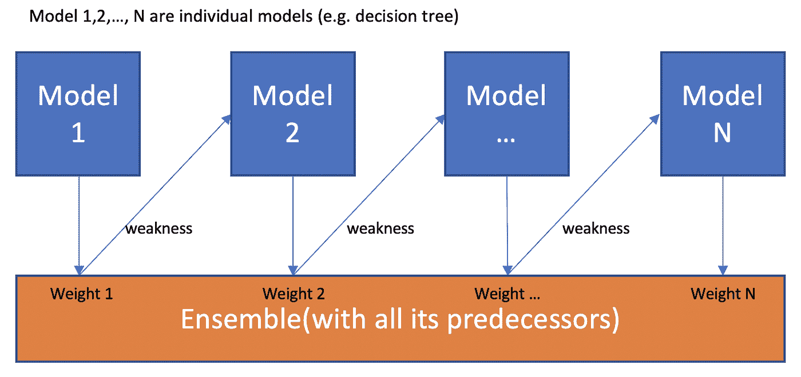

来源:互联网。

**梯度推进**

它被称为梯度提升，因为它采用[梯度下降](https://ml-cheatsheet.readthedocs.io/en/latest/gradient_descent.html)算法来**最小化添加新模型时的损失函数**。但是，它受到一次创建一个弱学习器(决策树)的限制，这使得该模型的计算成本很高，因为它是一个连续的过程。

为了克服这一点—

**极限梯度推进**问世，其设计具有以下特点。

1.  它通过并行创建提升树来支持*并行化*。
2.  它实现了*分布式计算*方法，用于评估任何大型和复杂的模块/数据集。
3.  它支持*正则化。*
4.  缓存优化。

现在，让我们试着去理解它

正如我们所知，监督机器学习模型往往会找到最适合训练数据 x ***i*** &标签 y ***i*** 的参数(θ)，为了训练模型，我们需要定义目标函数来衡量模型与训练数据的拟合程度。

任何监督机器学习算法的目标函数的显著特征是——它由两部分组成——**损失函数和正则项**

obj(ө)=l(ө)+ω(ө)

l(ө)=[损失函数](https://en.wikipedia.org/wiki/Loss_function) —训练损失衡量模型对训练数据的拟合程度。

ω(ө)=[正则化(数学)](https://en.wikipedia.org/wiki/Regularization_(mathematics)) —衡量模型的复杂程度。

**树木——(我们在学什么？)**

XGBoost 主要选择决策树集成模型，该模型主要包括分类树和回归树，具体取决于目标变量是连续变量还是分类变量。

这里有一个简单的购物车示例，它对某人是否喜欢一个假设的电脑游戏 X 进行分类，每个叶子值只包含一个分数。

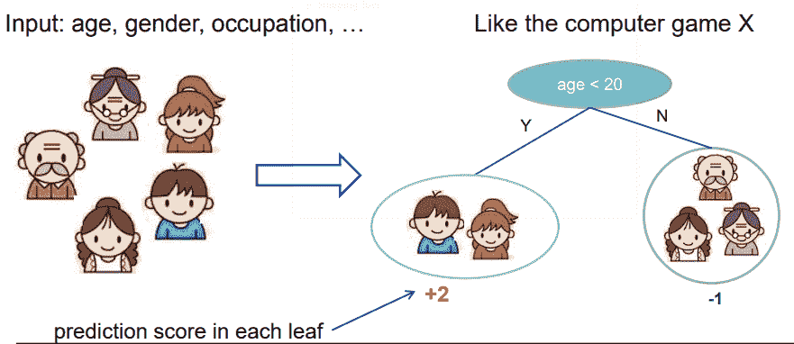

决策树集成:

大多数情况下，单个树不足以在数据集上提供更好的结果，因此我们构建多个树并将它们的预测相加。

这里有一个例子:

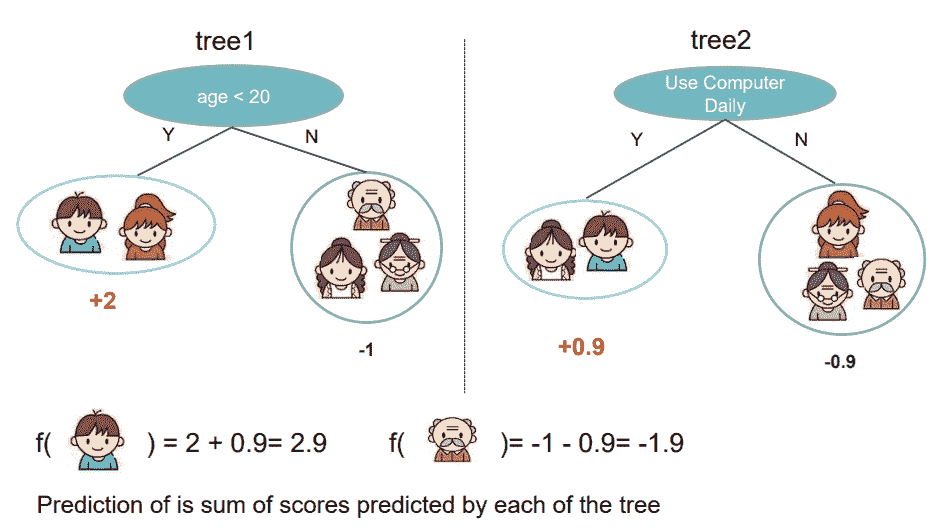

数学上，一般树模型可以表示为:

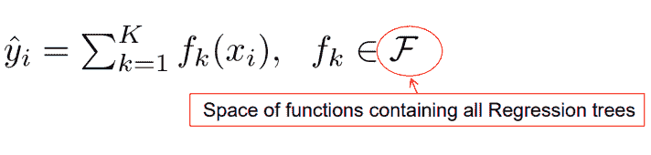

其中 K =树的数量，当我们处理监督问题时，我们的目标函数可以写成:

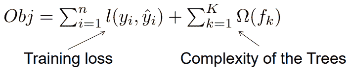

定义ω的可能方法？

1.  树中的节点数或深度
2.  叶权的 L2 范数

这定义了学习什么(目标和模型)，但现在来了一个非常重要的问题，即**如何学习？**

**解决方案** : **加法训练(助推)**

理解起来非常简单，其工作方式与它的名字所暗示的一样——从常量预测开始，每次都不断添加新的函数。

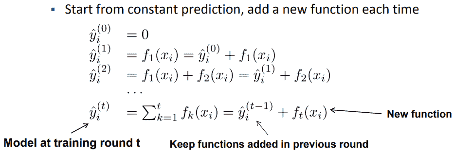

现在一个新的问题出现了，即如何决定添加哪个 **f** ？答案很简单:只要优化目标！！

对于优化，如果我们考虑均方误差(MSE)作为我们的损失函数，目标变成:

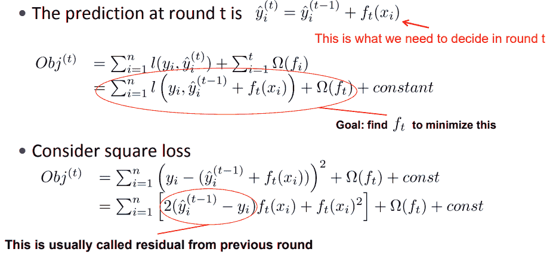

极端梯度推进对回归和分类都使用二阶泰勒展开。泰勒近似的天才之处在于将它分成相对简单的部分。

目标函数的泰勒展开式是:

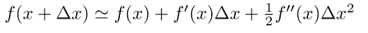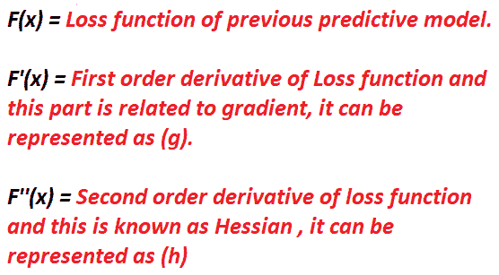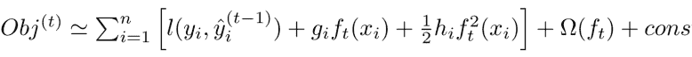

在我们移除所有常数之后，步骤 t 处的特定目标函数变成:

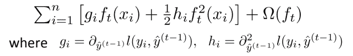

这成为我们对新树的优化目标。这个定义的一个重要优点是目标函数值只取决于 gi 和 hi。

上面讨论的部分为我们提供了 XGBoost 如何拟合训练数据以及如何进行预测的概念。

现在，让我们考虑另一个重要部分，即**优化。**

现在不用深入研究数学，xgboost 的正则化可以写成:

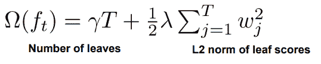

术语𝛀 惩罚了模型的复杂性。附加项有助于平滑最终学习的权重以避免过拟合，当𝛀 = 0 时，目标退回到传统的梯度树提升。

实际上不可能枚举所有可能的树结构，所以采用贪婪算法方法。

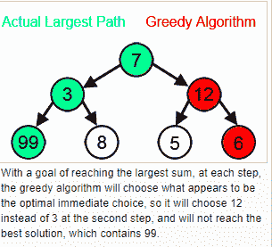

来源:维基百科

啊！我们已经走过了漫长的道路，现在让我们总结一下 XGBoost。

*   在每次迭代中添加一个新的树。
*   在每次迭代开始时，计算 gi 和 hi。
*   利用贪婪算法来生长一棵树。
*   向模型中添加一棵树。

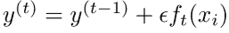

其中，∊是一个步长或收缩量，以防止过度拟合。

以上就是我对 XGBoost 的看法。如果你有任何改进它的建议或者想要增加一些东西，请随时给我发消息到这个 twitter 账号 **@DSsakshi。**

**免责声明:**

这个东西的灵感来自 https://xgboost.readthedocs.io/en/latest/的