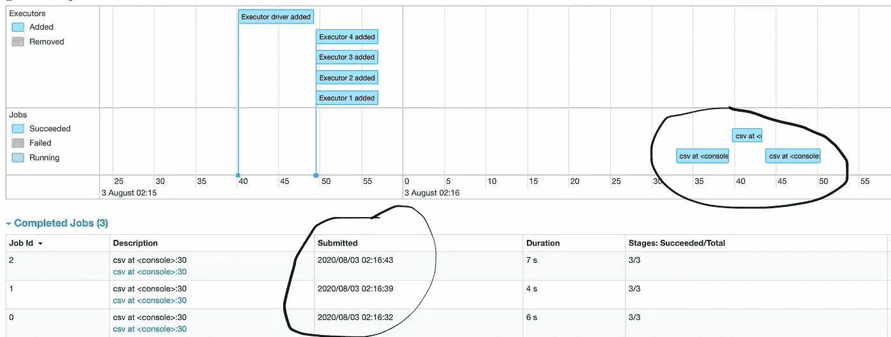
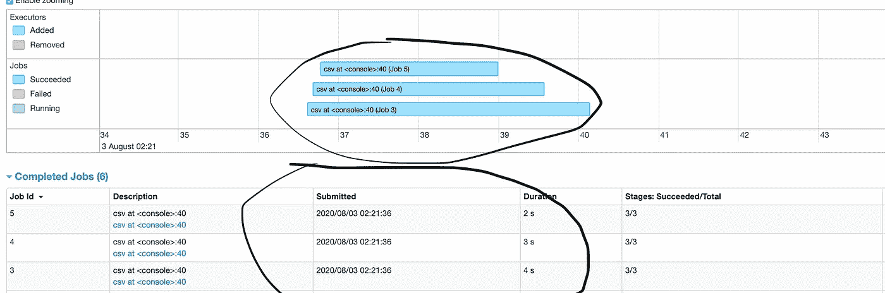

# 通过运行多个并行作业提升 Apache Spark 应用程序

> 原文：<https://medium.com/analytics-vidhya/boosting-apache-spark-application-by-running-multiple-parallel-jobs-25d13ee7d2a6?source=collection_archive---------0----------------------->


安东尼·拉奥在 [Unsplash](https://unsplash.com/s/photos/fire-booster?utm_source=unsplash&utm_medium=referral&utm_content=creditCopyText) 上的照片

T 从这篇文章的标题中，您可能会想到一个问题，Apache Spark 已经并行执行数据处理了，它有什么新功能吗？如果是这样的话，请允许我给出一个关于 spark job 的想法——它是一个并行计算，一旦在应用程序中调用 spark 操作，就会创建一个并行计算。除此之外，一个众所周知的事实是，默认情况下，Apache Spark 在每个执行器之间运行多个任务来实现并行性，然而，在作业级别却不是这样。换句话说，一旦一个 spark 动作被调用，一个 spark 作业就出现了，它由一个或多个阶段组成，并且这些阶段被进一步分解成多个任务，这些任务由执行者并行处理。因此，Spark 一次并行运行多个任务，而不是多个作业。

**警告:这并不意味着 spark 不能运行并发作业。**

通过这篇文章，我们将探索如何通过一次运行多个作业(spark 动作)来提高默认 spark 应用程序的性能。我还会分享一些 spark UI 片段，这些片段表明**对于相同的工作量，Spark 应用程序并发作业所用的时间只有默认 Spark 应用程序的四分之一。**

*注意:在本文中，我可能用“工作”一词来表示“火花行动”*

根据我的个人经验，我观察到一些提取应用程序包含这样的动作或作业，它们彼此之间没有任何关系，它们是完全独立的 Dag。

用一个简单的例子来说明:

*   我们想要查询 3 个不同的表并保存它们的 CSV 输出。(由于每个查询只涉及一个操作，即“保存”,这意味着在 spark UI 中会产生 3 个作业。)

为了实现上述声明，我们有以下选择。

*   每个查询有不同的 Spark 会话——非常低效和昂贵的想法。
*   相同的 spark 会话，并在循环中执行查询，即 Spark 应用程序的默认特性。
*   相同的 Spark 会话并并行运行查询——与其他两个相比非常高效。让我们继续吧。

通过使用单个 spark 会话运行并发作业，不仅可以最大限度地提高资源利用率，还可以大幅减少应用时间和成本。此外，如果我们有足够的资源，并且这些作业之间没有任何联系，那么在一个循环中或作为不同的 spark 应用程序执行它们是没有意义的。

现在，我们已经了解了我们的目标是什么和为什么，是时候看看我们如何实现它了。

为了实现作业级的并发，我们可以利用 Scala 并发特性，称为[](https://docs.scala-lang.org/overviews/core/futures.html)*。它的 ExecutionContext 负责异步执行计算。*

*在下面的代码中，我们有三个查询和一个名为“ *executeAndSave* ”的函数。我们将这个函数的调用封装在一个 Future 块中，并调用名为“Await.result”的 Future 函数来等待所有查询的结果。这样，我们将能够并行运行多个“保存”作业，并且不要忘记最后关闭 **ExecutionContext** 。*

```
*import scala.concurrent.**ExecutionContext**.Implicits.global
import scala.concurrent.duration.{Duration,MINUTES}
import scala.concurrent.{Await, Future} val pathPrefix="/lake/mutlithreading/"
val queries=Seq("SELECT * FROM ABC|output1","SELECT * FROM    PQR|output2","SELECT * FROM XYZ|output3")
**val futureArray: Array[Future[Unit]] = new Array[Future[Unit]](3)**
var i=0queries.foreach(queryAndPath => {
          val query=queryAndPath.split("\\|")(0)
          val dataPath=pathPrefix+queryAndPath.split("\\|")(1).trim
          **futureArray(i) = Future {
                executeAndSave(query,dataPath)
            }**
              i = i + 1
      })**futureArray.map(s => Await.result(s, Duration(15, MINUTES)))**

def executeAndSave(query:String,dataPath:String)(implicit context: Context):Unit = {
  println(s"$query starts")
  context.spark.sql(query).write.mode("overwrite").parquet(dataPath)
  println(s"$query completes")
    }*
```

> *除了上述解决方案， [**Pavel Filatov**](https://medium.com/u/86ac004e37f9?source=post_page-----25d13ee7d2a6--------------------------------) 在评论中建议，可以通过使用提供隐式并行的[并行集合](https://docs.scala-lang.org/overviews/parallel-collections/overview.html)来使其更加简单。我还认为，这是一种更简单的方法，我们不需要控制底层的并行化细节。下面请看他的[s 解决方案](https://gist.github.com/pavel-filatov/aaea22e304bfdb509866f13034df0d80)。*

*[https://gist . github . com/Pavel-filatov/aaea 22e 304 bfdb 509866 f 13034 df0 d 80](https://gist.github.com/pavel-filatov/aaea22e304bfdb509866f13034df0d80)*

## ***默认 spark 应用与并发 spark 应用之间的持续时间分析***

**

*连续作业的 Spark UI*

*在上面的代码片段中，我们可以看到默认的 spark 应用程序用了 17 秒，而下图所示的带有并发作业的 spark 应用程序只用了 4 秒就完成了同样多的工作。还可以看到，所有三个作业的提交时间是相同的。也可以从事件时间表中确认作业相互重叠的位置。由于**任务 Id 3** 花费了 4 秒，这在其他两个任务中是最长的，因此我们认为这是该任务的总时间。*

**

*并发作业的 Spark UI*

*在大多数情况下，在 spark 应用程序中运行并发作业会带来积极的结果并提升性能，**然而，可能会出现单独 Scala Futures 无法帮助**的情况，这是因为有时一个作业会消耗所有资源，而其他作业必须等到它们获得一部分资源后才能执行。在这种情况下，我们需要配置 Spark 的公平调度，这将确保资源分配给所有触发的作业。我在这里讨论过这个主题——“[Apache Spark:在一个应用程序中的并发作业之间公平地共享](https://towardsdatascience.com/apache-spark-sharing-fairly-between-concurrent-jobs-d1caba6e77c2)*

*希望，这篇帖子对你有所帮助。*

*请在评论中分享你的想法和建议。*