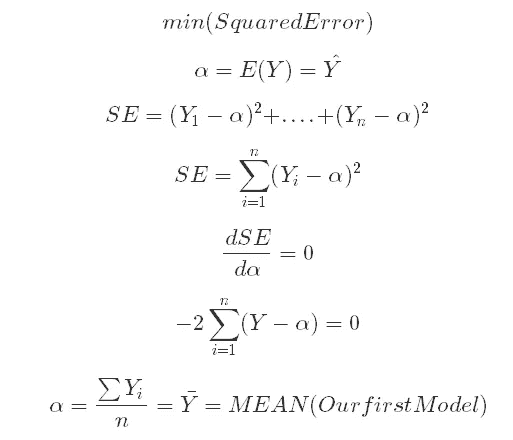
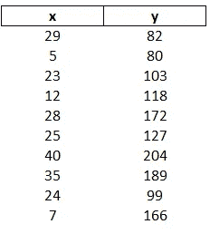
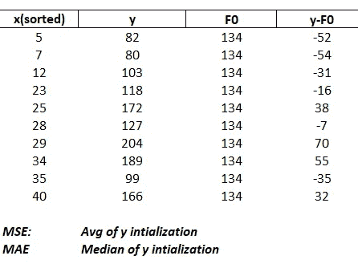
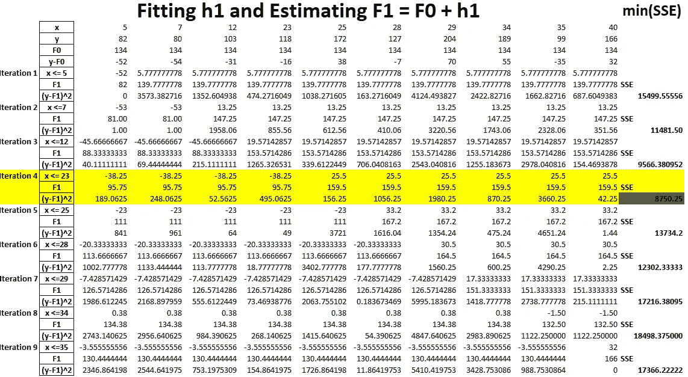
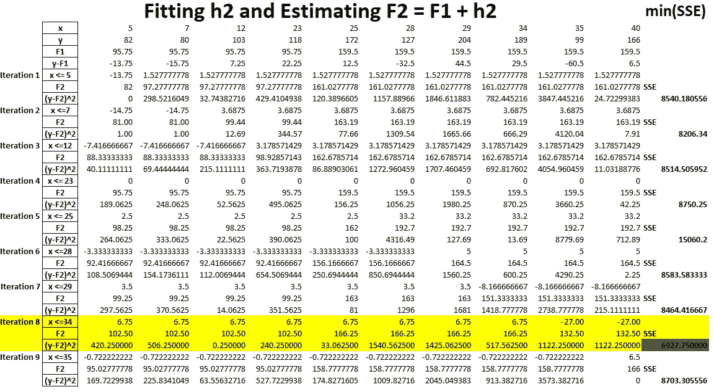
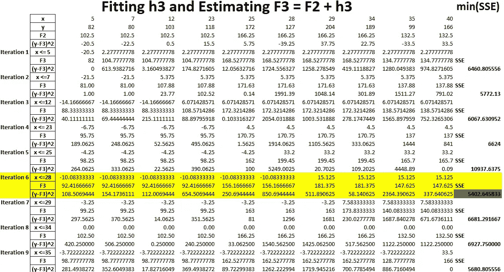
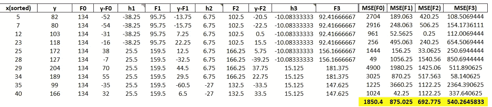
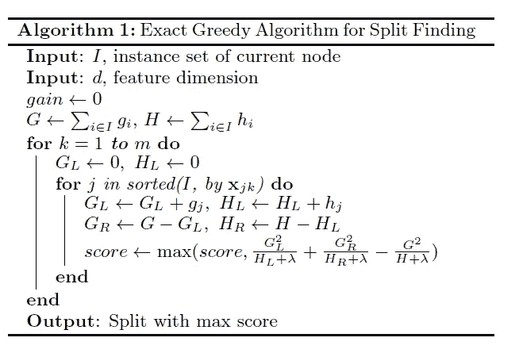

# 集成建模:展开基本的精确贪婪算法

> 原文：<https://medium.com/analytics-vidhya/boosting-models-unwrapping-the-basic-exact-greedy-algorithm-b67d88c7189a?source=collection_archive---------7----------------------->

***~ AI 和机器学习将提高一切事物的标准。现在不关注的会掉队~一个小组成员***

当一个人正在学习如何使用一种新的设备对一个静止的目标发射任何类型的弹药时，他/她会错过击中精确的内部或他/她瞄准的地方。在进行第一次尝试后，这个人走向目标，观察子弹击中的位置，以便用其他因素校准角度，并调整他的第一次尝试。将进行几次尝试，直到射手最终击中目标。进行多次试验的想法是从每一步中学习，并调整前一步产生的误差，直到尽可能精确地击中目标。

这种想法可以用来理解 boosting 背后的数学，boosting 是集成建模技术之一。然而，更重要的是一步一步地深入研究基本的精确贪婪算法，该算法用于在树学习中寻找最佳分裂，例如 boosting 模型。

# 介绍集合模型

集成模型是聚合的简单决策树或基础学习器，有助于控制偏差或方差。三个公认的但不限于合奏模特的家族是:

1.  Bagging:通过并行生成独立的决策树来控制方差。它在训练基础学习者时用替换法采样数据。因此，树重复地适合观察值的自举子集。最终预测是基础学习者的平均输出(回归)或多数投票(分类)。例如，RandomForests。
2.  Boosting:通过构建顺序树来减少前一个树的错误，从而控制偏差。在 boosting 中，特定树的增长会考虑已经增长的其他树，这些树是拟合到前一个模型的残差的可加模型。加法模型在它们之前被添加到原始模型，并且该过程继续进行，直到模型收敛(达到最优解或最低分数，例如均方误差)为止。例如，梯度增强和极限梯度增强(XBoost)。
3.  堆叠:使用不同的模型预测作为新模型中的新特征。

在本文中，我将讨论一个非常简单的框架来理解 boosting 如何使用精确的贪婪算法真正工作。然而，梯度下降(上升)的引入使得具有 n 维数据的推进模型非常复杂。因此，在使用基于任何技术的高级算法之前，理解这些技术的基础是至关重要的。如果从业者不知道模型背后的基础知识，就不应该使用模型。因此，在跳到梯度推进模型或可扩展学习系统(如著名的 XBoost)之前，理解贪婪算法的工作原理是至关重要的。

> 平均是第一个和基线模型！

# 精确贪婪算法

## 第一个模型

在解释精确贪婪算法背后的机制之前，让我们先来看看一个非常重要的模型，叫做平均！

最小化误差目标函数

设α是预测变量 y 的期望值，目标是使α与 y 的实际值的平方和最小。

对 SE 目标函数求微分，目的是使其最小化，这将使我们得出结论，Y(α)的期望值实际上是所有真实 Y 的平均值。因此，平均值是第一个已知的模型，直到优化被引入计算算法，模型变得复杂。

在讨论了第一个模型——平均之后，现在我们将深入讨论精确的贪婪算法。在贪婪算法中，将不断使用平均来寻找最佳分割，这将最小化每次迭代的误差平方和。我将使用 excel 演示该算法，目的是理解它是如何工作的，因为 scikit-learn boosting 模型已经支持该算法，并且用 python 构建 boosting 模型相当简单。

## 该算法

算法不叫贪得无厌！贪婪算法是在树学习中寻找变量之间和每个变量内部的最佳分割的许多技术之一。这个过程是通过枚举每个变量中所有可能的分裂来完成的。根据相对于最优解使用的损失函数(梯度下降、平方误差、绝对误差……)选择最佳分割。最优解将分别是梯度损失函数的最优梯度和平方误差成本函数的最小平方误差和。首先，该算法按升序对连续特征(变量)进行排序，然后查找该变量的每两行之间的分割统计。如果变量有 n 行，则算法枚举 n-1 个拆分。如果数据有 m 个特征，那么我们有(n-1)*m 个分裂。

从这个计算要求很高的过程中截取一小部分，我们观察它在 boosting 模型中是如何工作的。升压模型的步骤是:

1.  如果 MSE 是损失函数，则通过取 Y 变量的平均值来初始化基本模型。如果使用 MAE(平均绝对误差),那么初始模型将是 Y 列的中间值。
2.  计算残差(Y-初始模型预测)
3.  贪婪算法通过寻找给出最低 SSE 的变量的最佳分割来计算第一个加法模型。X 要素中的特定分割用于计算分割前后残差的平均值。
4.  加法模型被添加(拟合)到每一行的残差，以给出新的函数，该函数具有比初始函数更低的 MSE。
5.  该过程继续进行，其中几个其他加性模型被拟合以给出更新的模型，直到损失函数收敛，其中 MSE 不再显著变化。

让我们看一个例子，其中 Y 是一些假设的变量，我们试图使用一个假设的特征 X 来预测 Y。

## 贪婪算法助推应用

初始数据集被呈现给 boosting 模型

x 变量被排序。F0 = avg(Y ),因为损失函数是 MSE。计算残差。

贪婪算法在 x 的行之间计算加法函数 h1。选择具有最低 SSE 的分割来拟合 F0 上的 h1。

计算 F1 的残差(Y-F1)。一个新的附加模型被安装在它们上面。

通过将新的加性模型 h2 添加到先前的 F1 模型，第二次提升函数 F2。贪婪算法在迭代 8 时检测到此处的分裂(即第 8 行和第 9 行之间)。

假设这是最后一步，最好的模型 F3 具有最低的 MSE。流程和之前一样。

该过程可以继续回归新的加法模型，并在推导新的模型之前将它们拟合到函数的残差上，直到 MSE 不再变化。

这是我们在后台使用精确贪婪算法的 boosting 过程的总结。注意每个新模型的 MSE 是如何低于前一个模型的。只要 MSE 不断减小，就可以得到更多的函数，但要小心过度拟合！因此，一些 boosting 引入了正则化来控制拟合，而其他 boosting 则添加了并行学习来加快计算速度，更不用说稀疏感知分裂查找算法了。

对于梯度增强模型，上面讨论的思想可以被推广，其中为每个分裂计算损失函数的梯度，并且在贪婪算法迭代的每一步以指定的学习速率将加性函数拟合到梯度。学习速率可以是自适应的，以便不会错过损失梯度函数的最佳点或最小点。

XBoost 文档:梯度提升中的贪婪算法。g 和 H 分别是损失函数的一阶和二阶梯度统计量。

至于如果 Y 是类别变量，损失函数将是二元交叉熵或二项式偏差损失函数，其中假设模型预测每个类别的概率分布。

# 结论

在为模型提供变量并致力于获得良好的性能之前，理解模型如何工作背后的基础知识是非常重要的。统计模型变得越来越复杂，新的工具被用来处理高维数据集。建模开始使用平均，直到优化被引入，难以可视化的理论目标函数可以通过计算解决，而不是看起来像一个黑箱。因此，在跳到 boosting 之前，人们应该知道树学习是如何构造的，如何找到数据的最佳分割，以及几个算法背后的逻辑，这些算法使模型吐出预测。

如果你想要 excel 表格，请随时在 LinkedIn 上联系我！