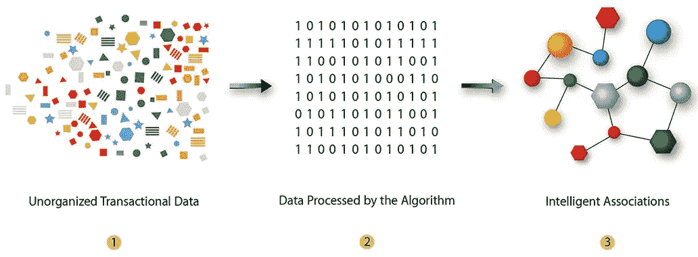

# 使用购物篮分析提升电信营销能力

> 原文：<https://medium.com/analytics-vidhya/boosting-telco-marketing-capabilities-using-market-basket-analysis-1ade1d67a601?source=collection_archive---------1----------------------->

想知道亚马逊/Flipkart/网飞是如何在你购物或看电影之前和之后知道向你推荐什么商品/电影的吗？

诀窍是亲和力分析的一个方面，专门用于促进销售，称为市场篮子分析(MBA)。在 B2C/零售行业，MBA 指的是一种无监督的数据挖掘技术，可以发现…