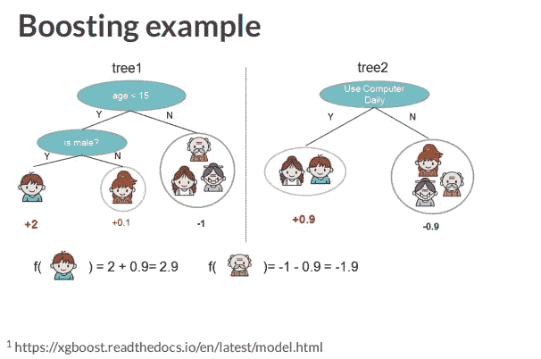
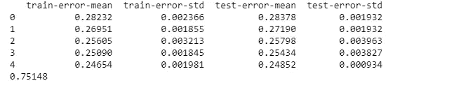

# 使用 XGBoost 提升模型的性能

> 原文：<https://medium.com/analytics-vidhya/boosting-your-model-performance-using-xgboost-80df2b642f60?source=collection_archive---------17----------------------->

初学者指南:XGBoost


由 [SpaceX](https://unsplash.com/@spacex?utm_source=medium&utm_medium=referral) 在 [Unsplash](https://unsplash.com?utm_source=medium&utm_medium=referral) 上拍摄的照片

如果您对 ML 感兴趣已经有一段时间了，那么您可能听说过这个叫做 XGBoost 的梯度增强库，它在 Kaggle 竞赛和黑客马拉松中非常流行，如果没有，请不要担心，我们将详细介绍它。

# 我们要讨论什么？？

1.  什么是 XGBoost
2.  是什么让 makes 比其他 ML 算法更受欢迎？
3.  升压的温和介绍
4.  如何用 XGBoost 实现模型？
5.  使用 XGBoost 进行交叉验证
6.  什么时候使用 XGBoost？

所以现在不浪费任何时间，让我们开始吧！！

# **XGBoost 是什么？**

XGBoost 是一种监督学习和集成算法，它在机器学习领域掀起了一场风暴。它是一个高度优化的梯度增强库，最初是用 C++编写的，但现在它有各种其他语言的 API，包括 Python 和 r。

它是专门为性能和速度设计的梯度推进决策树的实现。此外，它是一个开源软件，旨在提供高度可扩展的、分布式的和快速的梯度增强库。

# 是什么让它比其他 ML 算法更受欢迎？

自从 XGBoost 在 2014 年推出以来，它已经成为许多数据科学黑客马拉松和 Kaggle 比赛中 ML 从业者的首选。

它提供的一致性和速度使得 XGBoost 在其他 ML 算法中脱颖而出。不仅如此:

*   其核心算法用 C++编写，具有并行性
*   它始终胜过单一算法的方法。
*   它是可扩展的，可以用于分布式计算。
*   提供高效的内存使用
*   并在许多 ML 任务中实现了最先进的性能。

这是关于这个库的一些细节，但是你可能想知道这个库是如何实现这种性能的？？

嗯，这种最先进的性能是通过增强组装技术实现的。

# **轻柔的助推介绍**

我们知道 XGBoost 是一种集成学习技术。在后端，这些集成技术使用基础学习器，这些学习器只不过是相同或不同的学习算法(例如:决策树)。因此，集成技术结合了所有这些基本学习算法的预测能力，并给出了表现最佳的单个模型。

Bagging 和 Boosting 是两种集成学习技术，我们的 XGBoost 也是基于这种 Boosting 学习器。Boosting 不是一个特定的机器学习算法，而是一个可以应用于一组机器学习模型的概念，即**【元算法】**

助推转化可能会把弱势学习者转化为强势学习者。强学习者是任何可以被调整以达到良好性能的算法。它在数据子集上迭代学习一组弱学习者，根据每个弱学习者的表现加权每个弱预测。最后，合并所有加权预测，得到最终的单个加权预测。

这里有一个来自 XGBoost 官方文档的例子。



您可以看到，这两棵树都对一个小男孩和一个老人进行了分类，以及他们的相关权重，集成技术只是将两者的权重相加，并提供最终输出，如您在图像中所见。

所有这些关于集合和推进的细节，你可能会被吓到，然后说:

> “空谈是廉价的，给我看代码”

好了，我们开始吧……

# **如何用 XGBoost 实现模型？**

如果你只是想在将 XGBoost 安装到你的系统上之前尝试一下，你可以使用 [google-colab](http://colab.research.google.com/) ，它已经预装了所有的东西。

否则，您可以在 Windows/Linux/mac 上使用 PIP 轻松安装它。

只需在命令提示符/终端中输入以下命令:

```
pip3 install xgboost
```

或者，如果您正在使用 anaconda 发行版运行:

```
conda install -c conda-forge xgboost
```

现在您已经设置好了，我们可以继续编写代码了

我们有关于客户的数据，我们想知道一个客户在 5 个月后是否还会和我们在一起(即客户流失)。

代码:

[https://github.com/dhruvbpatel/xgboost-code](https://github.com/dhruvbpatel/xgboost-code)

在这段代码中，我们首先为我们的任务导入了所有的库，然后我们使用 pandas 读取了我们的数据，并将其作为数据帧存储在 churn_data 中。

之后，我们将数据的特征和目标变量分离出来，分别存储在 X 和 y 数组中。

使用 train_test_split 方法，我们将 X 和 y 数据分成训练和测试数据

完成所有这些后，现在我们正在初始化我们的 xgboost 模型，这里我们使用来自 XGBoost 库的 XGBClassifier 模型。您可以看到函数中有几个参数，第一个是:

1.  目标:它只是指定我们的学习任务，这里使用逻辑回归的二元分类。还有其他几个你可以在这里找到的。
2.  n_estimators:我们想要使用的估计器(我们的决策树基学习器)的数量。

经过这一切，现在我们终于可以用。fit()方法。最后，我们通过在我们的测试数据上进行测试并打印准确性分数来预测我们的模型性能。

运行上面的代码，你可以看到，没有太多的数据预处理和调整参数，我们得到了近 75%的准确性，这是相当可怕的。因此，通过一些调整和预处理，我们肯定可以获得一些很好的结果。

# 使用 XGBoost 进行交叉验证

使用交叉验证是提高模型性能的一种非常好的技术。我们可以使用 xgboost 库来执行已经内置的交叉验证。

你可以在这里找到所有的代码:

https://github.com/dhruvbpatel/xgboost-code

在这里，我们可以看到，我们像之前一样将数据分为要素和目标。你可能想知道的一个新事物是 xgb。DMatrix()方法。正如前面所讨论的，xgboost 非常快并且可伸缩，其背后的原因之一是使用了一个叫做 DMatrix 的特殊矩阵。你可以把它看作是一个数组的高度优化版本。

之前我们没有使用过 DMatrix，但是在后端，当我们在分类器上安装模型时，DMatrix 会自动创建并在其中传递数据。然而，使用 xgboost 的交叉验证，我们需要在这里定义 DMatrix。

在那之后，我们已经定义了我们将使用交叉验证的参数。使用交叉验证就像调用。xgboost 库中的 cv()方法

此外，我们在 cv()方法中定义了许多参数:

*   首先，我们传递我们创建的 DMatrix
*   然后我们传递我们定义的参数
*   指定交叉验证的折叠次数
*   指定增强回合数和计算误差的度量
*   我们指定我们的输出是否是熊猫数据帧
*   指定用于设置 random_state 的种子

打印我们的结果，我们会得到这样的结果:



交叉验证的输出

在这里，我们可以看到每一轮培训中的培训和测试错误。

因此，这样我们可以很容易地使用 xgboost 交叉验证来训练我们的模型。在所有这些阅读之后，您现在可以使用 XGBoost 并根据您的数据对它进行训练，按照您喜欢的方式调整参数。

# **什么时候使用 XGBoost？**

在学习了如何实现 XGBoost 模型之后，您可能想知道我应该什么时候使用它？

通常，您可以在任何需要的地方使用 XGBoost，通过适当的调整，它将继续优于其他 ML 算法。您可以使用 XGBoost:

*   您有大量的训练数据(因为它是可扩展的，并且与分布式计算一起使用),具有超过 1000 个样本(不一定，这只是一个示例)和少于 100 个特征
*   请记住**功能数量<训练数量**
*   此外，当您有分类和数字特征的混合或者只有任何数字特征时，它是合适的

阅读完所有这些内容，您可能会兴奋地尝试自己实现它，但是有些情况下您不应该使用 XGBoost:

*   当你做图像识别的时候
*   自然语言处理/文本数据
*   计算机视觉
*   当**号特征>号训练**

对于上面提到的所有场景，神经网络和深度学习技术会更好，但在任务的其余部分，XGBoost 应该是你的选择。

# 总结:

在本文中，您已经了解了 XGBoost 的一些基础知识，它是如何实现的，以及如何在数据中使用它们。读完这些之后，我真的希望你能使用 XGBoost 训练自己的定制模型，并与大家分享你的经验。

你可以在这里 找到这篇文章[中使用的代码:](https://github.com/dhruvbpatel/xgboost-code)

*感谢阅读！*😊*如果你喜欢，测试一下你能打多少次*👏*再过 5 秒。这对你的手指来说是很好的有氧运动，并且会帮助其他人看到这个故事。*

继续编码，继续探索……..签署 [Dhruv Patel](https://medium.com/u/465db8e4941b?source=post_page-----80df2b642f60--------------------------------)

您可以关注我:

推特:[https://twitter.com/dhruvhimself](https://twitter.com/dhruvhimself)
Github:[https://github.com/dhruvbpatel](https://github.com/dhruvbpatel)
LinkedIn:[https://www.linkedin.com/in/dhruv-patel-1057/](https://www.linkedin.com/in/dhruv-patel-1057/)