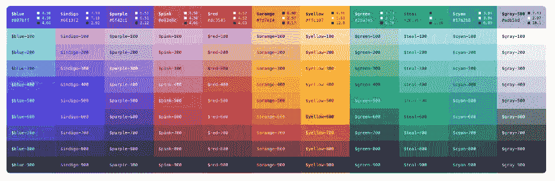
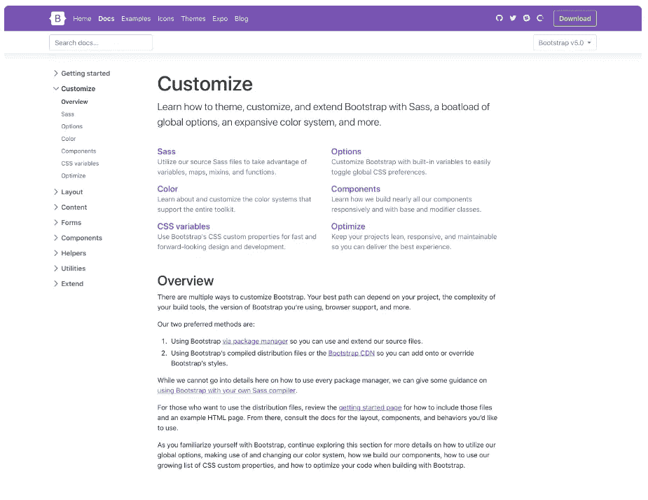
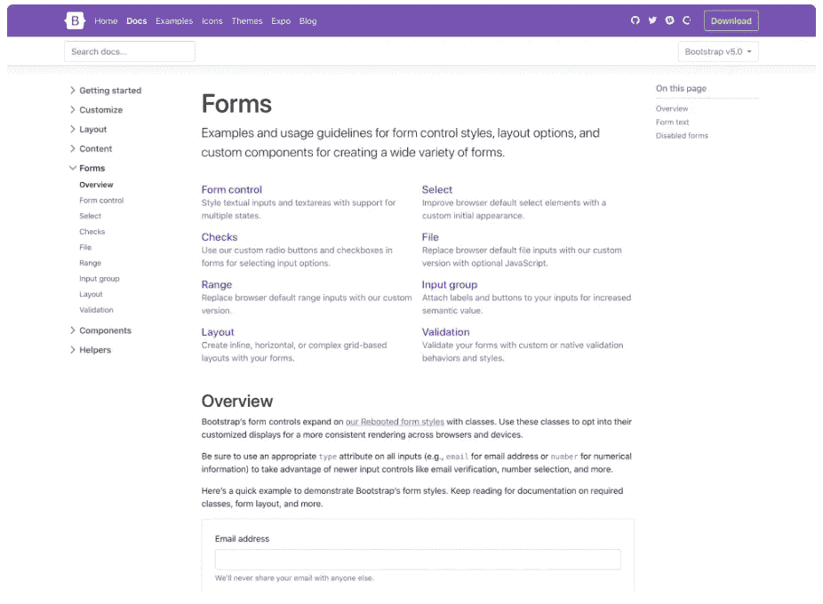

# 自举 5 阿尔法！

> 原文：<https://medium.com/analytics-vidhya/bootstrap-5-alpha-757c4a3a8767?source=collection_archive---------21----------------------->

自举 5 阿尔法！:使用 Bootstrap 构建快速、响应迅速的网站。


> Bootstrap v1.0 于 2011 年 8 月 19 日由 Mark Otto 和 Jacob Thornton 发布，至今已经 9 年了，Bootstrap 在开发人员中越来越受欢迎。随着 Bootstrap v5.0 alpha 的最新发布，它引入了一些非常令人兴奋和有用的特性。让我们看看 Bootstrap v5.0 提供了什么。

# jQuery 和 JavaScript

Obootstrap 经历的一个非常重大的变化是移除了 jquery，并放弃了我们的按钮插件，只使用 HTML 和 CSS 来切换状态。放弃 jquery 的一个重要原因可能是 jQuery 旨在解决的许多问题(DOM 操作、跨浏览器兼容性问题、AJAX、酷炫效果)现在已经以 Javascript 或 CSS 的形式实现为标准，许多开发人员认为 55k 的迷你下载不值得。

# 改进的自定义文档

B ootstrap 5 在定制方面提供了更多的灵活性。他们甚至非常清楚地提到了这一点，并增加了一个新的定制文档部分。v5 的定制文档扩展了 v4 的主题页面，提供了更多的内容和代码片段，用于构建 Bootstrap 的源 Sass 文件。他们甚至提供了一个入门 npm 项目，可以更快更容易地开始。



一个广泛的颜色系统内置 bootstrap 5，具有更多可定制和易于使用的功能。



定制文档部分

# CSS 自定义属性

随着 Bootstrap 5 的推出，人们现在可以使用自定义的 CSS 属性，这要感谢支持这一功能的 internet explorer 的移除。现在，您可以添加更多种类的组件和布局选项。

以我们的`.table`组件为例，我们添加了一些局部变量来简化条纹、悬浮和活动表格样式:

```
.table {
  --bs-table-bg: #{$table-bg};
  --bs-table-accent-bg: transparent;
  --bs-table-striped-color: #{$table-striped-color};
  --bs-table-striped-bg: #{$table-striped-bg};
  --bs-table-active-color: #{$table-active-color};
  --bs-table-active-bg: #{$table-active-bg};
  --bs-table-hover-color: #{$table-hover-color};
  --bs-table-hover-bg: #{$table-hover-bg};// Styles here...
}
```

很快，Sass 和 CSS 自定义属性的强大功能也将在更大的级别上引入，以实现更灵活的系统。

# 更新的表单

ootstrap 5 将所有的表单样式整合到了一个新的表单部分(包括输入组组件),以给予它们应有的重视。



在 v5 中，他们已经完全定制了表单控件——检查、单选、开关、文件等等。如果您熟悉 v4 的表单标记，这对您来说应该不会太遥远。有了一组表单控件，并专注于重新设计现有元素，而不是通过伪元素生成新元素，我们就有了更加一致的外观和感觉。这些新的表单控件都建立在完全语义化的标准表单控件之上——没有多余的标记，只有表单控件和标签。

```
<div class="form-check">
  <input class="form-check-input" type="checkbox" value="" id="flexCheckDefault">
  <label class="form-check-label" for="flexCheckDefault">
    Default checkbox
  </label>
</div><div class="form-check">
  <input class="form-check-input" type="radio" name="flexRadioDefault" id="flexRadioDefault1">
  <label class="form-check-label" for="flexRadioDefault1">
    Default radio
  </label>
</div><div class="form-check form-switch">
  <input class="form-check-input" type="checkbox" id="flexSwitchCheckDefault">
  <label class="form-check-label" for="flexSwitchCheckDefault">Default switch checkbox input</label>
</div>
```

# 增强型网格系统

在中，为了让开发人员更容易在 v4 和 v5 之间切换，bootstrap 保留了大部分构建系统(不包括 jQuery ),他们也构建在现有的网格系统上，而不是用更新更时髦的东西来取代它。

以下是我们网格中的变化概要:

*   我们添加了一个新的网格层！向`xxl`问好。
*   `.gutter`类已经被`.g*`工具取代，就像我们的边距/填充工具一样。我们还为你的网格间距增加了[选项，与你已经熟悉的间距工具相匹配。](https://v5.getbootstrap.com/docs/5.0/layout/gutters/)
*   新的网格系统取代了表单布局选项。
*   添加了垂直间距类别。
*   默认情况下，列不再是`position: relative`。

# 即将推出:RTL、offcanvas 等

还没到时候，一些即将推出的功能已经公布了…

[**RTL 来了！他们已经使用 RTLCSS 设计出了一个 PR，并且还在继续探索逻辑属性。**](https://github.com/twbs/bootstrap/pull/30980)

**我们的 modal 有一个分叉版本，即** [**实现了一个 offcanvas 菜单**](https://github.com/twbs/bootstrap/pull/29017) **。**

他们正在评估我们的代码库的其他一些变化，包括 Sass 模块系统，增加 CSS 自定义属性的使用，在 HTML 中嵌入 SVG 而不是 CSS，等等。

# 开始

**头到**[**https://v5.getbootstrap.com**](https://v5.getbootstrap.com/)**探索新上映。我们也发布了这一更新，作为 npm 的预发布，所以如果你觉得大胆或者对新的东西感到好奇，你可以通过这种方式获得最新版本。**

```
npm i bootstrap@next
```