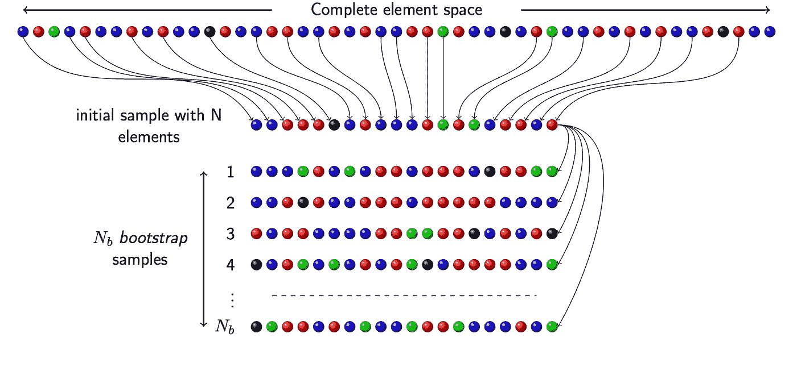

# 自举采样:用 Python 实现

> 原文：<https://medium.com/analytics-vidhya/bootstrap-sampling-an-implementation-with-python-2ab438adc9f6?source=collection_archive---------14----------------------->

Bootstrap 方法是非参数统计中使用的强大技术，也就是说，每当我们从未知的分布规律中获得数据时。

bootstrap 要解决的根本问题是众所周知的统计学问题:我们想要收集关于一个群体的信息，但是我们只得到这个群体的一个样本。我们怎么能…