# 基于机器学习的波士顿房价预测

> 原文：<https://medium.com/analytics-vidhya/boston-house-price-prediction-using-machine-learning-ad3750a866cd?source=collection_archive---------1----------------------->


大家好，我叫**尼维特**。欢迎来到**波士顿房价预测**教程。这是另一个在**媒体**网站上的机器学习博客。我希望你们都喜欢这个博客；好吧，我不想浪费你的时间。让我们准备好投入这一旅程。

到目前为止还不错，今天我们要处理一个数据集，它包含了房子的位置、价格和其他方面的信息，如平方英尺等。当我们处理这类数据时，我们需要了解哪一列对我们来说是重要的，哪一列是不重要的。我们今天的主要目标是建立一个模型，它能根据其他变量给我们一个好的房价预测。我们将对这个数据集使用线性回归，看看它是否能给我们一个好的准确度。

**目录:**

概观

动机

理解问题陈述

关于数据集。

关于中使用的算法

数据收集

数据预处理

探索性数据分析

特征观察

特征选择

模型结构

模特表演

预测和最终得分

输出

**概述**

在这篇博客中，我们将实现一个可扩展的预测房价的模型，使用一些基于数据集中的一些特征的回归技术，这就是所谓的波士顿房价预测。有一些创建模型的处理技术。我们将在接下来的部分中看到它…

**动机**

背后的动机我只是想知道加州的房价，以及我有一个想法要做一些有用的事情在锁定期。我觉得这是做好这个博客的有限动力。

**理解问题陈述**


**问题理解没错！**

房价是经济的一个重要反映，房价范围是买卖双方都非常感兴趣的。请购房者描述他们梦想中的房子，他们可能不会从地下室天花板的高度或靠近东西向铁路开始。但是这个游乐场竞赛的数据集证明，影响价格谈判的远不止卧室的数量或白色栅栏。

**关于数据集**

房价是经济的一个重要反映，房价范围是买卖双方都非常感兴趣的。在这个项目中，房价将在给定解释变量的情况下进行预测，这些解释变量涵盖住宅的许多方面。这个项目的目标是创建一个回归模型，能够准确估计给定特征的房子的价格。

在这个数据集中做出了预测波士顿房价的预测。在这里，我只是分别展示了每所房子的所有功能。比如房间数量，房子所在区域的犯罪率等等。我们将在接下来的部分展示。

**数据概述**

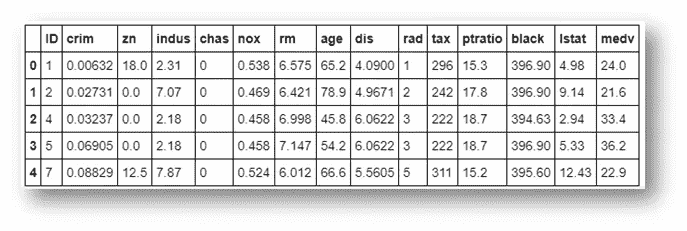

**数据集概述**

1. **CRIM** 各城镇人均犯罪率

2. **ZN** 面积超过 25，000 平方英尺的住宅用地比例

3. **INDUS** 每个城镇非零售商业亩数比例

4. **CHAS** 查尔斯河虚拟变量(= 1 if tract bounds river 否则为 0)

5. **NOX** 氮氧化物浓度(百万分之一)

6.每个住宅的平均房间数

7.1940 年以前建造的自住单位的比例

8.到五个波士顿就业中心的加权距离

9. **RAD** 放射状公路可达性指数

10.**税**每万美元的全价值财产税税率

11.按城镇划分的师生比例

12.**黑人** 1000(Bk — 0.63)其中 Bk 是按城镇划分的黑人比例

13.LSTAT 人口中地位较低的百分比

**关于**中使用的算法

这个项目的主要目的是使用一些回归技术和算法来预测基于特征的房价。

**1。** **线性回归**

**2。** **随机森林回归变量**

**机器学习包用于本项目**

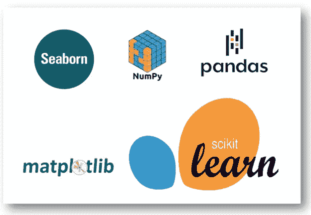

**本项目使用的软件包**

**数据收集**

我从 [Kaggle 得到了数据集。](https://www.kaggle.com/altavish/boston-housing-dataset)该数据集包括几个特征，如房间数量、犯罪率和税收等。让我们了解一下如何将数据集读入 Jupyter 笔记本。您可以从 [Kaggle](https://www.kaggle.com/altavish/boston-housing-dataset) 下载 csv 文件格式的数据集。

此外，我们还可以从 sklearn 数据集获取数据集。没错。它可以在 [sklearn 数据集](https://scikit-learn.org/stable/modules/generated/sklearn.datasets.load_boston.html)中找到。

让我们看看如何从 sklearn 数据集中检索数据集。

```
**from** **sklearn.datasets** **import** load_bostonX, y = load_boston(return_X_y=**True**)
```

**将 CSV 文件中的数据收集到 Jupyter 笔记本中的代码！**

```
*# Import libraries***import** **numpy** **as** **np****import** **pandas** **as** **pd***# Import the dataset*df = pd.read_csv(“train.csv”)df.head()
```


**房价预测数据集**

**数据预处理**

在这个波士顿数据集中，我们不需要清理数据。当我们从 Kaggle 下载时，数据集已经被清理了。为了让您满意，我将显示数据集中空值或缺失值的数量。我们还需要了解数据集的形状。

```
*# Shape of dataset*print(“Shape of Training dataset:”, df.shape)Shape of Training dataset: (333, 15)*# Checking null values for training dataset*df.isnull().sum()
```

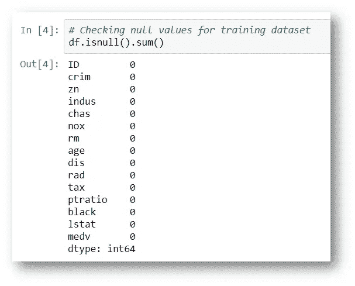

**检查数据集中缺失的值**

**注意:**目标变量是最后一个变量，称为 **medv** 。所以我们不能混淆，所以我只是将特性名 **medv** 重命名为 **Price。**

```
*# Here lets change ‘medv’ column name to ‘Price’*df.rename(columns={‘medv’:’Price’}, inplace=**True**)
```

没错。看特征或列名被改变了！

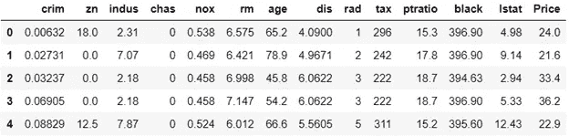

**看最后一列名称被更改。**

**探索性数据分析**

在统计学中，探索性数据分析( ***EDA*** )是一种分析数据集以总结其主要特征的方法，通常采用可视化方法。可以使用或不使用统计模型，但主要是为了查看数据在正式建模或假设检验任务之外能告诉我们什么。

```
*# Information about the dataset features*df.info()
```

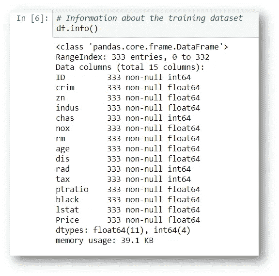

**关于数据集需要了解的事情**

```
*# Describe*df.describe()
```

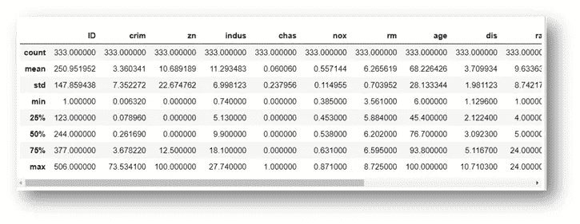

**数据集的描述**

**特征观察**

```
# Finding out the correlation between the featurescorr = df.corr()corr.shape
```

首先理解目标和其他特征之间的相关性

```
# Plotting the heatmap of correlation between featuresplt.figure(figsize=(14,14))sns.heatmap(corr, cbar=False, square= True, fmt=’.2%’, annot=True, cmap=’Greens’)
```

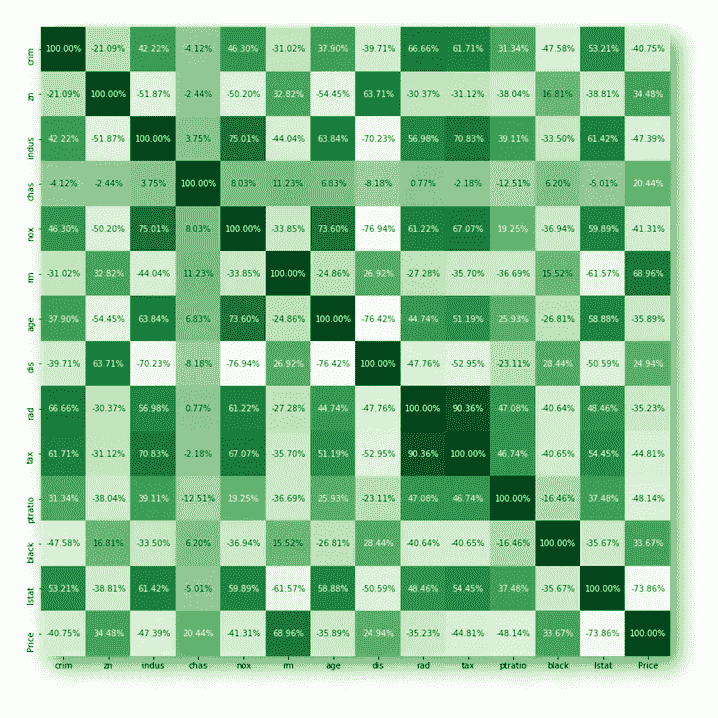

**哇！如此美丽的热图。**

```
*# Checking the null values using heatmap**# There is any null values are occupyed here*sns.heatmap(df.isnull(),yticklabels=**False**,cbar=**False**,cmap=’viridis’)
```

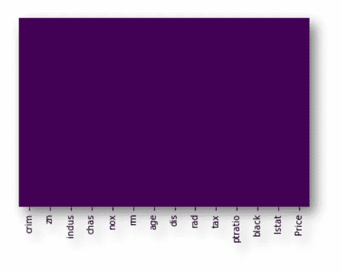

我认为这里没有空值！

**注意:**此处没有空值或缺失值。

```
sns.set_style(‘whitegrid’)sns.countplot(x=’rad’,data=df)
```

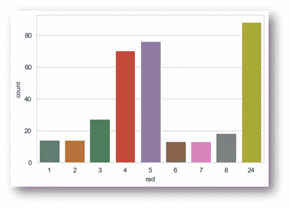

**rad 值的计数**

```
sns.set_style(‘whitegrid’)sns.countplot(x=’chas’,data=df)
```

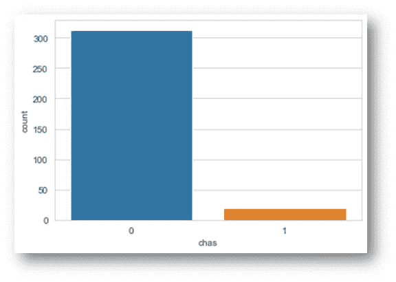

**对底盘特征进行计数**

```
sns.set_style(‘whitegrid’)sns.countplot(x=’chas’,hue=’rad’,data=df,palette=’RdBu_r’)
```

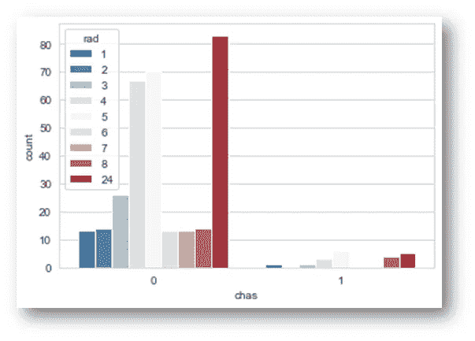

**chas 数据**

```
sns.distplot(df[‘age’].dropna(),kde=**False**,color=’darkred’,bins=40)
```

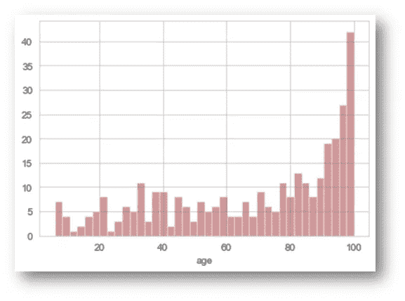

**房屋年龄特征理解**

```
sns.distplot(df[‘crim’].dropna(),kde=**False**,color=’darkorange’,bins=40)
```

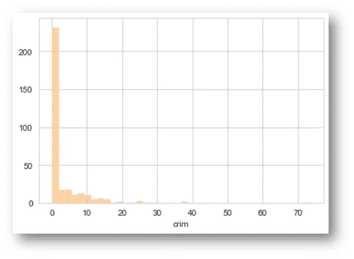

**卷曲率**

```
sns.distplot(df[‘rm’].dropna(),kde=**False**,color=’darkblue’,bins=40)
```

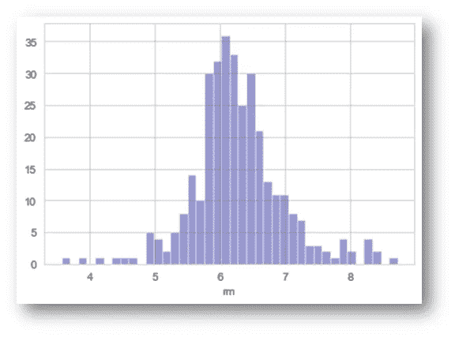

**了解进入房屋的房间数量**

**功能选择**

**特征选择**是您自动或手动**选择那些**特征**的过程，这些特征**对您感兴趣的预测**变量**或输出贡献最大。数据中包含不相关的**特征**会降低模型的准确性，并使模型基于不相关的**特征**进行学习。

```
*# Lets try to understand which are important feature for this dataset***from** **sklearn.feature_selection** **import** SelectKBest**from** **sklearn.feature_selection** **import** chi2X = df.iloc[:,0:13] *#independent columns*y = df.iloc[:,-1] *#target column i.e price range*
```

注意:如果我们想确定目标变量的最佳特性。我们应该确保目标变量应该是 int 值。这就是我把浮点值转换成 int 值的原因

```
y = np.round(df[‘Price’])*#Apply SelectKBest class to extract top 5 best features*bestfeatures = SelectKBest(score_func=chi2, k=5)fit = bestfeatures.fit(X,y)dfscores = pd.DataFrame(fit.scores_)dfcolumns = pd.DataFrame(X.columns)*# Concat two dataframes for better visualization*featureScores = pd.concat([dfcolumns,dfscores],axis=1)featureScores.columns = [‘Specs’,’Score’] *#naming the dataframe columns*featureScores
```

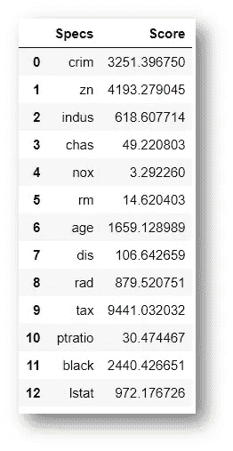

**数据集的所有特征**

`print(featureScores.nlargest(5,’Score’)) *#print 5 best features*`

**指标-规格-** **得分**

9 -税务-9441.032032

1-锌- 4193.279045

0-刑事- 3251.396750

11-黑色-2440.26651

6-年龄-1659.28989

**特征重要性**

```
**from** **sklearn.ensemble** **import** ExtraTreesClassifier**import** **matplotlib.pyplot** **as** **plt**model = ExtraTreesClassifier()model.fit(X,y)
```

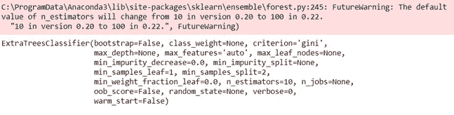

```
print(model.feature_importances_) *#use inbuilt class feature_importances of tree based classifiers*
```

[0.11621392 0.02557494 0.03896227 0.01412571 0.07957026 0.12947365

0.11289525 0.10574315 0.04032395 0.05298918 0.04505287 0.10469546

0.13437938]

```
*# Plot graph of feature importances for better visualization*feat_importances = pd.Series(model.feature_importances_, index=X.columns)feat_importances.nlargest(10).plot(kind=’barh’)plt.show()
```

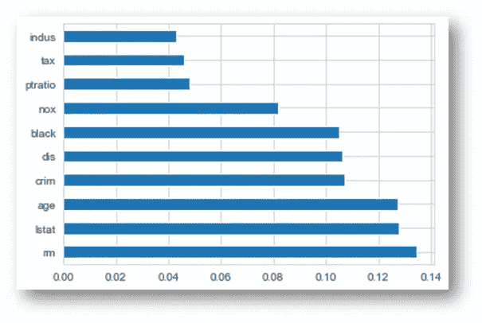

**由目标变量相关性评定的重要特性**

**模型拟合**

**线性回归**

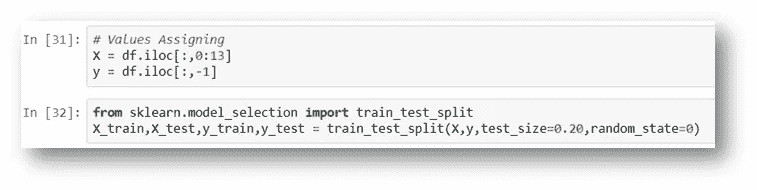

**列车试分裂**

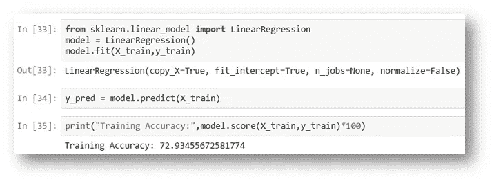

**列车准确率得分预测**

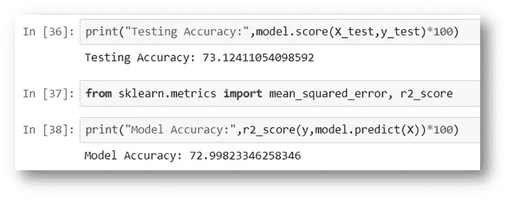

**模型预测**

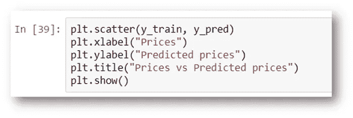

**模型可视化**

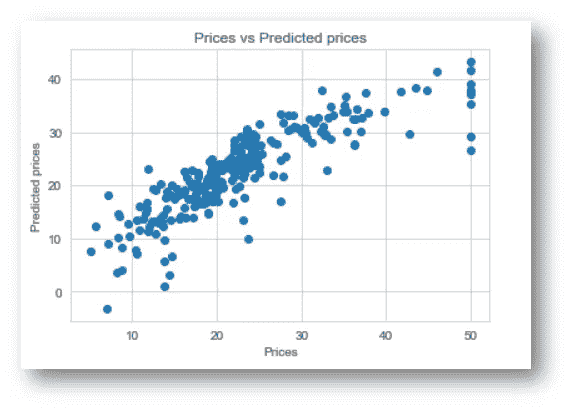

**看到了！如何预测数据点**

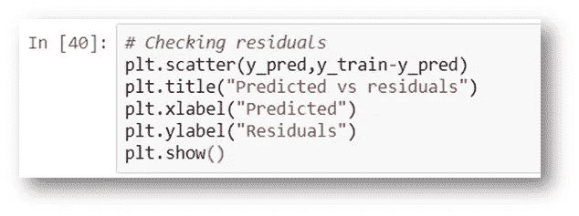

**残差值**

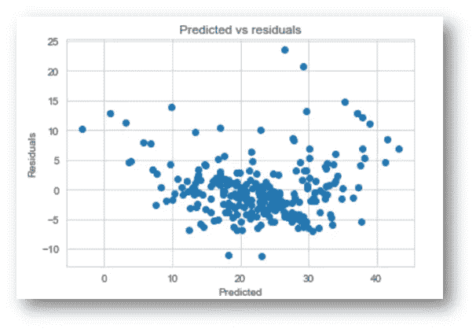

**预测 Vs 残差**

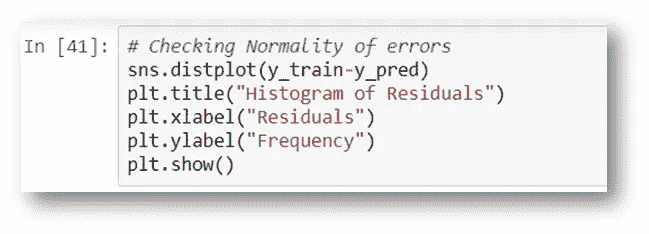

**误差的正态性**

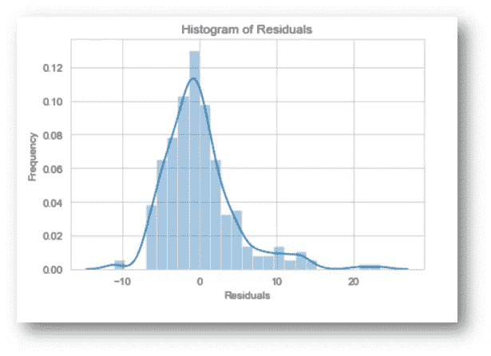

**残差的历史绘图**

**随机森林回归器**

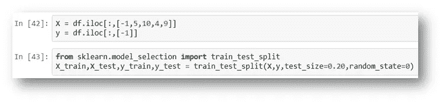

**赋值**

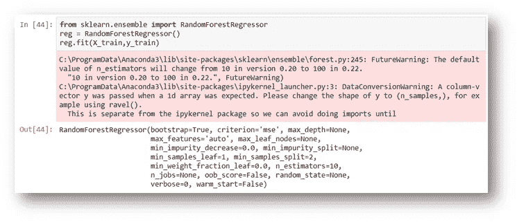

**模型拟合**

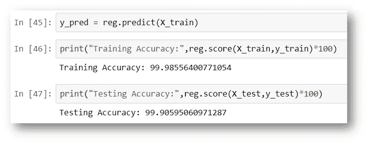

**预测分数**

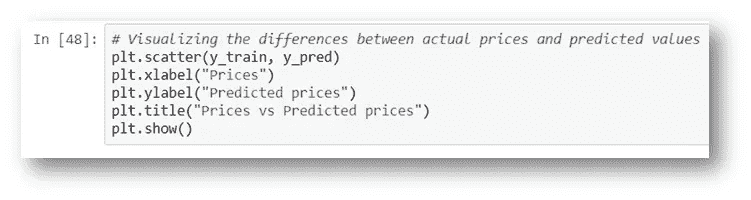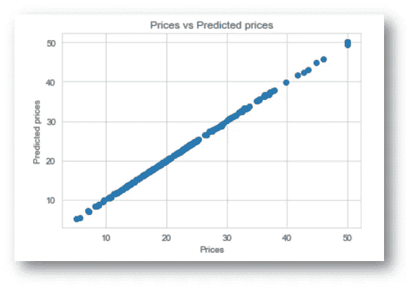

**线性回归绘制数据点**

**预测和最终得分:**

我们终于成功了！！！

**线性回归**

模型得分: **73.1%** 准确率

训练准确率: **72.9%** 准确率

测试精度: **73.1%** 精度

**随机森林回归器**

训练准确率: **99.9%** 准确率。

测试精度: **99.8%** 精度

**输出&结论**


通过探索性的数据分析，我们可以从数据中获得洞察力。每个特征与目标的关系。此外，从三个模型的评价可以看出，随机森林回归比线性回归表现更好。

我希望你们都喜欢这个博客。如果你想在这个博客里说更多，请联系我。我只是想找数据科学实习。我对数据科学领域充满热情。所以如果你想雇我。注意这一点…

**名称:尼维特**

**手机号码:9994268967**

**电子邮件:nivitusfdo007@gmail.com**

你可以用这些联系我。


[领英](https://www.linkedin.com/in/nivitus-fernandez-999a6815b/)


[Github](https://github.com/Nivitus)