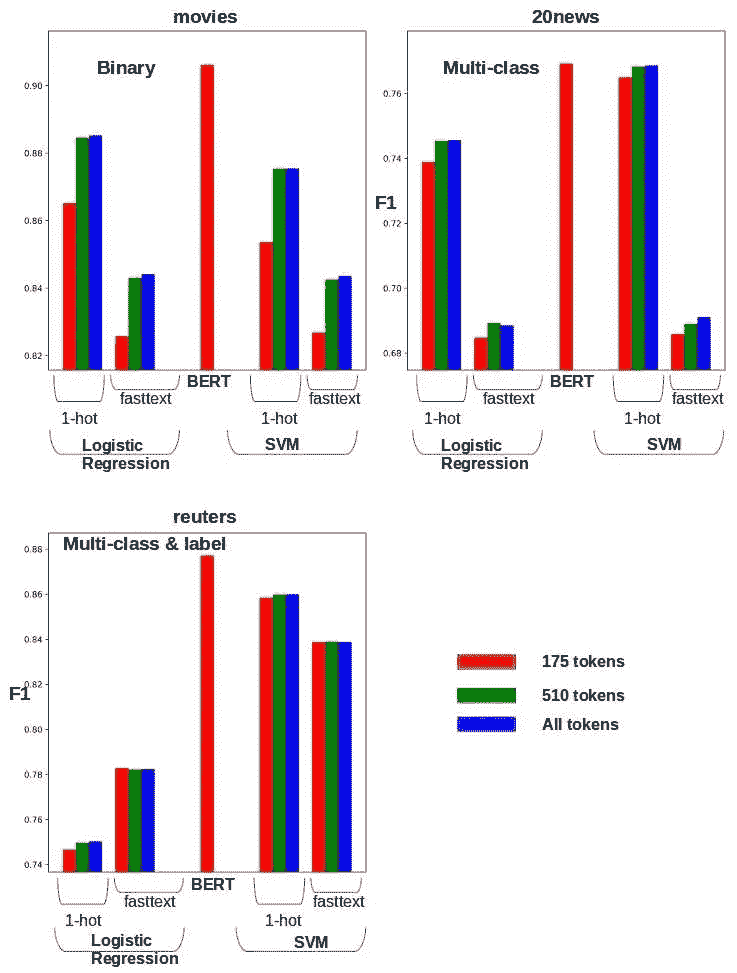
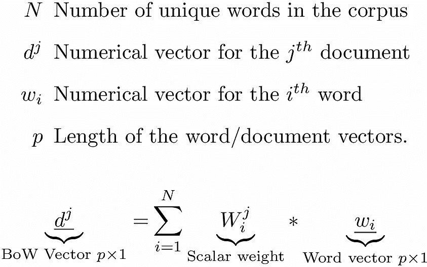
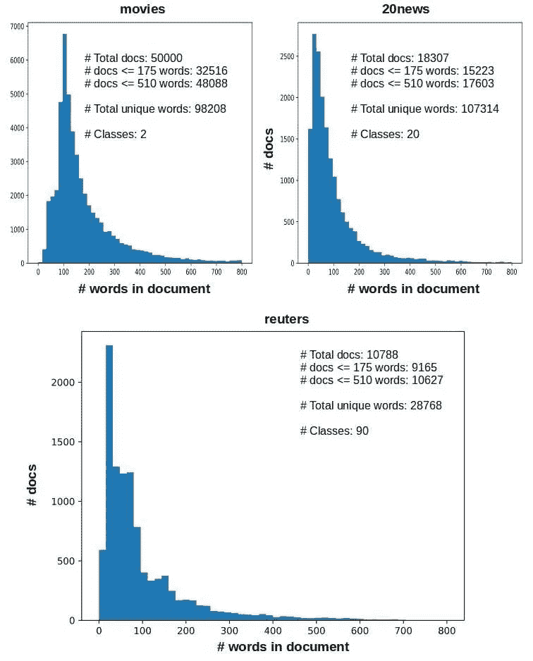
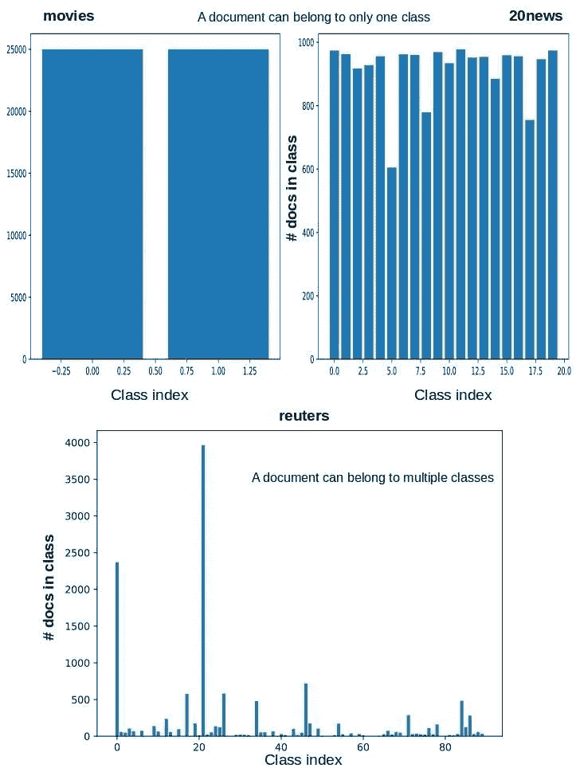
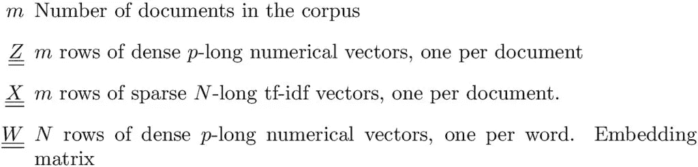
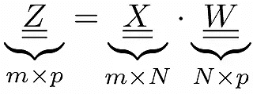
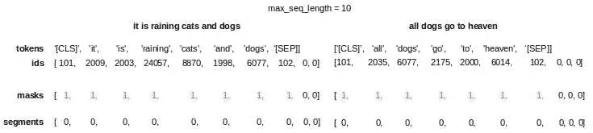
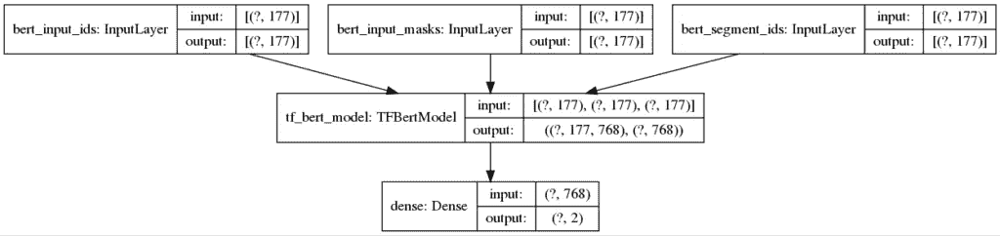
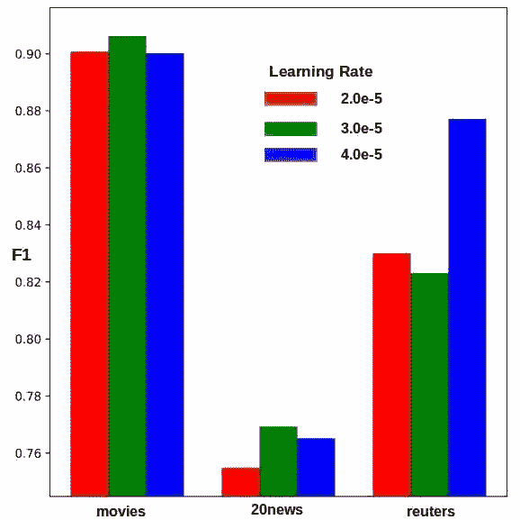

# 向伯特鞠躬:把这个分类！

> 原文：<https://medium.com/analytics-vidhya/bow-vs-bert-classification-1f24ba87240f?source=collection_archive---------4----------------------->



BERT 在代表二元、多类和多标签/类情况的三个不同存储库上产生了最好的 F1 分数。然而，使用 TF-IDF 加权的一个热词向量使用 SVM 进行分类对于使用 BERT 来说是一个不错的选择，因为它很便宜。

机器人在阅读，聊天机器人在聊天，有些甚至显然在写文章。在 NLP 的世界里，现在有很多的嗡嗡声和兴奋。也有很好的理由。计算机正在学习像人一样处理文本和语音。2001 年的 Hal 可能终于来了，虽然晚了几年。开玩笑的是，这些机器人掌握的核心技能之一是对文本/语音进行动态分类，以便它们可以进一步处理。

但是这些年来，给定向量集的分类技术并没有改变多少。1995 年[科尔特斯和瓦普尼克](https://link.springer.com/article/10.1007/BF00994018)的支持向量机(SVM)可能是最后一个重大进步。显然，嗡嗡声来自上游——文本被转换成矢量。通过相同的分类算法，更高质量的输入向量会带来更高的分类精度。如果您的文档向量更忠实地嵌入和反映了文档的含义，这对您有好处！您将从旧的分类器中获得更多的里程。但是谁在上游制造所有这些好的媒介呢？当然不是塞普蒂马教授！


[塞普蒂玛教授矢量](http://jakespot.co.za/septima-vector/)

原来是伯特和他的朋友 ELMO 一伙。在早先的帖子 [BoW to BERT](http://xplordat.com/2019/09/23/bow-to-bert/) 中，我们已经看到了单词 vectors 是如何进化来适应它们所处的环境的。我们观察了同一个单词的两个向量之间的相似性或缺乏相似性，但是在不同的上下文中。

这篇文章的目的是要看看文字向量的灵活性给实际的下游任务——文档分类——带来了什么不同。这里有一个简单的大纲。

1.  以三个不同的文档库为例。来自斯坦福的[电影评论](http://ai.stanford.edu/~amaas/data/sentiment/)(用于二元情感分类)、通过 scikit-learn 的 [20 新闻语料库](https://scikit-learn.org/0.19/datasets/twenty_newsgroups.html#)(用于多类别分类)以及通过 NLTK 的[路透社语料库](https://www.nltk.org/book/ch02.html)(用于多类别&多标签分类)。对每个存储库重复 2 到 4。
2.  使用 1-hot & fastText 单词向量构建 BoW 文档向量。用逻辑回归和 SVM 分类。
3.  微调 BERT 几个时期(这里是 5 个),同时对顶层的分类标记[CLS]中的矢量进行分类
4.  比较在 2 和 3 中获得的(加权)F1 分数。

用 scikit-learn 实现逻辑回归和 SVM。使用 huggingface 的 [transformers](https://github.com/huggingface/transformers) 模块将 BERT 实现为 Tensorflow 2.0 层。让我们开始吧。我们将在这里查看一些代码片段，但是完整的代码可以从 [github](https://github.com/ashokc/BoW-vs-BERT-Classification) 获得。

## 1.用于分类的文档向量

单词包(BoW)是一种从文档中的单词(它们的数字向量是特定的，1-hot，fastText 等)构建文档向量的方法。我们已经在之前的文章中讨论过这个问题。这是我们得到的等式。



等式 1:当 w_i 是 one-hot 时，文档的 BoW 向量是单词向量的加权和，那么 p = N。当从 fastText、Glove 等获得 w_i 时，p << N

BERT can be used to generate word vectors and Equation 1 above *可以用于获得文档向量。但是当分类是下游目的时，BERT 不需要从单词向量构建文档向量。从顶层的“[CLS]”标记射出的向量用作针对特定分类目标微调的代表*文档向量的*。这是一个更小的 BERT 模型的示意图(来自 [Jay Alammar](http://jalammar.github.io/illustrated-bert/) ),它采用了 12 层，1.1 亿个参数，最多 510 个单词序列。这里，用于分类目的的单词嵌入和 CLS 令牌向量的长度为 768。*


图一。[来源](http://jalammar.github.io/illustrated-bert/)

**用 BERT 转移学习和微调**

诸如来自 fastText 的那些公布的词向量在大量文本上被训练。我们可以在文档中使用它们。也就是说，这些词向量是可转移的。但是他们不会从我们的文件中吸收任何特定的知识。他们也不知道我们会用它们做什么。也就是说，它们既是静态的，也是任务不可知的。我们可以为我们的文档语料库构建定制的 fastText 单词向量。自定义向量嵌入语料库特定知识，但*不能转移*到不同的语料库。它们也是任务不可知的。

> 针对特定的文档语料库和特定的下游目标，微调通用的、可转移的单词向量是最新一批语言模型(如 BERT)的一个特征。

BERT 可以为句子中的任何单词生成数字向量(当然不会超过 510 个单词),无需额外的训练。但是在可能的情况下，用*我们的*文档对照*我们的*目标进一步培训 BERT *一点*是有利的。这样获得的单词(和 CLS 令牌)向量将会学习一些新的技巧来更好地完成我们的任务和文档。请注意，我们说当可能的时候。即使是更小的 BERT 也是一头拥有 1.1 亿个参数的野兽。对于大型文档存储库，微调 BERT 的成本会非常高。幸运的是，我们的回购并不多。

## 2.文档和标签向量

文档用一个简单的正则表达式清理，如下所示。用一个空格字符将这些标记连接起来将会产生一个干净的文档。

```
def tokenize (text): # no punctuation & starts with a letter & between 2-15 characters in length
    tokens = [word.strip(string.punctuation) for word in RegexpTokenizer(r'\b[a-zA-Z][a-zA-Z0-9]{2,14}\b').tokenize(text)]
    return  [f.lower() for f in tokens if f]
```

文档的字数对我们来说很重要，因为 BERT 每个文档的字数限制在 510 个字以内。实际上是 512，但是另外两个被特殊的开始([CLS])和结束([SEP])标记占用。图 2 显示了这些回复的要点，包括字数的分布。请注意，大量的文件都在 510 字以下，这意味着伯特应该很高兴。但是 BERT 是资源密集型的，在我的电脑上，在遇到 OOM 问题之前，它只能处理每个文档约 175 个单词(批量大小为 32)。



图二。文献库的命脉。所有文档都用于分类，但较长的文档会被截断为前 X 个单词。逻辑回归和 SVM 可以处理所有的单词，但是我们需要确保使用相同处理的文档在 BERT 和非 BERT 对应物之间进行双向比较。

图 3 显示了回购的分类标签分布。知道是相当重要的。在解释偏斜数据集上的分类器的性能时必须小心。



图 3。阶级分布。路透社的数据集是有偏差的，一些类别只有 2 个文档，而另一些类别有 4000 个文档。另外两个数据集相当平衡。

在所有情况下，文档的标签向量与类的数量一样长。它将在对应于它所属的类的索引处具有 1，而在其他地方具有 0。因此，reuters repo 中的一个文档的标签向量将有 90 个长度，值 1 的数量与它所属的类的数量一样多。另外两个 repos 中的标签向量是 one-hot，因为它们的文档只能属于一个类。

## 3.用弓分类

对于逻辑回归和 SVM，我们按照等式 1 构建 BoW 向量。Tf-idf 砝码用于 *W^j_i* 。为 *w_i* 尝试 One-hot 和 fastText 字向量。对于快速文本，我们使用 300 维向量，即等式 1 中的 p = 300。下面是用一个热门词向量构建 tf-idf 向量的一段代码。

```
X = docs['train'] + docs['test'] # All docs
X=np.array([np.array(xi) for xi in X]) # rows: Docs. columns: words
vectorizer = TfidfVectorizer(analyzer=lambda x: x, min_df=1).fit(X)
word_index = vectorizer.vocabulary_ # Vocabulary has all words
train_x = vectorizer.transform(np.array([np.array(xi) for xi in docs['train']])) # sparse tf-idf vectors using 1-hot word vectors
test_x = vectorizer.transform(np.array([np.array(xi) for xi in docs['test']])) # sparse tf-idf vectors using 1-hot word vectors
```

当对 *w_i* 使用 fastText 单词向量时，我们从公布的单词向量中得到嵌入矩阵 *W* (每行代表长度为 *p* 的单词向量)并将其与上面的 tf-idf 稀疏矩阵相乘。



等式 2。使用快速文本向量从稀疏 X 构建密集向量 Z

```
train_x = sparseMultiply (train_x, embedding_matrix)

def sparseMultiply (sparseX, embedding_matrix):
    denseZ = []
    for row in sparseX:
        newRow = np.zeros(wordVectorLength)
        for nonzeroLocation, value in list(zip(row.indices, row.data)):
            newRow = newRow + value * embedding_matrix[nonzeroLocation]
        denseZ.append(newRow)
    denseZ = np.array([np.array(xi) for xi in denseZ])
    return denseZ
```

使用这些向量通过逻辑回归或 SVM 进行分类对于 scikit-learn 来说很简单。reuters 语料库是多类和多标签的，因此我们需要将模型包装在 OneVsRestClassifier 中。由此得出的多标签混淆矩阵在此处汇总，得到一个加权混淆矩阵。

```
if (clf == 'svm'):
    model = LinearSVC(tol=1.0e-6,max_iter=20000)
elif (clf == 'lr'):
    model = LogisticRegression(tol=1.0e-6,max_iter=20000)
if (docrepo == 'reuters'):
    classifier = OneVsRestClassifier(model)
    classifier.fit(train_x, y['train'])
    predicted = classifier.predict(test_x)
    mcm = multilabel_confusion_matrix(y['test'], predicted)
    tcm = np.sum(mcm,axis=0) # weighted confusion matrix
else:
    train_y = [np.argmax(label) for label in y['train']]
    test_y = [np.argmax(label) for label in y['test']]
    model.fit(train_x, train_y)
    predicted = model.predict(test_x)
    cm = confusion_matrix(test_y, predicted)
```

## 4.用 BERT 分类

正如我们之前所说的，BERT 不需要 BoW 向量来进行分类。它将它们构建为针对特定分类目标的微调的一部分。BERT 有自己的记号赋予器和词汇。我们使用它的标记器，并以 BERT 期望的方式准备文档。

下面的代码片段获取一个文档列表，对它们进行标记，生成 BERT 用作输入的*id、掩码、*和*段*。每个文档产生 3 个列表，每个列表的长度与 *max_seq_length* 一样，所有文档都一样。长于 *max_seq_length* 标记的文档将被截断。短于 *max_seq_length* 标记的文档用 0 进行后置填充，直到它们具有 *max_seq_length* 标记。 *max_seq_length* 本身最大限制为 510。

```
import tensorflow as tf # 2.0
from transformers import *

tokenizer = BertTokenizer.from_pretrained('bert-base-uncased') #  BertTokenizer from the transformers module
def prepareBertInput(tokenizer, docs):
    all_ids, all_masks, all_segments= [], [], []
    for doc in tqdm(docs, desc="Converting docs to features"):
        tokens = tokenizer.tokenize(doc)
        if len(tokens) > max_seq_length:
            tokens = tokens[0 : max_seq_length]
        tokens = ['[CLS]'] + tokens + ['[SEP]']
        ids = tokenizer.convert_tokens_to_ids(tokens)
        masks = [1] * len(ids)
        # Zero-pad up to the sequence length.
        while len(ids) < max_seq_length:
            ids.append(0)
            masks.append(0)
        segments = [0] * max_seq_length
        all_ids.append(ids)
        all_masks.append(masks)
        all_segments.append(segments)
    encoded = [all_ids, all_masks, all_segments]
    return encoded
```

下面的图 4 运行了上面的几个句子。文档的每个实际标记列表前都有一个特殊的标记“[CLS]”，后附加“[SEP]”。id 只是来自 BERT 词汇表的整数映射。掩码 0 表示将被忽略的填充令牌。对于我们的单个文档分类问题，片段只是零向量。



图 4。为伯特准备文件。绿色的掩码表示活动令牌。

[transformers](https://github.com/huggingface/transformers) 模块可以加载预先训练好的 BERT 模型作为 tensor flow 2.0[TF . keras . model](https://www.tensorflow.org/versions/r2.0/api_docs/python/tf/keras/Model)子类对象。这使得在围绕 BERT 构建定制模型时，可以无缝地与其他 Keras 层集成。在我们定义完整的模型之前，我们应该考虑 reuters repo 的多标签情况。

```
if (docrepo == 'reuters'):
  multiLabel = True
  tfMetric = tf.keras.metrics.BinaryAccuracy()
  tfLoss = tf.losses.BinaryCrossentropy()
  activation = 'sigmoid'
  allMetrics = [tfMetric, tf.metrics.FalsePositives(), tf.metrics.FalseNegatives(), tf.metrics.TrueNegatives(), tf.metrics.TruePositives(), tf.metrics.Precision(), tf.metrics.Recall()]
else:
  multiLabel = False
  tfMetric = tf.keras.metrics.CategoricalAccuracy()
  tfLoss = tf.losses.CategoricalCrossentropy()
  activation = 'softmax'
  allMetrics = [tfMetric]
```

*   在多标签的情况下，一个标签的存在不应该影响另一个标签的存在/不存在。所以最后的致密层需要一个 sigmoid 激活。如果任何标签的预测分数大于 0.5，则该文档被分配该标签。
*   Softmax 激活适用于单标签情况。它迫使所有概率的总和为 1，从而在它们之间建立一种依赖关系。这对于单个标签的情况很好，因为标签是互斥的，并且我们选择具有最高预测概率的标签作为预测标签。
*   二进制度量查看每个标签的预测概率，如果它大于 0.5，则它记录命中(比如 1)或未命中(比如 0)。因此，单个预测向量产生多个 1 和 0，有助于所有文档和标签的整体预测能力。
*   另一方面，分类度量寻找具有最大预测概率的标签，并产生单个 1(对于命中)或单个 0(对于未命中)。这适用于单标签的情况。
*   其他 TF 提供的度量，例如*TF . metrics . false positives()*采用默认阈值 0.5 作为概率，因此适合于对多标签情况进行跟踪。

有了对方式讨论，我们就可以定义模型了。

```
def getModel():
    in_id = tf.keras.layers.Input(shape=(max_seq_length,), dtype='int32', name="bert_input_ids")
    in_mask = tf.keras.layers.Input(shape=(max_seq_length,), dtype='int32', name="bert_input_masks")
    in_segment = tf.keras.layers.Input(shape=(max_seq_length,), dtype='int32', name="bert_segment_ids")
    inputs = [in_id, in_mask, in_segment]
    top_layer_vectors, top_cls_token_vector = TFBertModel.from_pretrained(BERT_PATH, from_pt=from_pt)(inputs)
    predictions = tf.keras.layers.Dense(len(labelNames), activation=activation,use_bias=False)(top_cls_token_vector)
    model = tf.keras.Model(inputs=inputs, outputs=predictions)
    model.compile(optimizer=tf.optimizers.Adam(learning_rate=2e-5, epsilon=1e-08, clipnorm=1.0), loss=tfLoss, metrics=allMetrics)
    return model
```

上述代码片段中的第 6 行将“未封装的 L-12_H-768_A-12”模型作为一个层加载，并接受准备好的输入。它采用了 12 层(图 1 所示的变压器模块)，12 个注意力头和 1.1 亿个参数。每个令牌在每层中都有一个 768 长的数字向量表示。“top_cls_token_vector”是从顶层的“[CLS]”令牌发出的 768 长的向量。

以下是上述用于电影二进制分类的 Keras 模型的示意图，任何文档最多使用 175 个单词。图像显示 177 是因为我们前面提到的两个特殊标记。



图 5。用 BERT 分类电影评论的 Keras 模型

## 5.结果

为了让所有运行都使用完全相同的文档，以及培训/测试拆分，我们提前做了准备。shell 脚本运行存储库和分类器的各种组合，保存结果以供分析。弓法有 36 种组合。

*   3 篇报道(电影、20 篇新闻、路透社)
*   2 个分类器(逻辑回归，SVM)
*   两种类型的单词向量(One-hot，fastText)，以及
*   每个文档考虑的最大字数有 3 个不同的值(175，510，全部)。考虑这些的原因是为了能够比较 head-2-head 与 BERT，后者最多只能处理 510 个令牌，由于 OOM 问题，我的桌面上更像是 175 个。

对于 BERT，只有 3 次运行—每次回购运行一次。尽管 BERT 被限制为 510 个令牌，但在我的桌面上的实际限制是在 32 的批量中只允许 175 个令牌。从 s3 加载基本“无外壳 _L-12_H-768_A-12”模型，并针对 5 个时期进行微调。对学习速度有一些影响，将单独探讨。

```
history = model.fit(encoded['train'], y['train'], verbose=2, shuffle=True, epochs=5, batch_size=32)
evalInfo = model.evaluate(encoded['test'], y['test'], verbose=2)
```

下面的图 6 是我们要找的东西，整个博客都在找它。我们比较的是所有标签的加权 F1 分数，因为各标签的支持度差异很大，特别是在路透社的情况下，如图 3 所示。这里有一些简单的结论。


图 6。伯特在所有情况下都是群体中的领导者，即使在某些情况下不是很突出。

*   在所有情况下，伯特都能获得最好的 F1 成绩。
*   使用更多的令牌，逻辑回归和 SVM 稍微提高他们的分数。但拥有 175 枚代币的伯特依然是领头羊。正如我们在图 2 中看到的那样，大多数文档都少于 175 个单词。
*   相对于快速文本，一键单词向量可能更受欢迎。事实上，在热门词汇向量上打个蝴蝶结，用 SVM 作为分类器会产生相当不错的 F1 分数。
*   也许这是一个简单、廉价的方法，但是 BERT 的优异表现也伴随着比 BoW 高得多的资源利用率。

我们之前顺便提到过，微调期间的学习速率对使用 BERT 获得的结果有一些影响。下面的图 7 说明了这一点。使用 BERT 时优化超参数也是一个计算挑战。



图 7。学习率必须足够小，以便对 BERT 进行微调。稍微调整一下学习速度可以提高 F1 成绩。

## 6.结论

当*分类*是目标时，使用 tf-idf 加权一个热词向量的 BoW 和传统方法(如 SVM)应该是首先尝试的。它将建立一个基线，我们的目标是用更新的方法，如 BERT 来击败它。BERT 以一定的代价产生高质量的结果。但是更快、更轻的 BERT 版本正在不断开发中，而且云计算选项也越来越便宜。此外，BERT 嵌入并不局限于生成用于分类的句子向量，对于其他用例，one-hot 和 fastText 嵌入对 BERT 没有任何影响。

我们以此结束这篇文章。在接下来的文章中，我们将看看如何使用 BoW 和 BERT 进行集群。