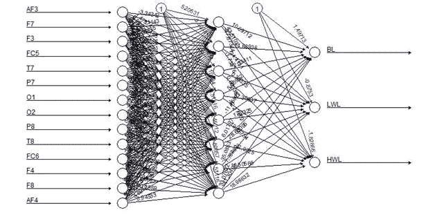
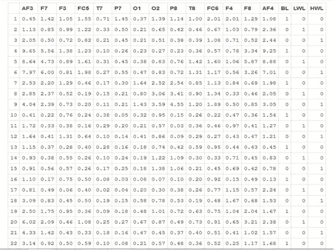
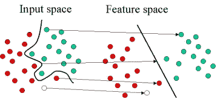
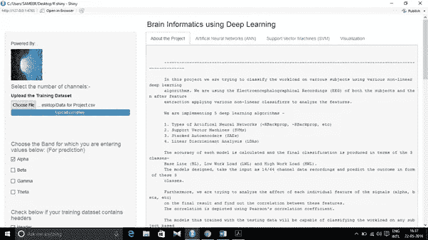

# 使用机器学习的大脑信息学

> 原文：<https://medium.com/analytics-vidhya/brain-informatics-using-machine-learning-b08f977b3c47?source=collection_archive---------21----------------------->

**摘要**:

**脑电图**是一种用来评估大脑电活动的测试。脑细胞通过电脉冲相互交流。脑电图可以用来帮助检测与此活动相关的潜在问题。该测试跟踪并记录脑电波模式。被称为电极的小而平的金属圆盘用电线固定在头皮上。电极分析大脑中的电脉冲，并向计算机发送信号，记录结果。脑电图异常模式中的电脉冲。任何异常都可能是癫痫发作或其他大脑疾病的迹象。记录看起来像有波峰和波谷的波浪线。这些线条允许医生快速评估是否存在异常模式

脑电图(EEG)技术在各种应用中已经越来越受欢迎。在本报告中，我们提出了一个基于深度学习的自动化系统，该系统可以使用廉价的脑电图设备(Emotiv EEG)获取的脑电图信号(EEG)将工作负荷分为 3 类——高、中、低。工作量是影响一个人在任何领域表现的关键因素，从研究、公司工作到军人。在这项研究中，使用 14 通道 EEG 来获取大脑信号，同时给受试者分配一些任务，这些任务根据他们对个人造成的工作量进行划分。然后获取的信号通过各种深度学习算法作为训练集。然后，经过训练的深度学习模型用于对个人的工作负荷进行分类，只需获取该个人的 EEG 信号，并将它们传递给这些模型。

**简介**:

在这项研究工作中，我们利用五种深度学习算法进行训练，然后比较每种算法的结果，以找出哪种算法最适合我们的结果。使用 Emotiv 脑电图机收集 14 个通道的数据。因为发现脑电图数据包含大量噪声和其他干扰元素，如果将这些噪声和干扰元素作为训练数据直接输入到算法中，可能会产生异常结果。因此，采集的 EEG 数据然后用各种数字信号处理技术进行处理，以滤除噪声和其他成分，并试图使信号尽可能纯净。

应用各种降噪滤波器来尽可能消除数据中的噪声。滤波后的数据通过巴特沃兹滤波器进行脑电信号的特征提取。基于它们的频率从 EEG 信号中提取α、β、γ、δ和θ特征。然后将脑电的这些特征作为输入训练集来训练各种深度学习算法。使用的四种深度学习算法是——人工神经网络(ann)、支持向量机(SVM)、线性判别分析(LDAs)和堆叠自动编码器。我们将详细讨论下面的每一个算法。

一旦模型被训练并且分类被执行，研究中的下一步是辨别在所有三种负载情况下 EEG 信号的各种特征之间的任何相关性。我们还使用各种统计方法计算了每种工作负载条件下各种特性之间的显著差异。

**人工神经网络**

我们使用的第一个深度学习模型是人工神经网络。我们开发了一个由 1 个隐藏层和 8 个隐藏神经元组成的深度神经网络。网络的输入是 14 通道 EEG 信号，因此输入层由 14 个神经元组成。我们想要的输出是一个分类器，它可以根据 EEG 信号将工作负荷分为 3 类，因此输出层由 3 个神经元组成。

下图显示了人工神经网络在视觉上的表现

14 个输入神经元代表 14 个 EEG 通道——AF3、F7、F3、FC5、T7、P7、O1、O2、P8、T8、FC6、F4、F8 和 AF4。3 个输出神经元代表 BL(基线)，即无工作负荷、LWL(低工作负荷)和 HWL(高工作负荷)。我们利用 R 编程来执行整个研究工作，上面显示的神经网络也用 R 编码。我们利用弹性反向传播技术(+Rprop)来训练深度神经网络。

为了训练深度神经网络，我们首先需要归一化整个输入数据集。我们利用 CRAN 服务器上 RSNNS 包中的 normalize 函数进行 R 编程。测试数据在输入网络进行测试之前也进行了标准化。因此，获得的分类输出是一种规范化的形式，我们必须使用上述同一个包中可用的反规范化函数来反规范化输出。由此获得的非标准化值是代表工作负荷是基本、低还是高的实际值。我们拥有的数据是 10 名学生的，我们进一步以 8:2 的比例进行了划分，然后将这些数据用于培训:测试。我们用 8 个学生的脑电图数据训练神经网络，然后用 2 个学生的数据测试深度网络。

我们输入神经网络的输入/训练数据如下所示。

14 通道 EEG 信号的输出集被转换成二进制矩阵格式，其中 3 列是格式(1，0，0 ),这表示对于每对信号，它只能是 3 种情况中的任何一种。因此，当使用反规格化函数对神经网络的输出进行反规格化时，3 个神经元的输出具有相同的格式(0，1，0 ),这被输入数据集所满足。

**支持向量机**

在[机器学习](https://en.wikipedia.org/wiki/Machine_learning)、**支持向量机** ( **支持向量机**，还有**支持向量网络**)是[监督学习](https://en.wikipedia.org/wiki/Supervised_learning)模型，带有相关的学习[算法](https://en.wikipedia.org/wiki/Algorithm)，分析用于[分类](https://en.wikipedia.org/wiki/Statistical_classification)和[回归分析](https://en.wikipedia.org/wiki/Regression_analysis)的数据。给定一组训练样本，每个样本被标记为属于两个类别中的一个，SVM 训练算法建立一个模型，将新样本分配到一个类别或另一个类别，使其成为非[概率](https://en.wikipedia.org/wiki/Probabilistic_classification) [二元](https://en.wikipedia.org/wiki/Binary_classifier) [线性分类器](https://en.wikipedia.org/wiki/Linear_classifier)。SVM 模型是将示例表示为空间中的点，通过映射，各个类别的示例被尽可能宽的间隙分开。然后，新的例子被映射到相同的空间，并根据它们落在缺口的哪一边来预测属于哪个类别。

除了执行线性分类，支持向量机还可以使用所谓的[内核技巧](https://en.wikipedia.org/wiki/Kernel_trick)有效地执行非线性分类，将它们的输入隐式映射到高维特征空间。

当数据没有被标记时，有监督的学习是不可能的，并且需要无监督的学习方法，该方法试图找到数据到组的自然聚类，然后将新数据映射到这些形成的组。对支持向量机进行改进的聚类算法称为**支持向量聚类**，通常用于工业应用中，当数据没有被标记时，或者当只有一些数据被标记作为分类过程的预处理时。

支持向量机基于定义决策边界的决策平面的概念。决策平面是在具有不同类成员资格的一组对象之间进行分离的平面。下图显示了一个示意性示例。在本例中，对象属于绿色或红色类别。分隔线定义了一个边界，其右侧的所有对象为绿色，左侧的所有对象为红色。任何落在右边的新物体(白色圆圈)被标记，即分类为绿色(或分类为红色，如果它落在分隔线的左边)。

上面是线性分类器的一个经典例子，即用一条线将一组对象分成各自的组(在这种情况下是绿色和红色)的分类器。然而，大多数分类任务并不那么简单，并且通常需要更复杂的结构来进行最佳分离，即，基于可用的示例(训练案例)正确地分类新对象(测试案例)。下图描述了这种情况。与之前的示意图相比，很明显，绿色和红色对象的完全分离需要曲线(比直线更复杂)。基于绘制分隔线来区分不同类别成员的对象的分类任务被称为超平面分类器。支持向量机特别适合处理这样的任务。

下图显示了支持向量机的基本思想。在这里，我们看到原始对象(示意图的左侧)被映射，即重新排列，使用一组数学函数，称为内核。重新排列对象的过程称为映射(转换)。请注意，在这个新设置中，映射的对象(示意图的右侧)是可线性分离的，因此，我们不用构建复杂的曲线(示意图的左侧)，只需找到一条可以分离绿色和红色对象的最佳线。

**堆叠式自动编码器**

用于预训练深度网络的贪婪分层方法通过依次训练每一层来工作。在这一页，你会发现自动编码器如何以贪婪的分层方式来预训练(初始化)深度网络的权重。

堆叠式自动编码器是由多层稀疏自动编码器组成的神经网络，其中每层的输出都连接到下一层的输入。形式上，考虑具有 n 层的堆叠式自动编码器。使用中的符号

自动编码器部分，让 *W* ( *k* ，1)*W*(*k*，2)*b*(*k*，1)*b*(*k*，2)分别表示参数*W*(1)*W*(2)*b*(1)*然后，通过按前进顺序运行每层的编码步骤，给出堆叠式自动编码器的编码步骤:*

通过以相反的顺序运行每个自动编码器的解码堆栈来给出解码步骤:

感兴趣的信息包含在 *a* ( *n* )内，是隐藏单元最深层的激活。这个向量用高阶特征来表示输入。

通过将 *a* ( *n* )输入到 softmax 分类器，堆叠自动编码器的特征可用于分类问题。

**培训**

获得堆叠式自动编码器的良好参数的一个好方法是使用贪婪的逐层训练。为此，首先在原始输入上训练第一层以获得参数 *W* (1，1)*W*(1，2)*b*(1，1)*b*(1，2)。使用第一层将原始输入转换为由隐藏单元的激活组成的向量，a .在该向量上训练第二层以获得参数 *W* (2，1)*W*(2，2)*b*(2，1)*b*(2，2)。对后续层重复上述步骤，将每个层的输出作为后续层的输入。

该方法单独训练每个层的参数，同时冻结模型其余部分的参数。为了产生更好的结果，在这一阶段的训练完成后，使用反向传播的[微调](http://ufldl.stanford.edu/wiki/index.php/Fine-tuning_Stacked_AEs)可用于通过同时调整所有层的参数来改善结果。

**线性判别分析**

线性判别分析(LDA)最常用作模式分类和机器学习应用的预处理步骤中的降维技术。目标是将数据集投影到具有良好类别可分性的低维空间，以避免过拟合(“维数灾难”)并降低计算成本。

因此，简而言之，LDA 的目标通常是将一个特征空间(数据集 n 维样本)投影到一个更小的子空间 kk(其中 k≤n1k≤n1)上，同时保持类别区分信息。
一般来说，降维不仅有助于降低给定分类任务的计算成本，而且还有助于通过最小化参数估计中的误差来避免过拟合(“维数灾难”)。

**结论:**

因此，我们利用 EEG 的 14 个通道来计算使用 4 种深度学习技术的任何个人的工作负荷，并在最后利用各种统计方法从获得的结果中进行推断。

我们使用的模型在其结果中显示了一些差异，因此它们都不能被称为工作负载分类的最佳模型。人工神经网络和支持向量机是分类的最佳工作算法之一，比其他算法更值得信赖

在我们的案例中，我们使用了名为 Emotiv 的 14 通道 EEG 设备。然而，所开发的机器可以用于所有的通道对——14，128，256。在 R shiny 中开发的 UI 是这样设计的，可以使用下拉菜单来选择用户试图用哪种数据来训练机器。

下面是用 R shiny 开发的完整应用程序的截图

参考资料:

1.  维基百科(一个基于 wiki 技术的多语言的百科全书协作计划ˌ也是一部用不同语言写成的网络百科全书ˌ 其目标及宗旨是为全人类提供自由的百科全书)ˌ开放性的百科全书
2.  [https://www . world scientific . com/doi/ABS/10.1142/s 0129065706000482](https://www.worldscientific.com/doi/abs/10.1142/S0129065706000482)
3.  [https://ieeexplore.ieee.org/abstract/document/4808252/](https://ieeexplore.ieee.org/abstract/document/4808252/)