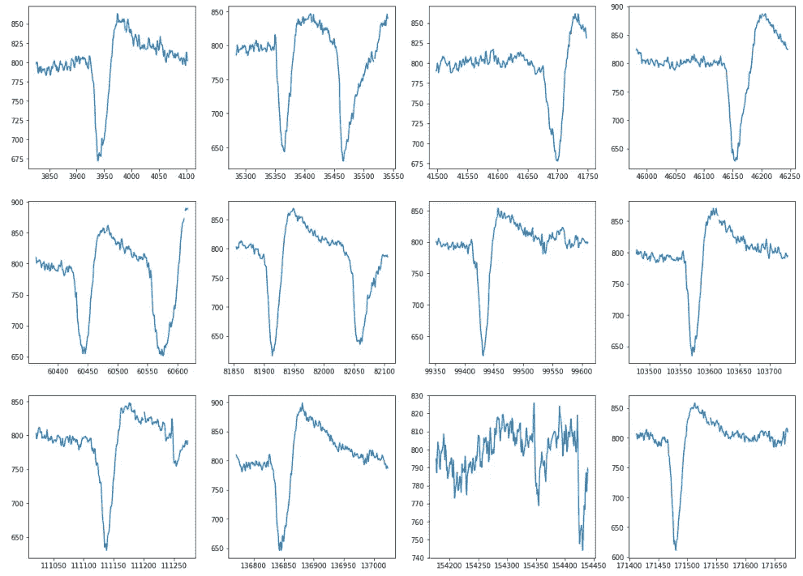

# DIY 大脑研究:廉价、高质量的脑电图数据

> 原文：<https://medium.com/analytics-vidhya/brain-research-on-the-cheap-ec9710a6c21b?source=collection_archive---------6----------------------->

照片由 [Unsplash](https://unsplash.com/s/photos/electricity?utm_source=unsplash&utm_medium=referral&utm_content=creditCopyText) 上的 [israel palacio](https://unsplash.com/@othentikisra?utm_source=unsplash&utm_medium=referral&utm_content=creditCopyText) 拍摄

更新:阅读这个项目的[第 2 部分](/analytics-vidhya/reading-the-brain-with-machine-learning-aad4627cbc4b)，在那里我建立了一个机器学习模型来自动检测 ERP。

如果计算机能读懂你的思想，甚至比你更清楚你喜欢什么，那会怎么样？如果它可以利用这种洞察力创作出特别适合你的口味和你此刻想听的原创音乐，会怎么样？如果你可以在自己家里做一个 10 分钟的快速测试来筛查各种精神疾病，以帮助你的医生诊断你，会怎么样？这些可能性让我对经济实惠的 [EEG](https://www.wikiwand.com/en/Electroencephalography) 设备和机器学习/人工智能的结合感到兴奋。

罗伯特·卢克曼在 [Unsplash](https://unsplash.com/s/photos/meditate?utm_source=unsplash&utm_medium=referral&utm_content=creditCopyText) 上拍摄的照片

这一切都是从我看到“大脑感应头带”的广告开始的它本质上是一种消费级脑电图设备，用于冥想时的神经反馈。这个想法是，你在冥想时戴上它，它会检测你的脑电波，并将信号转换成声音，给你实时反馈你在做什么。如果你的注意力非常分散，你会听到雷声。如果你设法让心灵更加平静，你会听到轻柔的雨声，然后它会安静下来，最终你会听到鸟儿歌唱，这是你做得很好的标志。作为一名内观禅修者，我同意，但作为一名机器学习工程师，我更兴奋的是能拿到原始的脑电图数据，看看能提取出什么样的洞见。

罗伯特·卢克曼在 [Unsplash](https://unsplash.com/s/photos/meditate?utm_source=unsplash&utm_medium=referral&utm_content=creditCopyText) 上拍摄的照片

我首先要弄清楚的是，这东西真的有用吗？是真的感应到了大脑还是某种精心制作的安慰剂？我做了研究，简短的回答是，是的，它以惊人的准确度探测大脑。我发现了维多利亚大学生物医学研究中心的一篇出色的研究论文，该论文将 Muse 与价值 75，000 美元的研究级 EEG 系统进行了比较。

> 此处展示的结果清楚地表明，MUSE EEG 系统可用于在不使用事件标记的情况下，通过单台计算机进行事件相关脑电位(ERP)研究。[……]此外，我们注意到完成两项实验任务(包括脑电图设置)的时间平均不到 10 分钟。为了进行比较，必须考虑我们的大阵列 ActiChamp 系统的任务完成时间。MUSE 的设置和测试时间大约是我们大型阵列系统设置和测试时间的六分之一。此处需要考虑的其他要点是，大型阵列系统通常需要两名(或更多)研究助理，而我们的 MUSE 系统需要一名研究助理，其成本大约为 75，000 美元，而 MUSE 系统需要 250 美元
> 
> 来源:[选择 MUSE:验证用于 ERP 研究的低成本便携式 EEG 系统](https://www.frontiersin.org/articles/10.3389/fnins.2017.00109/full#F6)

哇！这是一个游戏改变者。通常，当现有技术的价格下降到大众可以承受的时候，最令人兴奋的技术进步就出现了。想想个人电脑和智能手机。直到它们变得廉价，它们才真正改变了我们的生活方式。当然，昂贵的设置仍然更准确，有更多的电极，但如果你给我 95%的好，更容易使用，并且字面上**便宜 300 倍**，我会接受那个，非常感谢。

所以，作为第一步，我开始尝试用我自己的大脑扫描来复制上面的论文，我惊讶于它是如此的简单。要理解这一点，你需要知道什么是事件相关电位(ERP)。ERP 只是一种特定的电压模式(因此是电位),可以在一些事件发生后立即在大脑中进行测量。例如，*奖励积极性***(RewP)*是一种 ERP，当你对一个积极的行为(例如，你赢了一场游戏)获得反馈时就会发生。反馈消极是另一种 ERP，当你对一个行为得到负面反馈时。[已经研究了许多其他可能有用的 ERP](https://www.ncbi.nlm.nih.gov/pmc/articles/PMC3016705/)。既然这篇论文用的是 RewP，我决定自己试着检测一下。*

**

*我需要设计并试验在自己身上执行来触发 RewP。以前的研究使用金钱奖励来哄骗受试者，但谢天谢地我发现了一项研究，它表明即使没有金钱奖励，如果受试者在情感上关心结果，RewP 也是存在的。因此，我决定在解象棋谜题时记录我的大脑(我对象棋有点着迷，所以我会关心我是否答对了)，我编写了快速 Python 脚本来记录我的鼠标点击和时间戳，这样我就可以同步脑电图数据的时间。我还记录了我的屏幕，所以我可以用结果来标记鼠标释放时间戳(无论我是否得到了正确的结果)。这里是 RewP 应该看起来的样子(来自维多利亚大学的论文)。看这条较暗的线。*

**

*用 Muse 记录反馈(积极或消极)后的平均大脑活动。来源:[https://www . frontier sin . org/articles/10.3389/fnins . 2017.00109/full # F6](https://www.frontiersin.org/articles/10.3389/fnins.2017.00109/full#F6)*

*这是我在答对一个国际象棋谜题后的脑电图记录。*

**

*因为我的 X 轴显示的是 1，000 ms，而论文中显示的是 600 ms，所以图表在水平方向上有点压扁了，但是你肯定可以看到相似之处！信号下降到较低的水平，然后回升到比开始时更高的水平，然后再次变平。我会注意到 ERP 并不总是出现(如上面倒数第二张图所示)，但它出现在我第一次会议的 14 个记录中的 11 个中，而且这甚至没有像论文那样预处理数据。能够在一天之内复制出这篇论文的一部分是非常令人兴奋的！这说明了 Muse 是如何将大脑研究的门槛降低到如此之低，以至于像我这样没有大学支持的修补匠也能参与进来！*

**

*照片由[罗伯特·卢克曼](https://unsplash.com/@robertlukeman?utm_source=unsplash&utm_medium=referral&utm_content=creditCopyText)在 [Unsplash](https://unsplash.com/s/photos/meditate?utm_source=unsplash&utm_medium=referral&utm_content=creditCopyText) 上拍摄*

*我肯定需要收集更多的数据，尤其是来自不同大脑的数据，不仅仅是我自己的，但这些初步结果非常令人鼓舞。从这里，一旦我有了足够的数据，我想训练一个机器学习模型(可能是 RNN)，以自动检测这些 ERP 的。因为你可以把脑电图数据传输到电脑，所以可以是实时的。我可以把一些复杂的东西，比如大脑中的激活，简化成一个基于事件的 API，任何人都可以针对它编码。从那里开始，可能性是无限的。如果我能找到一个显示“我喜欢这个”的 ERP，或者其他类似的东西，它可能会成为有史以来最伟大的推荐系统，因为它甚至不需要你输入你的偏好。它会扫描你对内容的反应，并立即知道你最喜欢什么。另一个想法是，由于不同的精神障碍，如双相情感障碍，抑郁症，强迫症，在 ERP 如何呈现它们自己方面有已被研究的签名变化，我可以训练一个模型来检测这些异常，作为一种你可以在家里做的筛选，并把结果带给你的医生做进一步的测试。*

*既然我们已经有了一种简单的、负担得起的方法来直接将大脑与计算机连接起来，那么可能性只受到我们想象力的限制。传感技术将继续改进，我们破译信号并理解它们的能力也将继续提高。这只是开始。*