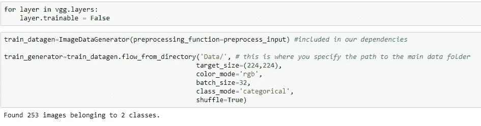

# 脑肿瘤分类迁移学习

> 原文：<https://medium.com/analytics-vidhya/brain-tumor-classification-transfer-learning-e04f84f96443?source=collection_archive---------3----------------------->

医疗保健中的人工智能

当我们试图学习新的方面或话题时，我们不会从头开始学习一切。我们从过去学到的知识中转移和利用我们的知识！

我们将在本文中讨论的内容

*   医疗保健中的人工智能
*   什么是迁移学习
*   迁移学习的应用
*   用 CNN 了解深度学习
*   深度迁移学习的类型
*   真实世界的例子(脑瘤检测)
*   结论和未来范围

**作为我的第一篇文章，希望我不要搞砸了。希望你喜欢并给你的反馈**

让我们开始吧

如果你只是想看代码:- [代码](https://github.com/iamhimanshu0/Brain_Tumor_Classification)

## **医疗保健中的人工智能**

**人工智能** ( **AI** ) **医疗保健**是在复杂的医疗数据分析中，利用复杂的算法和软件来估计人类的认知。具体来说，AI 是计算机算法在没有人类直接输入的情况下近似得出结论的能力。

人工智能技术与医疗保健领域的传统技术的区别在于获取信息、处理信息并向最终用户提供明确输出的能力。AI 通过[机器学习](https://en.m.wikipedia.org/wiki/Machine_learning) [算法](https://en.m.wikipedia.org/wiki/Algorithms)做到这一点。这些算法可以识别行为模式，并创建自己的逻辑。

为了减少误差幅度，人工智能算法需要反复测试。AI 算法在两个方面与人类不同:(1)算法是字面上的:如果你设定了一个目标，算法不能自我调整，只能理解它已经被明确告知的内容，(2)而算法是[黑盒](https://en.m.wikipedia.org/wiki/Black_box)；算法可以非常精确地预测，但不能预测原因。

医学中的各种专业已经显示出关于人工智能的研究在增加。

*   放射学
*   成像
*   远程保健
*   电子健康记录
*   工业

以下是为医疗保健中使用的人工智能算法做出贡献的大公司的例子。

*   国际商用机器公司
*   微软
*   谷歌
*   美国英特尔公司(财富 500 强公司之一ˌ以生产 CPU 芯片著称)

## 什么是迁移学习？

正如我前面讨论的那样，

“当我们试图学习新的方面或主题时，我们不会从头开始学习一切。我们从过去学到的知识中转移和利用我们的知识！”

这里要记住的第一件事是，迁移学习并不是一个新的概念，它对于深度学习来说是非常具体的。建立和训练机器学习模型的传统方法与使用遵循迁移学习原则的方法之间存在明显的差异。

**迁移学习**是机器学习中的一个研究问题，专注于存储在解决一个问题时获得的知识，并将其应用于另一个不同但相关的问题。例如，在学习识别汽车时获得的知识可以应用于识别卡车。这个研究领域与学习迁移的心理学文献的悠久历史有一定的联系。

# 预训练模型

迁移学习的一个基本要求是要有在源任务中表现良好的模型。幸运的是，深度学习世界相信分享。他们各自的团队已经公开分享了许多最先进的深度学习架构。

**为计算机视觉**:

*   VGG-16
*   VGG-19
*   盗梦空间 V3
*   例外
*   ResNet-50

**用于自然语言处理:**

*   Word2Vec
*   手套
*   快速文本
*   谷歌的通用句子编码器
*   谷歌变压器(BERT)的双向编码器表示

我们应该在什么时候应用迁移学习？

当新数据集小于用于训练预训练模型的原始数据集时。

**迁移学习的应用**

深度学习无疑是已经被用来非常成功地获得迁移学习好处的算法的特定类别之一。以下是几个例子:

*   自然语言处理的迁移学习
*   计算机视觉的迁移学习

**用 CNN 了解深度学习**

什么是卷积神经网络？

卷积神经网络(CNN 或 ConvNet)是最受欢迎的深度学习算法之一，这是一种机器学习，其中模型学习直接从图像、视频、文本或声音中执行分类任务。

CNN 对于在图像中寻找模式以识别物体、人脸和场景特别有用。他们直接从图像数据中学习，使用模式对图像进行分类，无需手动提取特征。

需要[物体识别](https://www.mathworks.com/solutions/image-video-processing/object-recognition.html)和[计算机视觉](https://www.mathworks.com/solutions/image-video-processing.html)的应用——比如[自动驾驶汽车](https://www.mathworks.com/solutions/automotive/automated-driving.html)和[人脸识别应用](https://www.mathworks.com/discovery/face-recognition.html)——严重依赖 CNN。根据您的应用，您可以从头开始构建 CNN，或者对您的数据集使用预先训练的模型。

是什么让 CNN 如此有用？

由于三个重要因素，使用 CNN 进行深度学习变得越来越流行:

CNN 消除了手动特征提取的需要——特征由 CNN 直接学习。

CNN 产生最先进的识别结果。

CNN 可以针对新的识别任务进行重新训练，使您能够建立在现有的网络上。

CNN 是如何工作的？

一个卷积神经网络可以有几十层或几百层，每一层都学习检测图像的不同特征。滤波器以不同的分辨率应用于每个训练图像，并且每个卷积图像的输出被用作下一层的输入。过滤器可以从非常简单的特征开始，例如亮度和边缘，并增加复杂性到唯一定义对象的特征

# 特征学习、图层和分类

这些层执行改变数据的操作，目的是学习特定于数据的特征。三个最常见的层是:卷积、激活或 ReLU 和池。

**卷积**将输入图像通过一组卷积滤波器，每个滤波器激活图像的某些特征。

**整流线性单元(ReLU)** 通过将负值映射为零并保持正值，可实现更快、更有效的训练。这有时被称为*激活*，因为只有被激活的特征被带入下一层。

**池化**通过执行非线性下采样简化输出，减少网络需要学习的参数数量

# **深度迁移学习的类型**

## 领域适应:-

领域自适应通常指源领域和目标领域之间的边际概率不同的场景，例如 ***P (Xₛ) ≠ P (Xₜ)*** 。

## 域名混淆:-

深度学习网络中的不同层捕获不同的特征集。我们可以利用这个事实来学习领域不变特征，并提高它们跨领域的可移植性。我们不允许模型学习任何表示，而是推动两个领域的表示尽可能地相似。

## 一次性学习:-

一次性学习是迁移学习的一种变体，我们试图根据一个或几个训练例子来推断所需的输出。这在现实世界中很有帮助，在现实世界中，不可能为每个可能的类都标记数据(如果这是一个分类任务),在现实世界中，可以经常添加新的类。

## 零射击学习:-

零射击学习是迁移学习的另一个极端变体，它依赖于没有标记的例子来学习一项任务。这听起来可能令人难以置信，特别是当使用示例学习是大多数监督学习算法的零数据学习或零短期学习时，方法在训练阶段本身进行巧妙的调整，以利用额外的信息来理解看不见的数据。

## 多任务学习:-

多任务学习与迁移学习略有不同。在多任务学习的情况下，几个任务同时被学习，没有源和目标之间的区别。在这种情况下，学习者一次接收关于多个任务的信息，与学习者最初不知道目标任务的迁移学习相比。

# **真实世界示例(脑瘤检测)**

我们将研究一个图像分类问题，其约束条件是每个类别的训练样本数量非常少。我们问题的数据集可以在 Kaggle 上找到。

## **主要目标**

我们将使用的数据集来自于 [***脑*** **肿瘤分类**](https://www.kaggle.com/navoneel/brain-mri-images-for-brain-tumor-detection) ***，*** ，其中我们的主要目标是建立一个深度学习模型，该模型可以成功地识别图像并将其分类为 ***脑肿瘤(*肿瘤性)**或 ***非脑肿瘤(非*肿瘤性*)***

**就 ML 而言，这是一个基于图像的二值分类问题。**

VGG16 模块图

**让我们编码**

查看 [GitHub](https://github.com/iamhimanshu0/Brain_Tumor_Classification) Repo:

## 构建数据集:-

首先，从数据集页面下载[**Brain _ Tumor _ dataset . zip**](https://www.kaggle.com/navoneel/brain-mri-images-for-brain-tumor-detection)文件，并将其存储在您的本地系统中。下载完成后，将其解压缩到一个文件夹中。数据集包含两个文件夹:是和否，其中包含 253 个大脑 MRI 图像。文件夹“是”包含 155 个肿瘤性脑 MRI 图像，文件夹“否”包含 98 个非肿瘤性脑 MRI 图像。

在这里，我们将使用

**熊猫、NUMPY、TENSORFLOW、KERAS、OS**

让我们导入库

我们将为 CNN 使用密集层和 GlobalAveragePooling2D

正如我之前解释的关于计算机视觉的预训练模型。我们有一个型号叫 VGG16 和 VGG19。因此，对于这种分类，VGG16 将工作良好。

我还导入了 ImageDataGenerator。这是为了数据扩充。这仅仅意味着通过对该批中的每个图像应用一系列随机变换(包括随机旋转、调整大小、剪切等)来添加更多的训练数据。).

定义图像大小([高度*宽度]) [224*224]和数据集的路径。在我的情况下，我将文件存储在数据文件夹中

现在是转移学习的时候了。只需从 VGG16 型号下载砝码即可

我们不需要导入最后一层，因为我们想使用我们自己的层作为最后一层，所以我们使用*include_top = False*

下载 VGG16 砝码后

然后我们应用 globaveragepooling2d()(x)

x 是 VGG16 模型的输出层

之后，我们应用具有 1024 个神经元的 2 个密集层，并且激活函数是 Relu。

和一个具有 512 个神经元和相同激活函数 Relu 的更密集层。

最后，还有一层是具有 2 个神经元的预测层，因为我们必须在 2 个类别之间进行分类，并添加*Softmax*激活函数，用于概率分布

现在我们检查**型号摘要**

我们不想训练 VGG16 层，所以我们* layer.trainable = False *

然后使用 ImageDataGenerator 对数据进行预处理

然后使用* train _ Data gen . flow _ from _ directory()*生成数据

它以“数据文件夹的路径，目标大小，颜色模式，批量大小，类别模式”作为参数

只需使用*model.compile()*编译模型，它将优化器、损失、指标作为参数

然后简单地用*model.fit_generator()*运行我们的模型

如您所见，我们获得了超过 94%的准确率和 0.1515%的损失。这是一个相当好的模型

列车损失

然后，我们使用*model.save()*保存我们的模型

**现在是预测的时候了**

导入必要的库并加载我们的模型

加载图像和预处理图像和预测输出

打印输出

代码: [Github](https://github.com/iamhimanshu0/Brain_Tumor_Classification)

# **结论和未来范围**

有了大数据集，我们可以改进它的预测，并能够获得更高的准确性，这可以帮助患者和医生。

迁移学习肯定会成为机器学习和深度学习在行业主流采用中取得成功的关键驱动因素之一。我绝对希望看到更多的预训练模型和创新的案例研究，它们利用了这一概念和方法。对于我未来的一些文章，你肯定可以期待下面的一些。

*   自然语言处理的迁移学习
*   音频数据的迁移学习
*   面向生成性深度学习的迁移学习
*   更复杂的计算机视觉问题，如图像字幕

查看我的新文章“Web 推荐系统的实际实现”

**参考文献:-**

*   [https://en . m . Wikipedia . org/wiki/Artificial _ intelligence _ in _ health care](https://en.m.wikipedia.org/wiki/Artificial_intelligence_in_healthcare)
*   [**https://towardsdatascience . com/a-comprehensive-hands-on-guide-transfer-learning-with-real-world-applications-in-deep-learning-212 BF3 B2 f27a**](https://towardsdatascience.com/a-comprehensive-hands-on-guide-to-transfer-learning-with-real-world-applications-in-deep-learning-212bf3b2f27a)
*   [**https://en . m . Wikipedia . org/wiki/卷积 _ 神经 _ 网络**](https://en.m.wikipedia.org/wiki/Convolutional_neural_network)