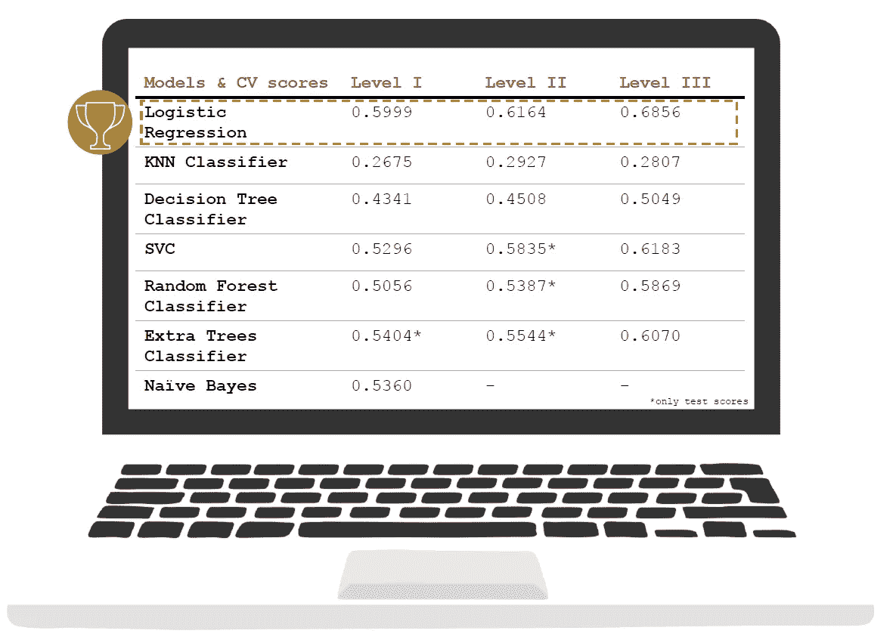

# 推特传播的品牌差异化分析

> 原文：<https://medium.com/analytics-vidhya/brand-differentiation-analysis-of-twitter-communication-f4829d49504?source=collection_archive---------15----------------------->

## 一种通过运动服装品牌对推文进行分类的机器学习方法


迭戈·哈拉米略在 [Unsplash](https://unsplash.com?utm_source=medium&utm_medium=referral) 上的照片

营销世界变得数字化。据估计，到 2023 年，超过 60%的媒体广告支出将是数字化的(来源:eMarketer)。**就这样** **在数字通信中脱颖而出的压力越来越大**。

这就引出了一个问题:品牌是否做了足够的努力来区分它们的在线业务。我想通过应用新学到的数据科学技能来解决这个问题的一部分，并因此问自己:**“机器可以被训练来区分 Twitter 品牌传播并正确分类吗？”**

除了向您展示我的分类分析结果并分享我对它们的一些想法(对于这一点，您可能想跳到最后)，我还想一步一步地向您展示我是如何处理这个项目的——从 Twitter 抓取、清理、探索性数据分析到运行许多具有不同参数的模型以确定最佳分类模型。

# 数据收集

对于 Twitter 上的品牌传播分析，我重点关注 **9 个大型运动服装品牌**:阿迪达斯、耐克、彪马、锐步、斐乐、亚瑟士、匡威、安德玛、新百伦。

为了获得大量的 Twitter 条目(tweets、retweets、quotes 和 replies ),我使用了 snscrape 和 Tweepy 的组合**(与 Twitter API access 结合使用)。相比之下，单独的 Twitter API 会将您限制在每个用户配置文件“仅”3.2k 左右的 Twitter 条目。 *在剩下的数据收集部分，我将向您展示一些更技术性的东西，我是如何使用 snscrape 和 Tweepy 的。如果对 Twitter 抓取不感兴趣，请跳过这一部分。***

首先，我从命令行使用 snscrape 从每个特定于品牌的用户配置文件(他们的主配置文件或他们的美国配置文件)中检索所有可能的 Twitter 条目(最大 100k——尽管在我的例子中从未达到过),并将信息保存在 json 文件中:

```
pip3 install snscrapesnscrape --jsonl --max-results 100000 twitter-user "user-profile-name" > brand-name.json
```

由于每个 Twitter 条目的“背景”信息有限，我只使用 Tweepy 中的 Tweet IDs，并通过 Tweepy 再次抓取它们以获得更多有用的“背景”信息。由于 Tweepy 正在使用 Twitter API，因此有必要使用您的个人密钥和令牌来设置身份验证。此外，由于刮擦率的限制，我在初始化中设置了一个等待时间。

```
import tweepy#You would need to insert your own Twitter API keys belowconsumer_key =”Personal API key”
consumer_secret=”Personal API secret key”
access_token=”Personal access token”
access_token_secret=”Personal access token secret”auth = tweepy.OAuthHandler(consumer_key, consumer_secret)
auth.set_access_token(access_token, access_token_secret) # then initialize Tweepy APIapi = tweepy.API(auth, wait_on_rate_limit=True)
```

由于来自 snscrape 的 id 数量超过了 Twitter API 的限制，所以我将这些条目分成块抓取，而不是一次全部抓取，并为此设置了一个函数。

```
def scrape_tweets(ids):
    """function to scrape twitter based on given ids and appending 
     them to a list"""
    list_of_items = api.statuses_lookup(ids, tweet_mode= "extended") for status in list_of_items:
           list_items_brand.append(status)
    return list_items_brand # scraping Twitter by chunks of 50 
chunks = int((len(ids))/50)list_items_brand = []
for i in range(chunks):
        batch = ids[i*50:(i+1)*50]
        scrape_tweets(batch)
```

使用 snscrape 的最后一个警告是它不能识别转发。作为一种变通方法，我使用标准的 Tweepy 过程来至少收集最近的转发，并将它们与其他数据集合并。

在进入清理部分之前，这给我留下了超过 196，000 条 Twitter 消息。

# 数据清理

这里的数据清理包括四个主要步骤:

1.  **分类项目** *(推文、回复自己、回复第三方、引用、转发)*和**删除回复第三方**(大部分包含客服回复消费者，与本项目无关)
2.  **删除由数百条相同推文组成的 Twitter“活动”**
3.  **删除非英语的 Twitter 条目**(因为我不希望品牌在其他语言使用上的差异影响分类)
4.  **将原始文本、标签和用户提及**拆分成不同的变量**并过滤出品牌内容**

让我们快速深入到过滤品牌内容的最后一步。正如开头所介绍的，我想通过分析一台机器是否能够正确地对 Twitter 通信进行分类，来调查运动服装品牌之间是否有足够的差异化。

如果推特上的信息包括“@adidas”或“#justdoit”这样的内容，这位模特可能会很轻松，更重要的是，这根本不会帮助我回答我的研究问题。因此，我正在通过移除标志性的口号、产品名称和品牌名称等方式来消除 Twitter 传播的品牌效应。


Twitter 项目非品牌化的例子

此外，我正在查看三个不同级别的信息来输入模型:
1 —只有原始的无品牌文本
2 —添加无品牌标签(例如“# Stanley cup”)
3—添加用户提及(例如“@86Kucherov”)

通过这种方式，我可以分析还有多少区分能力，例如用户提到的，或者原始的无品牌文本是否已经显示出良好的区分水平。


一条典型推文的三个信息层次——你能猜出这条推文背后的运动服装品牌吗？

# 快速浏览 EDA(探索性数据分析)

在开始有趣的建模之前，让我们快速看一下数据由什么组成。

数据清理之后，我只剩下 **~52k Twitter 条目**，其中大部分是 Tweets。大多数 Twitter 项目来自 2012 年至 2017 年，过去几年 Twitter 活动略有减少。然而，最重要的是,**有轻微的数据不平衡**,阿迪达斯和锐步都只有大约 4.5%的推文，相比之下最大的安德玛类有大约 17%。


由于 Twitter 条目文本将是分类模型中唯一的预测器，因此从该文本中获取“足够的信息”非常重要。这里的主要驱动因素是文本长度。从每个品牌的分布来看，**阿迪达斯和耐克的推文似乎比其他品牌的短**。尽管如此，大多数都在 50 个字符以上，因此足够长以允许区分。


但是数据探索到此为止，让我们看看实际的建模。

# 结合网格搜索的机器学习建模

这里的目标是建立一个**分类模型**，这是一个预测类别的算法。在这种情况下，该模型使用不同级别的 Twitter 信息作为输入，并预测它属于哪个运动服装品牌。

我把重点放在作为成功衡量标准的**准确性分数上**(正确分类案例的百分比)。这里的目标是打破 0.17 的基线(否则我每次只能预测“我最大的类”(安德玛)，并且在 17%的情况下是正确的)。

除了准确性得分，我还专注于找到一个模型，该模型预测每个类别至少几次，而不仅仅是完全忽略一个类别(例如，因为数据不平衡)。

## ***将文本转换成有用的东西，也就是预测变量***

为了让机器学习模型能够处理文本，我采取了几个步骤:

*   **用矢量器形成字数稀疏矩阵**(尝试两个选项:计数矢量器& TFIDF 矢量器)
*   **用标准 NLTK 英语停用词表删除对差异分析不重要的停用词**(如“you”)，并做一些单独添加
*   **使用标准缩放器尝试缩放**稀疏矩阵值
*   用 NLTK 搬运工斯特梅尔试着协调来自同一个词干的单词

## ***测试几种不同的分类模式***

为了识别最佳分类模型，我正在研究几种不同的算法:逻辑回归、KNN、决策树、SVC、随机森林、额外树和朴素贝叶斯。对于这些模型中的每一个，我通过使用网格搜索和管道来识别哪些参数工作得最好(跨矢量器和模型设置几个参数范围)。参数包括例如缩放/不缩放、词干化/不词干化、不同级别的正则化强度、不同级别的 n 元语法。

在确定了每个模型类型的最佳参数集之后，我正在比较每个模型类型的最高交叉验证分数，以确定最佳分类模型。

经过数百个小时和许多网格搜索和模型拟合，我发现我的项目的最佳模型是“简单的”逻辑回归:



每个预测值级别的模型得分概述(当然，您包含的信息越多(标签和用户提及),准确性提高得就越多)

## 深入“最佳模型”——一个简单的逻辑回归

我的第一个目标是**超过基线** (0.17)，只看原始文本(没有标签和用户提及)，这个目标很容易实现，准确率为 0.5999。我的第二个目标**对所有品牌进行分类**也达到了，正如你可能在下面的混淆矩阵中看到的。

然而，令人吃惊的是，阿迪达斯和锐步的**召回分数**(被正确识别的实际阳性比例)**。如右侧混淆矩阵所示，在测试集中，只有 23%的阿迪达斯推文和 38%的锐步推文被正确识别为他们的推文。对于这两个品牌来说，大多数错误的分类都是耐克、彪马、安德玛和新百伦。**


当查看每个品牌最相关的词(逻辑回归模型中系数最高的(1，2)的 n 个字母)时，人们可以很容易地识别出**在传播焦点**上的差异。典型的例子是，阿迪达斯的沟通以创意为中心，耐克的重点主要是奉献、进步和改进，而匡威更多的是围绕滑冰和艺术家进行沟通。


阿迪达斯、耐克和匡威最相关的 n 字母组合示例

# 结论性想法和局限性

所以，让我们对这个项目得出一些结论性的想法……首先，**运动服装品牌在简单的 Twitter 沟通中似乎确实与众不同**。在建立了一个可以识别差异并在超过 60%的情况下正确分类 Twitter 项目的机器学习模型后，我可以自信地说这一点(我认为这是相当高的，记住这个项目中有 9 个运动服装品牌)。

第二，**一些品牌在区分其原始信息方面似乎比其他品牌做得更好**，因此它们有更好的分类分数。似乎最好的差异化因素是斐乐(回忆得分 0.72)、安德玛(0.68)和耐克(0.68)，而最差的差异化因素是阿迪达斯(0.23)和锐步(0.38)。然而，由于我的数据集中存在轻微的不平衡，阿迪达斯和锐步帮助训练模型的 Twitter 条目数量较少，我无法完全证明糟糕的分数只是由于沟通风格。

此外，应考虑一些**限制**:

*   **媒体内容:**在查看那些运动服装品牌的推特传播时，你可以发现推文中附带了铺天盖地的照片和视频。媒体内容可能是造成差异的主要原因，但是，在这次分析中，我排除了那些照片和视频。人们可以通过例如照片标题分析将它们包括在分类问题中。
*   **沟通背景:**这里只使用了标准的矢量化方法。这些方法忽略了短语背后的上下文，而是看字数来分析文本。
*   **被忽视的渠道:**研究问题集中在 Twitter 传播上。由于社交媒体远不止 Twitter，人们可能会想看看其他渠道，如脸书、Instagram 等
*   **传播的成功:**虽然这个项目只关注传播是否与众不同，但还有一个全新的途径来观察这种传播的成功(例如，预测社交媒体的“成功”，如赞)

总之，营销世界变得数字化，在数字传播中脱颖而出的压力越来越大。这个项目表明，即使在原始推文中，运动服装品牌也在区分他们的传播(或多或少是好的)。**对于通信部门而言，更深入地研究此类分类模型的结果可能是相关的。**因此，他们可以确定他们的差异化目标是否实现，以及他们的焦点话题或词语是否与模型相关。

**很高兴听到你的想法！**