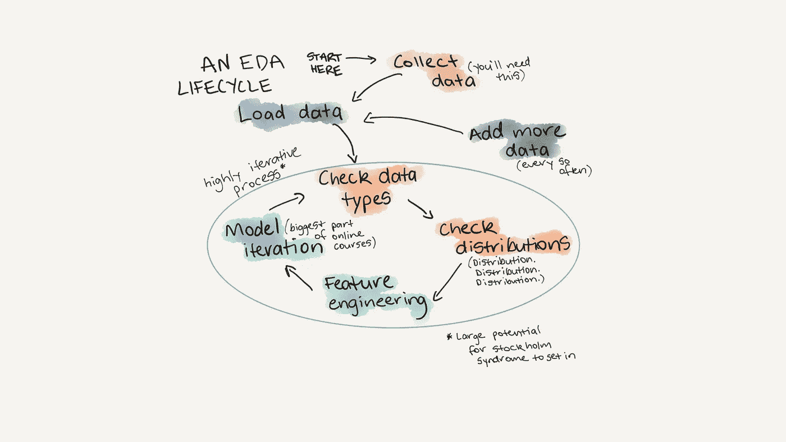
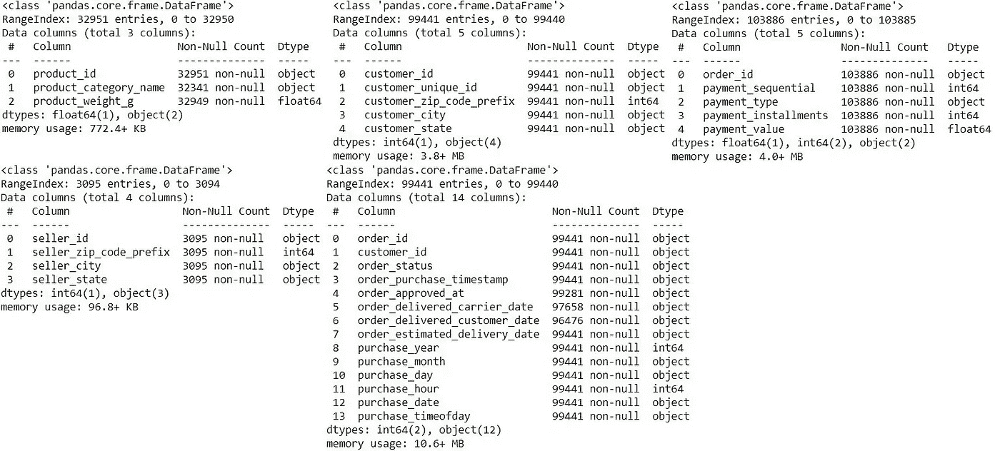
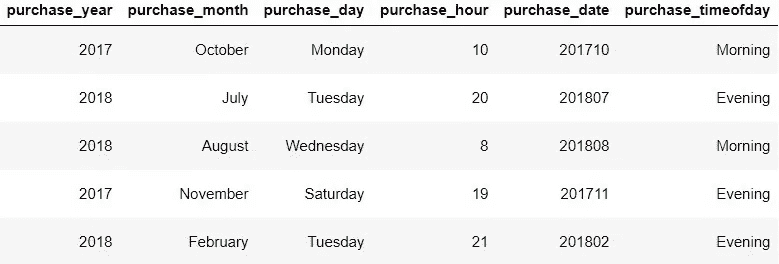
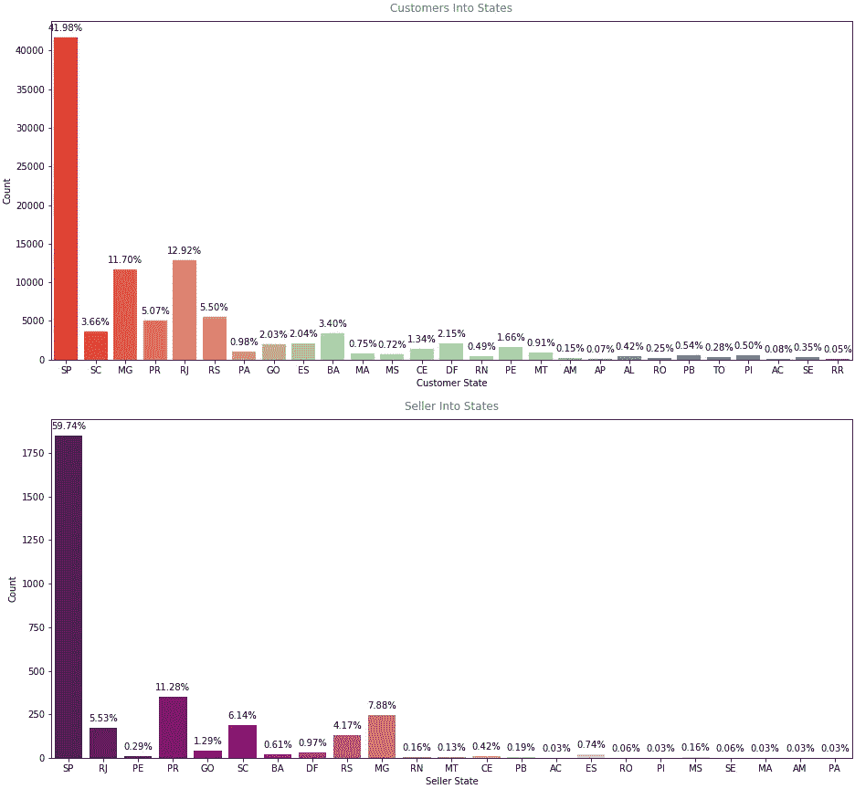
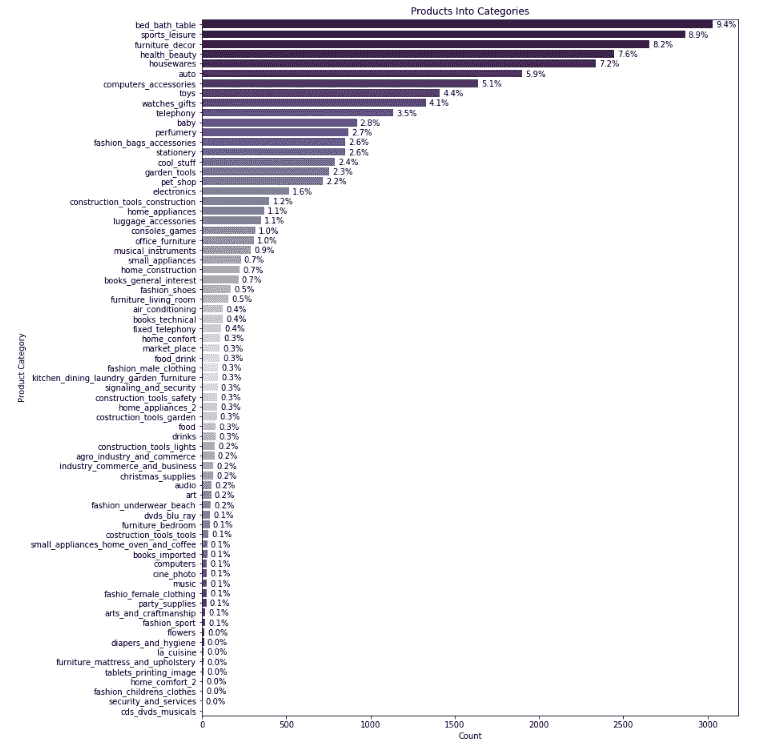
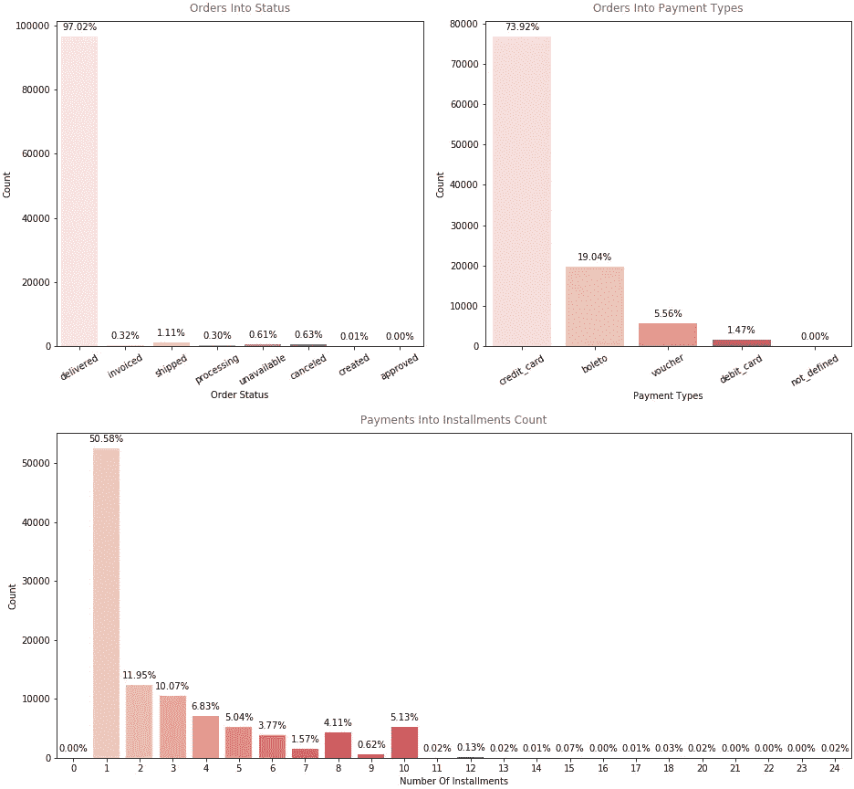
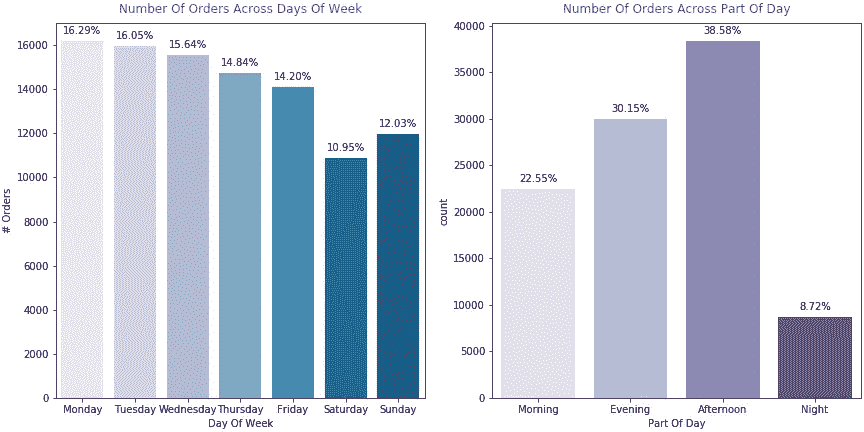
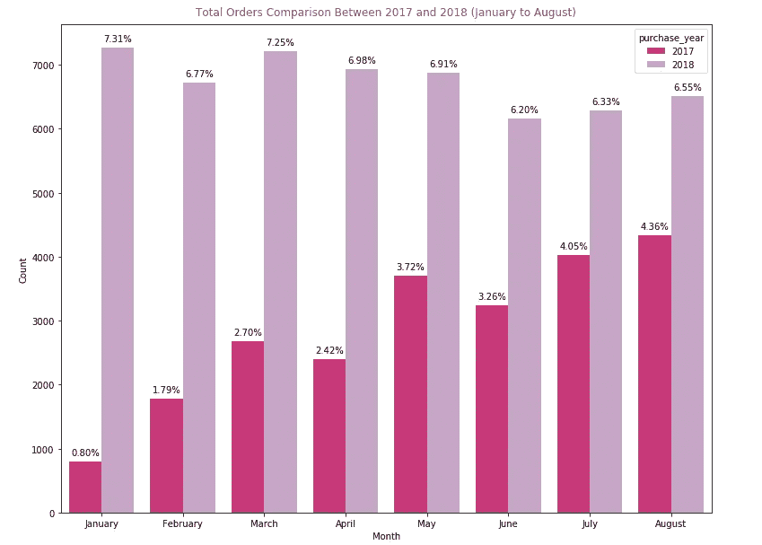
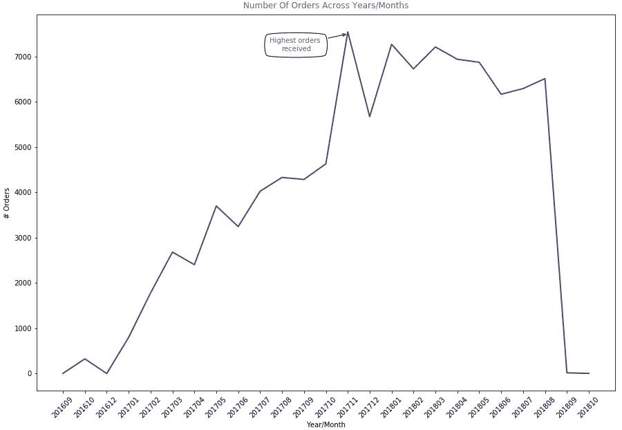

# 巴西公共电子商务

> 原文：<https://medium.com/analytics-vidhya/brazilian-e-commerce-public-eda-b8d02edd9aaf?source=collection_archive---------13----------------------->

[https://www . mrdbourke . com/a-gentle-introduction-to-explorative-data-analysis/](https://www.mrdbourke.com/a-gentle-introduction-to-exploratory-data-analysis/)

It 自伊斯坦布尔数据科学训练营开始以来，已经过去了 3 周，第一批项目的时间终于到来了。
我们被要求找到一个适合我们目标的数据集，并尝试在其上实施探索性数据分析(EDA ),以提取有助于描述业务意图的直觉。

# 关于数据集:

这是在 [Olist 商店](http://www.olist.com/)下的订单的巴西电子商务公共数据集。该数据集包含巴西多个市场 2016 年至 2018 年约 10 万份订单的信息。其功能允许从多个维度查看订单:从订单状态、价格、付款和货运表现到客户位置、产品属性，最后是客户撰写的评论。我们还发布了一个地理定位数据集，将巴西邮政编码与纬度/液化天然气坐标联系起来。

这是真实的商业数据，它已经被匿名化，评论文本中对公司和合作伙伴的引用已被替换为《权力的游戏》大公司的名称。

# 开始前探索:

在我开始用分析弄脏我的手之前😋，我应该研究数据，检查它，找到特征类型，找到丢失的值，并做一些清理。

熊猫信息()

我们可以看到，使用 ***pandas*** 库中提供的 ***info()*** 函数，数据集中缺失数据的数量太低了(幸运的我们😁).这是我们不是每天都会遇到的。
有一些特征包含 ***日期时间*** 数据，但被熊猫 ***read_csv()*** 解释为 ***对象*** 类型，如果我们要使用这些特征进行进一步分析，这是需要修复的。

# 从 EDA 开始:

## 1-将要素转换为日期时间:

在 orders 数据框中，有一些表示日期和时间的特性，但是对于这个分析，我将只使用'***order _ perchase _ time '***特性，它表示客户请求订单的日期和时间。我将该列中的值分离成多个列，分别表示(年、月、日、小时、年/月、时间)，如图所示。

## 2-将产品类别从门户网站转换成英文:

由于从 [Olist 商店](http://www.olist.com/)提供的表格 ***【产品类别名称翻译】*** ，这一步骤很容易完成，该表格包含 Portogies 中的数据集中呈现的每个产品类别及其在英语中表示的内容。

## 3-我们的客户属于:

*   首先，我决定根据客户/卖家所在的州来查看我们企业的客户/卖家的分布情况。
*   大部分客户位于[圣保罗](https://en.wikipedia.org/wiki/S%C3%A3o_Paulo_(state))(SP)[里约热内卢](https://en.wikipedia.org/wiki/Rio_de_Janeiro_(state)) (RJ)和[米纳斯吉拉斯](https://en.wikipedia.org/wiki/Minas_Gerais) (MG)。
*   另一方面，我们约 60%的卖家位于圣保罗，其余分布在巴拉那、米纳斯吉拉斯和 RJ。

## 4-我们销售什么类型的产品:

*   所以我开始从顾客那里寻找最想要的产品类别。
*   ***床浴桌***9.4%是最受欢迎的产品类别， ***运动休闲***8.9%， ***家具装饰***8.2%， ***健康美容***7.6%， ***家庭用品***7.2，

## *5-关于客户和订单:*

**

*   *从订单数据框中，我们可以非常明显地看到，大多数订单已经交付，这意味着该数据集主要包含有关已交付订单的数据，或者“我们公司正在完成其工作”🤓。*
*   *我们的大多数客户已经用他们的信用卡支付了 73.92%的订单。*
*   *我们大约一半的客户倾向于以一次分期付款的方式支付订单金额，另一方面，另一半的客户则以(2-10)次分期付款的方式支付。*

## *6-基于工作日的订单分配:*

**

*   *就研究客户行为而言，绘制工作日和部分工作日的订单数是最理想的起点。*
*   *这种类型的分析将有助于产生更有效的广告计划。*

## *7-订单对比(1 月至 8 月):*

**

*   *为了查看 2017 年 1 月至 8 月和 2018 年之间订单数量的增长，我绘制了这些时期的订单数量。*

## *8-业务增长:*

**

# *结论:*

*1-我们的大多数顾客位于圣保罗，我们可以建议商店在不同的社区和更多的城市投资广告。*

*2-我们的大多数卖家也位于[圣保罗](https://en.wikipedia.org/wiki/S%C3%A3o_Paulo_(state)) (SP)，为了获得最大利润，卖家可以投资更多的商店分店。*

*3-我们可以向新卖家推荐最想要的产品类别(****运动休闲******家具装饰、健康美容、家居用品******电脑配件)*** )。**

**4-我们的大多数客户使用他们的信用卡支付最低金额的分期付款，在这种情况下，卖方可以与银行投资，并提供一些优惠和折扣，以鼓励客户越来越多。**

**5-大部分订单都是在 ***开始的工作日*** 期间 ***下午*** 做出的。**

**6-2017 年和 2018 年之间利润有很大增长，我们的订单在 2017 年 11 月达到顶峰。**

# **在以下位置找到我:**

****LinkedIn:**[https://www.linkedin.com/in/yamenshaban/](https://www.linkedin.com/in/yamenshaban/)
**GitHub:**[https://github.com/yamenkaba](https://github.com/yamenkaba)**