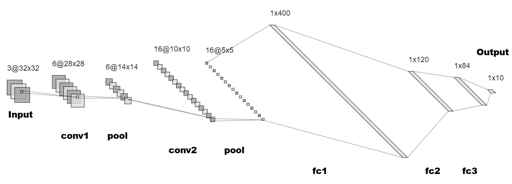

# PyTorch 的 CNN 教程分解

> 原文：<https://medium.com/analytics-vidhya/breakdown-of-pytorchs-cnn-tutorial-5347891cecb?source=collection_archive---------8----------------------->

> 这是一篇文章，我将写下我通过 PyTorch 提供的[卷积神经网络(CNN)教程所学到的东西。](https://pytorch.org/tutorials/beginner/blitz/cifar10_tutorial.html)

嘿大家好。我叫 Sean，我现在是高丽大学计算机科学专业的硕士研究生。具体来说，我的研究重点是深度学习方法。

我一直在尝试研究一些 PyTorch，因为我需要快速熟悉它，以便为我参与的项目进行研究和实验，还有什么地方比从文档提供的官方教程开始更好呢？这是一个非常简短的模型，但是通过一行一行的学习，我学到了很多东西。

# 基本信息

## 数据

本教程基本上引导我们使用 CNN 对 [CIFAR-10](https://www.cs.toronto.edu/~kriz/cifar.html) 图像样本进行分类。CIFAR-10 数据集是一个由 60，000 个标记图像组成的数据集，共有 10 个类别。每个图像都是形状(高度=32，宽度=32，通道=3)，有 50，000 个训练图像和 10，000 个测试图像。

数据集分为 5 个训练批次，每个批次有 10，000 个图像，以及一个测试批次。

## 模型架构

整体模型架构如下:

循序渐进:

1.  我们接收输入图像。
2.  我们让图像通过一个卷积层，它的内核大小为(5，5)，有 6 个滤波器，步长为 1。
3.  我们使用 shape (2，2)和 stride 2 执行最大池化。
4.  我们执行另一个卷积，但这次使用 16 个滤波器。
5.  我们执行另一个最大池操作。
6.  将图像展平为形状(16 * 5 * 5 = 400)，并穿过第一个完全连接的图层。
7.  图像再次通过两个更多的后续完全连接的层。
8.  对于每个图像类，最终输出的形状是(1，10)，我们执行分类。

好奇的话请看一下[我曾经画过网的网站](http://alexlenail.me/NN-SVG/LeNet.html)！

# 代码

整个代码如下:

现在，让我们把它一部分一部分地分解。

## 步骤 1:数据的基本配置。

这一步相对简单。我们只是通过使用`torchvision`库的函数下载 CIFAR-10 数据集，然后对数据执行一些基本的预处理(例如归一化)。如果你对变量`trainloader`和`testloader`不熟悉的话，它们可能会让你感到困惑(它们让我感到困惑)，但它们只是我们用来加载数据的工具。如果您查看第 5 步中的第二个`for`循环，这一点会变得很清楚。

## 步骤 2:可视化一些样本。

我跳过这一步的原因是因为我使用的服务器由于某种原因不允许可视化。不过，这没什么大不了的，因为本教程的重要部分不是看数据是什么样子。

## 步骤 3:定义要使用的 CNN。

如果你看一下`Net`类，你会注意到我们已经使用 PyTorch 的内置函数和方法基本上定义了我们将使用的 CNN 的构建块。`forward`函数基本上是执行实际计算的函数。

如果您对我们如何得出函数中定义的具体数字感到困惑，请记住:

回想一下我们的数据的形状(从(32，32，3)开始)，我们的内核的形状(5x5)，我们不使用任何填充，我们使用跨距 1(对于池层，我们使用跨距 2)。还要记住，池层也是一个卷积层，因此上面的等式也适用于它们。

总之，当我们通过网络传递数据时，数据的形状会发生如下变化:

1.  (32，32，3):输入数据
2.  (28，28，conv1 之后的数据
3.  (14，14，6):池后的数据
4.  (10，10，conv2 之后的数据
5.  (5，5，16):池后的数据

如果您感到困惑，这里有一个模型架构的示意图，以供参考:

现在，注意最后一层的形状是(5，5，16)并且在我们的`Net`类的`forward`函数中，我们用`x.view(-1, 16 * 5 * 5)`展平我们的数据。如果你不确定`-1`是做什么用的，它意味着推断特定的尺寸大小。[查看](https://docs.scipy.org/doc/numpy/reference/generated/numpy.reshape.html#numpy.reshape) `[numpy.reshape()](https://docs.scipy.org/doc/numpy/reference/generated/numpy.reshape.html#numpy.reshape)`的文档以获得更详细的解释。

如果你不熟悉`view`函数，那么我强烈推荐查看[这个堆栈溢出问题](https://stackoverflow.com/questions/49643225/whats-the-difference-between-reshape-and-view-in-pytorch)。`view`与`reshape`相似，但在技术意义上略有不同。不过，从概念上认为它们是相同的会有所帮助。

## 步骤 4:定义优化程序和损失详细信息。

这一步并不复杂。我们只是定义了将要使用的损失标准，以及将要使用的优化器。如你所见，我们将使用[交叉熵损失](https://en.wikipedia.org/wiki/Cross_entropy)和[带动量的随机梯度下降算法](https://en.wikipedia.org/wiki/Stochastic_gradient_descent#Momentum)。如果有您不熟悉的地方，请查看文档！

## 第五步:训练网络。

这一步是我们实际训练网络的时候。对于每个时代，我们基本上是:

1.  提取输入数据和相应的标签`inputs, labels = data`。
2.  清除我们的优化器`optimizer.zero_grad()`中的梯度值。
3.  用我们的模型`outputs = net(inputs)`计算输出分数。
4.  计算我们的预测和实际标签之间的交叉熵损失`loss = criterion(outputs, labels)`。
5.  使用`loss.backward()`计算`require_grads=True`处每个参数的梯度。
6.  使用`optimizer.step()`用从`loss.backward()`计算的梯度更新我们的优化器。
7.  更新我们的`running_loss`。
8.  如果适用，打印结果。

一旦运行了这段代码，您会注意到损失逐渐减少！

# 结论

本教程不会带你完成整个深度学习过程，但我相信它对学习 PyTorch 的工作方式很有帮助。但是，您应该记住的一件事是，当您对某一行代码感到困惑时，要养成查看文档的习惯。

我学习的目标是确保我能把这些材料教给别人。这很费时间，但我真的觉得这是正确的道路。

我希望这篇教程对找到它的人有所帮助。快乐学习！