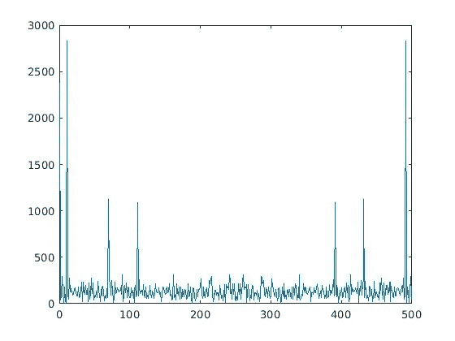
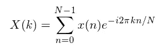
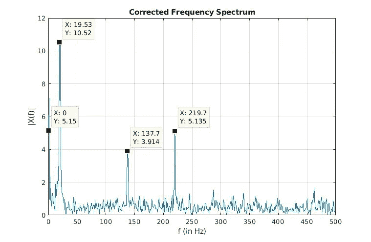

# 打破快速傅立叶变换(FFT)的混乱

> 原文：<https://medium.com/analytics-vidhya/breaking-down-confusions-over-fast-fourier-transform-fft-1561a029b1ab?source=collection_archive---------0----------------------->

毫无疑问，傅立叶变换是解决各种问题的最有价值的武器之一。FFT 实际上是许多信号处理工程师的面包和黄油。同时，在数据科学领域也有 FFT 应用的例子。例如，具有密集间隔的时间序列数据(例如:您可能在处理每小时的销售数据，而不是每月的销售数据)表现出复杂的季节性。傅立叶变换是分析这类季节性的便利工具。不幸的是，对于没有经验的人来说，它有时会导致灾难性和令人沮丧的结论。

我在 stack-exchange、Mathworks 和其他论坛上浏览了数百个讨论和问答。我所了解到的是:打算使用傅立叶变换的人确实知道他们为什么要使用它。但普遍的困惑是:**接下来是什么？**如何对手里的序列进行“后处理”，获得有意义的准确洞察？具体来说，主要有以下几个问题:

1.  什么是单边带(SSB)？我们为什么关心？
2.  我的 FFT 序列和物理频率有什么关系？这两者如何才能正确对齐？
3.  什么是 FFT 频段？它是如何设置 FFT 的分辨率的？
4.  为什么会有归一化的因素？

混淆的根源隐藏在建立傅立叶变换基础的数学基础之下。在这篇文章中，我将试着分析几种常见的混淆，这些混淆是在使用傅立叶变换时产生的。我会尽量少用数学来解释这个推理。希望这将有助于您使用这个神奇的工具，而不必费心去学习它背后的数学知识。

为了便于解释，我将使用快速傅立叶变换(FFT)的示例代码。FFT 本质上是一种计算离散傅立叶变换(DFT)的超快速算法。示例代码是用 MATLAB(或 OCTAVE)编写的，对于试图理解傅立叶变换的人来说，这是一个非常著名的例子。类似的例子可以在[这里的](https://au.mathworks.com/help/matlab/ref/fft.html)中找到。

在接下来的内容中，我们将从这段代码中提取部分内容并对其进行分析。首先，让我们设置一下背景。我们有一个可以在一秒钟内采集 1000 个样本的采样器。我们用采样器收集了 500 个时间点。

```
Fs = 1000;          %sampling rate
T = 1/Fs;           %sampling interval
L = 500;            %Number of time points
t = 0:T:(L-1)*T;    %time vector
```

接下来，让我们创建一个具有 3 个频率和一个将被采样的 DC 分量(0 Hz 分量)的信号。让我们添加一些噪音。如果需要，您可以绘制信号图进行初步目视检查。这是一个很好的实践。

```
% Define frequencies
f1 = 20;
f2 = 220;
f3 = 138; 
% Create the signal
x  = 5 + 12*sin(2*pi*f1*t-0.3) + 5*sin(2*pi*f2*t-0.5) + 4*sin(2*pi*f3*t - 1.5);
x = awgn(x,5,'measured') %noise with 5 dB Signal to Noise ratio
```

现在，我们已经准备好执行 FFT 了。我们手中有一个真实世界的信号，它是被加性噪声破坏的正弦波的混合物。让我们采用 FFT 并绘制它。真扫兴。是的，FFT 序列是复杂的序列。为什么？因为它们包含给定频率分量的幅度和相位信息，复数是描述它的最佳方式。那么让我们取这些序列的绝对值(幅度)。我们得到了什么？



FFT 序列的幅度 FFT(x)

这根本没有多大意义。首先，有 7 个峰值(包括零点的那个)。但是我们预期有 4 个峰值(3 个用于频率 f1、f2、f3，1 个用于 DC 分量)。其次，振幅发生了什么变化？看起来太高了！山峰的位置也不对。很明显，要解决这个问题，我们还有很多工作要做。

让我们打破第一个困惑:为什么有比我们预期的更多的峰值？这就是单边带(SSB)频谱发挥作用的地方。如果你仔细观察，上面的图的一边是另一边的镜像，峰值在 0 处下降。这是因为，对于实信号，正负频率的系数变成复共轭。这意味着，我们不需要用频谱的两面来表示信号，单面就可以了。这被称为单边带(SSB)频谱。为了得到 SSB 频谱，我们需要将我们的时域信号转换成解析信号，即 *xₐ = x + iH(x)* 。 *H(x)* 就是众所周知的希尔伯特变换。但是，好消息是，我们不需要为此学习新的转换。事实证明，如果只取与正频率相关的频谱并乘以 2，将得到 SSB 频谱，而无需对转换后的解析信号明确应用希尔伯特变换。这可以通过简单地编写两行附加代码来实现，如下面的代码片段所示:

```
X = fft(x,N);
SSB = X(1:L/2);
SSB(2:end) = 2*SSB(2:end);
```

注意，我们在乘以 2 时排除了第一个元素。这是因为，在 MATLAB 中，FFT 函数返回一个向量，其中第一个元素是 DC 分量(与 0 频率相关联)。DC 分量与 0 频率相关联，0 频率既非正也非负。实际上，这个系数是真实的。

接下来，我们需要为 FFT 频谱固定一个合适的 x 轴。在我们的例子中，我们需要把物理频率放在 x 轴上，这样我们就知道我们在正确的频率上得到峰值。这是极其关键的一步。要做到这一点，我们需要了解 FFT 是如何创建“频段”的。对于 *N* 点 FFT，创建的箱的数量是 *N/2。*

FFT 只是离散傅立叶变换(DFT)的一种实现。为了离散连续的频率，频率轴被均匀地分割成有限数量的已知部分。箱可以被认为是频谱样本。在我们的例子中，采样频率 *Fs = 1000* 样本/秒。根据奈奎斯特定律，可以由其样本无混叠地表示的最高物理频率简单地是 *Fs/2 = 500* Hz。因此，本质上，频谱被分割成 *(Fs/2)/(N/2)* 或 *Fs/N* 频段*的条带。*这个大。我们现在可以创建适当的频率轴，如下面的代码片段所示。

```
f = (0:N/2-1)*(Fs/N);
```

此外，频段让我们了解 FFT 的基本频率分辨率。简而言之，在这种程度上，我们将能够分离频谱中两个位置相近的频率。在我们的例子中，我们的频率分辨率为 *Fs/N = 1000/1024* 或 *0.9765* Hz/bin。如果频率的分离度小于 0.9765 赫兹，我们就无法将频率分离为不同的峰值。

我们快到了。我们提取了单边带光谱。我们还建立了光谱轴。现在，我们只想看看频谱，并拼出每个正弦波的幅度。在此之前，让我稍微重新表述一下 DFT。还记得 DFT 的定义吗？



DFT 可以看作是一种相关性

如果你仔细观察，你会注意到，计算 DFT 重新组装了很多相关性。没错。事实上，我认为这是一种非常直观的思考 DFT 工作原理的方式。因此，基本上对于每个仓，我们计算时域信号 *x* 和与该仓相关的复正弦波之间的互相关。进一步的研究表明，我们通常在相关运算中看到的某些东西确实丢失了。**一个归一化因子。**具体而言，信号长度的归一化因子。这就是我们将要做的，我们将用信号长度归一化频谱。现在，让我们把所有这些理解放在一起，让我们看看会发生什么。

```
figure(4)
plot(f,abs(SSB/L)) %Normalizing with signal length
xlabel('f (in Hz)')
ylabel('|X(f)|')
title('Corrected Frequency Spectrum')
```



瞧啊。我们已经成功地从噪音深处恢复了我们的频率。建议大家玩玩附带的代码，看看在不同的信号长度，FFT 点数，频率下会发生什么。我想提醒你，对于代码中给定的设置，如果你选择的频率高于 *Fs/2，就会发生混叠。由于混叠，高于 *Fs/2* 的*频率将作为低频成分出现在频谱中。这就是为什么建议在应用 FFT 之前进行低通滤波，尤其是在您不了解信号潜在频率成分的情况下。

我希望这个故事能让你对处理 FFT 运算有一些基本的了解。为了便于解释，许多数学观点被过分简化了，因为我试图迎合广大读者。下次见！