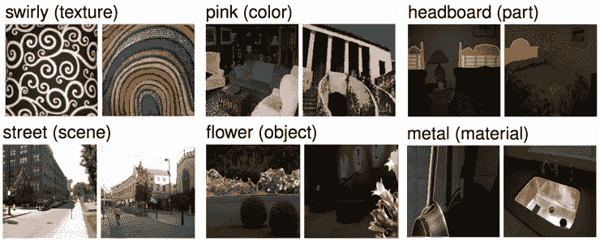
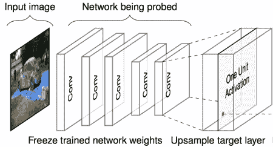
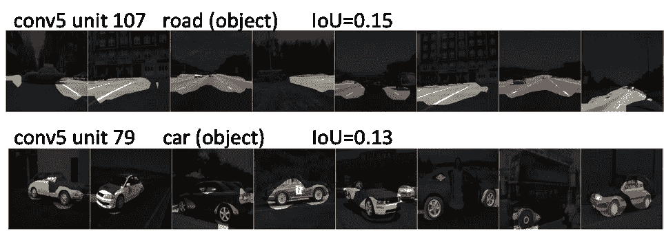
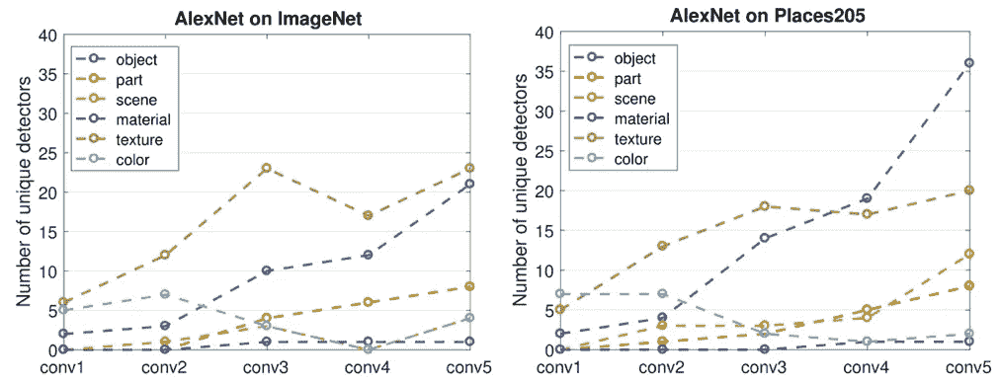
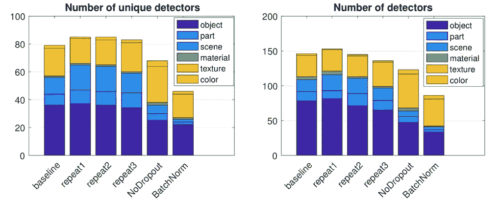
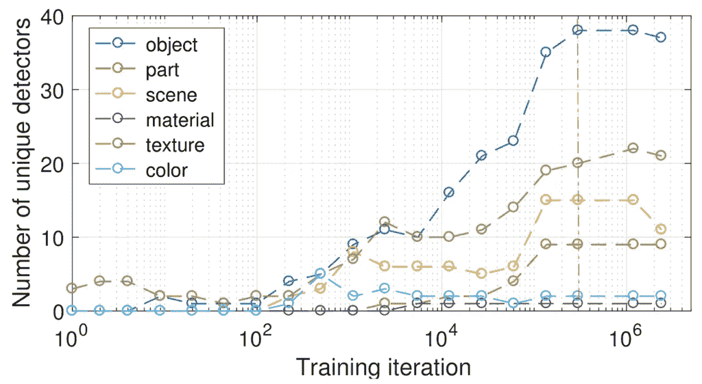

# 分解网络剖析

> 原文：<https://medium.com/analytics-vidhya/breaking-down-network-dissection-b4e3a6e9d5f2?source=collection_archive---------10----------------------->

## 从麻省理工学院 CSAIL 有趣的论文中提炼思想:“网络剖析:量化深度视觉表征的可解释性”。

“[网络剖析:量化深度视觉表征的可解释性](http://netdissect.csail.mit.edu/final-network-dissection.pdf)”是我最喜欢的可解释人工智能论文之一。我已经将内容浓缩成一篇简短的博文，这可能会帮助你快速理解文章中的观点。

# **动机**

深度学习通过在许多具有挑战性的任务中实现最先进的性能，彻底改变了计算机视觉、自然语言处理和强化学习。深层网络的一个主要缺点是它们的“黑箱”性质；很难理解这些网络是如何得到它们的输出的。麻省理工学院 CSAIL 的研究人员提出了一种称为“网络解剖”的技术，它提供了一个框架来描述 CNN 中各个卷积滤波器关注的是什么功能。

# **网络解剖**

要执行网络剖析，有 3 个步骤:

**第一步:识别一系列人类标记的视觉概念**

为了识别一组人类标记的视觉概念，作者构建了宽密标记数据集(Broden)数据集。Broden 数据集结合了几个密集标记的图像数据集:ADE [43]、开放表面[4]、Pascal-Context [19]、Pascal-Part [6]和可描述纹理数据集[7]。数据集中的每个图像都包含一个视觉概念，该视觉概念在图像内用逐像素的二进制分割图来标记。例如，如果被标记的视觉概念是汽车，那么包含汽车的所有像素被标记为 1，其余的像素被标记为 0。Broden 数据集有 63，305 幅图像，包含 1197 个视觉概念。有 6 类概念:纹理、颜色、材料、零件、物体和场景。

来自 Broden 数据集的示例。概念所在的像素被突出显示。图来自 Bau & Zhou 等人 2017([http://net dissection . csail . MIT . edu/final-network-dissection . pdf](http://netdissect.csail.mit.edu/final-network-dissection.pdf))。

**2。收集卷积滤波器对已知概念的响应**

这一步的目标是为每个卷积滤波器获得一个逐像素的二进制分割图，它告诉我们图像的哪些部分高度激活了卷积滤波器。在上一步中，所有的“已知概念”都包含在 Broden 数据集中。为了收集卷积滤波器对已知概念的响应，来自 Broden 数据集的图像被馈送到正在被剖析的 CNN，并且执行向前传递。然后存储每个卷积滤波器的激活图。给定网络的输入图像，卷积滤波器的激活图就是卷积滤波器的输出。

通常，过滤器越深入 CNN，激活图的尺寸越小。由于我们想要输入图像的二进制分割图，作者使用双线性插值将激活图上采样为与输入图像相同的大小。

激活图是实值的，但是必须转换成步骤 3 的二进制图。设单元 k 的激活图为 a_k。对于每个单元 k，确定最高分位数水平 T_k，使得在数据集中激活图的每个空间位置上 P(a_k > T_k) = 0.005。为了获得二值图，激活图中值大于 T_k 的所有像素被标记为 1，其余像素被标记为 0。结果是一个二进制图，对于高度激活卷积滤波器的输入图像部分，该二进制图被标记为 1。

图来自 Bau & Zhou 等人 2017([http://net dissection . csail . MIT . edu/final-network-dissection . pdf](http://netdissect.csail.mit.edu/final-network-dissection.pdf))。

**3。量化隐藏变量-概念对的一致性**

现在，我们有了一个二进制图，它告诉我们人类标记的概念在哪里(来自步骤 1)，还有一个二进制图，它告诉我们卷积滤波器在哪里被高度激活(来自步骤 2)。如果卷积滤波器对于包含人类标记概念的图像区域是高度激活的，那么也许我们可以说滤波器正在“寻找”那个概念。为了量化两个二元图之间的比对，使用并集上的交集(IoU)。

IoU =(二进制图都为 1 的像素数)/(在两个二进制图中标记为 1 的唯一像素数)

如果二进制概念图和二进制激活图的 IoU 超过 0.04，那么作者将产生激活图的卷积滤波器标记为标记概念的检测器。

图来自 Bau & Zhou 等人 2017([http://net dissection . csail . MIT . edu/final-network-dissection . pdf](http://netdissect.csail.mit.edu/final-network-dissection.pdf))。

**网络剖析和可解释性**

越多的卷积过滤器与你的数据集中人类标记的概念一致，CNN 就越“可解释”。这种可解释性的定义取决于有一个全面的概念数据集来比较卷积滤波器。由于 Broden 数据集只有 1197 个不同的概念，因此有许多人类可以理解的视觉概念在数据集中不存在。如果卷积过滤器与数据集中不存在的人类可理解的概念高度一致，则网络剖析的框架会将该过滤器称为不可解释的。

# **实验**

现在我们有了一个框架，可以用来将卷积过滤器标记为数据集中概念的检测器，让我们来看一些实验，看看网络剖析可以告诉我们什么。

**量化深度视觉表征的可解释性**

本实验在 ImageNet 上训练的 AlexNet 和 Places205 上训练的 AlexNet 上进行网络解剖。对于网络的每个卷积层，绘制了通过网络剖析为 6 个概念类别中的每一个识别的检测器的数量。对象和纹理检测器的数量增加到更深的卷积层。

图来自 Bau & Zhou 等人 2017([http://net dissection . csail . MIT . edu/final-network-dissection . pdf](http://netdissect.csail.mit.edu/final-network-dissection.pdf))。

**正则化对可解释性的影响**

作者调查了随机初始化、退出或批量标准化是否对 CNN 的可解释性(通过网络剖析识别的检测器数量)有任何影响。随机初始化似乎不影响可解释性。没有辍学的网络，有更多的纹理检测器，但对象检测器较少。批量标准化似乎大大降低了网络的可解释性。

图来自 Bau & Zhou 等人 2017([http://net dissection . csail . MIT . edu/final-network-dissection . pdf](http://netdissect.csail.mit.edu/final-network-dissection.pdf))。

**探测器数量与历元**

在该实验中，针对不同的训练迭代绘制了检测器的数量。随着训练过程的继续，探测器的数量大幅度增加。在下图中，在红色虚线之后，随着网络开始过度拟合，可解释性下降。

图来自 Bau & Zhou 等人 2017([http://net dissection . csail . MIT . edu/final-network-dissection . pdf](http://netdissect.csail.mit.edu/final-network-dissection.pdf))。

# **结论**

网络剖析是一个有用的框架，可以自动量化 CNN 的可解释性。我希望这篇文章已经帮助您理解了网络剖析是如何工作的。感谢阅读！