# 乳腺癌检测——3 个 SOTA 网络的基准。

> 原文：<https://medium.com/analytics-vidhya/breast-cancer-detection-benchmarking-3-sota-networks-767991a77521?source=collection_archive---------16----------------------->

## 作者:David El Malih | Randa Elmrabet tar mach | Fatma Moalla | Hamza Rami

# 概观

深度神经网络已经成为医学成像领域的游戏规则改变者。特别是，自动乳腺癌检测对于辅助放射科医生的日常工作非常重要。在这篇文章中，我将介绍 3 个目标检测算法的应用。目的是**基准测试**这 3 个算法的结果:**fast-RCNN**、 **RetinaNet** 和 **FCOS 物体探测器。**

# MIAS 数据库

为了训练每个网络，我们使用了 mini-MIAS 数据库:MIAS 数据库包含 322 个 1024 x 1024 的乳房 x 光照片以及一些细节:

*   **背景组织特征:** - F:脂肪性
    - G:脂肪-腺性
    - D:致密-腺性
*   **存在异常的级别:**
    - CALC:钙化
    -环:边界清晰/边界清楚的肿块
    -毛刺:毛刺状肿块
    -杂项:其他，边界不清的肿块
    -弓:结构扭曲
    -不对称:不对称
    -正常
*   **异常严重程度:** - B:良性
    - M:恶性
*   ***x，y* 异常中心的图像坐标。**
*   **包围异常的圆的近似半径(以像素为单位)。**

该项目的目的是预测异常的 *x，y* 位置(如果乳房 x 光片中有异常)、包围异常的圆的半径(以像素为单位)以及异常的类别。这是一个**物体探测**任务。

图像与一起给出。pgm 扩展名和注释位于 CSV 格式的. txt 文件中。该项目的第一部分是将数据库转换为更常见的格式(COCO 或 Pascal VOC)，使用一些已经实现了我们将要使用的算法的存储库(例如 facebook 的 [maskrcnn-benchmark](https://github.com/facebookresearch/maskrcnn-benchmark) )。同时，我们也在进行数据扩充和 train / val 分割。(查看[脚本](https://github.com/delmalih/MIAS-mammography-obj-detection/blob/master/generate_COCO_annotations.py)了解更多详情)。

迷你 MIAS 数据库的下载链接:【http://peipa.essex.ac.uk/info/mias.html 

# 算法

*   **更快-RCNN:**

更快的 RCNN 是一个**两阶段对象检测器**，使用**锚框**作为**边界框**预测的先验。这是最广泛使用的 R-CNN 系列的最新版本。在 R-CNN 系列论文中，版本之间的演变通常是在计算效率(整合不同的训练阶段)、减少测试时间和提高性能(mAP)方面。

该网络包括:

*   一个特征提取器(通常是 CNN)来获得整个图像的特征图。我们使用在 ImageNet 上预训练的 Resnet101 作为主干。
*   区域提议网络(RPN)生成图像中可能对象的“边界框”或位置。它始于输入图像被送入骨干卷积神经网络。首先调整输入图像的大小，使其最短边为 600 像素，最长边不超过 1000 像素。
*   预测该对象属于哪个类的分类器和获得对象边界框坐标的更精确版本的回归层。

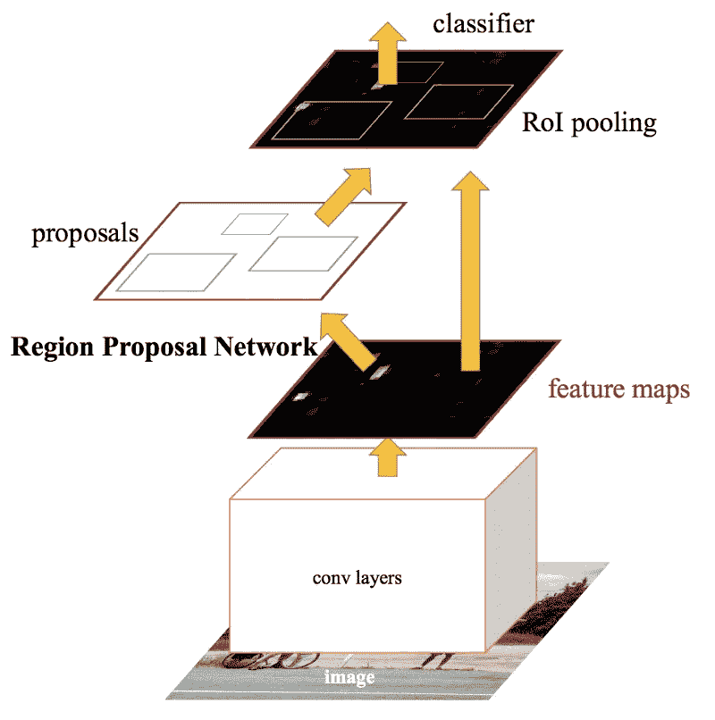

查看这篇文章，这篇文章对网络进行了更深入的描述。
[【论文】](https://arxiv.org/pdf/1506.01497.pdf) | [【实现。(pytorch)]](https://github.com/facebookresearch/detectron2) | [【实现。(tensorflow)]](https://github.com/tensorflow/models/tree/master/research/object_detection) | [【中篇】](https://towardsdatascience.com/faster-r-cnn-for-object-detection-a-technical-summary-474c5b857b46)

*   **视网膜网:**

RetinaNet 由脸书人工智能研究中心(FAIR)开发，是一个一级目标探测器，这意味着定位和分类任务可以同时完成。FAIR 给出的主要贡献是网络的损失函数:焦点损失。较低的损失是由“容易的”负样本(没有对象的边界框)造成的，因此损失集中在“硬的”正样本(实际包含框的边界框)。焦点损耗解决了一级检测器的类别不平衡问题:

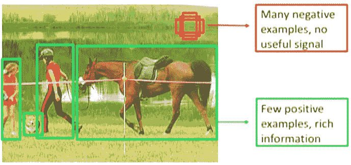

该网络包括:

*   一个特征提取器(通常是 CNN)来获得整个图像的特征图。我们使用在 ImageNet 上预训练的 Resnet101 作为主干。
*   一种特征金字塔网络(FPN ),用于在每个尺度上获取高级特征，以获取不同大小和形状的对象。它使用跳跃连接来建立与主干层的链接。
*   两个子网络:一个对每一层的边界框进行分类，另一个得到更精确的坐标。

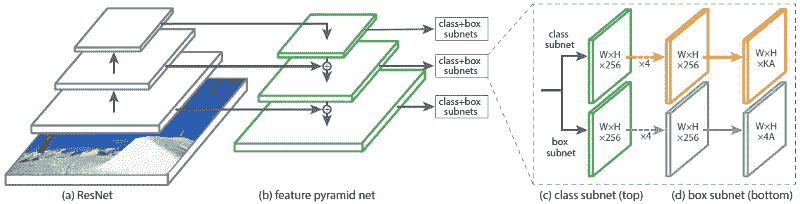

查看这篇对网络有更深入描述的文章。 [【论文】](https://arxiv.org/pdf/1708.02002.pdf)|[【Implem。(keras)]](https://github.com/fizyr/keras-retinanet) | [【实现。(pytorch)]](https://github.com/facebookresearch/detectron2) | [【中条】](https://towardsdatascience.com/review-retinanet-focal-loss-object-detection-38fba6afabe4)

*   **FCOS 物体探测器:**

FCOS 物体检测器是最新的算法(2019 年 8 月)，其特殊性在于它是一个**无锚物体检测器。**

基于锚的物体检测有一些未解决的问题:
-需要调整许多超参数(锚的数量，每个锚的长宽比等。)
-样本之间的类别不平衡:基于锚的模型通过计算锚盒和地面真相盒之间的 IOU 来设置正盒(带有对象的盒)。然而，他们一次生产数千个盒子，并且仅将其中的一些盒子标记为阳性盒子，而将大多数盒子标记为阴性(背景)。

FCOS 结构与 RetinaNet 相同:使用[特征金字塔网络(FPN)](https://arxiv.org/abs/1612.03144) 创建特征图，并在每个特征图后添加头部来训练**分类**、**包围盒回归**和一个名为**中心度**的高贵指标。

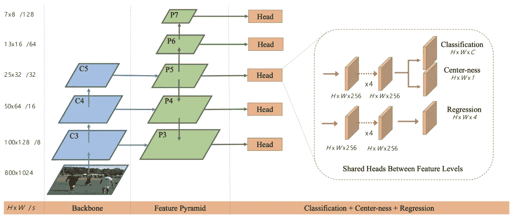

FCOS 把地面真值箱中的每一点都当作正样本。这导致远离对象中心的位置产生大量低质量的预测边界框。为了防止这种情况，他们添加了有效的索引来抑制这种被称为**中心度**的预测包围盒。它是一个描述点到地面真值盒中心距离的指标，作为一个分支添加在特征图之后。定义如下所示。

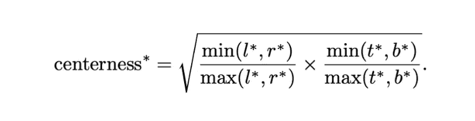

查看这篇对网络有更深入描述的文章。 [【论文】](https://arxiv.org/pdf/1904.01355.pdf)|[【Implem。(tensorflow)]](https://github.com/DetectionTeamUCAS/FCOS_Tensorflow) | [【实现。(pytorch)]](https://github.com/tianzhi0549/FCOS) | [【中条】](/lsc-psd/fcos-one-shot-anchor-free-object-detection-a3102da819bc)

# 输出过滤

一旦训练完成，每种算法都会输出数千个包围盒以及它们的预测类别和置信度得分。其中只有少数应该符合地面真相。因此，我们需要过滤原始输出，否则，我们将无法可视化相关的预测框。

有两种类型的过滤技术:

**1 —对置信分值应用阈值** 由于只有 1 或 2 个基础事实框，如果网络训练有素，大多数预测框应该具有非常低的置信分值。因此，我们应该只保留具有高分数的那些(例如，移除那些具有小于 0.75 的置信分值的那些)。
这将删除所有不相关的预测框。

**2 — NMS(非最大抑制)** 我们期待模型在地面真值包围盒上学习得很好。然后，我们应该期望许多预测的盒子与一个真实的盒子相匹配。在这种情况下，只有一个盒子被认为是真阳性，其他的被认为是假阴性。我们应该预料到这些盒子彼此非常接近，大小也差不多。(因此，我们可以认为匹配相同基础真值框的每对预测框的 IoU(交集/并集)大于 0.5)。对于这组预测的盒子，我们保留具有最高置信度得分的那个。

查看[这篇文章](https://towardsdatascience.com/non-maximum-suppression-nms-93ce178e177c)了解更多信息。
下面是一个带有原始预测框并经过过滤的图像示例:

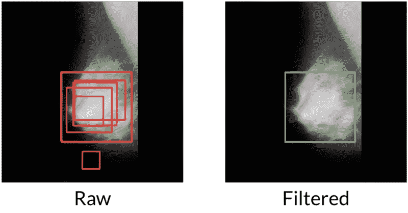

# 结果

在展示我们的结果之前，我们需要介绍一下我们用来比较这些算法的指标。

对于每个基本事实框，如果模型预测了一个框，则其位置或类别(或两者)是错误的，或者两者都是正确的。否则，没有预测框链接到这个基础事实框。因此，有 3 种不同的情况:

*   **FN(假阴性)**:有一个地面真值框，但没有与之链接的预测框。
*   **FP(误报)**:预测的箱子位置和/或类别错误
*   **TP(真正)**:有一个地面真值，链接到它的预测框(IoU > 0.5)有正确的类。

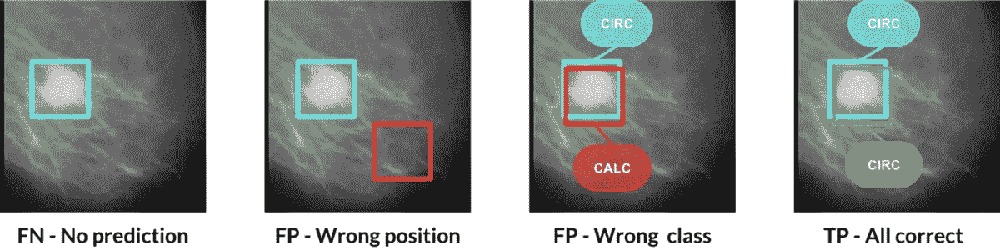

有了这些数字，我们可以创建两个新的指标:**精度**和**召回**。

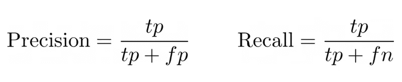

以下是每种算法每类的精度和召回率结果:

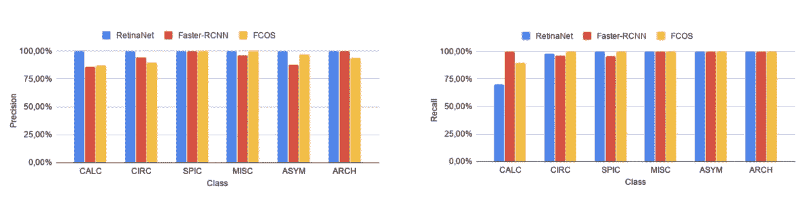

我们开始通过绘制每类/肿瘤类型的精确度和召回率来评估 3 种 SOTA 算法的性能。让我们记住，获得高召回意味着低假阳性率，这意味着我们在错误的位置和/或错误的类别错误中有所下降。而获得高精度意味着低的假阴性率，意味着没有预测。

*   上面的直方图显示了这些算法在 CALC 类的召回率和精确度方面的不佳表现。事实上，RetinaNet 给出了该类的低召回率，但是在相同的类上有非常好的精确度。
*   对于 ARCH 和 CIRC，我们通过使用 3 SOTA 获得了很好的召回分数，但是精确度分数低于其他类别，尤其是当我们使用 FCOS 时。
*   SPIC 和 ASYM 具有可比的结果，因为我们用 FCOS 和 RetinaNet 获得了出色的召回率和精确度分数，而用 fast-R CNN 获得了稍低的性能。
*   对于杂项类，我们使用 3 种 SOTA 方法获得了 100%的召回率，使用 RetinaNet 和 FCOS 获得了 100%的准确率。

总的来说，我们使用 3 个 SOTAs 中的一个在 MISC、ASYM 和 ARCH 类上获得了 100%的召回率，并且我们可以注意到，考虑到召回率和精确度，更快的 R-CNN 为 CALC 类提供了最好的性能。

**最终结果**

为了从这三个网络中选择一个，我们需要一个指标来比较它们，这个指标要结合精确度和召回率，并考虑到假阴性比假阳性要糟糕得多。因此，我们依赖于 **F5 得分**，它是精确度和召回率的调和平均值，召回率被认为是精确度的 5 倍重要:

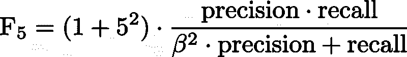

使用这一新指标，以下是 3 种算法的结果:

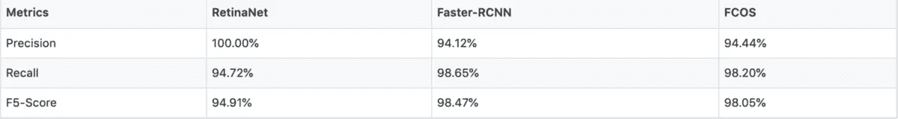

实验结果表明，该算法的 f5 评分为 98.45%，优于其他算法。这一突出的结果是由于在 CALC 分类上的高召回率，也是由于在检测小肿瘤方面更快的 RCNN 优于其他算法的事实。

至于 RetinaNet，我们获得了 100%的准确率，这是一个很好的结果，但仍然不够，94.72%的召回率使其在 f5 分数方面排名第三，仅次于 fast-RCNN 和 FCOS。

# 丰富

*   就性能(精度/召回率)而言，这三种算法是互补的。因此，考虑集成学习技术以受益于每个算法的优点是适当的。查看[这篇文章](https://towardsdatascience.com/simple-guide-for-ensemble-learning-methods-d87cc68705a2)了解更多信息。
*   由于“只有”大约 400 张可用图像，我们应该尝试更好的数据扩充，使用[自动增强](https://arxiv.org/pdf/1805.09501.pdf)或 [DAGANs](https://arxiv.org/pdf/1711.04340.pdf) 或使用迁移学习，首先在更大的数据库(如 [DDSM 数据库](https://wiki.cancerimagingarchive.net/display/Public/CBIS-DDSM))上训练我们的网络

# 参考

我们的 github 回购:[https://github.com/delmalih/mias-mammography-obj-detection](https://github.com/delmalih/mias-mammography-obj-detection)

[1] K .何等。艾尔。“更快的 R-CNN:走向实时目标检测”——
【2】t .-y . Lin 等。艾尔。“密集物体探测的焦损失”
【3】沈等。艾尔。“FCOS:全卷积一阶段物体检测”——[https://arxiv.org/pdf/1904.01355.pdf](https://arxiv.org/pdf/1904.01355.pdf)
【4】faster CNN 实现——[https://github.com/facebookresearch/maskrcnn-benchmark](https://github.com/facebookresearch/maskrcnn-benchmark)
【5】retina net 实现——[https://github.com/fizyr/keras-retinanet](https://github.com/fizyr/keras-retinanet)
【6】FCOS 实现——[https://github.com/tianzhi0549/FCOS](https://github.com/tianzhi0549/FCOS)
【7】MIAS 数据库——[https://tinyurl.com/y6elv5dr](https://tinyurl.com/y6elv5dr)

# 项目海报

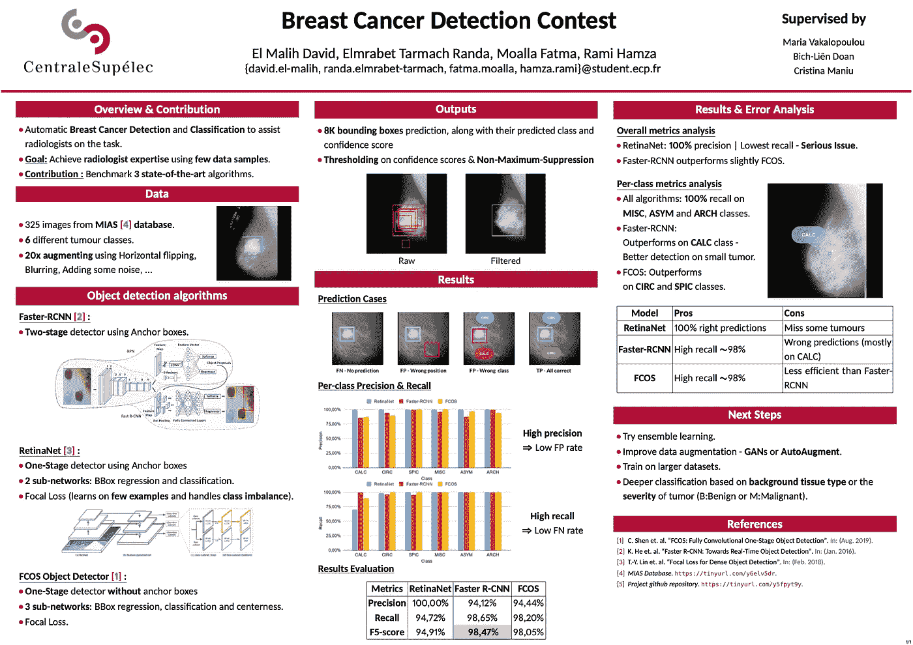