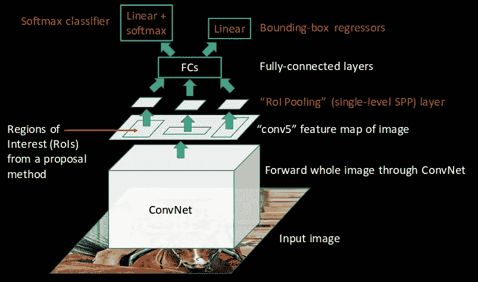

# 基于深度神经网络的乳腺癌检测

> 原文：<https://medium.com/analytics-vidhya/breast-cancer-detection-using-deep-neural-network-6691a472d7a7?source=collection_archive---------17----------------------->

# (U-Net，更快的 R-CNN)

案例研究

# 介绍

乳腺癌可以通过使用两种类型的图像来检测

1.乳房 x 光图像 2。组织学图像

我们可以将深度学习技术应用于这两种类型的图像，但后一种(即组织学图像)产生更高的准确性，因为图像包含更高的细胞细节，并且具有高分辨率。因此，在这种情况下，我们要进行组织学成像。

苏木精和伊红染色的乳腺组织学图像。

# 我们的任务

我们的任务是检测图像中的有丝分裂细胞。

有丝分裂细胞(左)，非有丝分裂细胞(右)

有丝分裂计数是乳腺癌诊断的关键指标。

许多机器学习和深度学习技术，如 SVM，决策树，CNN 等已经得到应用。

但是由于各种计算和数据相关的问题，很少有层数更多的深度学习模型得到应用。

在本案例研究中，我们将使用 U-Net 进行图像分割，然后使用更快的 R-CNN 进行对象检测。

# 资料组

我们将使用医学研究和竞赛中使用的两个数据集。

1.  2012 年 ICPR 的有丝分裂数据集。l [墨水](http://ludo17.free.fr/mitos_2012/index.html)

该数据集包含具有 300 个有丝分裂细胞 50 幅图像。病理学家还在每个选择的图像中手工注释有丝分裂。

(H&E)乳房图像(左)，带注释的图像(右)

黄色区域是有丝分裂细胞。还为每个图像提供了具有包含有丝分裂细胞区域的每个像素的 x 和 y 坐标的 csv 文件。

2.来自 ICPR 2014 的有丝分裂数据集

该数据集包含大约 1000 幅图像。

(H&E)乳房图像(左)，标有有丝分裂中心的图像(右)

这里黄点代表有丝分裂细胞的中心。

该数据集的问题在于，与第一数据集不同，不提供逐像素注释，仅提供有丝分裂细胞的中心。

# 我们的方法

我们的任务是识别有丝分裂细胞并在其周围创建包围盒。这是一种对象检测，其中对象是有丝分裂细胞，而不是猫、狗或人。

为了训练对象检测算法，我们需要带有注释的图像。具体来说，我们需要对象的边界框坐标，如{x，y，width，height}

由于我们数据集都不包含这些值，所以我们不能直接训练对象检测器。

**用于已经有像素级注释的数据集 1** 。为了获得边界框坐标，我们将首先使用每个图像的 csv 文件，使用包含有丝分裂细胞的区域的每个像素的 x，y 坐标，创建图像的游程编码(RLE)。

游程编码在这里可以被解释为图像的掩码。其中有丝分裂细胞区域的像素为白色，其余为黑色。

带注释的图像(左)，RLE 图像(右)

在创建图像的 RLE 之后，我们可以使用正常的图像处理技术来找到边界框坐标。

对于数据集 2，我们没有像素注释。因此，我们不能使用与数据集 1 相同的技术。我们必须找到一个替代的方法来找到边界框坐标。

我们将训练一个图像分割神经网络，它将分割有丝分裂细胞的区域，并将输出图像的掩模或 RLE。

为了训练一个图像分割网络，我们需要像数据集 1 一样的带有遮罩的图像。因此，我们将使用数据集 1 训练图像分割模型。使用这个模型，我们将得到数据集 2 的掩模或 RLE 图像。

在获得数据集 2 的图像的 RLE 后，我们可以获得与数据集 1 相同的边界框坐标。

在获得两个数据集的图像的边界框坐标之后，我们将训练对象检测网络。

对于图像分割，我们将使用 U-Net，对于对象检测，我们将使用更快的 R-CNN。训练后，我们的模型输出的图像应该像这样

(H&E)边界框中有有丝分裂细胞的乳房图像

# 什么是图像分割？

**图像分割**是将数字图像分割成多个片段的过程。更准确地说，图像分割是给图像中的每个像素分配标签的过程，使得具有相同标签的像素共享某些特征。

输入图像(左)，分段图像(右)

对于图像分割，我们将使用称为 U-Net 的全卷积网络(FCN)。

# 什么是物体检测？

**对象检测**是在数字图像和视频中检测某类语义对象的实例(如人、建筑物或汽车)。定位是使用边界框完成的，如图所示。

输入图像(左)，输出图像(右)

对于物体检测，我们将使用更快的 R-CNN。

# 完全理解卷积网络(FCN)

通常在用于图像分类的简单卷积神经网络(CNN)中，我们有一系列卷积层，接着是最大池层，最后是输出分类结果的全连接层。

分类

但是在图像分割中，我们希望对输入图像中的所有像素进行分类。为了达到以下目的，我们将使用卷积层代替全连接层，然后对其进行上采样以输入图像尺寸。

这种类型的网络被称为全卷积网络(FCN)

**上采样**层与卷积层相反。卷积是使输出尺寸变小的过程，而上采样是使输出尺寸变大的过程。

有各种方法来进行上采样，但我们对使用转置卷积的**上采样感兴趣**

# 转置卷积

转置卷积用于使用一些可学习的参数将输入特征映射上采样为期望的输出特征映射。

转置卷积运算

在这个过程中，每个输入单元与内核中的每个单元相乘。对所有的输入单元格都进行这个过程。在输出端，我们添加所有产生的上采样特征。

# 了解优信网

它被称为 U-Net，因为如图所示，它有一个“U”形结构。如果我们将架构分为两个对称部分，那么左边的部分称为收缩路径或下采样层。每个下采样层包含两个卷积和一个 max pool，这是一般的卷积过程。

右边部分是扩展路径或上采样层。每个上采样层包含两个上采样层(此处为**转置卷积)**和 max pooling。在上图中，我们有五个这样的下采样和上采样层。当输入图像大时，这种层的数量可以增加，反之亦然。

网络的瓶颈部分在收缩和扩展路径之间，这些路径由两个卷积层和一个转置卷积(上采样层)组成。

在下采样路径和上采样路径之间也存在跳跃连接。这些跳跃连接旨在向上采样时向全局信息提供局部信息。

最后得到与输入图像具有相同维数的输出分割图像。

优信网代码

代码分为三部分:下采样，瓶颈，上采样。

我们有六层下采样。每层有两个卷积层和一个最大池层。同样，每个层都保存在一个列表中，这样我们就可以在跳过连接中使用它

在包含两个卷积层和一个上采样层(这里是转置卷积)的瓶颈层中

那么我们有六个上采样层。每层有两个卷积层和一个上采样层(这里是转置卷积)。还应用跳过连接，其中我们将当前层与保存在列表中的来自下采样侧的对应层连接。

# 目标检测算法的发展

## 简要说明

## 使用 CNN 的目标检测

对于对象检测，我们可以使用一种简单的方法来训练 CNN 分类器，并向网络提供图像的裁剪区域。但是这种方法的问题是裁剪区域中的对象可能具有不同的纵横比和空间位置。

## 基于 R-CNN 的目标检测

为了克服前面的问题，我们使用**选择性搜索**从图像中提取这些盒子(这些盒子被称为区域)。选择性搜索从一幅图像中提取大约 2000 个区域，称为**感兴趣区域(ROI)。然后我们使用** CNN 提取每个感兴趣区域的特征，并使用支持向量机将这些区域分成不同的类别。边界框回归( *Bbox reg* )也被用于预测每个识别区域的边界框。

美国有线电视新闻网的运作

我们不使用裁剪过的图像，而是使用区域，这就是为什么它被称为基于区域的卷积神经网络。

这个网络的缺点是它非常慢，因为对于一个图像它产生大约 2000 个区域，因此对于 N 个图像 N*2000 是非常大的。

## 基于快速 R-CNN 的目标检测

以前方法的问题是对一幅图像运行 CNN 2000 次。为了克服这一点，我们将输入图像提供给 CNN，CNN 进而生成卷积特征图。使用这些图，提取提案的区域。然后，我们使用 RoI pooling 层将所有建议的区域重新调整为固定的大小，以便将其输入到一个完全连接的网络中进行分类，并同时使用 softmax 和线性回归层返回边界框

快速 R-CNN 的工作原理

快速 R-CNN 的问题是，它还使用选择性搜索作为建议方法来寻找感兴趣的区域，这是一个缓慢而耗时的过程

# 了解更快的 R-CNN

我们将使用**区域提议网络(RPN)** ，而不是使用选择性搜索来生成感兴趣的区域。RPN 将图像特征图作为输入，并生成一组对象提议，每个提议都有一个对象性分数作为输出。

快速 R-CNN 的工作原理

在上图中，如果我们用选择性搜索替换 RPN 网络，它将成为快速 R-CNN。唯一的区别是快速 R-CNN 使用选择性搜索，而快速 R-CNN 使用 RPN 来生成感兴趣的区域。

ROI 池用于对非均匀大小的输入执行最大池，以获得固定大小的特征地图。这里的输入是来自 CNN 的特征图和来自 RPN 模型的感兴趣区域。

在 ROI 合并之后，有两个完全连接的层，这两个层被连接到边界框回归器和用于输出的 softmax 分类器。

**代号**

美国有线电视新闻网(VGG-16)

我们已经使用预训练的 VGG-16 从图像生成特征地图。为此，我们从网络中移除了顶层。

VGG-16 结构

RPN 的代码

然后我们创建一个 rpn 网络，它从 VGG-16 模型中提取输入特征。它有一个回旋层分支成两个以上的回旋层。

x_class 分类是否是一个对象。x_regr 包含边界框坐标。

RPN 的结构

分类器代码

第一个 ROI 汇集(RoiPoolingConv)是通过 VGG-16(base_layer)生成的特征图和从 RPN 网络创建的 ROI(input _ ROIs)完成的。然后，它被传递到分类器网络，该分类器网络包含两个完全连接的层，该层被连接到边界框回归器(out_regr)和用于输出的 softmax 分类器(out_class)。

我们不使用 Conv2D，而是使用时间分布式。这是因为我们需要避免将几个图像合并成一个，因为所有图像的整个像素列表将被发送到第一层。为了避免这种情况，我们使用了时间分布。

分类器的结构

边界框将给出坐标，分类器将检测背景或前景。

# 工作流程

逐步过程

# 结果

两种 HPF 的有丝分裂检测结果

该模型的精度为 0.42，召回率为 0.36，F 值为 0.37