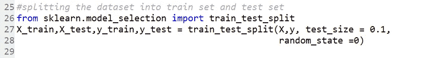
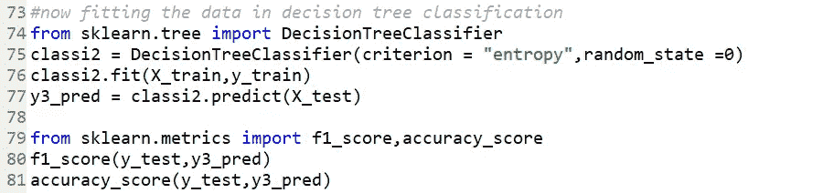

# 乳腺癌检测-使用机器学习算法

> 原文：<https://medium.com/analytics-vidhya/breast-cancer-detection-using-machine-learning-algorithms-1f61000508d8?source=collection_archive---------11----------------------->

图片来自:[https://www.youtube.com/watch?v=NSSOyhJBmWY](https://www.youtube.com/watch?v=NSSOyhJBmWY)

在本文中，我们将讨论乳腺癌的检测方法。**乳腺癌**是从乳腺组织发展而来的**癌症**。如果没有在早期发现，结果将是患者死亡。世界范围内大约有 12%的女性受到乳腺癌的影响，而且这个数字还在增加。

所以要解决这个问题，ML 扮演了一个非常重要的角色。ML 算法有助于确定细胞是恶性还是良性。ML 算法可以更有效地确定癌细胞。

我使用了来自**ka ggle-Breast-Cancer-Wisconsin(诊断)的乳腺癌数据集。**点击链接下载数据集:[https://www.kaggle.com/uciml/breast-cancer-wisconsin-data](https://www.kaggle.com/uciml/breast-cancer-wisconsin-data)

所以，让我们开始这个项目。

**1 —导入基本库**

**2 —数据集导入**

我们通过 python 库 pandas 导入数据集。并将数据集分为因变量( **y** )和自变量( **X** )。因变量由细胞状态( **M** 或 **B)** 组成，自变量由 30 个特征组成。

*输出->-*

x 集

y 集

**3 —对分类数据进行编码**

由于因变量( **y** )由字符串组成，因此它们必须以二进制格式编码，这样我们的模型在分类中就不会发现任何问题。为了编码，我们使用 python 的 Scikit-learn 库中的标签编码器类。

*输出->*

1=M，0=B

**4 —将数据集分为训练集和测试集**

现在，为了训练和测试模型，我们首先将数据分为训练集和测试集。为了将数据集分成训练和测试，我们使用 Scikit-learn 的模型选择库。

**5 —缩放数据的特征**

由于我们需要模型的精确预测，我们需要对数据进行特征缩放。因此，为了对数据进行特征缩放，我们使用 Scikit-learn 的预处理库的标准 Scaler 类。

# **机器学习模型构建**

我们必须建立最好的模型来对细胞进行分类。因此，我们必须使用多种机器学习算法来训练和测试数据集，并确定具有高准确性的最佳模型。

> **随机森林回归模型**

由于随机森林模型的输出是浮点数，我们将其转换为二进制形式。

*输出->*

accuracy _ score =**0.9298245614035088**

f1 _ score =**0.91666666666666**

> **K-最近邻模型**

*输出->*

accuracy _ score =**0.9473684210526315**

f1 _ score =**0.93333333333332**

> **朴素贝叶斯模型**

*输出->*

accuracy _ score =**0.912807017543859**

f1 _ score =**0.89836734693**

> **决策树分类模型**

*输出->-*

accuracy _ score =**0.9298245614035088**

f1 _ score =**0.9130434782608695**

> **随机森林分类模型**

*输出->*

accuracy _ score =**0.9649122807017544**

f1 _ score =**0.9565217391304348**

> **混淆矩阵**

*输出->*

随机森林分类器给出的准确率为 **96.49%** ，有 2 个错误预测。因此，我们可以说随机森林分类器模型是我们可以用来分类细胞的最佳模型。

> **保存并加载模型**

机器学习项目完成后，ML 模型需要部署到应用程序中。为了部署 ML 模型，我们需要首先保存它。为了保存机器学习项目，我们可以使用 **pickle** 或 **joblib** 包。在这里，我使用 python 的 pickle 包来加载和保存模型。pickle 或 joblib 包将模型保存到该地址，稍后为了部署模型，我们可以简单地通过 pickle 文件加载模型。

# 结论:

经过对所有算法的训练，我们发现随机森林回归、KNN、决策树分类、随机森林分类模型都有较高的准确率。从这些模型中，我们选择随机森林分类模型，因为它给出了最高的准确性。

请分享您对这篇文章的宝贵反馈，也分享您的疑问，以便我可以尽快更新。

我希望你理解这个机器学习项目，并喜欢它。我希望我的努力对挽救乳腺癌患者的生命有价值。我希望更多的临时模型能够更加精确，帮助我们解决这个问题。

