# 乳腺癌风险预测系统

> 原文：<https://medium.com/analytics-vidhya/breast-cancer-risk-prediction-system-a575c2eb8130?source=collection_archive---------15----------------------->

**问题陈述:**

乳腺癌是全球癌症死亡的主要原因之一。早期诊断大大增加了正确治疗和存活的机会，但这一过程是乏味的，并经常导致病理学家之间的分歧。计算机辅助诊断系统显示了提高诊断准确性的潜力。但是早期发现和预防可以大大降低死亡的几率。尽早发现乳腺癌很重要。

**先决条件:**

Python，机器学习

**解决方案:**

我们将使用机器学习算法决策树建立一个模型，该模型将根据以下信息预测乳腺癌类型:-

*   乳房半径
*   纹理
*   最差半径等。

**方法论&备选方案:**

*   我们计划在使用 python 的实现中使用决策树算法。之所以如此，是因为它是一种有效的算法，可以根据一些决策(所做的比较)来预测数据。构建一个根节点，然后针对不同的节点进行拆分，并在预测结果之前采取和考虑不同的决策。根节点取决于所计算的数据集中的信息增益和熵。
*   使用这种算法的优点是非常容易理解，并且可以处理分类和回归问题。
*   这种算法的缺点是，即使是数据的小变化也可能转化为模型的大变化。

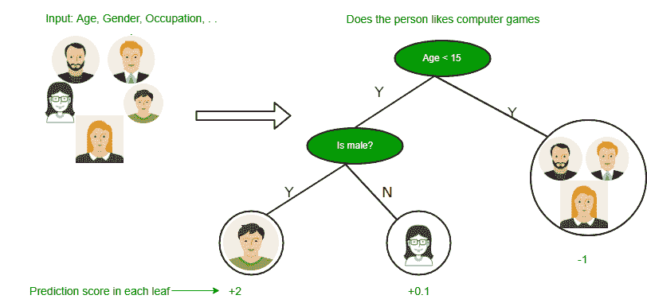

*   这里可以使用的另一种算法是随机森林分类器，它为这些新数据帧中的每一个拟合一棵树，并通过平均森林中的所有树来进行预测。这样做的好处是，该算法适用于大型数据集，也适用于高维数据。

**程序:**

从实现部分开始，需要 python 和机器学习算法、决策树的基础知识。

**步骤 1:** 准备好数据集。我使用了从 ka ggle([https://www.kaggle.com/uciml/breast-cancer-wisconsin-data](https://www.kaggle.com/uciml/breast-cancer-wisconsin-data))下载的乳腺癌风险预测数据集，该数据集具有以下属性:

1)身份证号码

2)诊断(M =恶性，B =良性)

3–32)

为每个细胞核计算十个实值特征:

a)半径(从中心到周边各点的平均距离)

b)纹理(灰度值的标准偏差)

c)周界

d)面积

e)平滑度(半径长度的局部变化)

f)紧密度(周长/面积-1.0)

g)凹度(轮廓凹入部分的严重程度)

h)凹点(轮廓的凹入部分的数量)

I)对称性

j)分形维数(“海岸线近似值”-1)

除“诊断”属性外，所有列都包含数字数据。该诊断属性包含癌症类型，即- M(代表恶性)或 B(代表良性)，它是文本数据。

**步骤 2:** 导入 python 中所有必需的库

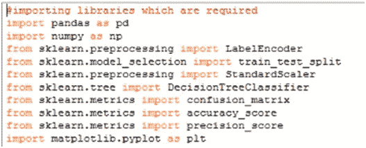

Python 库

使用的库及其功能:

1.  **熊猫** -这个库将被用来处理 python 中的数据集。例如:加载数据集，检查丢失的值，数据帧等。
2.  **NumPy**——这个库将在需要的时候用来塑造我们的数据。
3.  这是一个非常有用的 python 库。使用这个库的模块预处理。在预处理模块中，我们需要标签编码器和标准缩放器功能来对数据进行编码，并对其执行功能缩放。此外，该库中的另一个模块 model_selection 将用于导入 train_test_split 函数，该函数是拆分训练和测试数据中的数据集所必需的。这个库中的下一个模块是我们从中导入决策树分类器的树。该库中的最后一个模块是 metric，我们将从中导入混淆矩阵、准确度分数和精确度。

**步骤 3** :处理数据集

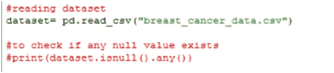

使用 pandas，read_csv 读取数据集并使用”。isnull()。any()"函数来检查数据集中是否有任何缺失值。“#”用于注释代码行，但是如果我们运行 print()语句，我们将得到列和布尔值形式的输出，如果列有任何缺失值，则为 true，否则为 false。

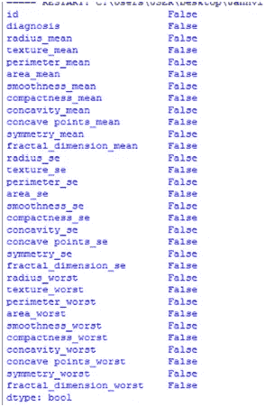

每一列都有 false 值，这意味着我们没有任何缺失值。

现在进入下一步。

**第四步:**编码数据

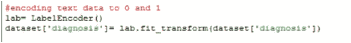

我们知道“诊断”列包含文本数据，但我们的机器无法理解文本数据，因此我们需要将其转换为二进制数据。对于这种转换，我们使用诊断列上的标签编码器将 M 和 B 转换为它们各自的编码器二进制数。要知道 M 或 B 的赋值，我们可以打印数据集。如果我们将有两个以上的文本值，我们将进一步在列上使用一个热编码，因为标签编码器将把文本翻译成像 0，1，2，…这样的值。

**第五步:**将数据拆分为自变量和因变量

对数据进行编码后，我们需要将数据集分为因变量和自变量，其中自变量包含用于预测结果的列，但它们彼此不依赖，因变量包含需要预测结果的列。

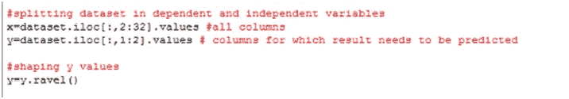

".来自 pandas 的“iloc”用于选择列范围。

在这里，我们还使用了 numpy 的 ravel()将 y 中的数据以数组的形式成形。

**步骤 6:** 将数据集分割成训练和测试数据

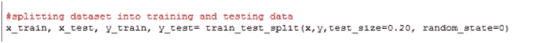

正如我们所知，在机器学习中，我们需要在某些数据上训练我们的机器，以便在测试时它可以显示良好的结果。因此，这里我们需要将数据集分成训练和测试数据。Sklearns 的 train_test_split()在这里用于拆分数据，在 LHS 端，我们有存储训练和测试数据的变量，x_train 和 y_train 变量将存储 x 和 y 变量的训练数据，同样也存储测试变量的训练数据。在函数参数中，我们有 x、y 列(完整数据)、test_size(这表明有多少百分比的数据将是测试数据)和 random_state 变量。

**第七步:**进行特征缩放

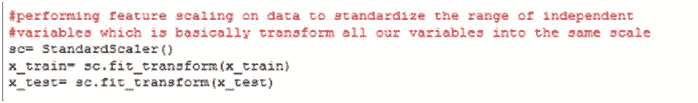

这是一种用于标准化独立变量范围或数据特征的方法。很多机器学习模型都是基于欧氏距离的。例如，如果一列(x)中的值比另一列(y)中的值高得多，则(x2-x1)的平方将给出比(y2-y1)的平方大得多的值。很明显，一个平方差比另一个平方差占优势。在机器学习等式中，与大得多的值相比，具有较低值的平方差将几乎被视为不存在。我们不希望这种情况发生。这就是为什么有必要将我们所有的变量转换成相同的尺度。有几种方法可以缩放数据。一种方法叫做标准化，可以使用。对于所选列的每个观察值，我们的程序将应用标准化公式，并将其拟合到一个刻度。

可以通过使用 StandardScaler()和拟合自变量来执行。

**步骤 8:** 对数据应用算法

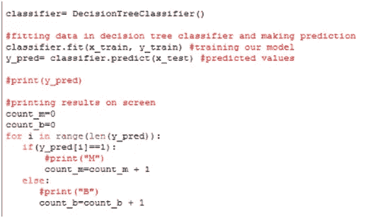

这里我们使用了决策树分类算法。首先，我们在此算法中拟合我们的训练数据来训练我们的模型，然后使用 predict()来预测测试数据的值。在我们的过程完成后，我们只是在屏幕上打印我们的数据。这里，count_m 和 count_b 是存储预测的 M 和 B 癌症数量的变量。

**第九步:**计算指标

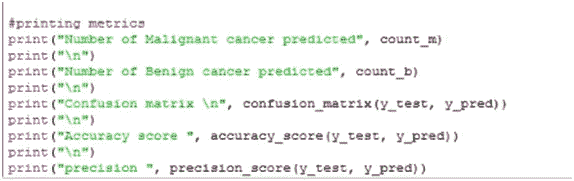

在执行算法并在屏幕上打印结果后，我们还需要评估我们的模型，以检查预测的准确性，这样我们就可以知道它是否可靠。我使用的指标是:

1.  混淆矩阵
2.  准确度分数
3.  精确

**现在是结果时间！！！**

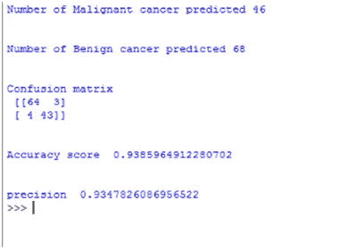

我们已经成功地在我们的数据集上预测了 M 和 B 癌症的数量，它们分别是 46 和 68。这表明患良性癌症的几率高于恶性癌症。混淆矩阵打印值如下:

真阳性= 64

真阴性= 43

假阳性= 3

假阴性= 4

准确度为 0.9386，精确度为 0.9348。

**结论:**

从这个项目得出的结论是，良性癌症比恶性癌症更常见。恶性肿瘤对健康有害，而良性肿瘤对健康危害不大，但如果不治疗，良性肿瘤很少会转化为恶性肿瘤。如果出现症状，不应该忽视，如果严重，可能会导致死亡。计算机辅助诊断系统显示了提高诊断准确性的潜力。但是早期发现和预防可以大大降低死亡的几率。尽早发现乳腺癌很重要。

**限制:**

这个项目使用了一个决策树分类器，对于数据集中的小变化，其输出容易发生大的变化。

**未来范围:**

我们计划为这个项目建立一个交互界面，并通过机器学习向患者建议预防措施和应对策略。