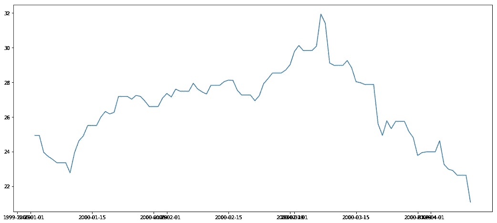

# 预言家和 ARIMA 预测布伦特原油价格

> 原文：<https://medium.com/analytics-vidhya/brent-oil-prices-forecast-with-prophet-and-arima-50f5f177da5b?source=collection_archive---------4----------------------->

原油价格的变动受到多种因素的影响。这些因素中有些是政治因素，有些则与通货膨胀、经济等有关。有可能根据历史数据预测未来的油价吗？本文将就此问题给出答案。


石油开采，来源:pixabay

在对该主题的文献回顾中，我能够找到之前由[陈等人](https://www.sciencedirect.com/science/article/pii/S1877050917326169)使用深度学习基于长短期记忆预测原油的工作。

# 时间序列

时间序列是按固定时间间隔存储的一系列记录。

根据时间间隔的频率，时间序列可以记录每年、每季度、每月、每天、每小时等等。例如每周商店销售额、每日天气预报、每月收入、每小时股票价格、分钟或秒钟网络流量等。

我们使用时间序列来预测未来，例如，我们可以根据前几年的历史来预测下个月的商店销售额。我们可以根据最近几年的物价上涨来预测通货膨胀。时间序列预测有助于预测汽车的未来销售，因此公司可以加强他们的产品线和供应链等。

# 资料组

此处提供了数据集的完整示例[。数据集的来源是美国能源信息管理局。csv 文件包含两列，日期和价格。该数据包含从 1987 年 5 月 17 日到 2019 年 9 月 30 日的每日历史布伦特油价。让我们探索并微调数据集:](https://www.kaggle.com/mabusalah/brent-oil-prices)

```
#import the csv file
oilPrices = pd.read_csv('/kaggle/input/brent-oil-prices/BrentOilPrices.csv')
#change column names to more comfortable names
oilPrices.columns=['date', 'price']
#Cast Date Column to type date
oilPrices['date'] = pd.to_datetime(oilPrices['date'])
print("Data Set:"% oilPrices.columns, oilPrices.shape)
print("Data Types:", oilPrices.dtypes)
#Check the top five records
oilPrices.head()
```


前五条记录和日期形状

您可能已经注意到，时间序列数据不包含周六和周日的值，因为市场在周末关闭。因此，必须填充缺失的值。要填充周末，首先将日期作为索引(对于重采样方法)，然后使用 forward fill ffill()，该函数将周末值分配给星期五值。重采样法用于时间序列的频率转换和重采样。对象必须具有类似日期时间的索引(DatetimeIndex、PeriodIndex 或 TimedeltaIndex)，或者将类似日期时间的值传递给 on 或 level 关键字。

```
oilPrices.set_index('date', inplace=True)
oilPrices = oilPrices.resample('D').ffill().reset_index()
```

确保我们没有空值:

```
oilPrices.isnull().values.any()
```

让我们将日期分为年、月和周来探究油价的趋势:

```
oilPrices['year']=oilPrices['date'].dt.year
oilPrices['month']=oilPrices['date'].dt.month
oilPrices['week']=oilPrices['date'].dt.week
```

分成训练和测试来预测 2019 年的油价。请注意，我对 2000 年的时间序列进行了训练，因为它证明了更高的准确性:

```
train = oilPrices[(oilPrices['date' ] > '2000-01-01') & (oilPrices['date' ] <= '2018-12-31')]
test = oilPrices[oilPrices['date' ] >= '2019-01-01']
```

年度价格可视化:

```
yearlyPrice=train.groupby(["year"])['price'].mean()
plt.figure(figsize=(16,4))
plt.title('Oil Prices')
plt.xlabel('Year')
plt.ylabel('Price')
yearlyPrice.plot()
plt.show();
```


年度价格可视化

# ARIMA 模型

ARIMA 用于建模非季节性时间序列，它代表“自回归综合移动平均”。我将使用 ARIMA 作为基线模型，对照 Prophet 模型进行测试，看看哪个模型做出的预测更好。此处提供全部参考资料[。](https://www.machinelearningplus.com/time-series/arima-model-time-series-forecasting-python/)

首先，我们需要为 ARIMA 估计量准备数据:

```
#Convert to Time Series For ARIMA Estimator
series=pd.Series(data=train['price'].to_numpy(), index=train['date'])
```

要用 ARIMA 预测时间序列，需要设置三个参数(p，d，q)的值:

*   *p* :自回归(AR)模型的阶数(即滞后观测值的个数)
*   *d* :差异的程度。
*   *q* :均线(MA)模型的阶。这实际上是时间序列数据上“窗口”函数的大小。

# 求 ARIMA 模型中差分(d)的阶

差分的目的是使时间序列平稳。要做到这一点，我们需要衡量今天和昨天之间的差异，然后(明天-昨天，等等。直到我们到达**静止数据**。

一个**平稳时间序列**是一个统计特性——如[均值](https://www.statisticshowto.datasciencecentral.com/mean/)和[方差](https://www.statisticshowto.datasciencecentral.com/probability-and-statistics/variance/)——随时间保持不变的时间序列

我们需要平稳数据来进行时间序列预测。正确的差分顺序是获得一个接近平稳的序列所需的最小差分，该序列在一个定义的平均值附近漫游，并且自相关函数(ACF)图相当快地达到零。

为了检验我们是否有平稳的时间序列，可以使用扩展的 Dickey-Fuller 方法，在存在序列相关性的情况下检验单变量过程中的单位根。如果 p 值 i > 0.05，也就是 0.286247，我们继续寻找差分的阶。

```
from statsmodels.tsa.stattools import adfuller
from numpy import log
result = adfuller(series.dropna())
print('ADF Statistic: %f' % result[0])
print('p-value: %f' % result[1])
```

但在此之前，让我们绘制时间序列中的前 100 条记录，看看 p 值是否可以虚拟演示:

```
plt.plot(series[0:100])
plt.show()
```



很明显，时间序列不是平稳的

由于时间序列不是平稳的，我们需要差分，如果时间序列是平稳的 **d 值将是 0** 。让我们做一天的差分，看看这是否会使数据稳定:

```
daily_series_diff1 = series.diff(periods=1).dropna()
daily_series_diff2 = daily_series_diff1.diff(periods=1).dropna()
fig, ax = plt.subplots()
ax.plot(daily_series_diff1[0:100], label='1st Order Differencing')
ax.plot(daily_series_diff2[0:100], label='2nd Order Differencing')
plt.ylim([-3,3])
legend = ax.legend(loc='upper center', shadow=True)
plt.title('Time Series')
plt.xlabel('Date')
plt.ylabel('Diff')
plt.show()
```


差分后的平稳时间序列

我们在上面看到的示例仅针对时间序列的前 100 条记录，如果我们查看 18 年的原始时间序列，我们会发现下面的示例:


18 年时间序列

一般来说，时间序列听起来并不稳定，但是在测试过程中， **d 的最佳值为零**。

*如果时间的移动不会引起分布形状的变化，则时间序列具有平稳性*；单位根是非平稳性的一个原因，我们注意到在第一次差分后，分布的形状没有变化。

结果显示，d 的最佳值为 1，但让我们通过下式进行最终测试:

*   **增广迪基富勒检验** ( [ADF](https://www.statisticshowto.datasciencecentral.com/adf-augmented-dickey-fuller-test/) ):是对[平稳性](https://www.statisticshowto.datasciencecentral.com/stationarity/)的[单位根](https://www.statisticshowto.datasciencecentral.com/unit-root/)检验。单位根会在您的[时间序列](https://www.statisticshowto.datasciencecentral.com/timeplot/)分析中导致不可预测的结果。
*   **科维亚特科夫斯基-菲利普斯-施密特-申** ( [KPSS](https://www.statisticshowto.datasciencecentral.com/kpss-test/) ):测试判断一个[时间序列](https://www.statisticshowto.datasciencecentral.com/timeplot/)围绕一个[均值](https://www.statisticshowto.datasciencecentral.com/mean/)或线性[趋势](https://www.statisticshowto.datasciencecentral.com/trend-analysis/)是否为[平稳](https://www.statisticshowto.datasciencecentral.com/stationarity/)，或者由于一个[单位根](https://www.statisticshowto.datasciencecentral.com/unit-root/)而非平稳。
*   **菲利普斯-佩伦检验** ( [PP](https://www.statisticshowto.datasciencecentral.com/unit-root/) ) **:** 是一种单位根检验，它是迪基-富勒检验的一种改进，修正了误差中的[自相关](https://www.statisticshowto.datasciencecentral.com/serial-correlation-autocorrelation/)和[异方差](https://www.statisticshowto.datasciencecentral.com/heteroscedasticity-simple-definition-examples/)

```
#Number of differences required for a stationary series
from pmdarima.arima.utils import ndiffs
y=series
# augmented Dickey–Fuller test (adf test)
print("ADF Test: ",ndiffs(y, test='adf'))
# Kwiatkowski–Phillips–Schmidt–Shin (KPSS) test
print("KPSS Test: ",ndiffs(y, test='kpss'))
# Phillips–Perron (PP) test:
print("PP Test: ",ndiffs(y, test='pp'))
```

三个测试输出为 1，这只是为了确保选择差值 **d=1** 的顺序的决定是最正确的。

# 自回归项 P 的阶

下一步是确定模型是否需要 AR 术语。为了找出所需的 AR 项数，我们需要检查偏自相关(PACF)图:

```
plt.rcParams.update({'figure.figsize':(12,3), 'figure.dpi':120})
from statsmodels.graphics.tsaplots import plot_pacf
fig, axes = plt.subplots(1, 2, sharex=True)
plot_pacf(daily_series_diff1, lags=10, ax=axes[0], title="Partial Autocorrelation 1st Order Differencing")
plot_pacf(daily_series_diff2, lags=10, ax=axes[1], title="Partial Autocorrelation 2nd Order Differencing")
plt.xlabel('Lag')
plt.ylabel('PACF')
plt.show()
```


一阶和二阶差分自相关

PACF 是序列与其滞后之间的相关性，在排除中间滞后的贡献之后。所以，PACF 在某种程度上传达了滞后和系列之间的纯粹相关性。这样，我们就能知道 AR 项目中是否需要这种滞后。如果我们考虑一阶差分 p=0 或二阶差分后的 PACF，那么 **p=1** 。

# 求移动平均项 q 的阶

就像我们看 PACF 图中 AR 项的数量一样，我们也可以看 ACF 图中 MA 项的数量。MA 术语在技术上是滞后预测的误差。

ACF 告诉我们需要多少 MA 项来消除平稳序列中的任何自相关。

如果自相关对于许多滞后(10 或更多)是正的，那么序列需要进一步差分。另一方面，如果滞后 1 自相关本身太负，那么序列可能是过差的。我做了两个区别，让我们看看下面的自相关性:

```
plt.rcParams.update({'figure.figsize':(12,3), 'figure.dpi':120})
from statsmodels.graphics.tsaplots import plot_acf
fig, axes = plt.subplots(1, 2, sharex=True)
plot_acf(daily_series_diff1, lags=20, ax=axes[0], title="Autocorrelation 1st Order Differencing")
plot_acf(daily_series_diff2, lags=20, ax=axes[1], title="Autocorrelation 1st Order Differencing")
plt.xlabel('Lag')
plt.ylabel('ACF')
plt.show()
```


自相关一阶和二阶差分

对于一阶差分，q=0。在第二次差分中，只有一个滞后远远高于显著性线。所以，让我们把 **q 设为 1** 。这是测试后决定的。所以三个参数(p，d，q)是(1，0，1)

我们也可以通过测量评估每个模型质量的赤池信息标准( **AIC** )来随机拟合模型的不同参数值，以查看最佳拟合值:

```
import pmdarima as pm
model = pm.auto_arima(series, start_p=1, start_q=1,
                      test='adf',       # use adftest to find optimal 'd'
                      max_p=3, max_q=3, # maximum p and q
                      m=1,              # frequency of series
                      d=None,           # let model determine 'd'
                      seasonal=False,   # No Seasonality
                      start_P=0, 
                      D=0, 
                      trace=True,
                      error_action='ignore',  
                      suppress_warnings=True, 
                      stepwise=True)print(model.summary())
```

所以模型的最终形状是:

```
from statsmodels.tsa.arima_model import ARIMA
model = ARIMA(series, order=(1, 0, 1)).fit(transparams=False)
print(model.summary())
```

我们注意到 P>|z|合理地小于 0.05。现在，让我们预测布伦特原油价格开始= ' 2019 年 1 月 1 日'，结束= ' 2019 年 9 月 30 日'

```
ARIMA_Predict = model.predict(start='1/1/2019', end='9/30/2019')
```

# 先知模型

Prophet 是脸书开发的一种工具，用于对具有线性或非线性增长的多重季节性的时间序列数据进行高质量的预测。

# Prophet 如何工作的简要概述

就其核心而言，Prophet 是一个附加模型，包含以下组件:

**T9)y(*t*)=*g*(*t*)+*s*(*t*)+*h*(*t*)+*ϵₜ***

*   *g* ( *t* )模型趋势，描述数据的长期增减。Prophet 结合了两个趋势模型，一个饱和增长模型和一个分段线性模型，这取决于预测问题的类型。
*   *s*
*   *h* ( *t* )对影响商业时间序列的节假日或大型事件(例如新产品发布、黑色星期五、超级碗等)的影响进行建模。)
*   *ϵₜ* 代表不可约的误差项


脸书先知模型

全面的预言家细节可以在论文[中以比例](https://peerj.com/preprints/3190/)预测。现在让我们导入并训练 prophet 模型:

```
from fbprophet import Prophet
d={'ds':train['date'],'y':train['price']}
df_pred=pd.DataFrame(data=d)
model = Prophet(daily_seasonality=False)
model.fit(df_pred)
```

现在让我们预测一下从 2019 年 1 月 1 日到 2019 年 9 月 30 日，273 天的未来油价。

```
future = model.make_future_dataframe(periods=273)
forecast = model.predict(future)
plt.figure(figsize=(18, 6))
model.plot(forecast, xlabel = 'Date', ylabel = 'Price')
plt.title('Brent Oil Price Prediction');
```


使用 Prophet 模型训练和预测时间序列

让我们仅以 2019 年为例:

```
forecast2019 = forecast[(forecast['ds' ] >= '2019-01-01') & (forecast['ds' ] <= '2019-09-30')]
```

# 估价

由于我们已经使用了 ARIMA 模型和预言家模型来预测未来的石油价格，所以让我们研究一下这两个模型的预测价格和实际价格，然后评估结果:

```
fig, ax = plt.subplots()
ax.plot(forecast2019['ds'], ARIMA_Predict, label='Predicted Prices')
ax.plot(test['date'], test['price'], label='Original Prices')
plt.ylim([0,100])
legend = ax.legend(loc='upper center', shadow=True)
plt.title('ARIMA Model Brent Oil Prices Forecast 2019')
plt.xlabel('Month')
plt.ylabel('Price')
plt.show()
```


2019 年 ARIMA 模型布伦特油价预测

```
fig, ax = plt.subplots()
ax.plot(forecast2019['ds'], forecast2019['yhat'], label='Predicted Prices')
ax.plot(test['date'], test['price'], label='Original Prices')
plt.ylim([0,100])
legend = ax.legend(loc='upper center', shadow=True)
plt.title('Prophet Model Brent Oil Prices Forecast 2019')
plt.xlabel('Month')
plt.ylabel('Price')
plt.show()
```


预言家模型布伦特油价预测 2019

初步观察表明，用 Prophet 预测的价格比实际价格高一点，而在 ARIMA，预测的价格较低，但两个模型预测的价格都与实际价格有些接近，让我们深入研究一下误差度量。

**平均绝对误差(MAE):** MAE 测量一组预测中误差的平均大小，不考虑它们的方向。MAE 是每个点和身份线之间的平均垂直和水平距离。将预测值和观察值之间的绝对差异相加，然后计算平均值，其中所有个体差异具有相同的权重。


MAE:平均绝对误差(n:集合长度，I:计数器)

```
from sklearn.metrics import mean_absolute_error
maeARIMA=mean_absolute_error(test['price'],ARIMA_Predict)
maeProphet=mean_absolute_error(test['price'],forecast2019['yhat'])
print('Mean Absolute Error ARIMA = {}'.format(round(maeARIMA, 2)))
print('Mean Absolute Error Prophet = {}'.format(round(maeProphet, 2)))
```

**ARIMA 的平均绝对误差为【12.23】**；而**预言者的平均绝对误差为【7.24】**

**均方误差(MSE)** : MSE 是一个二次评分规则，也测量误差的平均大小。它是预测值和观测值之间的平均平方差的平方根。


MSE:均方误差(n:集合的长度，I:计数器)

```
mseProphet = mean_squared_error(test['price'],forecast2019['yhat'])
mseARIMA = mean_squared_error(test['price'],ARIMA_Predict)
print('The Mean Squared Error of ARIMA forecasts is {}'.format(round(mseARIMA, 2)))
print('The Mean Squared Error of Prophet forecasts is {}'.format(round(mseProphet, 2)))
```

**ARIMA 预测的均方误差为【172.32】**，而先知模型的均方误差为**【72.04】。我对 MAE 和 MSE 之间的差异的观察是，预测值和观察值之间的差异在平均之前是平方的，因此如果预测值和观察值之间的差异的绝对值大于 1，MSE 将显示比 MAE 更高的误差，而如果差异的绝对值小于 1，MSE 将小于 MAE。MSE 是一个风险函数，对应于平方误差损失的期望值。在我的演示评估中，我使用了这两种方法。**

**均方根误差**[**(RMSE**](https://www.statisticshowto.datasciencecentral.com/rmse/)**)**:一种预测误差度量，它取 MSE 的根，因为它度量的是[残差的标准偏差](https://www.statisticshowto.datasciencecentral.com/residual/)(残差是数据点和回归线之间的垂直距离)，更多细节可以在[本文](/human-in-a-machine-world/mae-and-rmse-which-metric-is-better-e60ac3bde13d)中找到。


RMSE:均方根误差(n:集合的长度，I:计数器)

```
rmseProphet = sqrt(mseProphet)
rmseARIMA = sqrt(mseARIMA)
print('The Root Mean Squared Error of ARIMA forecasts is {}'.format(round(rmseARIMA, 2)))
print('The Root Mean Squared Error of Prophet forecasts is {}'.format(round(rmseProphet, 2)))
```

**ARIMA 预测的均方根误差为【13.13】**，**预言者的均方根误差为【8.49】**

# 结论

本文旨在探讨时间序列预测在未来油价预测中的应用。尽管油价因多种因素而波动，但 ARIMA 模型和预言家模型的预测价格与实际价格相差不远。在这个实验中，Prophet 模型比 ARIMA 模型的精确度略高。