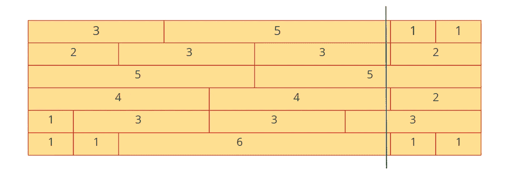

# 如何解决砖墙问题(竞争编程) :一个完整的算法与代码

> 原文：<https://medium.com/analytics-vidhya/brick-and-wall-problem-competetive-programming-a-complete-algorithm-with-code-e351354b6234?source=collection_archive---------2----------------------->

**问题陈述:**

一面墙由几排不同整数长度和统一高度的砖块组成。你的目标是找到一条从墙的顶部到底部的垂直线，这条线穿过最少数量的砖块。如果线穿过两块砖之间的边缘，这不算切割。

例如，假设输入如下，其中每行中的值表示该行中砖块的长度:

```
[[3, 5, 1, 1],
 [2, 3, 3, 2],
 [5, 5],
 [4, 4, 2],
 [1, 3, 3, 3],
 [1, 1, 6, 1, 1]]
```

我们能做的最好的事情就是在第八块砖后画一条线，这将只需要穿过第三和第五行的砖。

给定由每行砖块长度组成的输入，如上图所示，返回创建垂直线所需切割的最少砖块数。

**解说:**

a)首先要考虑的是，如果这条线没有穿过任何一层中两块砖之间的边缘，那么在最坏的情况下，它会穿过每一层中的砖，这使得答案等于墙的高度。


示例 1

b)所以，我们必须让垂直线穿过尽可能多的边。

c)这里的关键是，线应该至少穿过任何层中的一个边缘，否则它必须穿过每层中不需要的砖块。


例 2

d)牢记以上要点，我们到第一层，通过第一块砖边上的垂直线，其长度为 3 个单位。记住，我们的目标是通过一条垂直线至少穿过一条边。所以上图我们也是这么做的。

e)请看上图，我们放置的垂直线穿过第一层砖的边缘，但穿过所有其他层的砖。

f)因此，我们了解到，如果我们将垂直线穿过尺寸为 3 的第一块砖的边缘，那么我们总共切割 5 块砖(除了第一层，每层各一块)，这比切割所有 6 块砖(每层一块砖)要好。

g)因此，我们在尺寸为 5 个单位的第二块砖的边缘应用相同的原理。



示例 3

h)在上图中，可以注意到第二块砖边缘的垂直线只穿过第 3 层和第 5 层的砖。

I)我们将相同的原理应用于每层中砖块的所有边缘，并找到所有边缘中的最小值。仅此而已。我们找到解决办法了。见下面的算法，以一种聪明的方式实现上述解决方案。

**算法:**

**时间复杂度:O(数组大小)**

a)从上述方法中可以看出，我们只关注砖块的边缘。

b)所以我们只跟踪那些边的位置。这意味着只要有一条边，我们就在 2D 数组中存储这个特定的位置，每行代表一层。

例如，上面的问题可以归结如下。

[ [ 3, 8, 9, 10 ]

[ 2, 5, 8, 10 ]

[ 5, 10 ]

[ 4, 8, 10 ]

[1, 4, 7, 10 ]

[ 1, 2, 8, 9,10 ] ]

d)上述矩阵中的每个值代表边缘在相应层中的位置。层 1 在位置 3、8、9、10 处具有边。类似地，对于所有其他层也是如此。

f)下一步很明显。我们应该找出每个值在整个矩阵中出现的次数。例如，值 3 只出现一次。值 8 出现了 4 次。

g)一个值在上述矩阵中出现的次数代表在该特定位置包含边缘的层数。

h)在计算矩阵中每个值的出现次数后，找出其中的最大值。最大值表示在相同位置具有边缘的层的最大数量，这反过来告诉我们，如果我们在边缘的特定位置通过垂直线，这些层不能被切断。

I)我们从墙的高度中减去最大值，这就给出了需要切掉的最少砖块数——如果我们用一条垂直线穿过墙。

**代码(JAVA) :**

**注:**

**a)你可以使用 HashMap 这样的数据结构来存储边的出现次数。**

我使用了一个数组来存储值。

完全解