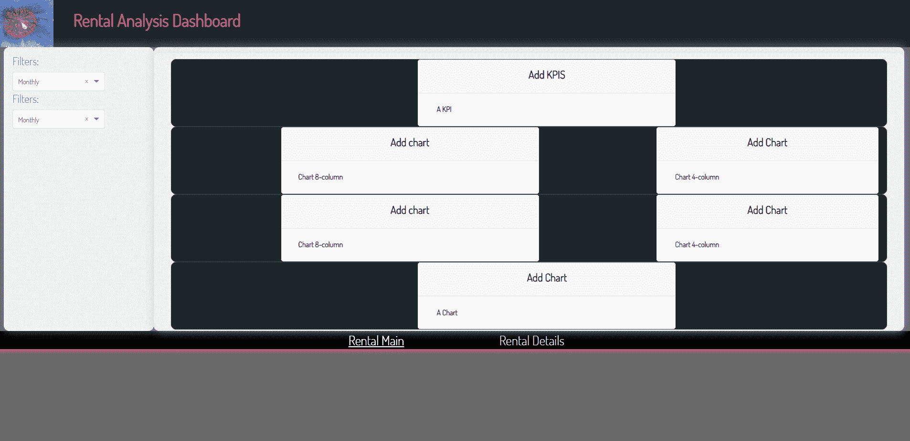
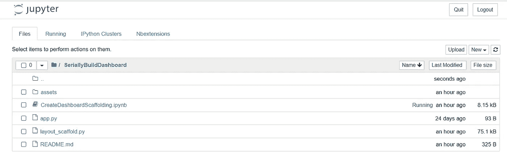
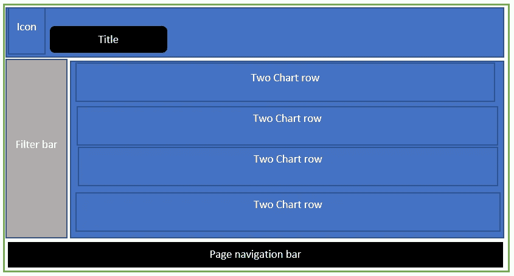
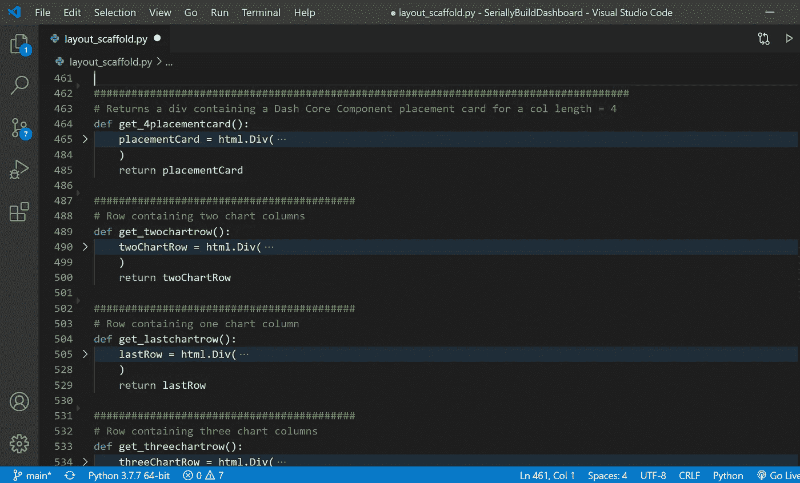
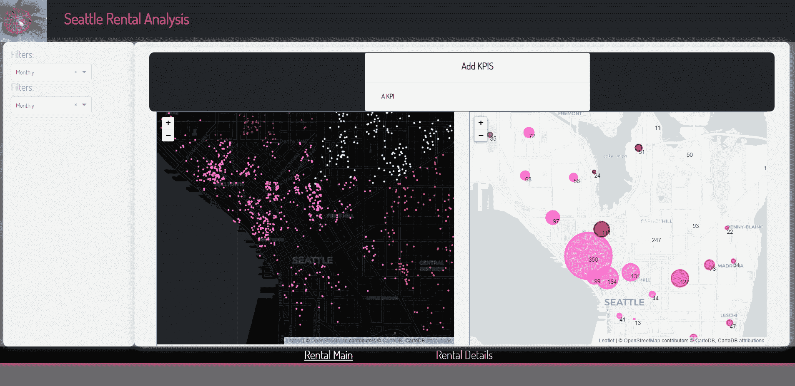

# 一砖一瓦:构建多页仪表板

> 原文：<https://medium.com/analytics-vidhya/brick-by-brick-build-a-multi-page-dashboard-37912dd7d9e6?source=collection_archive---------4----------------------->

第 1 部分:这是关于使用 Plotly Dash 逐步构建仪表板的系列文章的第一部分。我们从支架——页面的 HTML 结构开始。


喜马拉雅蓝罂粟

> ***注:*** *很大程度上要归功于*[***Gabriele Albini***](https://gabri-albini.medium.com/)*他的关于构建* [*专业仪表盘*](https://towardsdatascience.com/create-a-professional-dasbhoard-with-dash-and-css-bootstrap-e1829e238fc5) *结构的项目帮助我开始了自己的 Plotly Dash 仪表盘之旅。我使用了他分享的 HTML 构建结构的元素，特别是创建函数的可重用 HTML 元素，如 get_header 和 get_navbar。*

当一个数据集被转换成你可以从中获得洞察力的图像时，它会变得更有意义。根据上下文组织这些图像，进一步增强了直观价值。仪表板是视觉效果的精选集合，可以最有效地传递关于底层数据集的最大信息。每张图片都充分说明了数据的一个方面。通过精心安排的视觉效果，可以通过一个设计良好的仪表板提供一条通向最终结论的探索路线。仪表板的另一个吸引人的方面是我们可以向用户提供交互元素。这使得用户可以专注于他们感兴趣的数据段。细分市场可以是一个时间跨度，一个区域，一个感兴趣的产品，一个比较选择，你得到要点…交互式可视化中的工具提示和平移功能对于将底层值与可视化表示联系起来非常有帮助。

AirBnB 内部的[为这个仪表盘提供公开数据。当你向下滚动它的网站页面时，你将到达美国西雅图的信息。这是我们将要挖掘的数据。](http://insideairbnb.com/get-the-data.html)

在本系列的第一部分中，我们将决定并实现一个布局。根据 Dash 的文档: [Dash 非常简单，你可以在一个下午内围绕你的 Python 代码绑定一个用户界面](https://dash.plotly.com/introduction)。当我们开始分解数据并在数据中寻找关系时，我们需要将它们放在这个仪表板中。本文将着手创建显示布局。

## 目标

我们的目标是一个仪表板布局如下所示。



## 代码和下载

这个系列的代码可以在这个 [Github repo 找到。](https://github.com/sjtalkar/SeriallyBuildDashboard)该应用程序从 Jupyter 笔记本上运行。有。py (Python)文件，其中包含布局和数据操作的代码。我使用并强烈推荐 Visual Studio 代码来处理这些，因为有许多方便的扩展可用于格式化，这对于构建我们将在本文中完成的 HTML DOM 结构特别有帮助。

## 装置

按照本文 [***中的说明***](/plotly/introducing-jupyterdash-811f1f57c02e)***e***从 Jupyter 笔记本上设置并运行 Dash 应用服务器。Github 中的笔记本还列出了所使用的包及其版本，以帮助您开始使用。

## **结构**

标题栏声明该仪表板是一个租赁分析仪表板。它将包含一个图标来标记我们的仪表板。在标题下方的左侧，我们创建了一个包含过滤器的导航栏。目前，这些都是通用的下拉列表，包含三个选择，每周，每月和每年。随着项目的成熟，我们将使用各种类型的过滤器。在这个脚手架中定义过滤区域。

筛选器窗格的右侧是图表区。我把它分成了四行。第一行将保留给 KPIs 量表或带有汇总信息的卡片，以提供“一目了然”的关键汇总。

接下来，我们将通过地图、线条和条形聊天从不同角度分析数据。这将是绘图区。

最后在底部是页面导航链接的窄带。

## [**文件夹结构**](https://dash.plotly.com/external-resources)



文件夹结构和文件

我们将使用引导有一个响应仪表板页面。为了设计各种 HTML 组件并使用 Bootstrap 的 CSS，我们在 app 目录的根目录下创建了一个名为`assets`的文件夹。我们还将创建一个名为`data`的文件夹，其中包含我们从 AirBnB 网站内部收集的所有 CSV 数据。为了让 Dash 识别这种文件夹结构，请注意，创建应用程序时会在构造函数中包含 __name__。

[**重要:为什么需要在你的 Dash 构造函数中包含**](https://community.plotly.com/t/dash-app-does-not-load-assets-and-app-index-string/12178/10?u=chriddyp) `[**__name__**](https://community.plotly.com/t/dash-app-does-not-load-assets-and-app-index-string/12178/10?u=chriddyp)` [**。**](https://community.plotly.com/t/dash-app-does-not-load-assets-and-app-index-string/12178/10?u=chriddyp)

我们将在 assets 文件夹中存储其他元素，如图标和徽标图像。一旦遵循了这种文件夹结构，就可以通过调用来检索资产，这取决于资产文件夹中存在的图像文件。

```
html.Img(src=app.get_asset_url("LogoForDashboard.png"),
                                height="100%",width="auto")
```

## **HTML**

我们将使用 Bootstraps 的样式来制作一个响应式仪表板，其中的元素会在页面调整大小时自动调整大小。你可以在这里了解更多关于 Bootstrap 的网格系统 [**。**](https://getbootstrap.com/docs/4.0/layout/grid/) 这将让您了解我们将文档分成的 12 个列宽的行。通过嵌套行和列，我们可以实现更精细的网格布局控制。该布局在名为 layout_scaffold.py 的文件中实现



[**多页面支持和 URL 路由**](https://dash.plotly.com/urls)我们将要构建的仪表盘有两个页面。第一个布局如上所示。随着项目的成熟，我们将添加到后面的页面，但我们现在将为路由到其他页面奠定基础。Dash 将 web 应用呈现为“单页应用”。这意味着当用户导航应用程序时，应用程序不会完全重新加载，从而使浏览速度非常快。

有两个组件帮助页面导航: [dash_core_components。位置](https://dash.plotly.com/dash-core-components/location)和[仪表板 _ 型芯 _ 部件。链接](https://dash.plotly.com/dash-core-components/link)。注意在笔记本 createdashboardscaffolding . ipynb 中发送到回调的**路径名**的用法。

`Link`元素更新浏览器*的`pathname`而不刷新页面*。如果你使用一个`html.A`元素，那么`pathname`会更新，但是页面会刷新。您将在 layout_scaffold.py 文件中找到 dcc Link 元素。

Dash 中的回调始终遵循相同的结构，所以让我们来介绍一下它在 URL 路由中的应用。

整个应用程序布局在 html.Div 中包含一个输入元素和一个输出元素。

我们首先给`dash_core_components.Location.`分配一个 id =‘url’(这是我们给 id 起的名字)。这是输入元素，也就是说，它将浏览器地址栏中的 URL 路径捕获到名为 **pathname 的组件属性中。**

```
app.layout = html.Div([dcc.Location(id=’url’, refresh=False),
                       html.Div(id=’page-content’)
                      ])
```

输出元素是 id='page-content '的 Div。

接受该输入并返回输出的回调函数由函数 decorator @app.callback 修饰。dash.dependencies.Ouput 和 dash.dependencies.Input 分别指定组件 id(我们在上面声明的那些)和组件属性。对于输入，属性是路径名和 html。Div 元素，组件属性是**子元素。**下面的回调函数 display_page 发送了 **pathname，**用于将输出定向到我们在 layout_scaffold.py 文件中创建的 HTML 结构。您将在 layout_scaffold.py 文件中找到每个变量 rental-main、rentaldrilldown 和 rentaldetails。

```
[@app](http://twitter.com/app).callback(dash.dependencies.Output('page-content', 'children'),
              [dash.dependencies.Input('url', 'pathname')])
def display_page(pathname):
    if pathname == '/apps/rental-main':
         return rental
    elif pathname == '/apps/duration':
         return duration
    elif pathname == '/apps/rentaldetails':
         return rentaldetails
    else:
        return rental 
```

***进一步阅读请参考:***
[社区资源](https://community.plotly.com/t/what-is-the-meaning-of-the-children-property-and-where-to-get-the-property-list/7336/2)
[Dash 布局](https://dash.plotly.com/layout)
[基本 Dash 回调](https://dash.plotly.com/basic-callbacks)

## 模块化布局

使用我在[这里](https://towardsdatascience.com/create-a-professional-dasbhoard-with-dash-and-css-bootstrap-e1829e238fc5)中介绍的方法，开始项目时，有“位置卡”(使用 Dash Core Components 卡元素创建)，作为最终将显示的图表的占位符。设计好的页面被分割成一个网格结构，网格结构中的行和列是在 get_filterbar 等函数中定义的，get _ filter bar 返回一个包含筛选器和筛选器标签的多行 div，get_KPIrow 是将来用来保存 KPI 的行。这些元素已经放置在 layout_scaffolding.py 文件中。

模块化网格的创建允许我们构建仪表板，一次一个网格单元。它还允许我们重用这些元素，减少编码工作。

下面是用 Visual Studio 代码构建的 layout_scaffolding.py 的屏幕截图。



## 最后

为了在本地开发服务器上运行应用程序，我们使用下面的

```
app.run_server(debug=False)
```

使用内核->重启和全部运行来运行笔记本..
你会收到一个运行你可以与之互动的应用程序的链接。
Dash 正在[上运行 http://<localhost IP address>:8050/](http://127.0.0.1:8050/)

有关开发工具的更多信息，请访问此 [**页面**](https://dash.plotly.com/devtools) **。**

不要害羞！欢迎评论和提问。

> ***预告***

在本系列的第二部分中，我们将包括静态 HTML 地图，它具有工具提示和借助于 leav 的平移等交互性。

