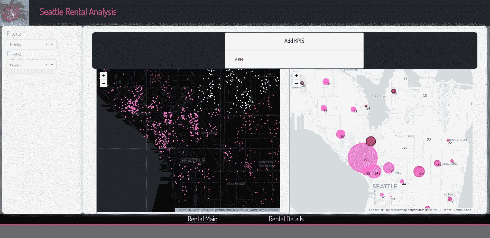

# 一砖一瓦:构建多页仪表板

> 原文：<https://medium.com/analytics-vidhya/brick-by-brick-build-a-multi-page-dashboard-9fe861cdec14?source=collection_archive---------12----------------------->

第 2 部分:这是关于使用 Plotly Dash 逐步构建仪表板的系列文章的第 2 部分。我们使用 follow 创建了一个空间数据散点图。


喜马拉雅蓝罂粟

AirBnB 内部的[数据提供了美国西雅图 AirBnB 房源的公开数据。我们将使用我们在这个](http://insideairbnb.com/get-the-data.html)[系列](https://sjtalkar.medium.com/brick-by-brick-build-a-multi-page-dashboard-37912dd7d9e6)的第一部分中创建的仪表板框架，并包含空间数据来探索列表的位置

## 目标

我们的目标是一个仪表板布局如下所示。我们将在布局中添加 iFrames 来显示树叶地图。这些地图是交互式的，悬停工具提示提供了每个点的更多细节。在左边，每个点代表一个列表。右边的地图显示了西雅图附近的列表总数。
***注:地图是静态的(。html 文件)，并将在下一篇文章中动态响应左边的过滤器。但是从下面可以看出，它们允许与缩放、平移和工具提示等功能进行交互。***



## 装置

按照本文 [***中的说明***](/plotly/introducing-jupyterdash-811f1f57c02e)***e***设置并运行 Jupyter 笔记本上的 Dash 应用服务器。Github 中的笔记本还列出了所使用的包及其版本，以帮助您开始使用。

## 代码和下载

这个系列的代码可以在这个 [Github repo 上找到。该应用程序从 Jupyter 笔记本上运行。有。py (Python)文件，其中包含布局和数据操作的代码。我使用并强烈推荐 Visual Studio 代码来处理这些，因为有许多方便的扩展可用于格式化，这对于用 Python 构建 HTML DOM 结构和编码特别有帮助。](https://github.com/sjtalkar/SeriallyBuildDashboard)

用地图创建仪表盘的文件有:
**笔记本:** createdashboardspatial . ipynb
**。py 文件:
layout _ spatial . py
data manipulation _ spatial . py
callback _ spatial . py
。html 文件:**IndvListingsMap.html
NeighborhoodCountMap.html

## [文件夹结构](https://dash.plotly.com/external-resources)


**笔记本中的更改——createdashboardspatial . ipynb** 如果您是从本系列的第 1 部分来到这里的，那么笔记本中唯一要做的更改就是布局 python 文件的名称。布局现在将包括显示地图的 html div，因此我们从 layout_spatial.py(而不是 layout_scaffolding.py)中导入所有函数。
对 layout_spatial.py 中的布局所做的更改由于 HTML 文档元素创建的模块化而变得非常容易。


例如，我们创建了一个函数 get_mapcol，它获取一个 HTML 文件的名称，并将其显示在 html.Div 中。Div 并更改各种空间数据的文件名。整个 Div 是一个六列(Bootstrap)元素，可以包含在页面的一行中。

内嵌框架标签 html.iFrame 为在当前 html 文档中嵌入文档提供了无数种可能性。在这个练习中，我们在指定的位置嵌入静态 HTML 页面，这个标签允许在页面中放置视频和其他交互式媒体。随着我们在本系列的下一篇文章中更好地理解 Dash 核心组件，我们将更新当用户在过滤器中选择一项时显示的 HTML，这将缩小他们感兴趣的西雅图的范围。

HTML 地图本身是使用 were 生成的。您可以在 callbacks_spatial.py 中查看生成这些地图的代码，但首先让我们看看是什么为这些地图提供了数据。

这将我们带到 datamanipulation_spatial.py 文件。这些地图中显示的 AirBnB 内部数据位于 listings_1.csv 文件中，该文件是从网站下载的 listings.csv.gs 文件中提取出来的(使用 7zip)。Pandas 函数 read_csv 将此 csv 数据读入数据帧 full_df，我们将把该数据帧复制到用于空间数据的 rental_geo_df 特定数据帧中。这些数据是从网上搜集来的，比大多数交给分析师的数据都要干净。我们感兴趣的空间数据主要是纬度和经度，以便在一个 follow 地图上定位列表。我们还获取“价格”和社区名称，这样当用户将鼠标悬停在地图上的列表上时，我们可以提供工具提示信息。

感兴趣的操作是创建 glow_marker_color 列。我为西雅图的 17 个“社区”选择了一种“霓虹”颜色，并把它放在一个数组中。我们现在要将这些颜色分配给它们被选择的邻居组。

```
glow_group_color = dict(zip(
list(rental_geo_df.groupby(
"neighbourhood_group_cleansed").groups.keys()),
glow_color_list))rental_geo_df["glow_marker_color"] = rental_geo_df["neighbourhood_group_cleansed"].map(glow_group_color)
```

我们通过这些邻域组对数据帧进行分组，然后使用 groups.keys()来访问组的名称，然后可以将其转换为一个列表。然后，我们用邻域列表压缩颜色列表，并创建一个字典，该字典可用于使用“map”函数在数据帧中创建一个新列。很方便，是吧？

另一个有趣的操作是为邻域范围的列表聚合计数创建一个聚合计数。我们还归一化(缩放到 0 到 1 之间的数字)一个邻域中的列表数。然后，该列将用于调整显示地图上每个街区的列表计数的圆圈的大小。


有了在 datamanipulation_spatial.py 文件中创建的数据帧，我们可以在 callbacks_spatial.py 文件中运行 createRentalMap 和 createListingSpatial 函数。下一节将详细介绍这些函数。

## [概念](https://pypi.org/project/folium/0.1.5/#:~:text=Concept,as%20markers%20on%20the%20map.)

follow 构建在 Python 生态系统的数据优势和 fleet . js 库的映射优势之上。在 Python 中操作您的数据，然后通过 leav 在活页地图上将其可视化。

> follow 使得在交互式传单地图上可视化用 Python 处理的数据变得很容易。它既可以将数据绑定到地图上进行 choropleth 可视化，也可以将 Vincent/Vega 可视化作为地图上的标记进行传递。

叶有几个瓷砖选项，你可以在这里阅读关于[。](https://python-visualization.github.io/folium/modules.html)使用我们选择的深色背景和浅色背景进行初始化，并使用西雅图数据集的纬度和经度的平均值计算位置中心。


然后我们可以调用 plotDot 函数，该函数利用 follow 的 CircleMarkers 在地图上创建一个散点图。工具提示、弹出窗口和其他子元素的添加为可视化添加了额外的信息。每个点“CircleMarker”都被添加到上面创建的地图元素中，一旦添加了所有元素，就可以使用 map.save(文件名)保存地图


***注意:由于静态 HTML 已经为您创建，您将不需要运行这些函数。随着本系列中过滤的实现，它们将被大量使用。***

## 最后

使用内核->重启和全部运行来运行笔记本..
您将收到一个运行应用程序的链接，您可以与之互动。
Dash 正在运行于[http://<localhost IP address>:8050/](http://127.0.0.1:8050/)

请随意评论、提问和联系。