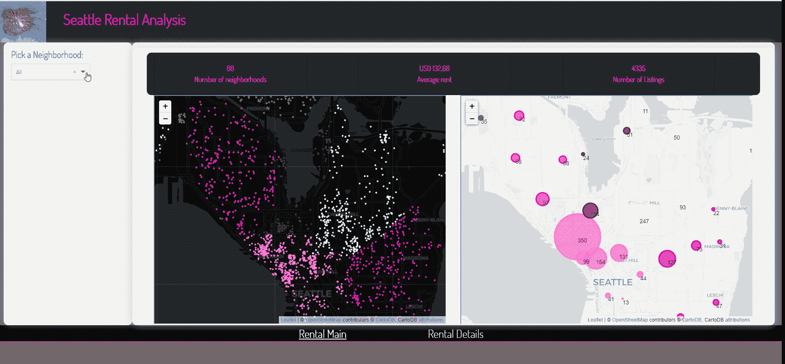
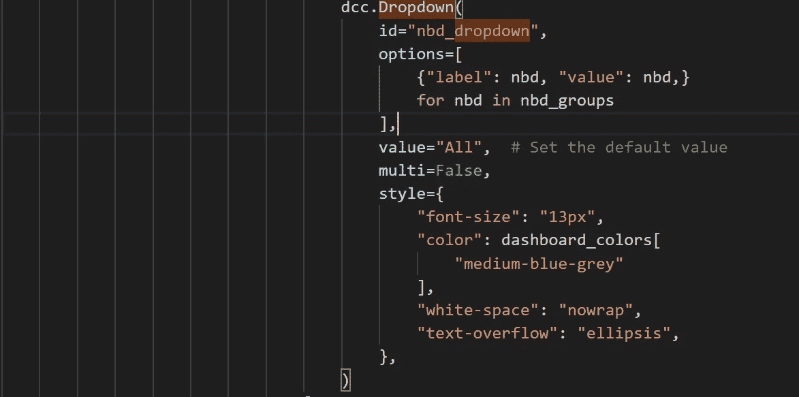
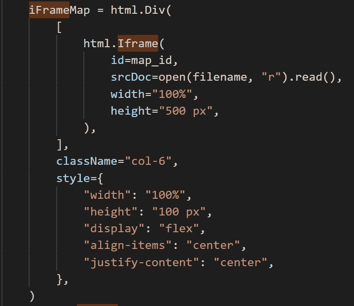
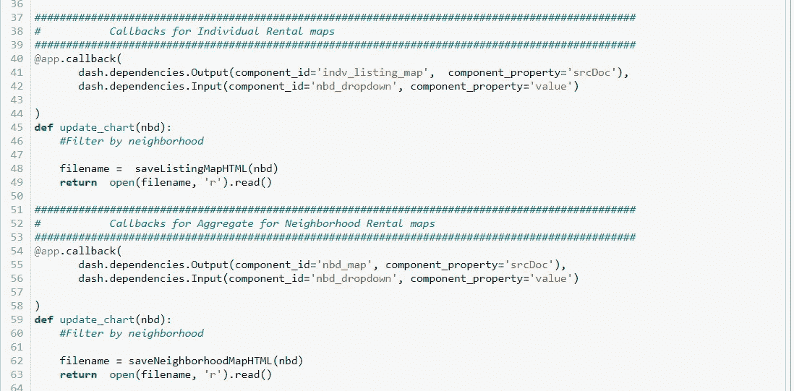
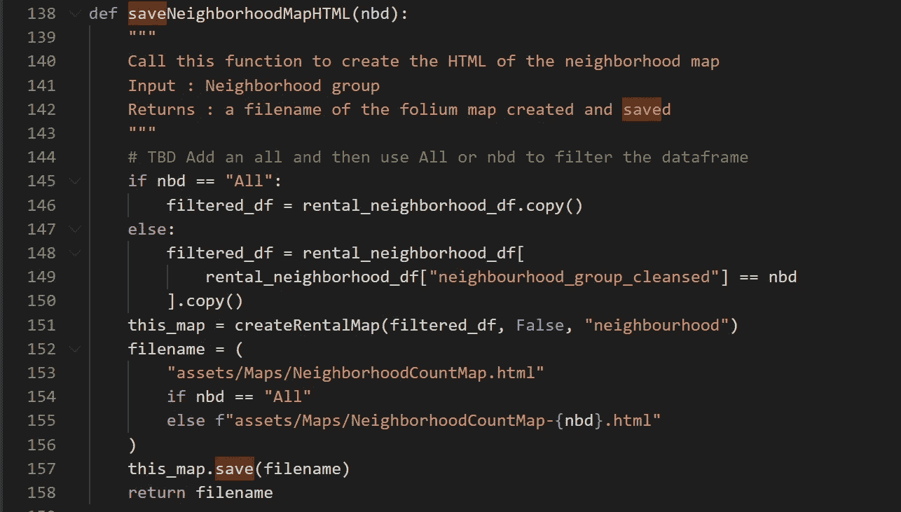
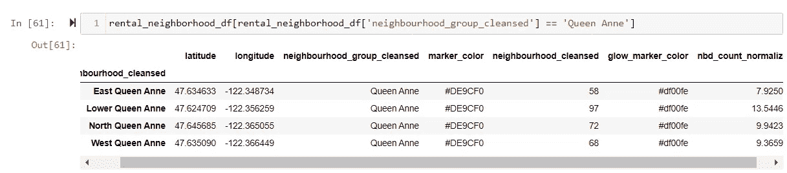
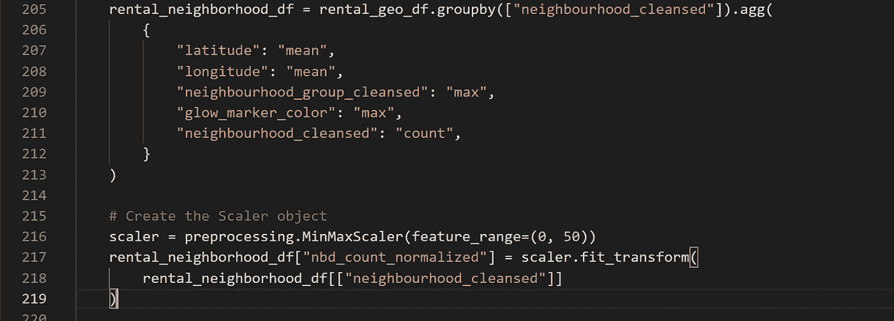
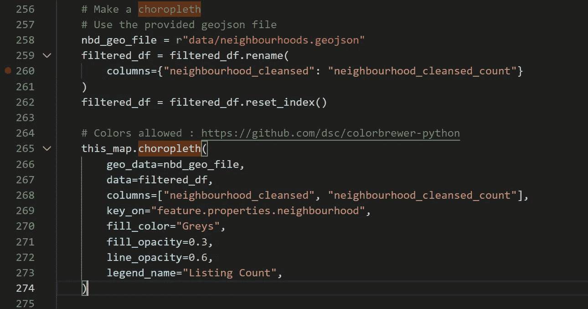
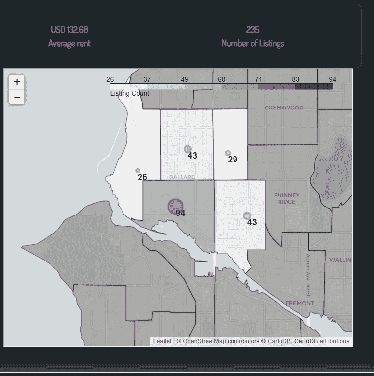
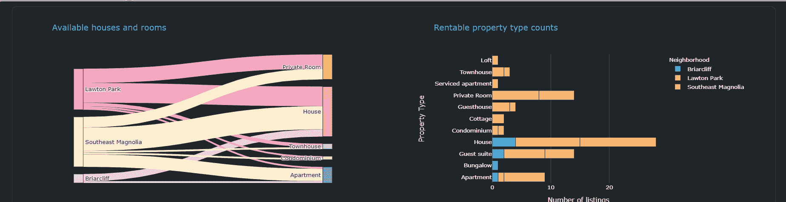

# 一砖一瓦:建立一个多页仪表板(破折号过滤器)

> 原文：<https://medium.com/analytics-vidhya/brick-by-brick-build-a-multi-page-dashboard-dash-filters-dbec58d429d2?source=collection_archive---------7----------------------->

第 3 部分:这是关于使用 Plotly Dash 逐步构建仪表板的系列文章的第 3 部分。我们将选择项添加到一个下拉过滤器中，该过滤器将过滤我们设置的仪表板中的叶子地图(我们在这里动态创建地图)。

喜马拉雅蓝罂粟

AirBnB 内部的[数据提供了美国西雅图 AirBnB 房源的公开数据。我们将使用我们在这个](http://insideairbnb.com/get-the-data.html)[系列](https://sjtalkar.medium.com/brick-by-brick-build-a-multi-page-dashboard-37912dd7d9e6)的第一部分中创建的仪表板框架，并包括空间数据来探索列表的位置。

## 目标

虚线下拉菜单的实现

在上图中，您会看到在左侧过滤栏中添加了一个单选下拉列表(在标签“Pick a Neighborhood”下)，其中包含西雅图的所有邻居组。有 17 个这样的列表，选择其中一个会更新所显示的叶子地图，以仅显示该邻居组内的列表。下拉列表还包含“All”，选择显示整个西雅图地区的列表。

## 装置

按照本文 [***中的说明***](/plotly/introducing-jupyterdash-811f1f57c02e)***e***从 Jupyter 笔记本上设置并运行 Dash 应用服务器。Github 中的 notebook 还列出了所使用的包(如 follow)及其版本，以帮助您开始使用。

## 代码和下载

这个系列的代码可以在这个 [Github repo 中找到。](https://github.com/sjtalkar/SeriallyBuildDashboard)应用程序从 Jupyter 笔记本上运行。有。py (Python)文件，其中包含布局和数据操作的代码。我使用并强烈推荐 Visual Studio 代码来处理这些，因为有许多方便的扩展可用于格式化和自动完成，这些扩展对用 Python 构建 HTML DOM 结构和编码特别有帮助。

用来创建带有地图的仪表盘的文件有:
**笔记本:** createdashboardspatialfilter . ipynb
**。py 文件:
layout _ spatial _ filter . py
data manipulation _ spatial _ filter . py
callback _ spatial _ filter . py
。html 文件:**IndvListingsMap.html
NeighborhoodCountMap.html

## [文件夹结构](https://dash.plotly.com/external-resources)

提醒一下，在用 app = JupyterDash(__name__)初始化应用程序时，Dash 假定一个文件夹结构，其中 CSS 文件以及图标和图像文件等资产驻留在**资产**文件夹中。数据文件从**数据**文件夹中加载。与本系列的前几部分相比，由于我们将生成更多的邻居地图，我们将从 assets/Maps 文件夹中存储和读取 follous 地图。

## **概念**

**Dash 核心组件输入和输出**
Dash 为我们提供了许多交互式用户界面。下拉菜单、单选按钮、日期选择器(范围和单个)、滑块和文本区域等用户输入组件可以轻松地添加到布局中。这些过滤器在页面范围内可用，有助于同步页面中的各种图表。每一个输出元素，比如图形或卡片，都有一个相关的回调函数，它返回要显示的“值”。该值可以是要在 html 段落元素中显示的一些文本，或者是 Dash 核心组件图形元素，或者是读入 Iframe 的文件。回调可以选择应用或忽略用户在输入中选择的值。

关于 Dash 核心部件的细节可以在这里找到:[https://dash.plotly.com/dash-core-components](https://dash.plotly.com/dash-core-components)

***注意:本应用中使用的输入和输出元素可以在 layout _ spatial _ filter . py fil***e 中找到

> **深入下拉输入**

要使用下拉式过滤器，我们导入 **dash_core_components** ，如 layout_spatial_filter.py 文件所示。这使我们能够初始化下拉组件。
*每个组件都可以用一个 id 来唯一标识，我们将 id 为**的下拉菜单称为“nbd_dropdown”。
*下拉列表中的选项在**选项**参数内，其中“**标签**是下拉列表中显示给用户的文本，而“**值**是项目被选中时发送给回调函数的相应值。
* **值参数**是应用程序启动时下拉列表中显示的初始值。我们将它设置为“All”，这样我们就可以从西雅图的所有街区开始。
*下拉菜单可允许单项或多项选择。我们将“ **multi** ”设置为 False，从而将这个下拉列表限制为单一选择，这样用户就可以一次完全放弃地探索一个街区。
*使用“**样式**”参数，指定 CSS 内联样式来设计组件。**

> ****深入研究 iFrame 输出****

****

**Dash 的输出元素(如图表)由 Dash 核心组件提供。在接下来的文章中，我们将访问显示图形对象的图形。在本文中，我们将使用 dash_html_components 更新我们在[上一篇文章](https://sjtalkar.medium.com/brick-by-brick-build-a-multi-page-dashboard-9fe861cdec14)中加载的叶子地图。具体来说，我们使用组件 Iframe。Iframe 是 HTML5 元素的包装器，允许在 HTML 文档中嵌入文档。完整的论据列表可以在[这里找到。](https://dash.plotly.com/dash-html-components/iframe)**

*   **对我们的需求至关重要的是我们为输出元素设置的 **id** 。注意，本着模块化和重用的精神，我们可以通过用 id 调用 get_mapcol 来创建多个包含 div 的 Iframe。每个调用都包含我们想要分配给输出元素的 id。在这个应用程序中，我们有两个带有 Iframes 的列——“indv _ listing _ map”和“nbd_map”。记住这些，因为我们要在下面的回调中使用它们。**
*   **第二个参数是组件属性，它将随回调的输出而更新。这里的 **srcDoc** 是通过打开和读取我们从 assets/Maps 文件夹中提供的静态 HTML 文件来初始化的**。我们将很快创建新的叶子地图，并将它们保存为 html 文档。与组件 id 相关联的回调将读取这些文件并更新其 srcDoc。****
*   **“宽度”和“高度”参数被设置为指定我们希望这些地图在页面上呈现的房间规格。**

> ****深入探讨地图回调****

**转到 Jupyter 笔记本，**createdashboardspatialfilter . ipynb .**在这里，您将找到由@ app.callback decorators 标识的输出元素的回调，在这里我们链接了函数(update_chart)，该函数将提供打开的 html 文档以在 Iframe 中显示。回调函数的名称完全由您决定。不可协商的是指定 dash.dependencies.Output 和 dash.dependencies.Input 的顺序。输入的顺序映射到回调函数的参数，因此要特别注意顺序。**

**在下一节中，我们将查看函数 saveListingMapHTML 和 saveNeighborhoodMapHTML，它们使用作为“nbd”传递的邻域选择来实际创建叶子地图。这种争论可以支持“所有”或西雅图的一个社区团体，如“安妮女王”或“巴拉德”…**

****

> ****深入研究代码生成和将叶子地图保存为 HTML****

****

**邻域地图的回调函数(当用户在下拉选择中选择一个新的邻域时调用)将我们带到**callbacks _ spatial _ filter . py**文件，我已经在其中放置了 saveNeighborhoodMapHTML 函数。该函数首先过滤数据帧以包含“neighborhood _ group _ cleansed”列，从而仅包含所选的邻域组。如果用户选择“全部”,则保留整个数据帧。在接下来的文章中，将会有更多关于数据清理和数据帧创建的细节。此处显示了应用了过滤的 rental_neighborhood_dataframe 中的数据结构。**

****

**租房 _ 邻里 _df**

**调用叶子。Map 来创建基本地图(在上面的代码中命名为 this_map 变量),我们将使用 add_to(添加到地图)或 add_child(添加到 CircleMarker 等元素)向其中添加标记、工具提示和其他元素。**

****争来争去。地图****

*   **地图以**位置**为中心。因为我们有一个带有街区和列表的纬度和经度的数据帧，所以我们将地图“居中”在纬度和经度的平均位置。**
*   **叶子地图有各种各样的选项供我们选择。对于“谷歌”地图效果，选择 OpenStreetMap。以下 tilesets 内置于 leav 中。在这个应用程序中，我选择了使用 CartoDB 正电子(用于邻域列表聚合)和 **CartoDB dark_matter** (用于单个列表)。对于列表，我们选择了深色地图，因为许多列表被绘制成散点图，每个小点代表一个列表。将鼠标悬停在该点上可以提供位置和价格的更多详细信息。选择较浅色调的 **CartoDB 正电子**用于邻域聚合列表，以便可以清楚地显示聚合，还因为我将在地图上分层一个 Choropleth(也就是说，划分邻域并使用相对于其中列表的颜色强度对其进行着色)。将下列选项传递给应用程序中的“tiles”关键字。您也可以使用自定义图块:**

> **“OpenStreetMap”
> “map box Bright”(免费图块的有限缩放级别)
> “map box Control Room”(免费图块的有限缩放级别)
> “Stamen”(地形、调色剂和水彩)
> “cloud made”(必须通过 API 密钥)
> “map box”(必须通过 API 密钥)
> **【CartoDB】(正电子和暗物质)****

*   **选择一个 **zoom_start** 值是很重要的，当地图第一次出现时，它将显示您希望用户关注的数据。您很可能需要使用这个值，直到您设置地图时该区域成为焦点。这里我们开始的值是 13，用户可以使用 Folium 的交互式放大和缩小来进一步探索地图。**

**我定义了另一个函数 plotDot，当它应用于上面所示的数据帧中的每一行时，将利用纬度、经度、glow_marker_color、nbd_count_normalized 在我们初始化的地图上绘制圆形标记。**

**为了理解绘制的值，让我们理解下面的代码(您将在 data manipulation _ spatial _ filter . py 中找到)**

**我们通过按邻居分组(column = neighborhood _ cleansed)来聚合底层数据的租金列表。请注意，在 neighborhood_group 中有多个邻域，因此当我们执行此聚合时，我们还使用“max”聚合器选择公共 neighborhood_group。邻域中的总列表被“计数”并放置在 neighborhood _ cleansed 列中。我们将使用列表总数来“调整”(设置半径)圆形标记的大小，该标记将在地图上显示列表数。为了保持半径在地图的范围内，我们使用 sklearn 的预处理。将计数范围设置在 0 到 50 之间的 MinMaxScalar 方法——所有列表都在此范围内统一“规范化”。**

****

**这就把我们带到了叶子。CircleMarker，为上面显示的 rental_neighborhood_df 数据帧的每一行调用，它提供要使用的圆心(纬度、经度)以及半径(列表聚合计数的标准化值)。创建后，使用 add_to 将圆标记添加到地图(this_map)中。还添加了一个定制的工具提示，提供邻居名称和邻居的实际列表计数。**

**我还想在地图上提供列表的数量，所以我在一个 leav 中使用了 icon = DivIcon。标记，定位在与 CircleMarker 相同的纬度和经度。**

**在此映射的下一个实现中(在文件 callbacks_bar_sankey.py 中)，使用下面的代码将一个 choropleth 元素添加到映射中:**

********

**鸡冠花叶**

**请注意上面是如何概述邻域组中的邻域的。数据集为我们提供了一个 geojson(neighborhoods . geo JSON)文件，该文件包含带有**key _ on**feature . properties . neighborhood 的邻域名称。该键与我们的 data frame(**data**= filtered _ df)中的列 neighborhood _ cleansed 之间的一对一映射使我们能够使用该 geo JSON 文件来创建 Choropleth 地图。所使用的色标是根据每个邻域中的列表计数(neighbourhood _ cleansed _ count)而缩放的灰度。用提供的**线条 _ 不透明度**绘制边界，并用**填充 _ 不透明度填充。** 我们还为色标提供了一个图例标题( **legend_name** )。**

****最后** 我们在此总结这篇关于 Dash 核心组件输入元素(下拉菜单)用法的详尽文章。但是请注意，在文件中，您将看到使用下拉选择的附加元素。显示每一个街区的挂牌数量和平均租金的卡片使用与上述相同的模式。自己尝试一下，如果你有任何问题，请随时评论、提问并联系我们。**

*****预告:*****

**在下一篇文章中，我将向您展示用户如何在 Sankey 图中挖掘可供出租的房产类型。我们还将探讨数据清理。这个的代码在 [Github Repo](https://github.com/sjtalkar/SeriallyBuildDashboard) 的文件中，后缀为(_bar_sankey)。**

****

**桑基图和条形图**