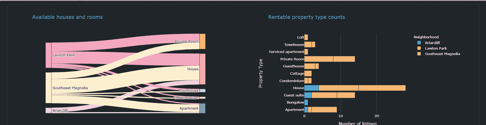
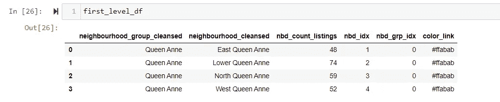

# 一砖一瓦:构建多页仪表板(桑基图)

> 原文：<https://medium.com/analytics-vidhya/brick-by-brick-build-a-multi-page-dashboard-sankey-diagrams-a73b0876c1f?source=collection_archive---------9----------------------->

第 4 部分:这是关于使用 Plotly Dash 逐步构建仪表板的系列文章的第 4 部分。我们讨论数据清理、数据类型识别、格式化和准备，特别是关于创建 Sankey 和条形图。桑基图将显示一个街区中房产的数量和类型


喜马拉雅蓝罂粟

AirBnB 内部的[数据提供了美国西雅图 AirBnB 房源的公开数据。我们将使用我们在这个](http://insideairbnb.com/get-the-data.html)[系列](https://sjtalkar.medium.com/brick-by-brick-build-a-multi-page-dashboard-37912dd7d9e6)的第一部分中创建的仪表板框架，并包含空间数据来探索列表的位置

# 目标

我们将为仪表板创建一个 Sankey 图表，如下所示。我们还有一个分段(按邻居)条形图，针对每个邻居组，显示相同的信息，但旁边的样式不同。在桑基图表中，每个链接显示了某个社区中某个物业类型的数量。但它也可以显示一个街区内不同类型的房产的分割情况。当悬停在节点上时，显示属性类型的集合以及邻域内属性的集合。**这是桑基图在相同空间**内提供的比分段条形图更多的信息。


**两级桑基**



**仪表板内的三键和横条**

# 装置

按照本文 [***中的说明***](/plotly/introducing-jupyterdash-811f1f57c02e)***e***从 Jupyter 笔记本上设置并运行 Dash 应用服务器。Github 中的笔记本还列出了所使用的包及其版本，以帮助您开始使用。

# 代码和下载

这个系列的代码可以在这个 [Github repo 上找到。](https://github.com/sjtalkar/SeriallyBuildDashboard)应用程序从 Jupyter 笔记本上运行。有。py (Python)文件，其中包含布局和数据操作的代码。我使用并强烈推荐 Visual Studio 代码来处理这些问题，因为有许多方便的扩展可用于格式化，特别有助于在 Python 中构建 HTML DOM 结构和编码，以及格式化代码。

用地图创建仪表盘的文件有:
**笔记本:** 本文使用:rentalsankeychart . ipynb
**sankey 和 Bar 的仪表盘实现可以在这里找到** createdashboardbarsankey . ipynb
**。py 文件:
layout _ bar _ sankey . py
data manipulation _ bar _ sankey . py
callback _ bar _ sankey . py
。html 文件:**IndvListingsMap.html
NeighborhoodCountMap.html

# **概念**

是一种可视化技术，允许显示流动(传统上是能量、金钱或材料)。几个实体(`nodes`)用矩形或文本表示。它们的链接用箭头或弧线表示，箭头或弧线的宽度与流的重要性成比例。
如需进一步参考，可访问本综合[目录](https://datavizcatalogue.com/methods/sankey_diagram.html)。在一个 Sankey 图中可以描述几个层次的流程层次。在我们的应用程序中，我们将使用这种可视化来显示邻居列表对一个邻居组的贡献，以及各种财产类型的列表对一个邻居的贡献。

## 数据

租金数据可以从几个角度来看，例如:a)租房者；b)房东；c)AirBnB 公司；d)市议会制定条例和法规。

以各种方式对这些数据进行切片和分段，使我们能够为这些利益相关者提供见解。数据分析师手中的每个数据集都需要一些处理，这样我们才能从中挤出信息。第一步通常是清理数据并添加额外的汇总或清理列。

## **加载数据和初始清理**

下面的代码详细描述了这个过程，createRentalDF 函数加载了 listings_1.csv 文件，这个文件是从我们从 AirBnB 内部网站下载的 listings.csv.gz 文件中提取出来的。为了构建这个仪表板的可视化效果，我对一些列感兴趣，而不是所有的列，因此在我进行探索性数据分析之后，我感兴趣的列被挑选出来放入 dataframe rental_df 中。

1.  **列信息和数据类型**

虽然大多数列名都是不言自明的，但我在网上搜索了这些列的含义，研究了从文件中加载的数据帧中的数据类型，并标记了为了可视化而希望清理和修改的数据类型。更重要的是，我区分了**分类和数字数据类型，有序和名义，离散和连续**。
[**关于这些类型的信息，这里有一篇你会喜欢的**](https://towardsdatascience.com/how-many-data-types-can-you-name-a5f8869066ca) 文章。下面是我准备的指导我清理数据框的文件截图。


**数据类型和列理解**

***注:上图中从许可证往下，所有数值均为文本***

**2。缺失信息**

我想强调在一些列上执行的一些数据清理任务。host_response_rate 是一个以百分比结尾的字符串。这必须通过去掉百分号并转换成浮点数来表示。但是该字段也缺少某些主机的信息。相当多的主机(约 1/5)有多个列表。我们可以利用这一事实，通过找到主机的平均响应率，并在缺少该值的主机上填入该值，用“典型”响应率来填充缺少的响应率。
**注:用下面的**查找有多个列表的主机数量

```
 df1 = rental_df[“host_id”].value_counts().to_frame()
 df1[df1[‘host_id’] > 1]
```


关于如何处理缺失值的更多信息，你会发现 [**这篇**](https://liberalarts.utexas.edu/prc/_files/cs/Missing-Data.pdf) 文章很有用。

**3。将字符串数据转换为数值**

一些数据是分类文本，可以转换成数字，用于进一步的 ML 分析。例如，host _ reponse _ time 分为四个类别，这四个类别按照重要性明确排序，因为响应“一小时内”比“几天或更长时间”具有更高的值。因此，我们给它们分配一个数值，以便于分析，如下所示。


**4。清理和整合财产类型**

rental_df 中的 property_type 列范围很广，如笔记本 **RentalSankeyChart.ipynb.** 中所列。为了找出该数据中的含义，我们将合并隐喻性的相似属性，以便我们可以更好地可视化和分析较少数量的属性。房间被分类为共享或私人，独立于它们所在的属性(房子/公寓)。当一处房产被描述为“整体”时，那么该房产的类型——小屋/房子/公寓/小屋就会被提到最前面。其他合并可以在下面代码中的函数 **createPropertyTypeCol** 中看到。

# 设置 Sankey 图表数据

我们有邻里团体分叉成邻里，最终分叉成财产类型。因此，我们的节点就是我们上面创建的邻居组、邻居和属性类型。链接将显示每个社区组到社区到物业类型连接的列表数量。当用户使用 Pandas group by 和 count 函数选择一个邻域组时，将动态创建这些聚合计数。

Plotly 图形对象“go”要求数据以一种方式排列，这种方式有助于我们传达层次结构或流的每个级别的节点和链接权重，作为 go 的参数。桑基函数。我将向您展示如何简化这些源、目标和链接值列表的创建。以下是桑基图表的创建，您可以参考 [**文档**](https://plotly.com/python/sankey-diagram/) 了解更多详情。

两个参数，**节点**和**链接**，每个都是一个字典对象，用期望的属性**、**来设置，并完整地描述图表。

**节点**:在标签属性的字典中指定**节点**的名称。这里，列表中填充了 Sankey 流的每个级别的节点名称。我们可以通过选择每个节点的粗细和包围它的线条来自定义它的外观。我们还可以为每个节点设置单一颜色或提供不同的颜色(提示:将颜色参数设置为列表，每个元素代表一个节点的颜色)。使用“ **customdata** ”和“ **hovertemplate** ”的组合来定制悬停工具提示。在 customdata 中，我提供了节点名称，因此，当用户悬停在节点上时，模板可以使用节点名称创建一个字符串来显示该节点的属性列表的聚合值(无论是邻居、组还是属性类型)

**link**:**link**参数是另一个字典对象，它有三个键:source、target 和值，它们是携带连接信息的列表。对于每个链接，颜色在发送给颜色属性的列表中提供。就像节点的情况一样，可以提供一个**悬停模板**来定制工具提示(或者覆盖默认的**工具提示**)。它使用我们在节点中设置的 **customdata** 。

```
fig = go.Figure(data=[go.Sankey(
    node = dict(
      pad = 15,
      thickness = 20,
      line = dict(color = "black", width = 0.5),
      label = label_list,
      color = color_node,
      customdata=label_list,
      hovertemplate="%{customdata} has  %{value} listings<extra></extra>",  
    ),
    link = dict(
        source = source,
        target = target,
        value = values,
        color = color_link,
        hovertemplate="Link from  %{source.customdata}<br />"
                    + "to %{target.customdata}<br />has  %{value} listings<extra></extra>",
      )
)])
```

例如，使用 pandas groupby，我们为邻居组“Queen Anne”的第一级 Sankey 创建一个数据帧(这是我们的仪表板过滤器中的用户选择)。当我们将这些数据按安妮女王的邻居分组时，我们得到了一个如下图所示的数据帧。nbd_count_listings 列将为我们提供需要传递给上面的**值**参数的列表。我们可以将这个列转换成一个列表来使用它的值，但是源和目标所需的列表呢？



**带有汇总列表计数和索引的数据框架**

现在是时候创建如下所示的映射列表了，索引的位置与值对齐。


**第一级 Sankey 列表节点和链接(邻域组到邻域)**

为了创建源索引和目标索引，我们首先为每个节点分配一个索引。获取组中唯一的邻域名称列表，并将其存储在“label_list”中。每个邻域的索引将是它在列表中的索引位置。用户在仪表板中选择的邻居组被提供索引 0。创建一个字典，将这个列表中的邻域名称映射到它在 label_list 中的位置。

这个字典价值连城，因为我们现在可以用它将数据帧中的列值(neighborhood _ cleansed)映射到索引。属性类型采用相同的技术。我们将所有可用的唯一属性类型添加到同一个列表(label_list)中，从而为它们分配一个列表索引。该索引是字典中属性类型键的值，可用于将列 property_type_class 映射到索引值。


**显示在源和目标列表中使用的索引创建的代码**

让我们看看对更细粒度级别的邻居和财产类型重复上述过程。

从包含列表计数的 groupby 数据帧开始。


**桑基 _df**

想象你想要创建的链接。


创建字典，将关键字设置为邻域名称，将值设置为标签列表中邻域的索引。使用字典将数据帧中的列映射到索引。

创建的索引列现在可以变成列表，提供给 go 中的源和目标参数。桑基函数。


**将列转换为源、目标和值的列表**

这种模式是高度可伸缩的，因为我们可以简单地向标签列表添加新级别的新节点，并使用列表索引为我们创建的任何聚合级别的数据帧设置索引。我们希望分配给链接的颜色也作为列添加到数据帧中，并且可以根据每个节点(邻域)的值进行设置。

# 最后

我已经向您展示了如何在 Plotly 中创建数据结构来创建 Sankey 图表。我建议您现在探索并巩固您的理解，将图表扩展到另一个级别，将我们之前整合的物业类型分成单个物业类型，以更精细地了解租赁用户的利益。帮助他们租到他们心仪的房产！

请随意评论、提问和联系。