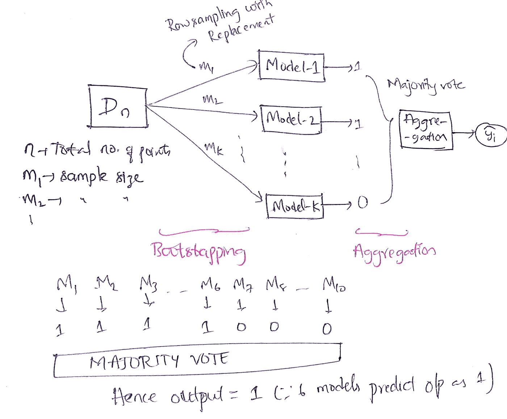

# 关于集合模型 I(随机森林)的一点想法

> 原文：<https://medium.com/analytics-vidhya/brief-idea-on-ensemble-models-i-random-forest-3aa3dd5b9bdb?source=collection_archive---------21----------------------->

## 机器学习中 Bagging 技术的集成模型综合指南。

绳子表示模型的基础学习者，雕像表示模型的性能。

## 为什么选择集合模型？

> 正如你可能已经经历了各种机器学习模型，如 KNN，逻辑回归，决策树等。(如果您没有浏览过任何模型，请不要担心，我们将在接下来的博客中讨论它们。然而，我已经使理解这个系综模型变得简单了。)你可能会怀疑，有没有办法把所有这些模型结合起来，建立一个新的模型？是的，这是可能的，这种结合起来建立一个强大模型的想法就是集合模型的概念。

我们可以将这种合奏模式与 IPL(印度超级联赛)的 CSK 队和作为基础学习者的球员联系起来。来自不同国家的所有最好的运动员被聚集在一起，以便我们能建立一个强大的队。(这只是为了了解这个合奏会有多强大。)

有如下四种总体策略，

1.  装袋
2.  助推
3.  堆垛
4.  级联

## 装袋:

Bagging 一词是由两个词组成的，即 Bootstrapping(替换行抽样)和 Aggregation。

Bootstrapping 是用替换对数据点进行采样。假设给定的数据集有“n”个点，我们从给定的数据集创建大小为(< n)的“k”个样本。

通常，聚合操作意味着对分类问题应用多数表决。对于回归，它将计算预测值的平均值或中值。

核心思想是，给定 n 个数据点，我们采样成 k 个样本，分别是 m1，m2，m3，…mk 样品。现在，每个样本都被提供给一个模型，这个模型被称为基础学习者(每个模型看到不同的数据样本，因为只有一个数据子集被提供给这个模型)，所有这些模型在聚合阶段被合并成一个模型(如果是分类任务，它只需进行多数表决。假设有 10 个基本模型，如果其中 6 个预测类别标签为 1，我们推断类别标签为 1，如果这是一个回归问题，我们取预测的平均值。)

由于我们将聚合与引导一起使用，即使一些数据点发生了变化，也只有一部分数据受到影响。总体结果变化不大，这样我们就可以减少方差(方差就是模型随着训练数据集的变化而变化的程度。如果模型变化很大，就是高方差模型。)模型。

既然你已经有了装袋概念的直觉，那我们就来讨论一下随机森林吧。

## 随机森林(RF):

随机森林是最流行的装袋技术之一。

随机森林名称已经进入图片，因为森林只不过是一组树木。因此，我们这里使用的基础学习器是决策树(具有低偏差和高方差)。由于我们对数据进行随机采样(引导),因此命名为 Random。组合起来就是随机森林。

因此，随机森林以决策树为基础模型，在其基础上应用 bagging(替换行抽样)并进行列抽样(特征抽样)。

> **RF:决策树+Bagging(带替换的行抽样)+列抽样(特征抽样)**

对于行采样和特征采样，模型使用不同的数据集进行训练，也就是说，如果数据有任何变化，当我们采样时，只有较少的模型受到影响，从而获得良好的整体性能。

每个基础学习器具有合理的深度，使得每个模型完全在数据上得到训练，从而产生高方差模型，这导致过度拟合(在训练数据上表现良好，但在测试数据上失败)。因此，通过汇总，我们减少了方差。随着基本模型(k)数量的增加，方差减少(过拟合减少)，反之亦然。

因此，k =基本模型的数量可以称为**超参数**。

**注**:列采样或特征采样无需替换，因为相同的特征出现两次会引入共线特征，导致性能最差。

*代码实现* : `[**sklearn.ensemble**](https://scikit-learn.org/stable/modules/classes.html#module-sklearn.ensemble)` **。RandomForestClassifier()**

> 因为每个决策树是独立的，所以随机森林可以是平凡的可并行化的(可以在每个核上训练每个模型)。

因此，通过 Bagging，我们使用高方差和低偏差决策树(深度更大的树)作为基础模型来减少方差。当我们用这种方法减少方差时，你可能会有疑问，**是否有一个集合模型来减少偏差？**是的，Boosting 是我们为减少偏见而实施的策略，我们将在接下来的博客中对此进行讨论。所以，在偏差和方差之间总是有一个权衡。

这都是关于一个整体模型。如果有任何错误，请原谅，并随时提供您的宝贵反馈，以便我可以改进它。谢谢:)

请参考这个[链接](/@bhanuprakash193/brief-idea-on-ensemble-models-ii-gradient-boosting-decision-tree-7ed996fd4085)看下一个关于 GBDT 模特的博客。

***参考文献:***

1.  [https://thecommonmanspeaks.com/statue-used-massage-egos/yilubali-statue/](https://thecommonmanspeaks.com/statue-used-massage-egos/baahubali-statue/)
2.  [https://scikit-learn.org/stable/modules/generated/sklearn.ensemble.RandomForestClassifier.html#sklearn-ensemble-randomforestclassifier](https://scikit-learn.org/stable/modules/generated/sklearn.ensemble.RandomForestClassifier.html#sklearn-ensemble-randomforestclassifier)