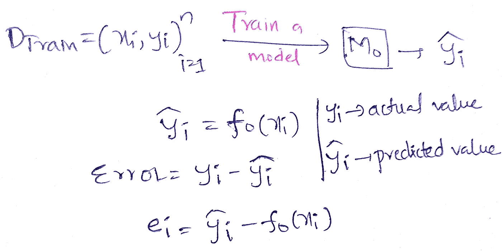
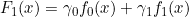
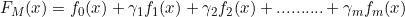
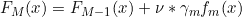

# 关于集成模型 II(梯度推进决策树)的一点想法

> 原文：<https://medium.com/analytics-vidhya/brief-idea-on-ensemble-models-ii-gradient-boosting-decision-tree-7ed996fd4085?source=collection_archive---------18----------------------->

## 机器学习中 Boosting 技术的集成模型综合指南。

用 MS PowerPoint 创建

在这篇博客中，我们将了解 Boosting，这是建立集合模型的策略之一。在我之前的博客中，我已经简单地讨论了打包策略，如果你还没有，请浏览一下。这里是[环节](/@bhanuprakash193/brief-idea-on-ensemble-models-i-random-forest-3aa3dd5b9bdb)。

> 简单地说，我们可以将助推技术与我们生活中的一句名言或教训联系起来:“ ***从错误中吸取教训*** ”
> 
> 错误+纠正=学习

这是升压工作原理的核心思想。让我们深入了解一下。

**理解偏差:**

这个模型的思想是减少偏差。偏差误差是由于简化假设而产生的误差，如假设平面将正负点分开，但曲线(非线性表面)实际上将它们分开。因此，这些建模假设将导致欠拟合的高偏差模型。因此，我们可以直观地将高偏差视为高训练误差。

## 工作原理:

在这篇博客中，我将帮助你直观地了解 Boosting 是如何用更少的数学和更多的理论来工作的。我们将基础模型作为低方差和高偏差模型(浅深度通常为 1 或 2。深度为 1 的树称为决策树桩)。

***第一步:***

在第一步中，我们在全部训练数据上训练一个模型。模型在此基础上进行训练，并试图找到正确的函数，即根据数据拟合函数。所以我们得到了预测的产量。我们有实际值和预测值，实际值和预测值之间的简单差异就会产生误差。获得的这个误差用于下一阶段，使得模型非常适合以进一步减小误差。

***第二步:***

不是用完整的数据点和 Yi 进行训练，而是仅在和在第一阶段或步骤 1 或先前阶段中获得的误差上进行训练(在，error_i 上训练模型)。所以我们尝试用误差函数来代替 Yi。因此，这个阶段结束时的模型会是这样的，

两个基本模型 h0 和 h1 的加权和

伽马值通过损失最小化函数获得(请参考维基。)

***第三步:***

现在再次训练 Xi 和在步骤 2(前一阶段)中获得的误差，并在其上拟合一个模型。同样，我们对 Xi 和前一阶段结束时留下的误差(这是一个残留误差)重复步骤 m 次，直到我们得到一个低残留误差。随着阶段的数量(=基础学习者的数量，因为在每个阶段我们都在训练一个基础模型)增加，在每个阶段，我们都在拟合误差，以使残差逐阶段减小。这个误差是有偏差的。因此，我们能够完成减少偏差的任务。

在求解损失最小化函数时，我们得到的残差等于损失函数在每个阶段-m 的负梯度。因此，我们用**伪残差代替残差，这有助于我们最小化任何损失函数**，只要它是可微分的。这个伪残差就是梯度提升的核心思想。请参考维基百科的梯度推进算法，了解数学更深层次的见解。在这篇博客中，我主要集中在它如何工作的理论部分。

因此最终的模型会是这样的，

m 是基础学习者的数量

上面的等式可以被准确地认为是逻辑回归，而γ代表逻辑回归中的权重，而在这里，它可以被认为是使损失函数最小化的常数。

**过度配合**:

随着基础学习者数量的增加，我们经常在 GBDT(梯度推进决策树)中过度拟合，因为我们试图拟合误差函数，因此我们在训练数据上更加精确以避免误差。这将导致模型的高方差和过拟合。因此，为了避免这种情况，有一个被称为收缩的概念，它通常位于 0 和 1 之间。

较小的收缩值允许我们部分考虑以前的模型输出。因此，这控制了模型的过度拟合。

v 值控制过度拟合

> 超参数:基础模型的数量和收缩率(v)

**代码** : `[sklearn.ensemble](https://scikit-learn.org/stable/modules/classes.html#module-sklearn.ensemble)`。梯度推进分级机

## XGBoost:

有没有一种方法可以将装袋技术(行抽样和列抽样)和 boosting(GBDT)的优点结合起来？是的，XGBoost 是 GBDT 的实现，与单独使用 GBDT 相比，我们可以使用相同的数据实现更高的性能。

> GBDTs 不容易并行化，因为所有的基本模型都是顺序相关的，即前一阶段的数据用于下一阶段的训练。

这都是关于 GBDTs 如何工作的简单直觉。可以很容易地用于低延迟应用程序，因为每个决策树的深度都很浅，所以存储和运行它们是很简单的。

请查看以下参考资料，以了解更深层次的数学直觉。谢谢:)

请参考这个[链接](/@bhanuprakash193/a-brief-idea-on-ensemble-models-iii-stacking-classifier-564a81a855e4?sk=fddcca18a4130de438235d37ac67b149)来看下一个关于叠加的整体模型的博客。

**参考文献:**

[https://en.wikipedia.org/wiki/Gradient_boosting](https://en.wikipedia.org/wiki/Gradient_boosting)

 [## 3.2.4.3.5.sk learn . ensemble . gradientboostingclassifier-sci kit-learn 0 . 23 . 2 文档

### class sk learn . ensemble . GradientBoostingClassifier(*，loss='deviance '，learning_rate=0.1，n_estimators=100…

scikit-learn.org](https://scikit-learn.org/stable/modules/generated/sklearn.ensemble.GradientBoostingClassifier.html)  [## Python API 参考-xgboost 1 . 2 . 0-快照文档

### 本页给出了 xgboost 的 Python API 参考，更多内容请参考 Python 包介绍…

xgboost.readthedocs.io](https://xgboost.readthedocs.io/en/latest/python/python_api.html)