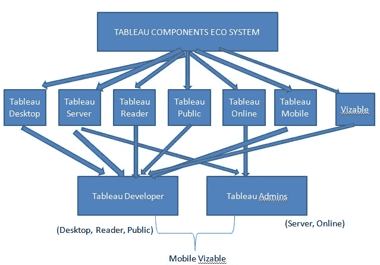
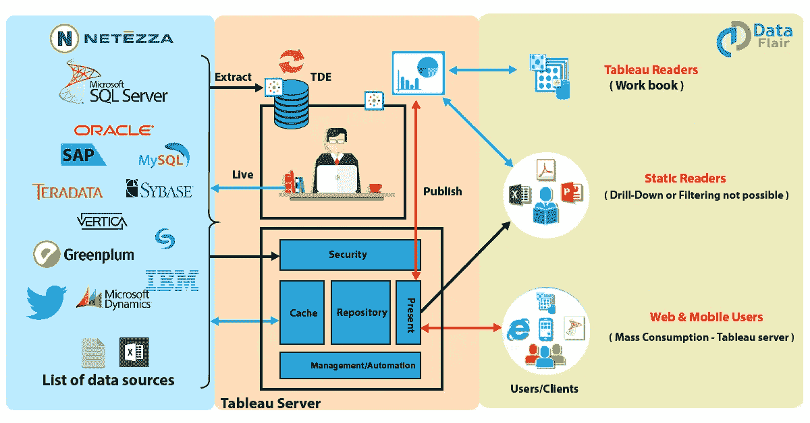
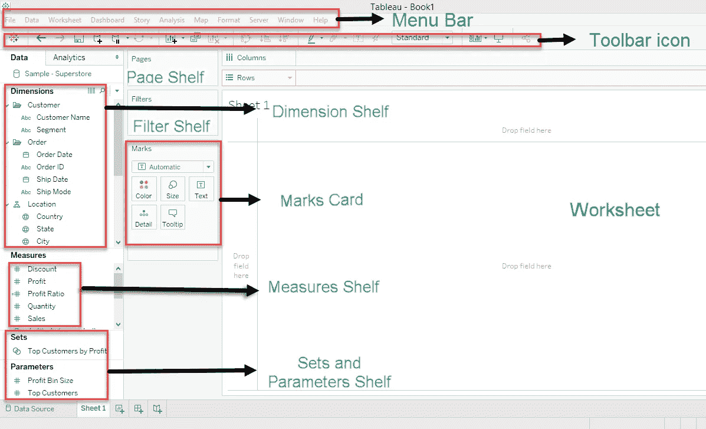
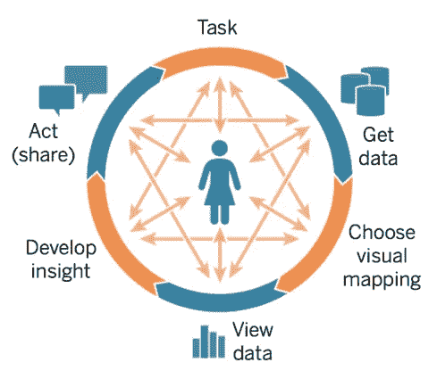

# Tableau 和视觉分析简介。

> 原文：<https://medium.com/analytics-vidhya/brief-introduction-to-tableau-and-visual-analysis-b194bb5c7867?source=collection_archive---------20----------------------->

Tableau 是一家软件可视化公司，生产专注于商业智能的交互式数据可视化产品。

它允许客户将更多的时间花在数据分析上，而不是花在数据争论上。

**Tableau 的组件**

**画面建筑**

它分为三个部分

1.  数据源
2.  Tableau 服务器
3.  Tableau 桌面和客户端。

**Tableau 桌面 UI**

【Tableau 如何考虑数据库？

Tableau 中的数据源，列分为维和度量。

维度是一个独立变量的字段。

例如-(文本、地理数据、日期)

测度是因变量的场，其值是一个或多个变量的函数。(数字、图形或浮点值)。

使用维度和度量可以创建不同类型的图表。Tableau 支持 24 种类型的图表。

**哪些可视化最适合各种应用？**

1.  条形图-当尺寸停止时使用。
2.  线形图-连续尺寸的首选。
3.  双轴图-用于同时表示两个测量值。
4.  地理图-用于在地理图上绘制测量值。
5.  面积图-双轴-提供了更好的比较措施。
6.  热图用于显示不同类别之间的差异。
7.  树形图—用于表示嵌套矩形中的质量。

**表格中的功能**

1.  联接-组合列
2.  union-合并行

将不同的行组合在一起时，条件数据字段和属性应该相同。

通过联接或联合将不同的数据源联接在一起。

排序功能可用于根据度量对类别和子类别进行排序。

**Tableau -Set**

Set 是一种过滤器，我们可以在其中设置显示值的条件。

例如，折扣> 20%

**表格预测**

预测用于根据图表的当前值预测未来趋势。使用折线图来表示趋势。

ex——用于投资目的。

**画面突出显示**

突出显示用于在所有类别中突出显示特定的子类别。

**Tableau —设备设计者**

设备设计器用于为特定设备制作最佳可视化效果。

**视觉分析**

从可视化界面中获得洞察力，为了从数据源中获得正确的洞察力和知识，我们应该能够尽可能准确地表示数据。

# 视觉分析循环

第一步-获取数据或了解你正在处理的数据。

第二步-过滤掉数据以修正参数，这些参数将能够以一种更有洞察力和更有意义的方式代表你的数据。

第三步-增强你的数据，使其在视觉上吸引人，然后调整它，获得洞察力，或者做出你想要最终依赖数据的推断。

**如何感知数据？**

专注学习——投入大量的注意力去发现数据或获得洞察力或从中提取正确的知识。

前注意力学习——这不像注意力学习那样需要太多的注意力。

**为什么会出现**的画面？

1.易用性

2.直接连接和运行——这意味着它可以连接到已经提到的任何数据源。可以从数据源提取数据并对其进行更改。直播连接可以轻松完成。

3.非常适合 mashups 将数据集连接在一起，包括或集成大量数据源，以便可视化地分析和表示它们。

4.盒子里的最佳实践——Tableau 是一个包。

表示数据所需的一切都是现成的。