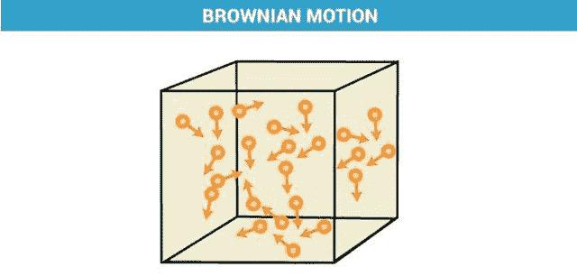
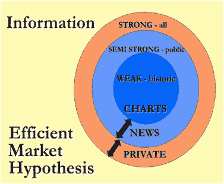
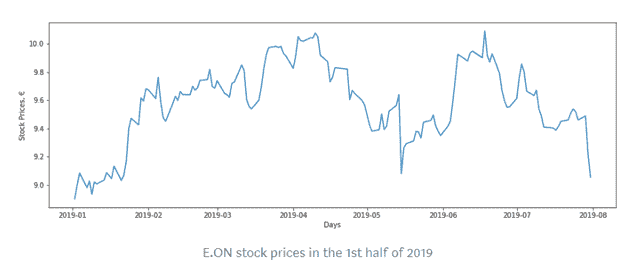
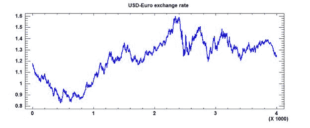
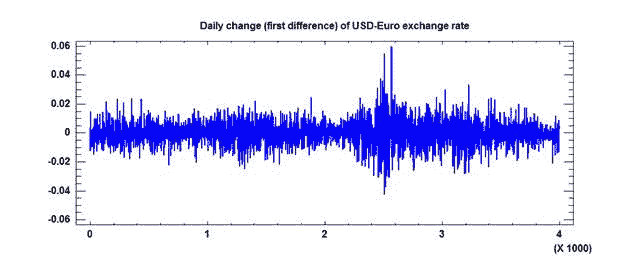
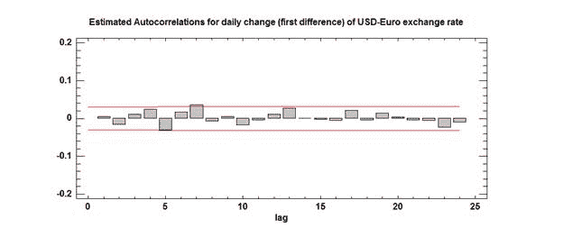
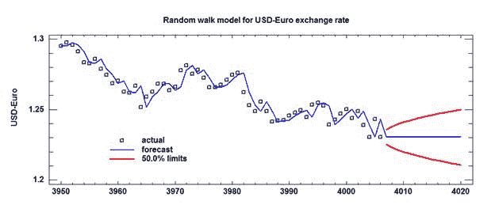
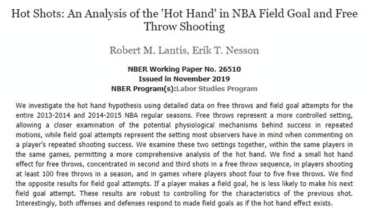

# 布朗运动、随机漫步和热手谬误

> 原文：<https://medium.com/analytics-vidhya/brownian-motion-random-walks-and-the-hot-hands-fallacy-e24aba54804f?source=collection_archive---------9----------------------->

以下所有内容纯属研究，不应被解释为推测或观点。

> 这些波动的确定受到无数因素的影响:因此，不可能期望一个数学上精确的预测。关于这些波动的矛盾观点分歧很大，以至于在同一时刻，买方认为市场在上涨，而卖方认为市场在下跌。
> 
> 资料来源:路易斯·巴奇利尔，《投机理论》

# **什么是布朗运动？**

布朗运动是悬浮在液体或气体中的小颗粒的运动。这些粒子相互碰撞，并在碰撞时以随机的、曲折的方式运动。这是随机性和混沌的中心论题。

来源: [Byju](https://byjus.com/chemistry/brownian-motion-zig-zag-motion/)

因为布朗运动发生在微观尺度上，所以用概率模型来描述它。在这篇文章中，我们将通过随机过程的应用来阐述布朗运动，随机过程通常用于描述随机运动的变量，如上面的粒子。

# 单身汉:可预测的价格是可开发的价格

你可能从爱因斯坦的奇异之年论文中知道布朗运动。或者，你可能从法国研究生 Louis Bachelier 那里听说过，他比爱因斯坦早 5 年发表了他的著作，提出布朗运动可以作为预测股票市场价格变化的工具。

Bachelier 的理论是，一旦价格开始变得可预测，它就会立即变得可利用。在市场有效的信念下，预测的价格模式将立即消失，因为市场竞争将价格带回均衡。正如巴奇列尔的论文答辩委员会所描述的:

> 买方相信可能会上涨，否则他不会购买，但如果他购买，有人卖给他，这个卖方认为下跌是可能的。由此可以得出结论，市场作为一个整体认为所有交易和所有交易组合的数学预期为[零](/cantors-paradise/brownian-motion-in-financial-markets-ea5f02204b14)。

保罗·萨缪尔森在将近 56 年后发现了巴切莱特的理论，并随后出版了他关于随机价格波动的著作，名为《合理预期价格随机波动的证明》。这是有效市场假说的前提，尤金·法玛在他 1970 年的评论《有效资本市场:理论和实证研究综述》中对此进行了扩展。

# **有效市场假说:所有价格变动都是随机的**

有效市场假说认为“资产价格完全反映了[市场](https://en.wikipedia.org/wiki/Efficient-market_hypothesis)的所有可用信息。”因此，当市场消息灵通且竞争激烈时，所有的价格变动必定是随机的，因为所有的价格已经反映了所有可获得的信息。

金融工具价格的变化取决于无数的经济变量，包括地缘政治因素、自然和宏观经济指标。EMH 认为，已知的已经被计算在内，未知的无法计算在内。因此，根据这一理论，任何预测方法都是有缺陷的，因为它们永远无法预测价格运动。

来源:[研究门](https://www.researchgate.net/publication/299371748_Investigation_of_market_efficiency_and_Financial_Stability_between_SP_500_and_London_Stock_Exchange_Monthly_and_yearly_Forecasting_of_Time_Series_Stock_Returns_using_ARMA_model)

因此，市场反映了“预期的或可预测的变化”，并留下了“未预期的或不可预测的变化，这些变化必须被假设为随机发生[因此，预期收益导致鞅，即一系列随机变量(价格)，其预期未来值等于当前值](/cantors-paradise/brownian-motion-in-financial-markets-ea5f02204b14)。

FV = PV。

# **随机漫步**

EMH 是基于股票市场是随机的假设。具体来说:

> 在投机者将所有可用的知识整合到他们的交易中后，人们预计结果将是价格显示出不可预测的波动，与他们过去的历史无关。

市场通常用随机漫步假说来描述，布朗运动是随机漫步的极限情况(在这里有更深入的描述)。伯顿·马尔基尔在他名副其实的书《漫步华尔街》中推广了随机漫步的理念。

下图显示的是随机游走，价格相互碰撞，不断移动，创造了市场。市场是一个随机过程，由一系列随机步骤组成。如下图所示，股票价格通常呈波浪形，在短期内波动。

来源:[走向数据科学](https://towardsdatascience.com/simulating-stock-prices-in-python-using-geometric-brownian-motion-8dfd6e8c6b18)

随机游走假设过去的趋势不能用来预测未来的运动。这与 EMH 密切相关，因为假设价格是不可预测的，因为任何运动都是由不可预见的事件驱动的。

随机漫步对技术和基本面分析都不屑一顾，他说“股票市场价格的随机漫步理论对图表分析师和基本面分析的支持者都提出了重大挑战”。根据这一理论，预测市场是徒劳的，根据马尔基尔和其他人。

# **随机性的应用**

我们可以把随机漫步想象成一个孩子用蜡笔画的东西。她把蜡笔放在纸上，在纸上涂写。她的动作没有任何韵律或理由，而且据推测，她并没有把蜡笔的动作建立在她刚刚画的基础上。她只是画线。

当被要求画一条线时，这个图表看起来就像一个孩子会画的东西。它起伏不定，有许多高峰和低谷。当你看下面的美元对欧元汇率时，你会看到同样的变化。

来源:[罗伯特·诺](https://people.duke.edu/~rnau/411home.htm)

取时间序列的第一个差值，或每日变化，会更好地描述价格模式。这使我们能够预测来自模型的变化，而不是试图解释系列的水平。当运动向上或向下的可能性相等时，该模型有效，两个方向各有 50%的几率。

我们来看一下上图(T2 — T1)的第一个不同点或者日变化:

来源:[罗伯特·诺](https://people.duke.edu/~rnau/411home.htm)

我们怎么知道这些变化是随机的呢？这涉及到深入研究它们的自相关性，即“滞后 k 个周期的变量和自身之间的相关性”如果这些值确实是随机的，这些自相关应该等于 0。

如果值是随机的，它们就不应该有任何相关性。下面的红色条带是 0.05 显著性水平，测试自相关从零开始是否具有统计显著性。数据保持在频段内，支持约 0 自相关。

来源:[罗伯特·诺](https://people.duke.edu/~rnau/411home.htm)

这是无漂移的随机游走模型，假设市场的每一步都有一个等于零的平均值。如果模型中存在漂移，这意味着步长等于非零值。

在随机漂移行走模型中，孩子不是用蜡笔笔尖画画，而是用断了的蜡笔画画，偏向右边或左边。然而，我们假设我们的孩子有一个新的蜡笔，直接从盒子里拿出来，并且我们正在操作一个无漂移随机行走模型。

下面是那个孩子用她新的蜡笔画画。这是应用于美元对欧元汇率的无漂移随机游走模型。预测遵循与数据相同的路径，滞后一个周期。长期路径是一条直线，因为假设模型中没有漂移(新蜡笔)，而不是向上或向下漂移(破损蜡笔)。

来源:[罗伯特·诺](https://people.duke.edu/~rnau/411home.htm)

如你所见，用红色划分的置信带以横向抛物线的形式增长。这是因为预测的标准误差(提前 k 步预测)比提前一步预测大 k 的平方根。随机游走模型将时间的平方根纳入其误差中。抛物线是通过取变量的平方根来创建的。将这两者结合在一起，就在我们的图表上产生了侧面抛物线。

随机漫步模型有时被称为天真模型。认为事情会一如既往地继续下去似乎并不复杂。但该模型对金融理论有重要的应用，包括布莱克-斯科尔斯模型。

# **结论:人类非常善于发现模式，即使他们不在那里**

我们都看过篮球，见证过一个球员不停跳投的瞬间。一个又一个篮筐，球员势不可挡。我们假设这种条纹是一种模式。

但实际上，这是一系列随机事件的上升趋势。球员一个接一个的投篮没有固定的模式，而是完全靠运气。人类是寻求模式的动物。Apophenia 是这种现象的学名，它出现在赌徒谬误、统计学中的 I 型错误以及之前描述的体育运动中的“热手”谬误中。

我们倾向于将项目分成可识别的特征。这是让我们得以生存的进化特征。然而，这并不总是意味着这些模式存在。

来源: [NBER](https://t.co/61PrZqIzXB?amp=1)

这些作者简单地陈述了它。"如果一名球员射门得分，他就不太可能尝试下一次射门得分。"然而，即使这样也是有争议的。也许这完全是随机的。我们在一切事物中寻找模式。投篮和罚球有许多变量，但一个共同的变量是心理。

无论好坏，我们都可能成为“热手”谬论的牺牲品。

越好:“我是碰不得的！当心，世界。”

更糟的是:“我再也不会有这么好的运气了！要出事了。”

两者的权重应该相等，也许这就是随机游走预测中水平线的真正来源——净零效应，以一种水平甚至时尚考虑所有项目。

回到 Bachelier，布朗运动，以及以上所有的，保罗·萨缪尔森在他 1972 年的书中写下了以下内容:

> “这个定理是如此的普遍，以至于我必须承认，多年来，我一直在自己的头脑中摇摆不定，要么认为它是非常明显的，要么认为它是非常广泛的。这也许是基本结果的特点。
> 
> 来源:[保罗·萨缪尔森](https://books.google.com/books?id=xJtYDwAAQBAJ&pg=PT539&lpg=PT539&dq=%E2%80%9CThe+theorem+is+so+general+that+I+must+confess+to+having+oscillated+over+the+years+in+my+own+mind+between+regarding+it+as+trivially+obvious+and+regarding+it+as+remarkably+sweeping.+Such+perhaps+is+characteristic+of+basic+results.&source=bl&ots=OCIEv1YtbF&sig=ACfU3U0tONjF4BcCtu0D6fxIUla6cCtLnQ&hl=en&sa=X&ved=2ahUKEwj--vOJ36fmAhV9IDQIHXn3Ca4Q6AEwAnoECAgQAQ#v=onepage&q=%E2%80%9CThe%20theorem%20is%20so%20general%20that%20I%20must%20confess%20to%20having%20oscillated%20over%20the%20years%20in%20my%20own%20mind%20between%20regarding%20it%20as%20trivially%20obvious%20and%20regarding%20it%20as%20remarkably%20sweeping.%20Such%20perhaps%20is%20characteristic%20of%20basic%20results.&f=false)