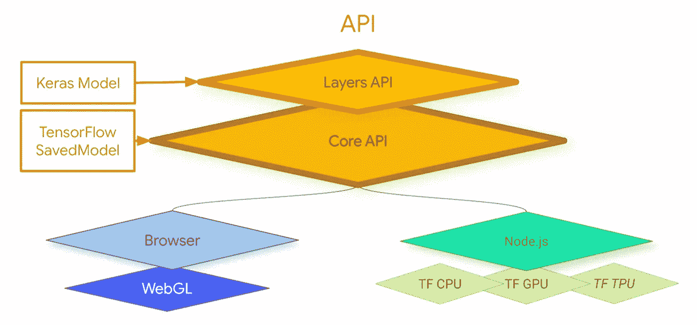
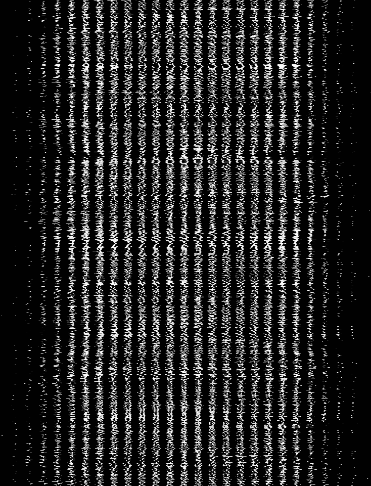
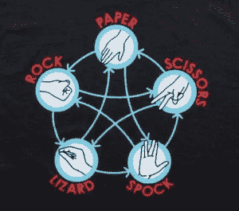

# 基于浏览器的模型和 TensorFlow.js

> 原文：<https://medium.com/analytics-vidhya/browser-based-models-with-tensorflow-js-afcd10be3615?source=collection_archive---------9----------------------->

## 机器学习的关键技能之一不仅仅是制作模型，还有部署。最激动人心的部署场景之一是 javascript，您可以在 web 浏览器中进行训练、测试和推理。

来源— [免费版](https://www.freepik.com/free-vector/machine-learning-banner-artificial-intelligence_6993831.htm#page=1&query=machine%20learning&position=25)

你可能会想，训练一个机器学习模型并从中获得推论将需要一个大数据中心，或者至少在你的机器中需要一个大 GPU。但是，在现代网络浏览器和高科技计算机的帮助下，我们可以立即训练一个模型，并将其部署在您的网络浏览器上。我们可以轻松地将图像上传到网络浏览器，或者从网络摄像头获取图像，这很酷。然后，我们可以有一个模型在 web 浏览器中进行推理，而不需要将图像发送到云中由任何服务器处理。

# TensorFlow.js 的设计与架构

来源— [Coursera](https://www.coursera.org/learn/browser-based-models-tensorflow/lecture/PITQg/a-few-words-from-laurence)

它被设计成既可以在浏览器上运行，也可以在 Node.js 服务器上运行。 [TensorFlow.js](https://www.tensorflow.org/js) 中的**层 API** 看起来和感觉上很像 Keras。因为我们将使用 javascript 编码，所以在语法上与我们使用 python 编码略有不同。低级 API 被称为**核心 API。**它们被设计为使用 TensorFlow 保存的模型格式，这是一种标准文件格式，可用于移动和嵌入式设备的 [JavaScript](https://www.w3schools.com/js/) 、Python APIs，甚至 [TensorFlow Lite](https://www.tensorflow.org/lite/) 。为了加速训练和推理，核心 API 随后与浏览器一起运行，并可以利用 [**WebGL**](https://en.wikipedia.org/wiki/WebGL) 。同样在 [**Node.js**](https://www.w3schools.com/nodejs/) 上，您可以构建服务器端或终端应用程序，然后根据您的机器利用 CPU、GPU 和 TPU。

# 浏览器中的简单神经网络

您需要做的第一件事是在您的 [HTML](https://www.w3schools.com/html/) 文件的标题下方和正文上方添加一个脚本标签，以加载 TensorFlow.js 文件。下面是实现这一点的代码。

要使用 tensorflowjs 服务，您的 HTML 页面中必须包含此脚本

第一行将模型定义为顺序的。最简单的神经网络是一层一个神经元。所以我们只在序列中增加了一个密集层。这个密集层中只有一个神经元，正如你所看到的，单位等于一个参数。然后我们编写了一个神经网络，其损失函数为**均方误差**，它在线性关系中工作良好，并使用 [**SGD(随机梯度下降)**](https://en.wikipedia.org/wiki/Stochastic_gradient_descent) 作为优化器。 **Model.summary** 只是为我们输出模型定义的摘要。

用 javascript 制作模型

此外，**dot training()**应该是一个异步函数，因为训练可能会花费不确定的时间，我们不想在这个过程中阻塞浏览器。您可以调用这个函数并解析您刚刚在上面创建的模型，然后进行预测。

用 javascript 训练模型

下面是您将用来训练神经网络的**数据**。首先，你会注意到我们将其定义为张量 2D，而在 Python 中我们可以使用 NumPy 数组。我们在 JavaScript 中没有 NumPy，所以我们要低一点。顾名思义，当使用一个**张量 2D** 时，你有一个二维数组或者两个一维数组。在这种情况下，你会看到我的训练值在一个数组中，第二个数组是这些训练值的形状。所以我在一个一维数组中使用一组 6 个值，因此第二个参数是**【6，1】**，我们将对 **y** 做同样的处理。因此，如果您调整这段代码来添加或删除参数，请记住还要添加第二个数组来匹配它的大小。

用 Javascript 预测

调用异步 dotraining()函数后，我们可以很容易地使用**模型进行预测。现在，您已经准备好在您的 web 浏览器中运行我们的第一个简单的神经网络。只需运行您的 HTML 文件，您就可以在控制台中看到训练以及模型的摘要，并获得预测的输出作为警告消息，如下所示。**

整个代码的演示([浏览器中的简单神经网络](https://github.com/Tirth1306/Browser-based-Models-with-TensorFlow.js/tree/master/Week1/Example)

# 浏览器中的图像分类

现在，我们将看看 JavaScript 中的图像处理，通过在浏览器中训练用于图像分类的[卷积神经网络](https://towardsdatascience.com/a-comprehensive-guide-to-convolutional-neural-networks-the-eli5-way-3bd2b1164a53#:~:text=A%20Convolutional%20Neural%20Network%20(ConvNet,differentiate%20one%20from%20the%20other.)，然后编写一个浏览器应用程序，该应用程序获取这些图像并将它们传递给分类器。我们将从使用 JavaScript 创建模型开始。下面是用 JavaScript 创建一个 convnet 的代码。它看起来很熟悉，但也有一些小的不同。

用 Javascript 制作模型

可以使用模型对象的 fit 方法来训练模型。您传递给它训练数据和标签，以及一个参数字典。批处理数据进行训练，而不是一次用所有数据淹没模型，这总是一个好主意。当在浏览器中操作时，这是一个更好的主意，这样你就不会锁定浏览器本身。如果您希望模型在训练时进行验证以报告准确性，那么您可以使用如下所示的验证数据列表。您还可以指定想要训练的历元数，并且可以打乱数据以防止[过度拟合](https://www.geeksforgeeks.org/underfitting-and-overfitting-in-machine-learning/)。和往常一样，您可以指定回调，这样就可以更新用户的培训状态，为此 javascript 有一个很酷的库，叫做 tf-vis。

输入数据

## Javascript 中的可视化工具( [tjs-vis](https://github.com/tensorflow/tfjs/tree/master/tfjs-vis) )

JavaScript 有一些额外的工具，您可以使用它们使培训的可视化更加友好。首先，用这个脚本将名为 tjs-vis 的库包含在代码中。

包括用于更好可视化的脚本

要使用带有 fitCallbacks 的 tf-visualization 库，只需声明它是来自 **tfvis.show.fitCallbacks** 的返回。这个函数要求您传递一个容器，它将在其中呈现反馈，以及一组它应该跟踪的指标。很简单，将指标列表设置为您想要获取的指标，如损失、验证损失、准确性和验证准确性。对于容器，您只需设置名称和任何所需的样式，可视化库就会在浏览器中创建 tose 元素。

设置 tf-vis 的所有参数

## —子画面

MNIST 精灵表的一部分(来源— [精灵表](https://storage.googleapis.com/learnjs-data/model-builder/mnist_images.png))

你可能对包含数千张图片的 [MNIST 数据库](https://en.wikipedia.org/wiki/MNIST_database)很熟悉。当在 python 中训练模型时，它将每张图像作为来自文件系统的输入，并根据模型非常容易和即时地处理它。但是在浏览器中，每当你加载一张图片时，它就会发出一个 [HTTP](https://en.wikipedia.org/wiki/Hypertext_Transfer_Protocol) 调用，发出数千个 HTTP 调用并不是一个好的做法。一个好的解决方案是制作整个 MNIST 数据集的[**sprite sheet**](https://www.codeandweb.com/what-is-a-sprite-sheet)**。Sprite Sheet 对于训练 javascript 中的分类器非常有用。因此，sprite 工作表在一个图像中包含了所有 70，000 个图像，它们相互堆叠，然后被分割成一个单独的图像。这个单独的图像然后被转换成数组，并由模型处理。**

**下面是使用 MNIST 数据集的笔迹分类演示。**

**浏览器中的图像分类器演示(完整代码[此处](https://github.com/Tirth1306/Browser-based-Models-with-TensorFlow.js/tree/master/Week2/Example)**

# **将模型转换为 JSON 格式**

**我们可以把用 Python 中的 [TensorFlow](https://www.tensorflow.org/) 创建的模型转换成 [JSON](https://www.json.org/json-en.html) 格式，这样它们就可以用 Javascript 在浏览器中运行了。为此，我们必须在 python 中安装 tensorflowjs。**

**在 python 中安装 tensorflowjs**

**一旦您创建并训练了您的模型，我们需要保存我们的模型。我们将从生成一个目录来保存文件开始，我们使用时间戳来完成这项工作。所以我们将**导入时间**，获取当前时间戳，并保存模型和路径/tmp/saved_models/，后跟时间戳。它将保存的模型保存到指定的路径。现在下一行将把您保存的模型转换成 JSON 格式。您的模型可能有多个文件，而不仅仅是 model.json，这取决于您的模型。下一步，您需要下载这些文件，并将它们放在与将要托管它们的 HTML 页面相同的目录中。更多方法，点击这里。**

**将模型转换成 JSON 格式的代码**

**首先，模型的 URL 必须通过 HTTP 加载。虽然它和 HTML 在同一个目录中，但是我们可以直接写名字，但是我仍然使用 URL 路径。一定要把这部分做好。为了获取 JSON 并将其转换为模型，我将通过传递那个 **MODEL_URL** 来调用**await TF . loadlayersmodel()**。一旦完成，我将有一个训练有素的模型可用。现在，我可以通过调用模型的 model.summary 来检查模型，并通过调用 **model.predict()** 来获得结果。对，就是这样。现在你可以在 python 中创建任何类型的模型，并且可以通过转换成 JSON 格式在 javascript 中使用。**

**将转换后的模型加载到 javascript 中的代码**

# **Javascript 中的迁移学习**

**[迁移学习](https://towardsdatascience.com/a-comprehensive-hands-on-guide-to-transfer-learning-with-real-world-applications-in-deep-learning-212bf3b2f27a)是一种将知识应用于一个问题的技术，即从另一个问题中获得的知识。这里，和以前一样，您将从 JSON 模型的托管 URL 加载它，并使用 **tf.loaLayersModel** 将其加载到一个对象中。这里我使用的是一个托管的 URL[**预训练的 mobilenet**](https://storage.googleapis.com/tfjs-models/tfjs/mobilenet_v1_0.25_224/model.json) 。现在，您可以从预加载的 mobilenet 中获得一个输出层。我们选择名为 **conv_p3_13_relu，**的图层，在它上面我们将冻结一切。然后，我们将使用 **tf.model** 类来创建一个新模型，它的构造函数可以接受输入和输出，我们将设置它接受 mobilenet 输入，即 mobilenet 的顶部，然后 **conv_pw_13_relu** 作为输出。以便当我们将一组新的层连接到该模型时，该层下的所有内容都将被忽略。**

**加载要使用预训练模型进行迁移学习的层**

**与 Python 不同，我们将使用 javascript 创建一个新的模型，而不是在原始模型的冻结层下添加一组新的紧密连接的层。其输入形状是所需 mobilenet 层的输出形状。然后，我们将它作为一个单独的模型来训练。**

**使用迁移学习根据您的需求扩展预训练模型**

**在预测时，我们将从截断的 mobilenet 得到一个预测，直到我们想要给我们一组嵌入的层。然后，我们将通过新模型传递这些嵌入，以获得新模型被训练的预测。正如你在下面看到的，这和你可能习惯的有点不同。**

# **石头剪刀布蜥蜴史波克**

****

**来源— [粉丝网站](https://the-big-bang-theory.com/rock-paper-scissors-lizard-spock/)**

**由卡伦·布莱拉和萨姆·卡斯创作的传统碰运气游戏“石头剪刀布”的延伸。[山姆·卡斯解释道](http://www.samkass.com/theories/RPSSL.html)，他设计了这个扩展游戏，因为看起来大多数石头剪刀布游戏都会以平局告终。**

> **“剪刀剪纸，纸盖石头，石头压死蜥蜴，蜥蜴毒死斯波克，斯波克砸碎剪刀，剪刀砍头蜥蜴，蜥蜴吃纸，纸反驳斯波克，斯波克蒸发石头，一如既往，石头压死剪刀。”—谢尔顿**

****

**来源— [生活大爆炸](https://the-big-bang-theory.com/rock-paper-scissors-lizard-spock/)**

**现在，我已经使用预先训练的 MobileNet 模型开发了分类器，对网络摄像头捕捉的石头、布、剪刀、斯波克和蜥蜴的手势进行分类。在这个项目中，我使用了上面讨论的所有概念，下面是我的项目演示以及代码解释。**

**手势分类器演示(完整代码[此处](https://github.com/Tirth1306/Browser-based-Models-with-TensorFlow.js/tree/master/Week4)**

# **结论**

**在 tensorflowjs 的帮助下，我们可以借助 javascript 在浏览器中训练、测试和验证我们的模型。我们还学习了一些工具，如 tjs-vis，它用于在浏览器中更好地可视化培训，以及一些技术，如 sprite sheet，它对于减少对服务器的 HTTP 调用非常重要。然后我们学习了一些技巧，比如将预先训练好的模型转换成 JSON 格式，然后在 javascript 中使用转换后的模型。此外，我们已经看到了 javascript 中的迁移学习，这与我们过去在 python 中所做的略有不同。如果你想在这个领域更深入，我想推荐[Coursera](https://www.coursera.org/learn/browser-based-models-tensorflow)的课程。**

# **tirth Patel——Nirma 大学计算机科学与工程专业学生。**

**[LinkedIn](https://www.linkedin.com/in/tirth-patel-861303171/)|[Github](https://github.com/Tirth1306/)|[insta gram](https://www.instagram.com/__txrth__/)**